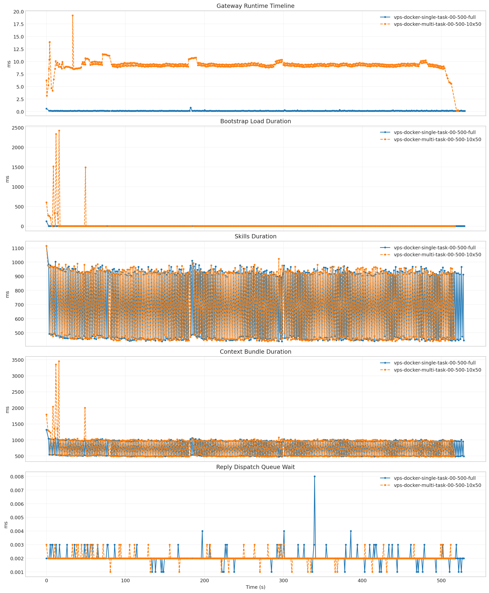
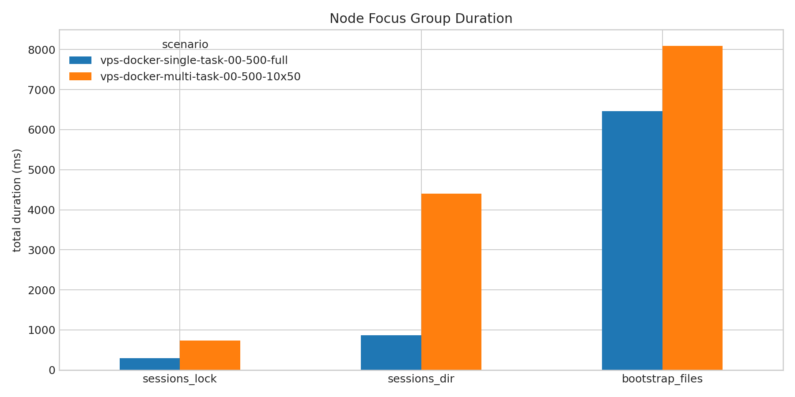

# 为什么你的龙虾这么慢

截至 2026 年 3 月 27 日，OpenClaw GitHub 主仓库已达到约 `33.8` 万星，已经成为这一轮开源 AI Agent 热潮里最具代表性的项目之一。热度快速上升的同时，围绕它的讨论也迅速从“能不能用”扩展到“能不能安全地用、稳定地用”。官方安全页面显示，仓库当前已有 `335` 条安全相关记录；同时，官方安全模型也明确强调，它默认并不是一个面向互不信任用户共享同一网关的多租户系统。在这样的背景下，安全、权限边界、插件信任模型和共享部署方式，已经成为 OpenClaw 被反复讨论的现实问题。

这份快报不从安全问题本身展开，而是从另一个同样决定实际可用性的维度切入：并发效率。我们想回答的不是“某个函数慢了多少毫秒”，而是一个更实际的问题：为什么同一套网关，在单 worker 时表现稳定，一旦进入多 agent 协作、多实例并发或多会话同时运行的状态，整体响应时间就会上升一个数量级。

## 先说结论

- 同样都是 500 次请求，单 worker 场景的总耗时均值是 `1061ms`，10 个 worker 并发后变成 `10161ms`，慢了约 `10` 倍。
- 这次变慢，主要发生在“等待执行完成（`wait`）”阶段，而不是“读取历史结果”阶段。
- 真正拖慢系统的，不是模型推理、CPU 打满或磁盘裸读写变慢，而是“会话数量变多带来的重复冷启动”叠加“会话状态管理链路在并发下更拥堵”。

## 哪些场景会遇到这个问题

这个问题并不只出现在“多 agent”这个词上，它更广泛地出现在“同一个网关同时服务多个独立执行单元”的场景里。

多 agent 的典型场景是：一个主控把任务拆给多个 worker，并行查资料、读代码、跑工具、汇总结果。表面上看是一项任务，实际上背后是多个执行单元同时向同一个网关发起请求。

多 session 的典型场景是：多人同时接同一个服务、一个人同时开多个标签页或多个项目、批量自动化任务一起发起请求。表面上不一定叫“多 agent”，但本质上也是多个会话同时在争抢同一套后端资源。

这次测试更接近后一种现实使用形态：同一个网关同时服务多个 worker、多个会话。它不是“单条请求内部再拆 10 个 agent”的严格模拟，但足够贴近外部并发使用时的压力模型，因此对实际体验具有较强参考意义。

## 这次实验怎么做

| 场景 | 并发数 | 每个 worker 请求数 | 总请求数 | 会话策略 | 启动间隔 | 消息内容 | 运行环境 | 采集项 | 成功率 |
| --- | --- | --- | --- | --- | --- | --- | --- | --- | --- |
| 单 worker 基线 | 1 | 500 | 500 | 每个 worker 一个会话（`per_worker`） | 0ms | `/context list` | Docker + `openclaw:bench-local` + openEuler 24.03 LTS + Python 3.12.10 | docker stats、pidstat、strace、node trace、iostat、perf、vmstat | 500/500 |
| 10 worker 并发 | 10 | 50 | 500 | 每个 worker 一个会话（`per_worker`） | 150ms | `/context list` | Docker + `openclaw:bench-local` + openEuler 24.03 LTS + Python 3.12.10 | docker stats、pidstat、strace、node trace、iostat、perf、vmstat | 500/500 |

这组实验控制得比较干净：总请求数一样，消息内容一样，运行环境一样，采集手段也一样。最大的区别只有两个：一边只有 `1` 个 worker 和 `1` 个会话，另一边是 `10` 个 worker 和 `10` 个会话。

## 结果先看图

| 场景 | 总耗时均值 | 总耗时 95 分位 | 等待阶段均值 | 等待阶段 95 分位 | 发送均值 | 历史读取均值 | 连接阶段均值 |
| --- | --- | --- | --- | --- | --- | --- | --- |
| 单 worker 基线 | 1061.123ms | 1336.504ms | 973.591ms | 1251.777ms | 2.847ms | 84.659ms | 225.969ms |
| 10 worker 并发 | 10161.143ms | 11308.623ms | 10082.269ms | 11223.202ms | 5.665ms | 73.183ms | 5358.133ms |

这里最重要的观察有两个。

第一，总耗时和等待阶段几乎一起被拉长了，说明问题主要发生在“请求交出去以后，到结果真正回来之前”。

第二，历史读取阶段几乎没变，甚至还略低一点。这意味着瓶颈不在“最后把结果拿回来”，而是在网关内部真正执行和协调的那一段。

需要单独说明的是：连接阶段在多 worker 下也明显升高，但这项指标是按 worker 建连记录的，而且不计入总耗时。所以这份报告的主结论仍然以“总耗时”和“等待阶段”为准。

## 先排除几个常见但不成立的解释

如果只看“10 倍变慢”这个结果，很容易先把原因归结为 CPU、内存、磁盘，或者误以为是模型推理本身明显变慢。但这组数据并不支持这种解释。

- CPU 平均占用几乎一样：`44.9%` vs `45.3%`。
- 内存平均占用也很接近：`2.07%` vs `2.20%`。
- 磁盘利用率也很接近：`0.390%` vs `0.355%`。
- 磁盘写等待也没有明显恶化：`1.276ms` vs `1.326ms`。
- 回复发回队列几乎没变化：`0.002ms` vs `0.002ms`。
- 技能信息整理几乎没变化：`698.850ms` vs `700.802ms`。
- 上下文总拼装只小幅增加：`742.934ms` vs `764.308ms`。

换句话说，这并不是典型的资源打满问题，也不是模型推理能力本身发生了明显变化。真正的瓶颈在别处。

## 网关内部到底慢在哪里

从大流程上看，一次请求进入网关后，可以粗略理解成下面几步：

提交请求 -> 等待开始执行 -> 准备基础上下文 -> 整理技能信息 -> 拼装完整上下文 -> 产出回复 -> 发回结果 -> 读取历史

| 场景 | 基础上下文加载均值 | 技能整理均值 | 上下文总拼装均值 | 真正开始执行前等待均值 | 回复队列等待均值 |
| --- | --- | --- | --- | --- | --- |
| 单 worker 基线 | 2.758ms | 698.850ms | 742.934ms | 0.143ms | 0.002ms |
| 10 worker 并发 | 22.000ms | 700.802ms | 764.308ms | 9.253ms | 0.002ms |

这张表的意义不在于“哪一项绝对值最大”，而在于帮我们先排除错误方向。

技能整理几乎没变，回复队列几乎没变，上下文总拼装也只是小幅增加。真正能看出变化的，是基础上下文加载，以及“真正开始执行前的等待”。这说明瓶颈并不主要出在实际执行和结果返回阶段，而是集中在执行前的准备、会话协调和准入等待阶段。

## 真正的根因：多会话把公共链路挤住了

顺着这个方向往下看，真正明显放大的，是会话状态管理这条公共链路。

| 场景 | 会话锁累计时长 | 会话目录扫描累计时长 | 会话索引文件累计时长 | 会话临时文件累计时长 | 基础工作区文件累计时长 |
| --- | --- | --- | --- | --- | --- |
| 单 worker 基线 | 298.634ms | 77.678ms | 164.106ms | 327.700ms | 6459.129ms |
| 10 worker 并发 | 733.853ms | 1781.805ms | 210.497ms | 1679.839ms | 8091.316ms |

这里有三个数字需要重点关注。

- 会话目录扫描从 `77.678ms` 增加到 `1781.805ms`。
- 会话临时文件链从 `327.700ms` 增加到 `1679.839ms`。
- 会话锁文件从 `298.634ms` 增加到 `733.853ms`。

这意味着什么？

说明多 worker 并发时，系统不是单纯多做了几次“读文件”这么简单，而是多了很多围绕会话状态的协调动作：要看目录、要碰锁文件、要更新索引、要处理临时文件。它们共用同一条异步文件系统处理通道，互相挤占，就会把“请求已经到了，但真正开始干活之前”的那段时间拉长。

因此，更准确的表述是“会话状态管理链路拥堵”，而不是笼统地说“文件系统慢了”。真正被放大的，是会话相关的公共管理开销。

## 为什么看起来连“基础上下文准备”也变慢了

这一点特别容易误读。

表面上看，基础上下文加载均值从 `2.758ms` 涨到了 `22.000ms`，好像连最基本的上下文准备都被拖慢了。但把每个会话的第一次请求单独拿出来看，结论就不一样了。

单 worker 场景里，只有 `1` 个会话，所以只付出 `1` 次首次冷启动（cold start）成本。10 worker 并发场景里，有 `10` 个会话，所以会重复付出 `10` 次首次冷启动成本。

最关键的证据是：去掉每个会话的第一条请求后，基础上下文加载均值几乎完全一样。

- 单 worker：`2.511ms`
- 10 worker 并发：`2.492ms`

这说明热态下它并没有真正变慢。它之所以在总均值上看起来更慢，主要是因为会话数从 `1` 个变成了 `10` 个，首次冷启动被重复触发了 `10` 次。

所以，基础上下文准备并不是这次性能下降的主要原因。更准确地说，它的上升主要来自多会话场景下首次冷启动次数的增加。

## 这件事该怎么改

这并不意味着只能通过“放弃会话隔离”来换性能。相反，比较务实的优化方向是：在保留独立会话边界的前提下，把全局争用和重复冷启动从请求热路径里移走。

优先级最高、最值得先做的两件事：

- 把全局 `sessions.json` 和 `sessions.json.lock` 从请求热路径里拿掉。最有效的方向是分片索引，或者直接换成带并发控制的存储层，例如 `sqlite WAL`、`LMDB`、`LevelDB`、`Redis`。即使暂时不换存储层，至少也要做到按 session 分片，避免所有会话都竞争同一把全局锁。
- 如果业务存在较稳定的并发区间，可以预热一小批相互独立的会话，并按 worker 或 user 粘性复用；如果会话规模不可预估，则至少应预热会话创建所依赖的静态上下文、索引和基础状态。这样既能保持会话隔离，也能减少每次新建会话都重新进入冷态的概率。

如果会话必须保持完全独立，最值得优先改造的点包括：

- 不要在请求路径里扫描 `sessions/` 目录。更合理的做法是让 `session_key -> 文件路径` 直接定位，或者维护一份常驻内存索引，启动时一次加载，之后只做增量更新。
- 不要采用“写临时文件 -> 改名 -> 解锁 -> 再继续执行”的串行路径。更好的方式是先更新内存态，再异步批量刷盘；或者改成 `journal / append-only` 形式，再由后台做整理和压缩。
- 把锁粒度从“全局 session 索引锁”降到“分片锁”甚至“单 session 锁”。即使会话彼此独立，只要底层仍然共享一把全局索引锁，并发瓶颈就还会存在。
- 将 session 状态链路和基础上下文读取链路分开排队。当前现象表明，它们很可能在竞争同一条异步文件系统执行通道，因此会相互放大等待时间。

缓解冷启动的做法也比较明确：

- 将 `AGENTS.md`、`SOUL.md`、`TOOLS.md`、`IDENTITY.md`、`USER.md`、`HEARTBEAT.md`、`BOOTSTRAP.md` 这类静态文件常驻内存，并通过文件变更监控做失效，而不是在每个新会话第一次请求时重新读取。
- 将技能快照和上下文拼装拆成“静态前缀 + 会话动态部分”。静态部分可以缓存，动态部分再按会话补齐。
- 做后台预热。服务启动后先把一批会话跑到热态，再开始接入真实流量。
- 设置更合理的会话保活时间，避免回收过于激进。很多冷启动重复出现，本质上并不是业务真的需要新会话，而是旧会话过早被回收了。

## 总结

综合这组实验可以看到，OpenClaw 在多 worker、多会话并发场景下变慢，核心并不是模型推理、CPU 或磁盘本身显著恶化，而是会话数量增加后，首次冷启动被重复触发，同时会话索引、目录扫描、锁文件和临时文件这一整条状态管理链路进入了竞争状态，最终把等待执行完成阶段明显拉长。对应的优化方向也比较清楚：一是把全局 `sessions.json` 和全局锁从请求热路径中移走，改成分片索引或更适合并发的存储层；二是在保留会话隔离的前提下，尽量预热静态上下文、索引和常见并发规模下的热会话，减少重复冷启动；三是降低锁粒度，拆开 session 状态更新与基础上下文读取的执行通道，避免它们继续相互挤占。

补充一句辅助验证：另一组发送`/history head 1`消息的对比实验里，总耗时均值也从 `626.935ms` 增加到 `6088.424ms`，方向一致。
