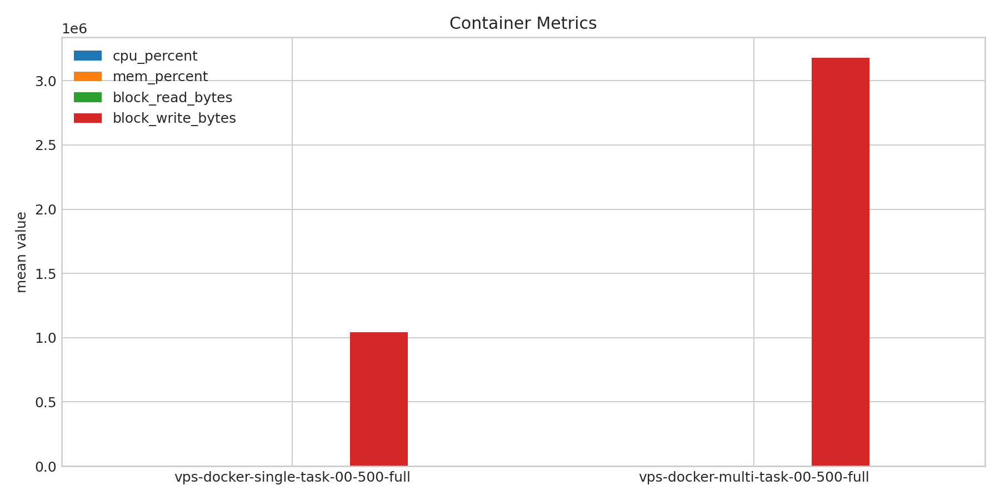
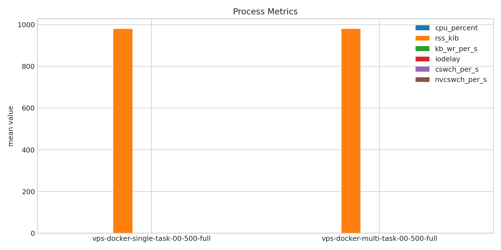
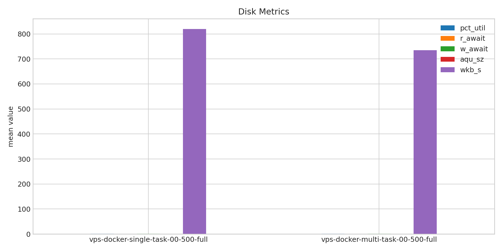
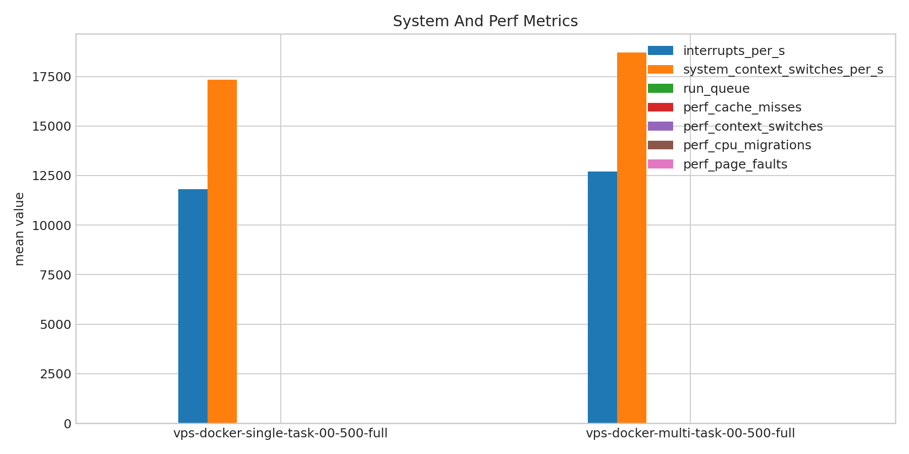

# Benchmark Comparison Report

- out root: `/root/client-harness/out`
- res root: `/root/client-harness/res`

## `vps-docker-single-task-00-500-full` vs `vps-docker-multi-task-00-500-full`

**Run Dirs**

| scenario | run_dir | requests_total | requests_ok | requests_failed |
| --- | --- | --- | --- | --- |
| vps-docker-single-task-00-500-full | /root/client-harness/out/20260324T183523Z_vps-docker-single-task-00-500-full | 500 | 500 | 0 |
| vps-docker-multi-task-00-500-full | /root/client-harness/out/20260324T183647Z_vps-docker-multi-task-00-500-full | 500 | 500 | 0 |

**Figures**

- 
- 
- 
- 
- 
- 
- 

**Latency Overview Table**

| scenario | total_mean | total_p50 | total_p95 | total_p99 |
| --- | --- | --- | --- | --- |
| vps-docker-single-task-00-500-full | 117.949 | 112.396 | 138.049 | 149.266 |
| vps-docker-multi-task-00-500-full | 2000.369 | 1942.718 | 3206.884 | 3750.755 |

**Container Metrics Table**

| scenario | cpu_percent | mem_percent | block_read_bytes | block_write_bytes |
| --- | --- | --- | --- | --- |
| vps-docker-single-task-00-500-full | 104.185 | 4.138 | 0.000 | 1043341.667 |
| vps-docker-multi-task-00-500-full | 102.546 | 4.145 | 0.000 | 3178545.455 |

**Process Metrics Table**

| scenario | cpu_percent | rss_kib | kb_wr_per_s | iodelay | cswch_per_s | nvcswch_per_s |
| --- | --- | --- | --- | --- | --- | --- |
| vps-docker-single-task-00-500-full | 0.000 | 980.000 | 0.000 | 0.000 | 0.000 | 1.000 |
| vps-docker-multi-task-00-500-full | 0.000 | 980.000 | 0.000 | 0.000 | 0.000 | 1.000 |

**Disk Metrics Table**

| scenario | busiest_device | pct_util | await | r_await | w_await | aqu_sz | wkb_s |
| --- | --- | --- | --- | --- | --- | --- | --- |
| vps-docker-single-task-00-500-full | vda | 0.810 | - | 0.000 | 1.027 | 0.025 | 819.661 |
| vps-docker-multi-task-00-500-full | vda | 0.947 | - | 0.000 | 1.018 | 0.021 | 734.994 |

**System Metrics Table**

| scenario | interrupts_per_s | system_context_switches_per_s | run_queue | perf_cache_misses | perf_context_switches | perf_cpu_migrations | perf_page_faults | perf_unsupported_events |
| --- | --- | --- | --- | --- | --- | --- | --- | --- |
| vps-docker-single-task-00-500-full | 11810.800 | 17328.600 | 1.167 | 0.000 | 1.000 | 0.050 | 0.000 | cache-misses, cache-references |
| vps-docker-multi-task-00-500-full | 12701.037 | 18710.685 | 1.315 | 0.000 | 1.000 | 0.037 | 0.000 | cache-misses, cache-references |
