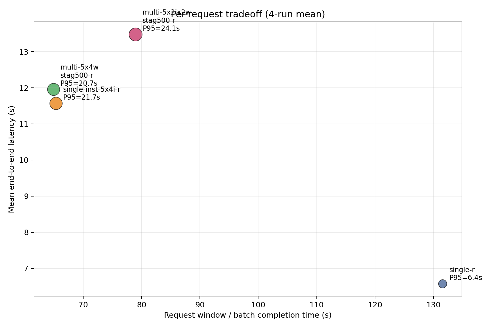
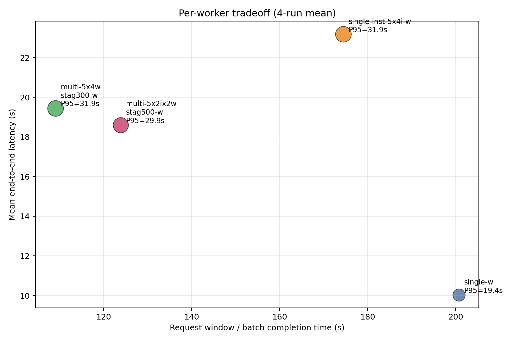
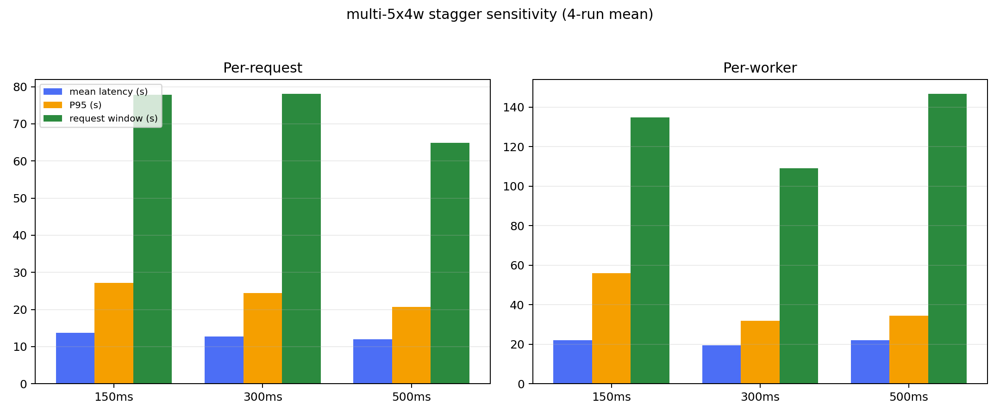
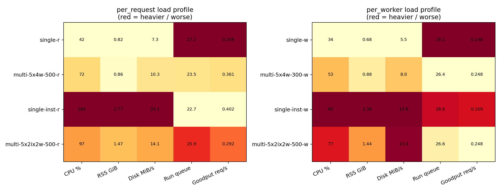

# task-01 综合结论

本页把 `/root/client-harness/res/task-01/task-01-run1~4/` 的结果做了统一汇总，重点回答 3 个问题：

1. `per_request` 和 `per_worker` 两种 session mode 下，4 种负载模式各自的延迟/尾延/整批完成时间 trade-off 是什么。
2. `multi-5x4w` 在不同 `stagger` 下应该怎么选。
3. 4 种模式的资源负载特征分别是什么。

## 统计口径

- 以 `run_dir` 为事实来源去重，合并后共得到 `48` 个唯一场景结果。
- 名字里带 `request` 的结果按 `per_request` 统计；带 `worker` 的结果按 `per_worker` 统计。
- `multi-5x4w` 先在内部做 `4-run` 平均，再选代表配置：
  - `per_request` 选 `stag500`
  - `per_worker` 选 `stag300`
- `request_window_sec` 代表从第一条请求开始到最后一条请求完成的窗口，可近似理解为“20 个请求这一批的完成时间”。
- 需要单独说明两点：
  - `run1` 的模型目录名是 `qwen3-32b8x2`，`run2~4` 是 `qwen3-235b8x2`，所以下面的绝对耗时是“4-run pooled average”，更适合看相对排序和 trade-off，不适合当成单一模型的精确 SLA。
  - `run1` 有少量对比页把 `multi-5x4w-stag300` 误标成 `stag500`；本汇总一律按真实 `run_dir` 修正。

## 一页结论

- `per_request` 下，最低单请求时延和尾延始终是 `single-r`。它在 `4/4` 个 run 里都拿到了最低 `total_mean` 和最低 `total_p95`，4-run 平均为 `6.6s / 6.4s`；代价是整批完成时间最慢，`request_window` 平均 `131.6s`。
- `per_request` 下，如果目标是“并发负载下更快跑完 20 个请求”，最值得选的是 `multi-5x4w-stag500-r`。它在 `4` 次 run 里有 `3` 次拿到最短 `request_window`，4-run 平均 `request_window = 64.9s`，和 `single-inst-r` 的 `65.4s` 基本打平，但 `CPU / RSS / 磁盘写入` 只要后者的大约 `44% / 31% / 43%`。
- `per_worker` 下，最低单请求时延仍然是 `single-w`。它在 `4/4` 个 run 里拿到最低 `total_mean`，在 `3/4` 个 run 里拿到最低 `total_p95`，4-run 平均为 `10.0s / 19.4s`；但整批完成时间最慢，`request_window` 平均 `200.7s`。
- `per_worker` 下，如果看“吞吐、资源、稳定性”的综合折中，最佳默认值是 `multi-5x4w-stag300-w`。它的 `request_window` 4-run 平均最短，为 `109.1s`；虽然 `multi-5x2ix2w-500-w` 的平均 `total_mean` 和 `P95` 略低，但它更吃资源，而且 `4` 次 run 里出现过 `1` 次失败，综合不如 `multi-5x4w-stag300-w` 稳。
- `single-inst-5x4i` 在两种 mode 下都不是好的默认方案。它的特点是把 `CPU / RSS / 磁盘写入` 明显拉高，但没有换来同等幅度的时延收益；尤其在 `per_worker` 下，4-run 平均资源最重、批量完成也不快。

## 核心图表

`per_request` 的“单请求时延 vs 整批完成时间”：

`per_worker` 的“单请求时延 vs 整批完成时间”：

`multi-5x4w` 的 `stagger` 敏感性：

4 种模式在两种 session mode 下的资源负载画像：

## 4-run 平均对比

### `per_request`

| mode | total_mean | total_p95 | request_window | CPU% | RSS GiB | Disk MiB/s | success |
| --- | ---: | ---: | ---: | ---: | ---: | ---: | ---: |
| `single-r` | 6.6s | 6.4s | 131.6s | 42 | 0.82 | 7.3 | 100% |
| `multi-5x4w-stag500-r` | 12.0s | 20.7s | 64.9s | 72 | 0.86 | 10.3 | 100% |
| `single-inst-r` | 11.6s | 21.7s | 65.4s | 164 | 2.77 | 24.1 | 100% |
| `multi-5x2ix2w-stag500-r` | 13.5s | 24.1s | 79.0s | 97 | 1.47 | 14.1 | 100% |

读表后的结论：

- `single-r` 是纯延迟最优，但吞吐最差。
- `multi-5x4w-stag500-r` 和 `single-inst-r` 的整批完成时间几乎一样，均值也接近；但 `multi-5x4w-stag500-r` 的 `P95` 更好，同时资源开销远小得多，所以是更好的并发默认值。
- `multi-5x2ix2w-stag500-r` 在均值、尾延、批量完成时间三项上都没有赢过 `multi-5x4w-stag500-r`，也没有资源优势。

### `per_worker`

| mode | total_mean | total_p95 | request_window | CPU% | RSS GiB | Disk MiB/s | success |
| --- | ---: | ---: | ---: | ---: | ---: | ---: | ---: |
| `single-w` | 10.0s | 19.4s | 200.7s | 34 | 0.68 | 5.5 | 100% |
| `multi-5x4w-stag300-w` | 19.5s | 31.9s | 109.1s | 53 | 0.88 | 8.0 | 100% |
| `single-inst-w` | 23.2s | 31.9s | 174.5s | 90 | 2.36 | 13.6 | 100% |
| `multi-5x2ix2w-stag500-w` | 18.6s | 29.9s | 123.9s | 77 | 1.44 | 13.4 | 98.75% |

读表后的结论：

- `single-w` 仍然是单请求体验最好的一档，但它把整批完成时间拉到了最长，不适合作为并发默认模式。
- `multi-5x2ix2w-stag500-w` 的平均 `total_mean` 和 `P95` 略优于 `multi-5x4w-stag300-w`，但它的 `request_window` 更长，`CPU / RSS / 磁盘写入` 更高，而且出现过失败，所以更像“局部延迟略好、整体性价比更差”。
- `single-inst-w` 基本可以排除：它既没有最好时延，也没有最好吞吐，但资源却最重。

## `multi-5x4w` 的 stagger 结论

### `per_request`

| stagger | total_mean | total_p95 | request_window |
| --- | ---: | ---: | ---: |
| `150ms` | 13.7s | 27.1s | 77.8s |
| `300ms` | 12.8s | 24.4s | 78.1s |
| `500ms` | 12.0s | 20.7s | 64.9s |

结论：`per_request` 下 `stag500` 是明确最佳值。它同时拿到了最低均值、最低 `P95` 和最短批量完成时间。

### `per_worker`

| stagger | total_mean | total_p95 | request_window |
| --- | ---: | ---: | ---: |
| `150ms` | 22.1s | 56.0s | 134.7s |
| `300ms` | 19.5s | 31.9s | 109.1s |
| `500ms` | 22.1s | 34.4s | 146.7s |

结论：`per_worker` 下 `stag300` 最稳。`150ms` 会把尾延拉爆，`500ms` 会把整批完成时间拉长，只有 `300ms` 同时压住了均值、`P95` 和 `request_window`。

## 4 种模式的负载特征

- `single`
  - 典型特征是资源最轻、单请求延迟最好、整批完成最慢。
  - 适合“用户体感优先”的基线，不适合吞吐目标。
- `multi-5x4w`
  - 典型特征是单容器内并发，资源开销中等，但吞吐/资源比最好。
  - 在 `per_request` 下是最好的并发默认值；在 `per_worker` 下也是最平衡的默认值。
- `single-inst-5x4i`
  - 典型特征是把 4 个实例的 CPU、内存、磁盘写入都显著拉高。
  - `per_request` 下只能做到“接近 `multi-5x4w` 的批量完成时间”，却付出远高于 `multi-5x4w` 的系统成本；`per_worker` 下更不划算。
- `multi-5x2ix2w`
  - 负载强度介于 `multi-5x4w` 和 `single-inst-5x4i` 之间。
  - `per_request` 下没有打过 `multi-5x4w`；`per_worker` 下平均延迟略好，但整批完成、资源、成功率都更差，因此不适合作为默认方案。

## 为什么“单请求更慢”却可能“整批更快”

这组结果里一直在同时比较 3 个不同目标：

- `单用户时延`：一个请求自己要等多久。
- `整批完成时间`：20 个请求这一批要多久全部跑完。
- `整体性价比`：跑完这一批一共消耗了多少 `CPU / 内存 / 磁盘 / 实例`。

这 3 个目标天然不完全一致，所以会出现“局部更优、整体反而不优”的情况。

### 为什么单用户时延短，总时间反而更长

`single-r` / `single-w` 这类串行模式下，请求几乎独占资源：

- 没有太多 worker 竞争。
- 排队、抢锁、上下文切换更少。
- 单个请求的等待更短，所以 `total_mean` / `P95` 往往更好。

但代价是 20 个请求基本只能一个接一个做，所以总时间会接近“20 次单请求时间的累加”。因此它常常表现为：

- 单请求更快
- 整批更慢

### 为什么并发下单用户更慢，总时间反而更短

像 `multi-5x4w` 这种并发模式会让多个请求重叠执行：

- 虽然每个请求会因为共享资源而变慢。
- 但 20 个请求不再是简单串行累加，而是多条 lane 同时推进。

只要“并发重叠带来的收益”大于“资源竞争带来的损失”，就会出现：

- 单请求更慢
- 但整批完成更快

本次结果就是这个典型现象。例如：

- `per_request` 下，`single-r` 的 4-run 平均是 `6.6s / 131.6s`
  - 单请求平均 `6.6s`
  - 但整批完成时间 `131.6s`
- `multi-5x4w-stag500-r` 的 4-run 平均是 `12.0s / 64.9s`
  - 单请求变慢到 `12.0s`
  - 但整批完成时间缩短到 `64.9s`

也就是说，单请求大约慢了近一倍，但因为并发把请求重叠起来，整批反而快了接近一倍。

### 为什么“整体性价比”又是第三件事

即使两个模式的整批完成时间接近，资源成本也可能差很多。

例如 `per_request` 下：

- `multi-5x4w-stag500-r` 的 `request_window = 64.9s`
- `single-inst-r` 的 `request_window = 65.4s`

两者整批速度几乎一样，但：

- `multi-5x4w-stag500-r` 平均 `CPU = 72`，`RSS = 0.86 GiB`
- `single-inst-r` 平均 `CPU = 164`，`RSS = 2.77 GiB`

所以虽然它们“总时间”差不多，`multi-5x4w-stag500-r` 仍然更有性价比，因为它用更低的系统成本拿到了几乎一样的吞吐。

### 为什么并发模式更容易出现长尾

并发不会让所有请求平均变慢，而是更容易让少数请求特别倒霉：

- 撞上忙时段
- 排在长请求后面
- 争抢共享资源失败
- 被更大的 session/context 拖慢

所以并发模式常常会出现：

- 均值不一定特别差
- 但 `P95 / P99` 更容易恶化

这也是为什么本文一直把 `total_mean`、`total_p95` 和 `request_window` 一起看，而不是只看其中一个指标。

### 这是不是所有 server-client 系统都会遇到的问题

基本上是。只要系统满足下面两个条件，这个 trade-off 就会出现：

- 多个请求共享同一套资源
- 并发不是免费的

Web 服务、RPC、数据库、推理服务、缓存、消息队列都会有类似现象。差别只在于程度：

- 如果系统可以近似线性扩容、请求几乎不共享状态，这个矛盾会轻很多。
- 如果系统有共享模型、共享 session、共享 I/O，或者会话上下文会累积，这个矛盾就会被放大。

本次 task-01 的负载正好属于后者，所以你会特别明显地看到：

- `stagger` 改一点，结果就会变很多。
- `per_worker` 比 `per_request` 更容易出现长尾。
- 多实例不一定比单实例多 worker 更划算。

## 最终建议

- 如果目标是最低单用户时延：
  - `per_request` 选 `single-r`
  - `per_worker` 选 `single-w`
- 如果目标是“20 个请求尽快跑完，同时不要把机器负载打得太重”：
  - `per_request` 选 `multi-5x4w-stag500-r`
  - `per_worker` 选 `multi-5x4w-stag300-w`
- 如果必须上多实例：
  - `per_request` 优先 `single-inst-r`，但只在你接受显著更高 CPU / RSS / 磁盘写入时才有意义。
  - `per_worker` 不建议把 `single-inst-w` 作为默认值；若只在 `single-inst-w` 和 `multi-5x2ix2w-w` 二选一，更偏向 `multi-5x2ix2w-w`，但它仍然不如 `multi-5x4w-stag300-w`。

## 附件

- 聚合后的唯一场景明细：[aggregated_unique_runs.csv](./aggregated_unique_runs.csv)
- 代表模式 4-run 平均：[representative_mode_summary.csv](./representative_mode_summary.csv)
- `multi-5x4w` stagger 汇总：[multi_5x4w_stagger_summary.csv](./multi_5x4w_stagger_summary.csv)
- 各 run 的最佳模式统计：[best_by_run.csv](./best_by_run.csv)
