## `multi-5x4w-stag150` vs `multi-5x4w-stag300` vs `multi-5x4w-stag500`

**Run Dirs**

| scenario | run_dir | instance_num | requests_total | requests_ok | requests_failed |
| --- | --- | --- | --- | --- | --- |
| multi-5x4w-stag150 | /root/Zehao/ClawHarness/out/batch_run_1/task-01/20260416T133141Z_vps-docker-qwen3-32b8x2-multi-5x4w-stag150-request | 1 | 20 | 20 | 0 |
| multi-5x4w-stag300 | /root/Zehao/ClawHarness/out/batch_run_1/task-01/20260416T133828Z_vps-docker-qwen3-32b8x2-multi-5x4w-stag300-request | 1 | 20 | 20 | 0 |
| multi-5x4w-stag500 | /root/Zehao/ClawHarness/out/batch_run_1/task-01/20260416T134556Z_vps-docker-qwen3-32b8x2-multi-5x4w-stag500-request | 1 | 20 | 20 | 0 |

**Aggregation Policy**

- `pidstat` per-process metrics are summed across instances.
- `iostat` and `vmstat` host-wide metrics are averaged across instance collectors.
- This makes multi-instance runs comparable with single-instance runs at the whole-machine level.

**Figures**

- 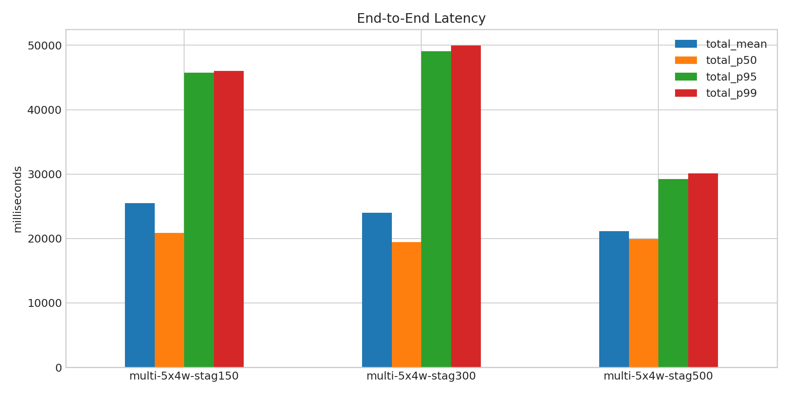
- 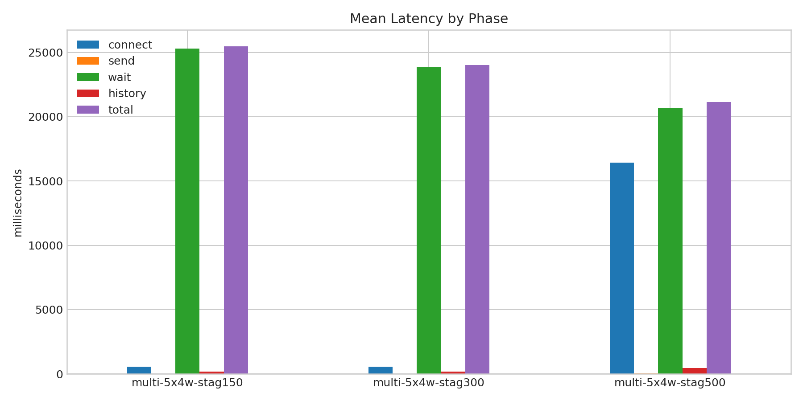
- 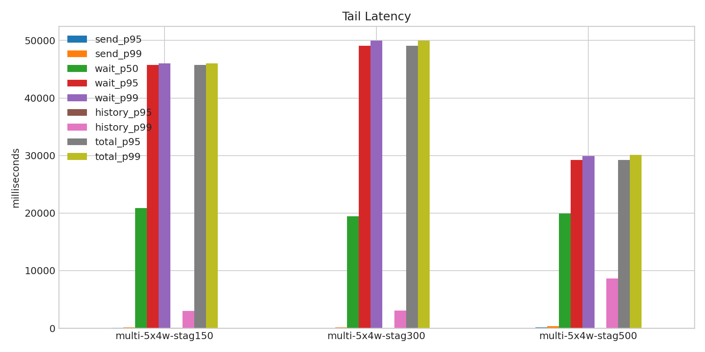
- 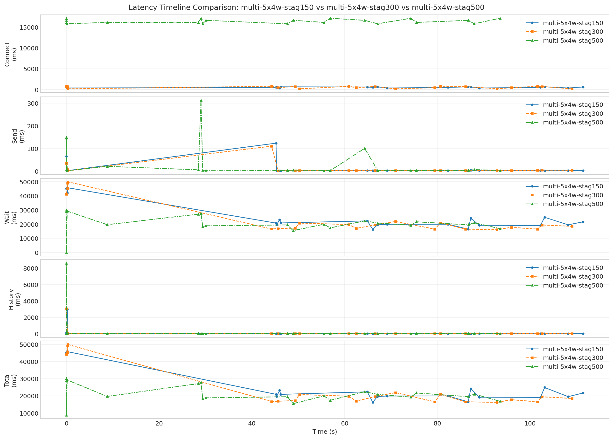
- 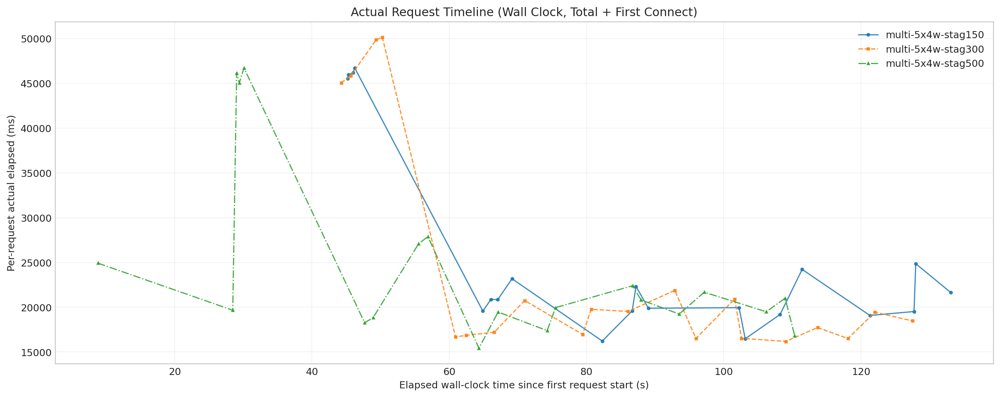
- 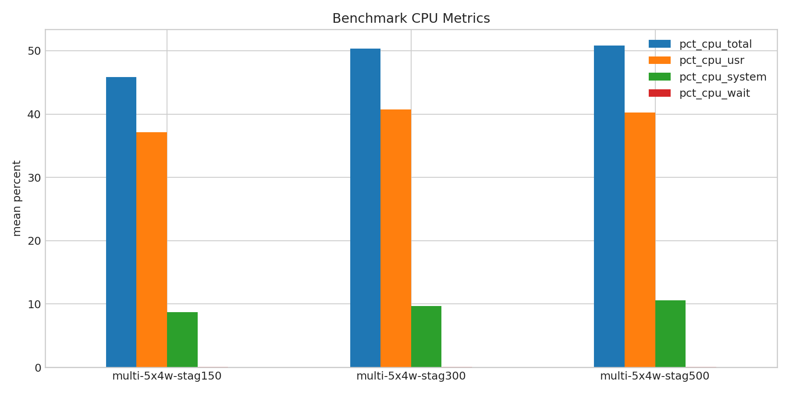
- 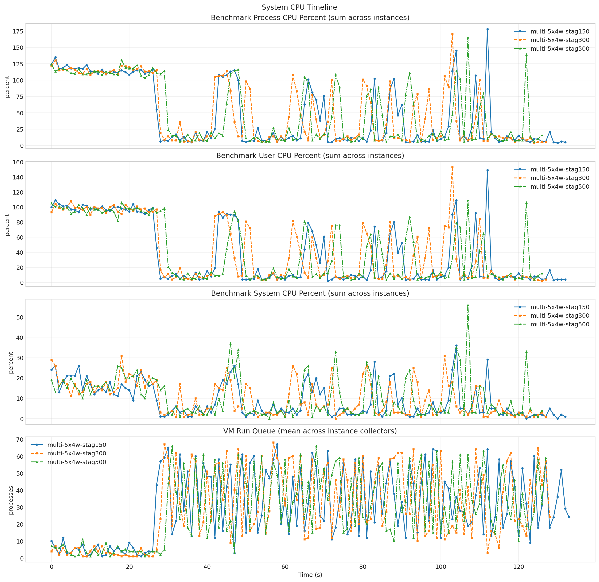
- 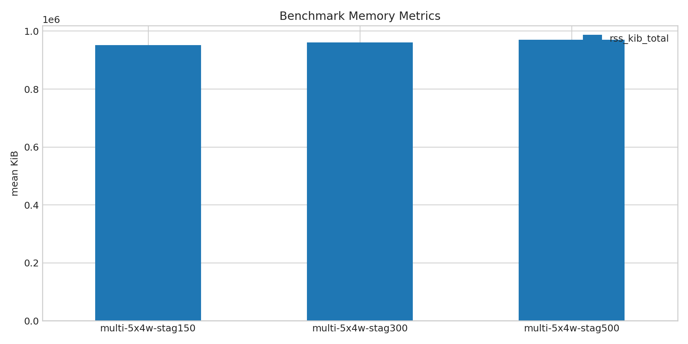
- 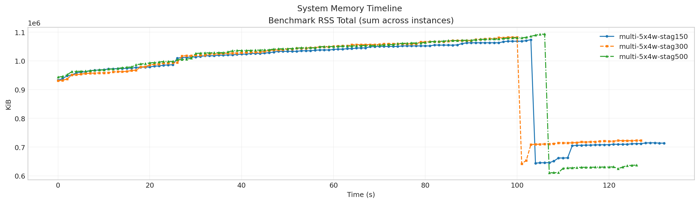
- 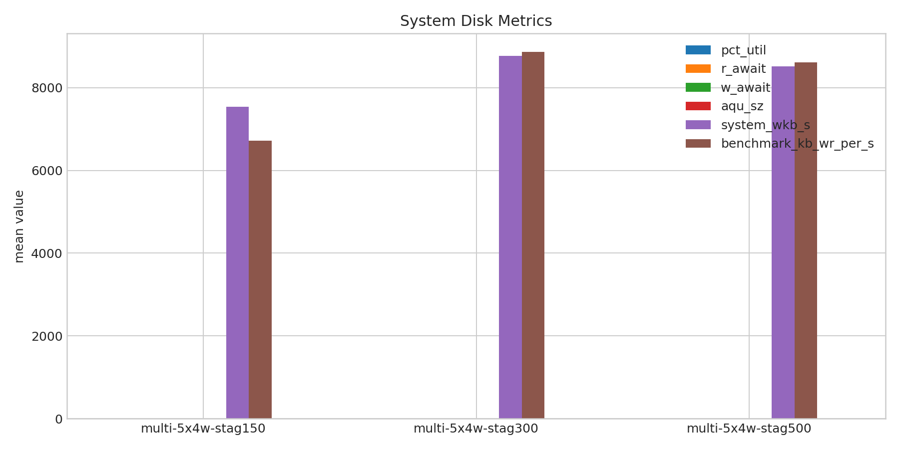
- 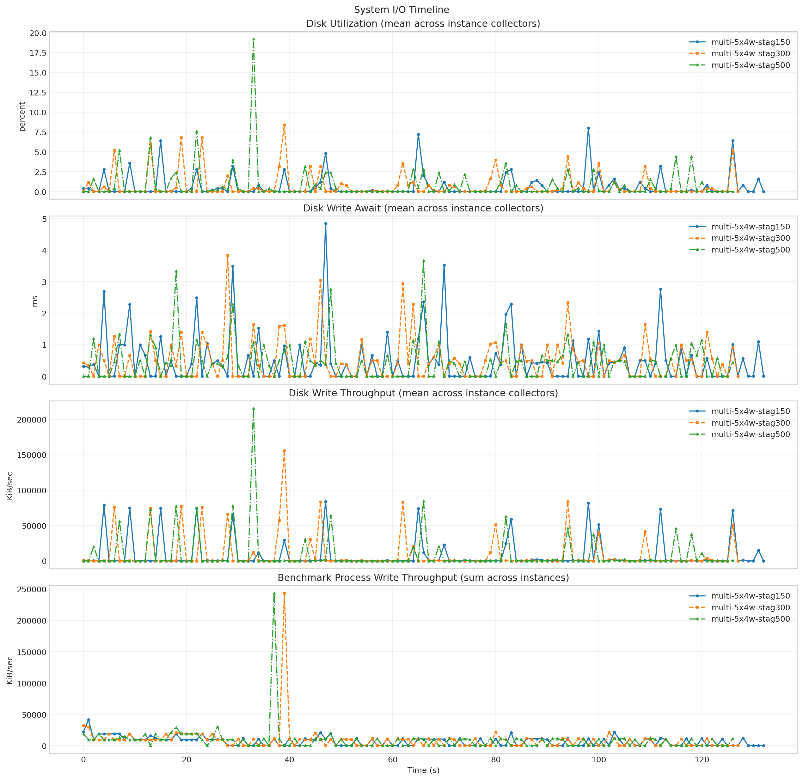
- 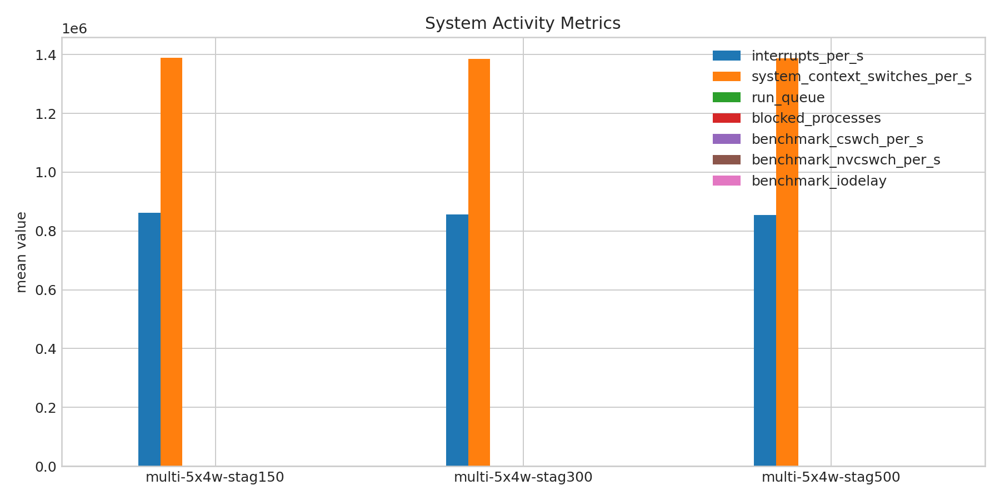
- 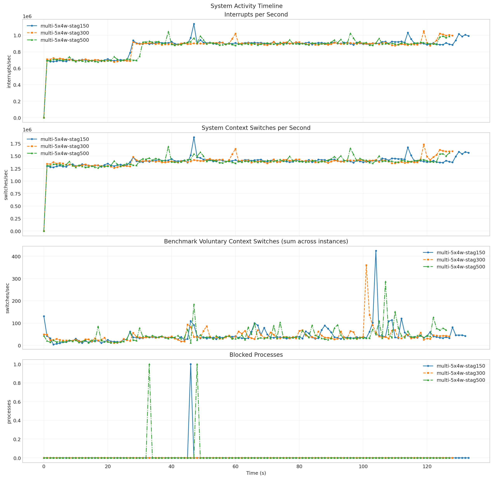

**Run Timing Table**

| scenario | run_dir | run_started_at | run_finished_at | run_wall_clock_sec | first_request_started_at | last_request_finished_at | request_window_sec |
| --- | --- | --- | --- | --- | --- | --- | --- |
| multi-5x4w-stag150 | /root/Zehao/ClawHarness/out/batch_run_1/task-01/20260416T133141Z_vps-docker-qwen3-32b8x2-multi-5x4w-stag150-request | 2026-04-16T13:31:48.992930+00:00 | 2026-04-16T13:34:12.007132+00:00 | 143.014 | 2026-04-16T13:31:49.614158+00:00 | 2026-04-16T13:34:02.697258+00:00 | 133.083 |
| multi-5x4w-stag300 | /root/Zehao/ClawHarness/out/batch_run_1/task-01/20260416T133828Z_vps-docker-qwen3-32b8x2-multi-5x4w-stag300-request | 2026-04-16T13:38:36.479127+00:00 | 2026-04-16T13:40:55.067199+00:00 | 138.588 | 2026-04-16T13:38:37.266790+00:00 | 2026-04-16T13:40:44.784376+00:00 | 127.518 |
| multi-5x4w-stag500 | /root/Zehao/ClawHarness/out/batch_run_1/task-01/20260416T134556Z_vps-docker-qwen3-32b8x2-multi-5x4w-stag500-request | 2026-04-16T13:46:04.763716+00:00 | 2026-04-16T13:48:18.194340+00:00 | 133.431 | 2026-04-16T13:46:21.885054+00:00 | 2026-04-16T13:48:12.232039+00:00 | 110.347 |

**Latency Overview Table**

| scenario | total_mean | total_p50 | total_p95 | total_p99 |
| --- | --- | --- | --- | --- |
| multi-5x4w-stag150 | 25476.896 | 20872.248 | 45772.739 | 46040.833 |
| multi-5x4w-stag300 | 24027.232 | 19434.949 | 49099.507 | 49964.462 |
| multi-5x4w-stag500 | 21126.048 | 19950.484 | 29235.442 | 30088.631 |

**Mean Latency by Phase Table**

| scenario | connect | send | wait | history | total |
| --- | --- | --- | --- | --- | --- |
| multi-5x4w-stag150 | 545.876 | 11.661 | 25301.068 | 164.127 | 25476.896 |
| multi-5x4w-stag300 | 540.334 | 9.688 | 23853.886 | 163.616 | 24027.232 |
| multi-5x4w-stag500 | 16413.064 | 39.150 | 20642.242 | 444.616 | 21126.048 |

**Tail Latency Table**

| scenario | send_p95 | send_p99 | wait_p50 | wait_p95 | wait_p99 | history_p95 | history_p99 | total_p95 | total_p99 |
| --- | --- | --- | --- | --- | --- | --- | --- | --- | --- |
| multi-5x4w-stag150 | 65.402 | 123.360 | 20836.667 | 45755.442 | 46024.308 | 95.674 | 2991.215 | 45772.739 | 46040.833 |
| multi-5x4w-stag300 | 33.918 | 110.163 | 19421.576 | 49084.323 | 49947.602 | 20.165 | 3038.712 | 49099.507 | 49964.462 |
| multi-5x4w-stag500 | 148.992 | 312.900 | 19923.716 | 29202.881 | 29932.598 | 30.865 | 8603.807 | 29235.442 | 30088.631 |

**System CPU Table**

| scenario | pct_cpu_total | pct_cpu_usr | pct_cpu_system | pct_cpu_wait |
| --- | --- | --- | --- | --- |
| multi-5x4w-stag150 | 45.849 | 37.165 | 8.684 | 0.045 |
| multi-5x4w-stag300 | 50.352 | 40.695 | 9.656 | 0.055 |
| multi-5x4w-stag500 | 50.827 | 40.260 | 10.567 | 0.055 |

**System Memory Table**

| scenario | rss_kib_total |
| --- | --- |
| multi-5x4w-stag150 | 952013.865 |
| multi-5x4w-stag300 | 961397.562 |
| multi-5x4w-stag500 | 970353.449 |

**System Disk Table**

| scenario | busiest_device | pct_util | r_await | w_await | aqu_sz | system_wkb_s | benchmark_kb_wr_per_s |
| --- | --- | --- | --- | --- | --- | --- | --- |
| multi-5x4w-stag150 | sda | 0.600 | 0.000 | 0.506 | 0.103 | 7541.684 | 6720.688 |
| multi-5x4w-stag300 | sda | 0.684 | 0.016 | 0.483 | 0.098 | 8773.469 | 8865.406 |
| multi-5x4w-stag500 | sda | 0.796 | 0.016 | 0.423 | 0.100 | 8517.953 | 8612.976 |

**System Activity Table**

| scenario | interrupts_per_s | system_context_switches_per_s | run_queue | blocked_processes | benchmark_cswch_per_s | benchmark_nvcswch_per_s | benchmark_iodelay |
| --- | --- | --- | --- | --- | --- | --- | --- |
| multi-5x4w-stag150 | 862355.381 | 1389390.545 | 30.261 | 0.007 | 43.486 | 23.098 | 0.000 |
| multi-5x4w-stag300 | 856420.225 | 1386105.488 | 29.581 | 0.000 | 41.531 | 30.016 | 0.000 |
| multi-5x4w-stag500 | 854584.492 | 1387013.336 | 29.094 | 0.016 | 44.181 | 27.402 | 0.000 |

**Token Throughput Table**

| scenario | rows_with_usage | output_tokens_mean | output_tps_request_mean | output_tps_session_delta_mean |
| --- | --- | --- | --- | --- |
| multi-5x4w-stag150 | - | - | - | - |
| multi-5x4w-stag300 | - | - | - | - |
| multi-5x4w-stag500 | - | - | - | - |

**NPU Table**

| scenario | utilization_pct | hbm_usage_pct | aicore_usage_pct |
| --- | --- | --- | --- |
| multi-5x4w-stag150 | - | - | - |
| multi-5x4w-stag300 | - | - | - |
| multi-5x4w-stag500 | - | - | - |

**System Timeline Peaks Table**

| scenario | benchmark_cpu_peak | benchmark_cpu_peak_t_sec | benchmark_rss_peak_kib | benchmark_rss_peak_t_sec | system_disk_pct_util_peak | system_disk_pct_util_peak_t_sec | system_disk_w_await_peak | system_disk_w_await_peak_t_sec | system_interrupts_peak | system_interrupts_peak_t_sec | system_context_switches_peak | system_context_switches_peak_t_sec | system_run_queue_peak | system_run_queue_peak_t_sec | npu_utilization_peak | npu_utilization_peak_t_sec | npu_aicore_peak | npu_aicore_peak_t_sec | npu_hbm_peak | npu_hbm_peak_t_sec |
| --- | --- | --- | --- | --- | --- | --- | --- | --- | --- | --- | --- | --- | --- | --- | --- | --- | --- | --- | --- | --- |
| multi-5x4w-stag150 | 178.000 | 112.000 | 1073804.000 | 103.000 | 8.000 | 98.000 | 4.840 | 47.000 | 1137885.000 | 47.000 | 1872676.000 | 47.000 | 67.000 | 58.000 | - | - | - | - | - | - |
| multi-5x4w-stag300 | 171.000 | 103.000 | 1082036.000 | 100.000 | 8.400 | 39.000 | 3.830 | 28.000 | 1051212.000 | 119.000 | 1729339.000 | 119.000 | 68.000 | 57.000 | - | - | - | - | - | - |
| multi-5x4w-stag500 | 165.000 | 107.000 | 1093240.000 | 106.000 | 19.200 | 33.000 | 3.670 | 66.000 | 1044811.000 | 39.000 | 1687314.000 | 39.000 | 66.000 | 31.000 | - | - | - | - | - | - |
