## `multi-5x4w-stag150` vs `multi-5x4w-stag300` vs `multi-5x4w-stag500`

**Run Dirs**

| scenario | run_dir | instance_num | requests_total | requests_ok | requests_failed |
| --- | --- | --- | --- | --- | --- |
| multi-5x4w-stag150 | /root/Zehao/ClawHarness/out/batch_run_1/task-01/20260416T132627Z_vps-docker-qwen3-32b8x2-multi-5x4w-stag150-worker | 1 | 20 | 20 | 0 |
| multi-5x4w-stag300 | /root/Zehao/ClawHarness/out/batch_run_1/task-01/20260416T133412Z_vps-docker-qwen3-32b8x2-multi-5x4w-stag300-worker | 1 | 20 | 20 | 0 |
| multi-5x4w-stag500 | /root/Zehao/ClawHarness/out/batch_run_1/task-01/20260416T134055Z_vps-docker-qwen3-32b8x2-multi-5x4w-stag500-worker | 1 | 20 | 20 | 0 |

**Aggregation Policy**

- `pidstat` per-process metrics are summed across instances.
- `iostat` and `vmstat` host-wide metrics are averaged across instance collectors.
- This makes multi-instance runs comparable with single-instance runs at the whole-machine level.

**Figures**

- 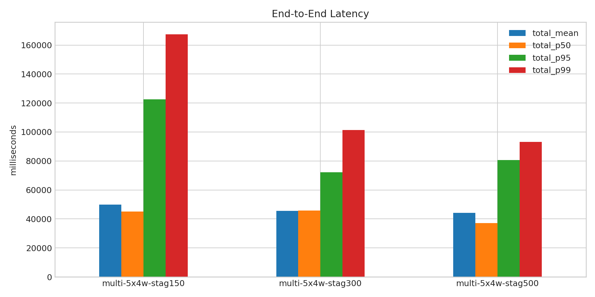
- 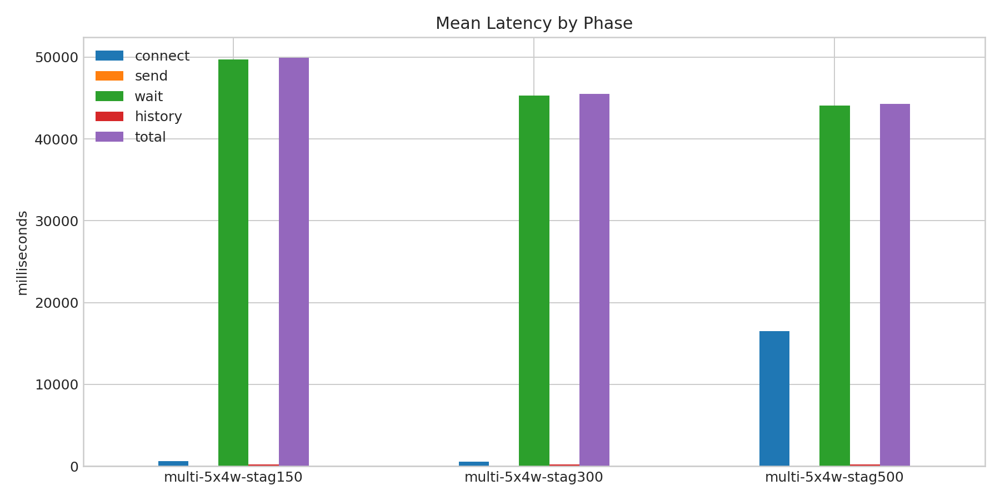
- 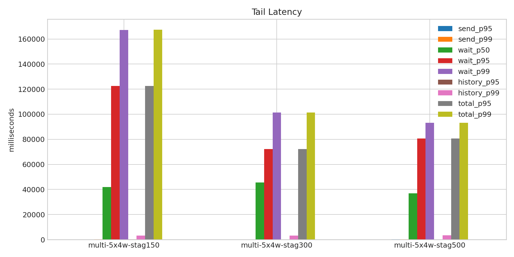
- 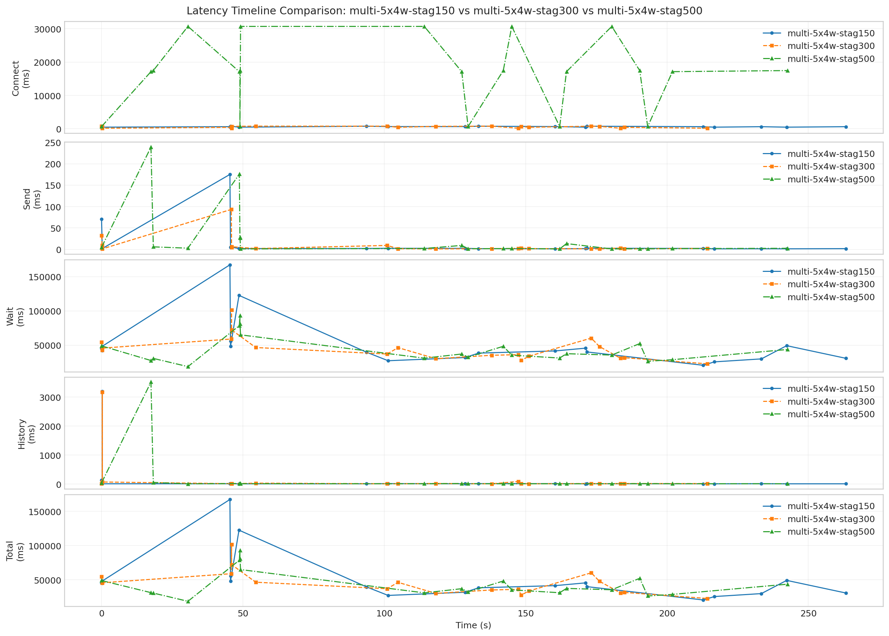
- 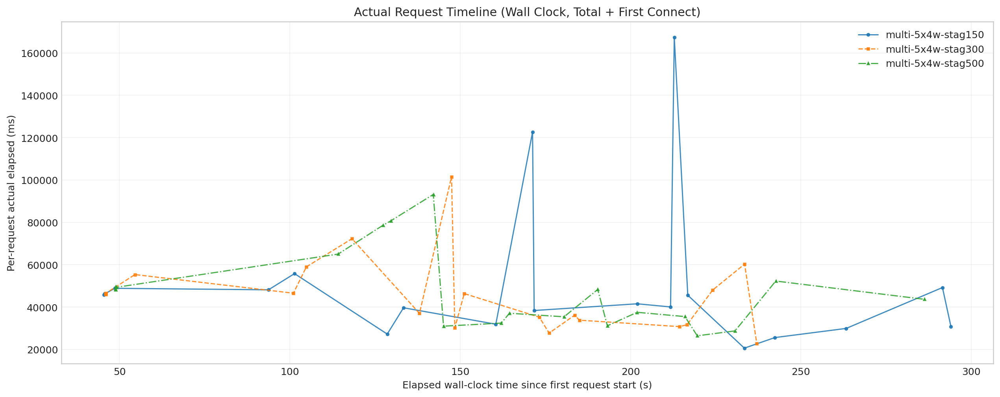
- 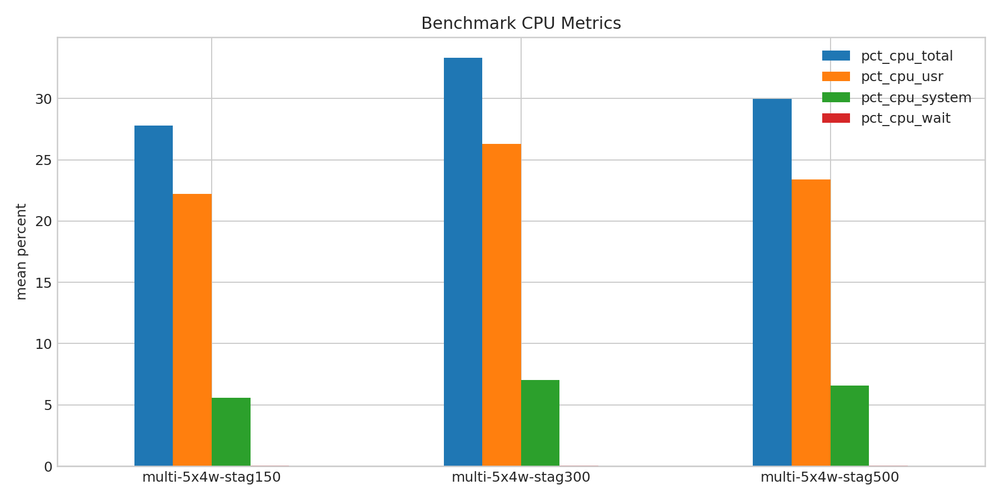
- 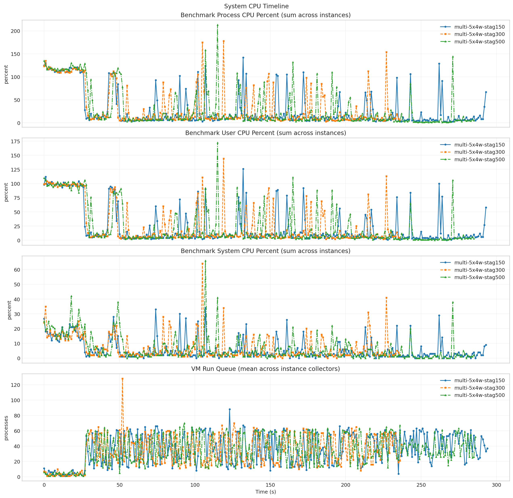
- 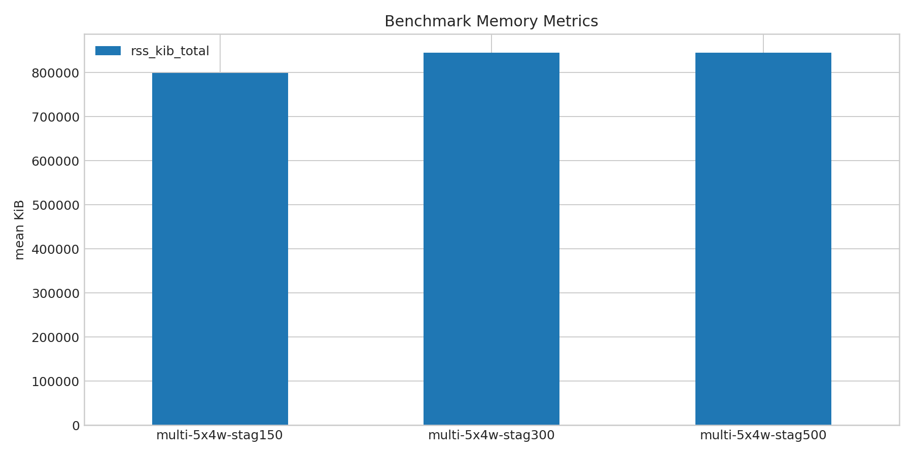
- 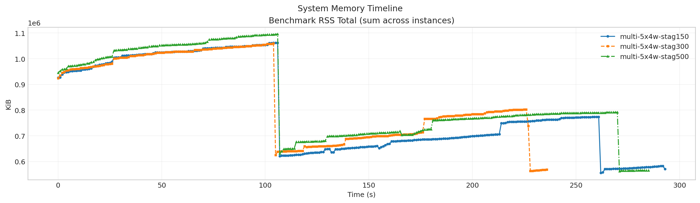
- 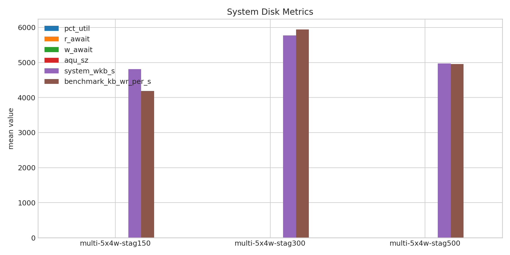
- 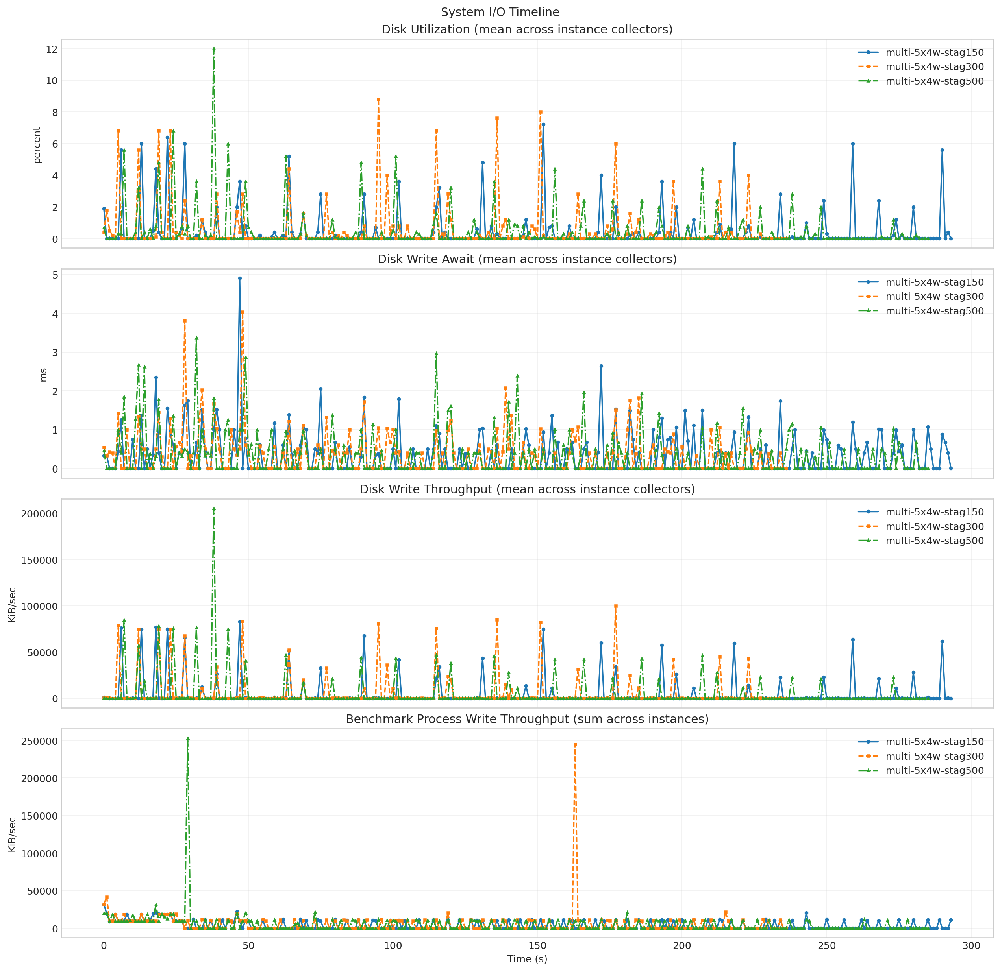
- 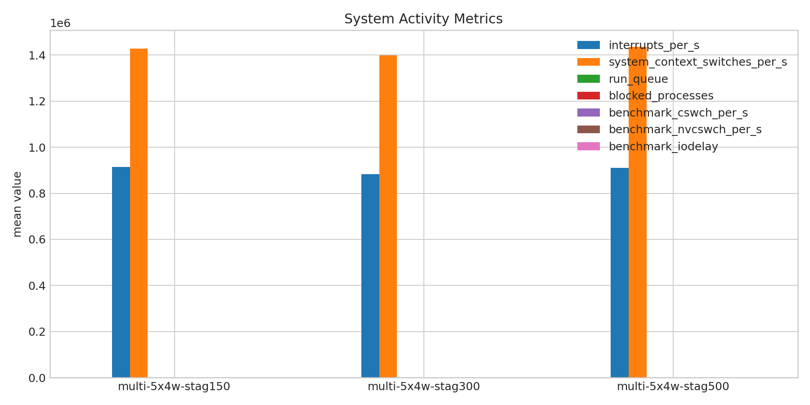
- 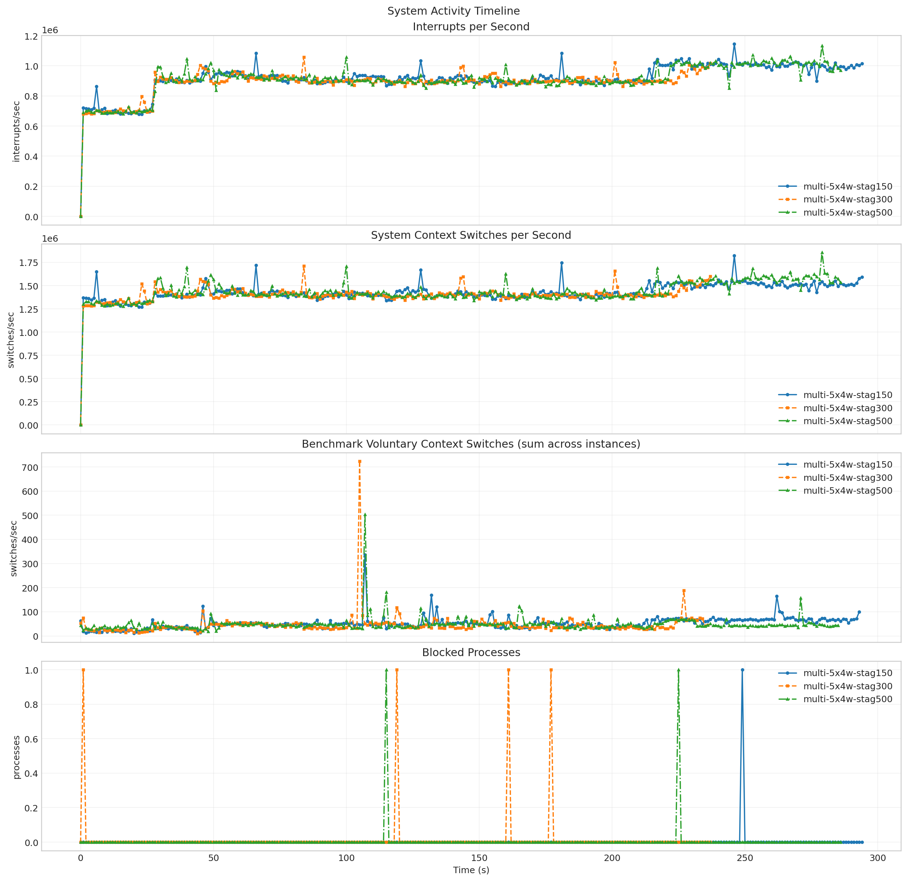

**Run Timing Table**

| scenario | run_dir | run_started_at | run_finished_at | run_wall_clock_sec | first_request_started_at | last_request_finished_at | request_window_sec |
| --- | --- | --- | --- | --- | --- | --- | --- |
| multi-5x4w-stag150 | /root/Zehao/ClawHarness/out/batch_run_1/task-01/20260416T132627Z_vps-docker-qwen3-32b8x2-multi-5x4w-stag150-worker | 2026-04-16T13:26:35.107685+00:00 | 2026-04-16T13:31:41.253550+00:00 | 306.146 | 2026-04-16T13:26:35.757390+00:00 | 2026-04-16T13:31:29.785350+00:00 | 294.028 |
| multi-5x4w-stag300 | /root/Zehao/ClawHarness/out/batch_run_1/task-01/20260416T133412Z_vps-docker-qwen3-32b8x2-multi-5x4w-stag300-worker | 2026-04-16T13:34:19.925292+00:00 | 2026-04-16T13:38:28.543158+00:00 | 248.618 | 2026-04-16T13:34:20.697749+00:00 | 2026-04-16T13:38:17.748987+00:00 | 237.051 |
| multi-5x4w-stag500 | /root/Zehao/ClawHarness/out/batch_run_1/task-01/20260416T134055Z_vps-docker-qwen3-32b8x2-multi-5x4w-stag500-worker | 2026-04-16T13:41:04.048554+00:00 | 2026-04-16T13:45:55.842057+00:00 | 291.794 | 2026-04-16T13:41:04.702548+00:00 | 2026-04-16T13:45:50.947789+00:00 | 286.245 |

**Latency Overview Table**

| scenario | total_mean | total_p50 | total_p95 | total_p99 |
| --- | --- | --- | --- | --- |
| multi-5x4w-stag150 | 49922.709 | 45139.027 | 122611.658 | 167421.788 |
| multi-5x4w-stag300 | 45518.749 | 45706.730 | 72247.396 | 101460.015 |
| multi-5x4w-stag500 | 44304.270 | 37044.969 | 80705.627 | 93148.206 |

**Mean Latency by Phase Table**

| scenario | connect | send | wait | history | total |
| --- | --- | --- | --- | --- | --- |
| multi-5x4w-stag150 | 625.334 | 14.300 | 49729.722 | 178.647 | 49922.709 |
| multi-5x4w-stag300 | 521.615 | 9.115 | 45328.164 | 181.429 | 45518.749 |
| multi-5x4w-stag500 | 16489.151 | 26.274 | 44086.487 | 191.469 | 44304.270 |

**Tail Latency Table**

| scenario | send_p95 | send_p99 | wait_p50 | wait_p95 | wait_p99 | history_p95 | history_p99 | total_p95 | total_p99 |
| --- | --- | --- | --- | --- | --- | --- | --- | --- | --- |
| multi-5x4w-stag150 | 70.443 | 175.159 | 41936.124 | 122600.768 | 167233.931 | 130.777 | 3201.003 | 122611.658 | 167421.788 |
| multi-5x4w-stag300 | 32.403 | 93.356 | 45633.837 | 72229.241 | 101442.409 | 91.340 | 3175.010 | 72247.396 | 101460.015 |
| multi-5x4w-stag500 | 175.992 | 238.899 | 37016.605 | 80667.520 | 93109.145 | 56.176 | 3519.225 | 80705.627 | 93148.206 |

**System CPU Table**

| scenario | pct_cpu_total | pct_cpu_usr | pct_cpu_system | pct_cpu_wait |
| --- | --- | --- | --- | --- |
| multi-5x4w-stag150 | 27.809 | 22.211 | 5.598 | 0.027 |
| multi-5x4w-stag300 | 33.329 | 26.320 | 7.008 | 0.038 |
| multi-5x4w-stag500 | 29.979 | 23.416 | 6.563 | 0.028 |

**System Memory Table**

| scenario | rss_kib_total |
| --- | --- |
| multi-5x4w-stag150 | 799579.374 |
| multi-5x4w-stag300 | 845248.084 |
| multi-5x4w-stag500 | 845271.762 |

**System Disk Table**

| scenario | busiest_device | pct_util | r_await | w_await | aqu_sz | system_wkb_s | benchmark_kb_wr_per_s |
| --- | --- | --- | --- | --- | --- | --- | --- |
| multi-5x4w-stag150 | sda | 0.458 | 0.000 | 0.353 | 0.050 | 4807.116 | 4188.280 |
| multi-5x4w-stag300 | sda | 0.535 | 0.004 | 0.358 | 0.056 | 5776.308 | 5943.052 |
| multi-5x4w-stag500 | sda | 0.445 | 0.003 | 0.333 | 0.060 | 4970.797 | 4953.748 |

**System Activity Table**

| scenario | interrupts_per_s | system_context_switches_per_s | run_queue | blocked_processes | benchmark_cswch_per_s | benchmark_nvcswch_per_s | benchmark_iodelay |
| --- | --- | --- | --- | --- | --- | --- | --- |
| multi-5x4w-stag150 | 915296.149 | 1428124.288 | 35.417 | 0.003 | 52.236 | 14.392 | 0.000 |
| multi-5x4w-stag300 | 883693.550 | 1398899.542 | 33.357 | 0.017 | 45.099 | 18.316 | 0.000 |
| multi-5x4w-stag500 | 909736.568 | 1436127.972 | 34.596 | 0.007 | 48.409 | 14.584 | 0.000 |

**System Timeline Peaks Table**

| scenario | benchmark_cpu_peak | benchmark_cpu_peak_t_sec | benchmark_rss_peak_kib | benchmark_rss_peak_t_sec | system_disk_pct_util_peak | system_disk_pct_util_peak_t_sec | system_disk_w_await_peak | system_disk_w_await_peak_t_sec | system_interrupts_peak | system_interrupts_peak_t_sec | system_context_switches_peak | system_context_switches_peak_t_sec | system_run_queue_peak | system_run_queue_peak_t_sec |
| --- | --- | --- | --- | --- | --- | --- | --- | --- | --- | --- | --- | --- | --- | --- |
| multi-5x4w-stag150 | 142.000 | 132.000 | 1061964.000 | 106.000 | 7.200 | 152.000 | 4.900 | 47.000 | 1145393.000 | 246.000 | 1824279.000 | 246.000 | 88.000 | 123.000 |
| multi-5x4w-stag300 | 178.000 | 119.000 | 1059368.000 | 104.000 | 8.800 | 95.000 | 4.030 | 48.000 | 1058823.000 | 84.000 | 1709580.000 | 84.000 | 128.000 | 52.000 |
| multi-5x4w-stag500 | 213.000 | 115.000 | 1095796.000 | 106.000 | 12.000 | 38.000 | 3.370 | 32.000 | 1132934.000 | 279.000 | 1855645.000 | 279.000 | 70.000 | 93.000 |
