## `single-w` vs `multi-5x4w-stag500` vs `multi-inst-5x4i` vs `multi-inst-5x2ix2w-500`

**Run Dirs**

| scenario | run_dir | instance_num | requests_total | requests_ok | requests_failed |
| --- | --- | --- | --- | --- | --- |
| single-w | /root/Zehao/ClawHarness/out/batch_run_1/task-01/20260416T132159Z_vps-docker-qwen3-32b8x2-single-20-request | 1 | 20 | 20 | 0 |
| multi-5x4w-stag500 | /root/Zehao/ClawHarness/out/batch_run_1/task-01/20260416T133828Z_vps-docker-qwen3-32b8x2-multi-5x4w-stag300-request | 1 | 20 | 20 | 0 |
| multi-inst-5x4i | /root/Zehao/ClawHarness/out/batch_run_1/task-01/20260416T135316Z_vps-docker-qwen3-32b8x2-single-inst-5x4i-request | 4 | 20 | 20 | 0 |
| multi-inst-5x2ix2w-500 | /root/Zehao/ClawHarness/out/batch_run_1/task-01/20260416T151659Z_vps-docker-qwen3-32b8x2-multi-inst-5x2ix2w-stag500-request | 2 | 20 | 20 | 0 |

**Aggregation Policy**

- `pidstat` per-process metrics are summed across instances.
- `iostat` and `vmstat` host-wide metrics are averaged across instance collectors.
- This makes multi-instance runs comparable with single-instance runs at the whole-machine level.

**Figures**

- 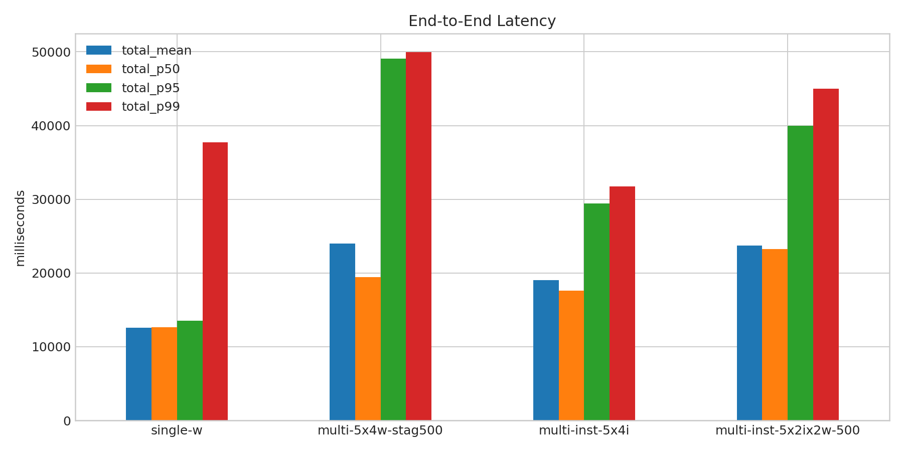
- 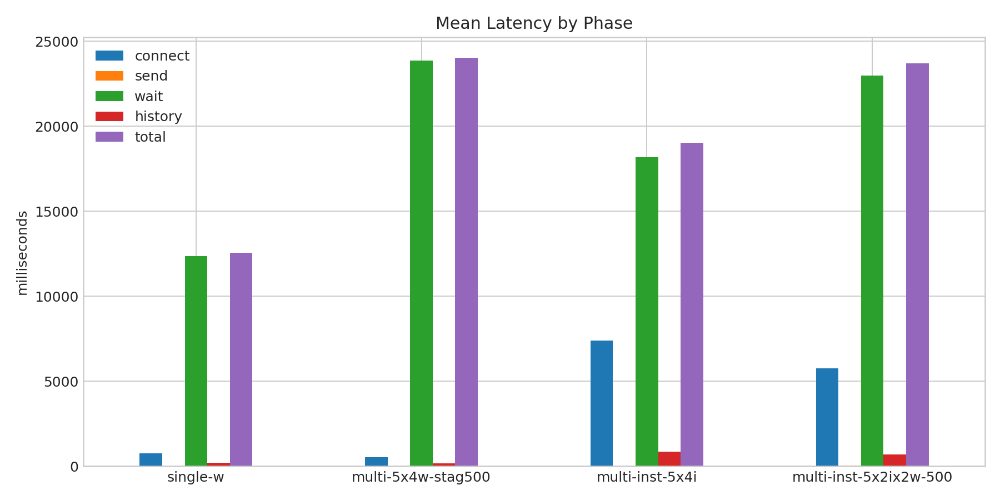
- 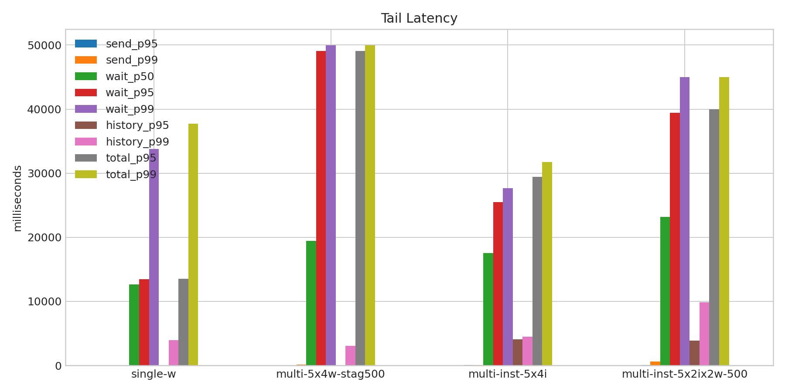
- 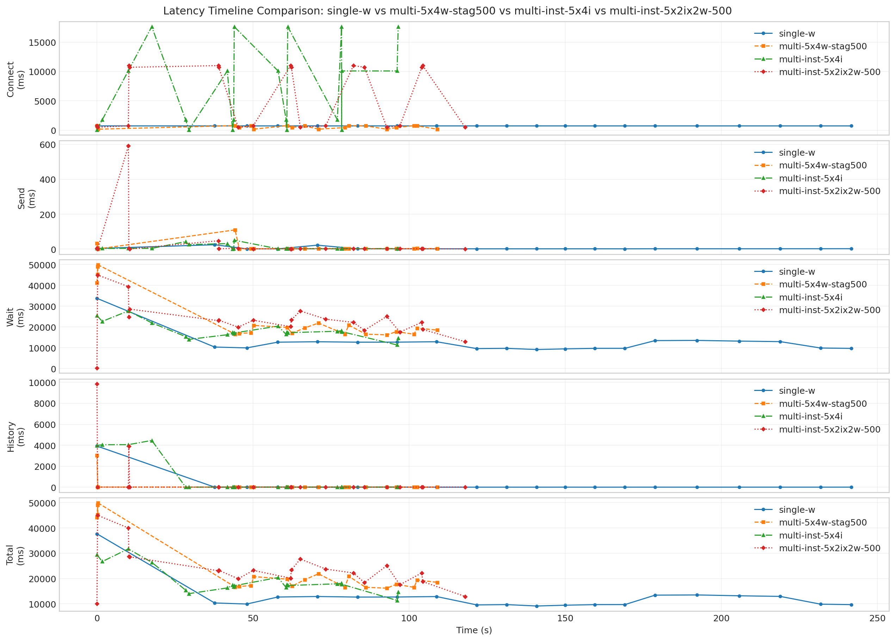
- 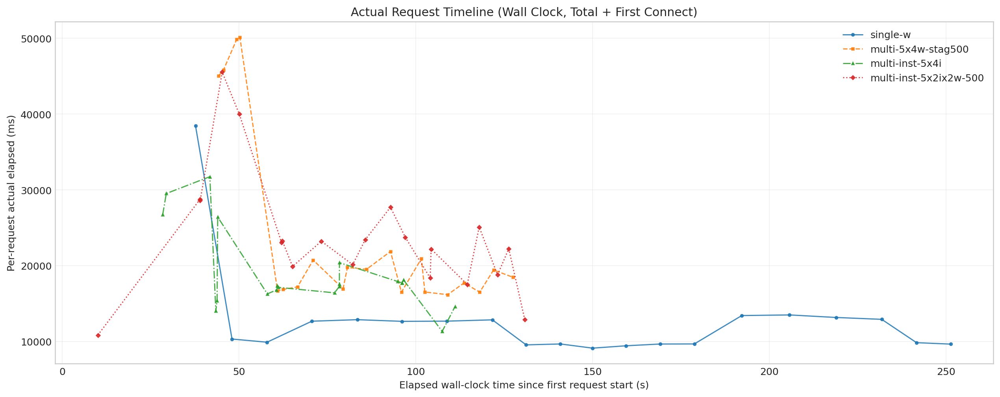
- 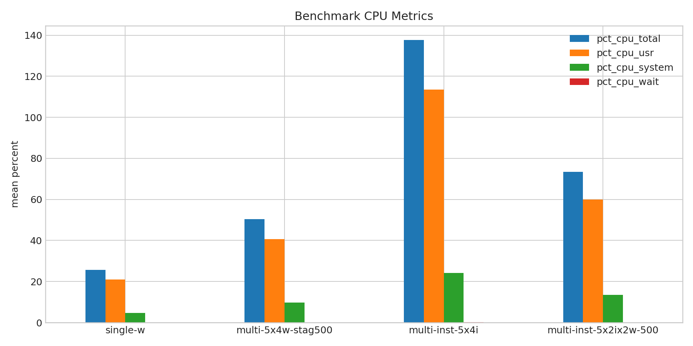
- 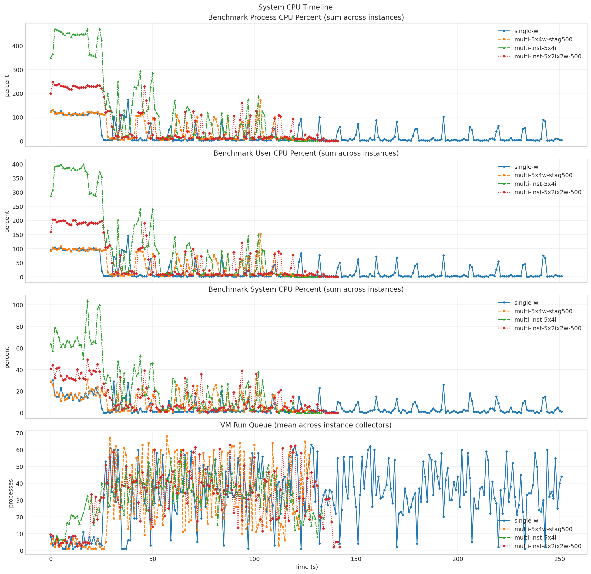
- 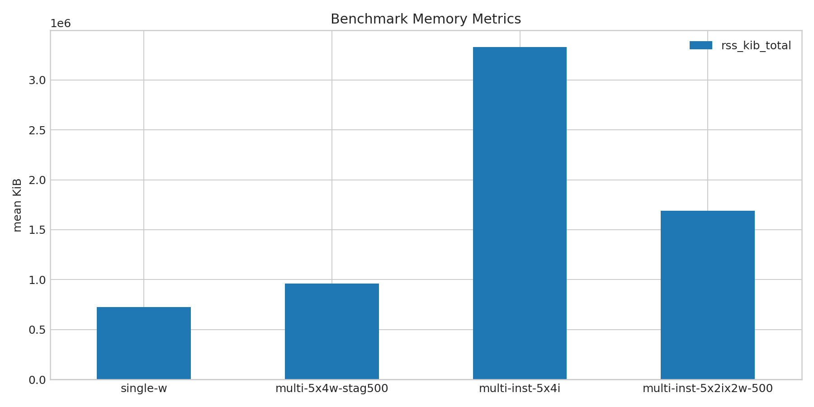
- 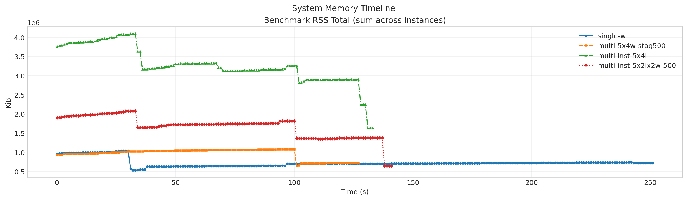
- 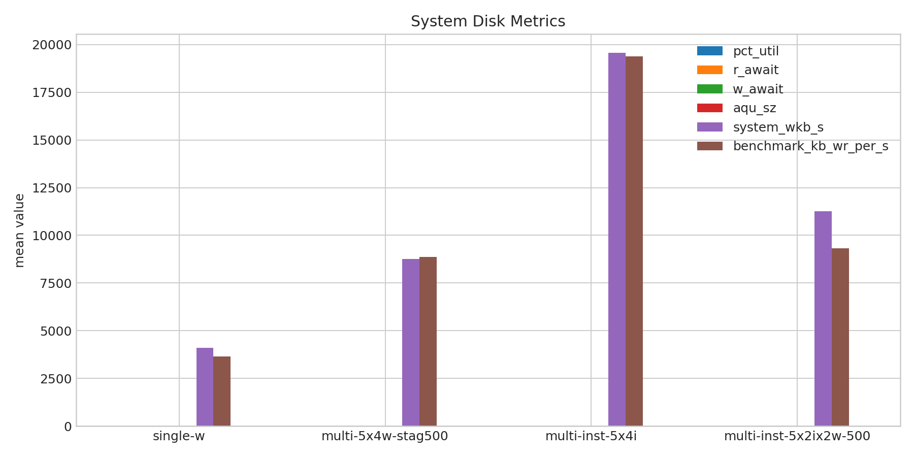
- 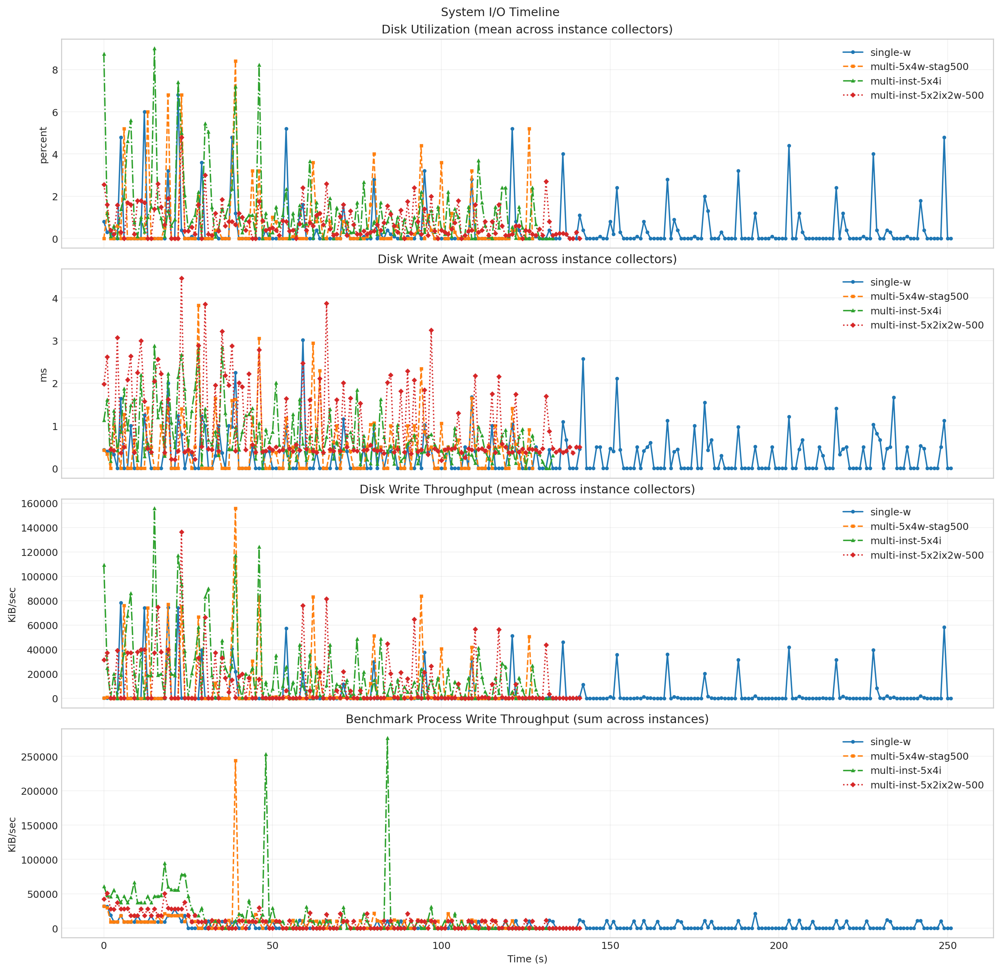
- 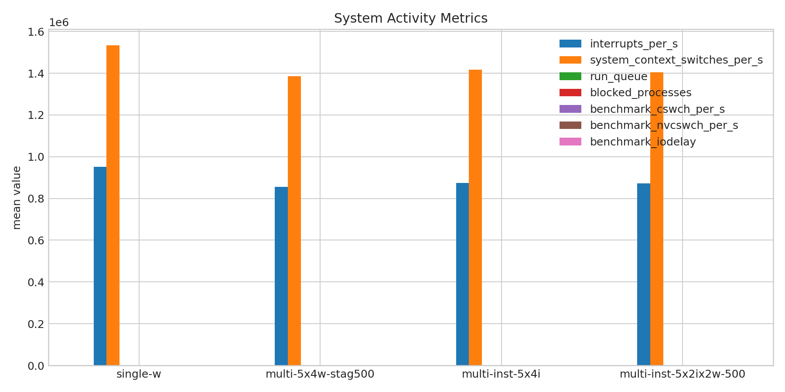
- 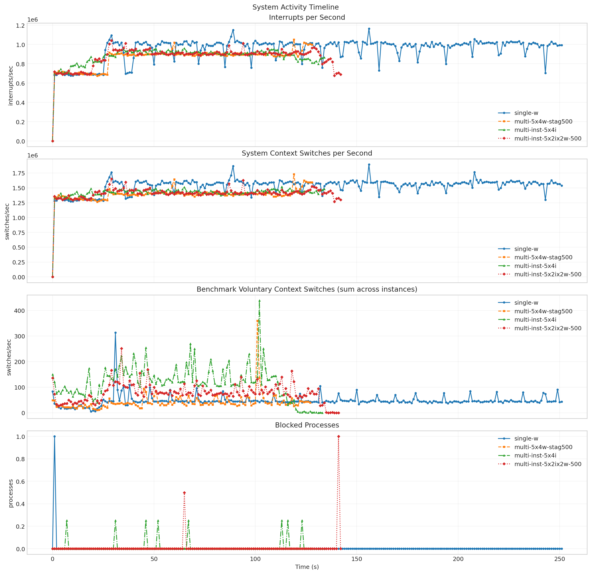

**Run Timing Table**

| scenario | run_dir | run_started_at | run_finished_at | run_wall_clock_sec | first_request_started_at | last_request_finished_at | request_window_sec |
| --- | --- | --- | --- | --- | --- | --- | --- |
| single-w | /root/Zehao/ClawHarness/out/batch_run_1/task-01/20260416T132159Z_vps-docker-qwen3-32b8x2-single-20-request | 2026-04-16T13:22:07.496235+00:00 | 2026-04-16T13:26:27.277752+00:00 | 259.782 | 2026-04-16T13:22:08.235413+00:00 | 2026-04-16T13:26:19.587649+00:00 | 251.352 |
| multi-5x4w-stag500 | /root/Zehao/ClawHarness/out/batch_run_1/task-01/20260416T133828Z_vps-docker-qwen3-32b8x2-multi-5x4w-stag300-request | 2026-04-16T13:38:36.479127+00:00 | 2026-04-16T13:40:55.067199+00:00 | 138.588 | 2026-04-16T13:38:37.266790+00:00 | 2026-04-16T13:40:44.784376+00:00 | 127.518 |
| multi-inst-5x4i | /root/Zehao/ClawHarness/out/batch_run_1/task-01/20260416T135316Z_vps-docker-qwen3-32b8x2-single-inst-5x4i-request | 2026-04-16T13:53:47.994698+00:00 | 2026-04-16T13:56:02.055764+00:00 | 134.061 | 2026-04-16T13:53:48.069632+00:00 | 2026-04-16T13:55:39.184395+00:00 | 111.115 |
| multi-inst-5x2ix2w-500 | /root/Zehao/ClawHarness/out/batch_run_1/task-01/20260416T151659Z_vps-docker-qwen3-32b8x2-multi-inst-5x2ix2w-stag500-request | 2026-04-16T15:17:14.506517+00:00 | 2026-04-16T15:19:48.308301+00:00 | 153.802 | 2026-04-16T15:17:15.280253+00:00 | 2026-04-16T15:19:26.139426+00:00 | 130.859 |

**Latency Overview Table**

| scenario | total_mean | total_p50 | total_p95 | total_p99 |
| --- | --- | --- | --- | --- |
| single-w | 12567.561 | 12659.291 | 13504.993 | 37712.032 |
| multi-5x4w-stag500 | 24027.232 | 19434.949 | 49099.507 | 49964.462 |
| multi-inst-5x4i | 19019.368 | 17579.462 | 29442.295 | 31737.685 |
| multi-inst-5x2ix2w-500 | 23702.205 | 23227.559 | 40002.007 | 45031.050 |

**Mean Latency by Phase Table**

| scenario | connect | send | wait | history | total |
| --- | --- | --- | --- | --- | --- |
| single-w | 738.830 | 4.346 | 12358.068 | 205.107 | 12567.561 |
| multi-5x4w-stag500 | 540.334 | 9.688 | 23853.886 | 163.616 | 24027.232 |
| multi-inst-5x4i | 7391.217 | 9.831 | 18173.444 | 836.054 | 19019.368 |
| multi-inst-5x2ix2w-500 | 5744.487 | 34.189 | 22970.959 | 697.017 | 23702.205 |

**Tail Latency Table**

| scenario | send_p95 | send_p99 | wait_p50 | wait_p95 | wait_p99 | history_p95 | history_p99 | total_p95 | total_p99 |
| --- | --- | --- | --- | --- | --- | --- | --- | --- | --- |
| single-w | 22.834 | 25.308 | 12649.275 | 13494.578 | 33783.328 | 19.060 | 3924.809 | 13504.993 | 37712.032 |
| multi-5x4w-stag500 | 33.918 | 110.163 | 19421.576 | 49084.323 | 49947.602 | 20.165 | 3038.712 | 49099.507 | 49964.462 |
| multi-inst-5x4i | 42.929 | 51.219 | 17568.088 | 25461.605 | 27679.778 | 4053.137 | 4458.059 | 29442.295 | 31737.685 |
| multi-inst-5x2ix2w-500 | 48.081 | 591.121 | 23206.900 | 39400.887 | 45014.226 | 3890.935 | 9832.964 | 40002.007 | 45031.050 |

**System CPU Table**

| scenario | pct_cpu_total | pct_cpu_usr | pct_cpu_system | pct_cpu_wait |
| --- | --- | --- | --- | --- |
| single-w | 25.654 | 20.909 | 4.745 | 0.024 |
| multi-5x4w-stag500 | 50.352 | 40.695 | 9.656 | 0.055 |
| multi-inst-5x4i | 137.688 | 113.544 | 24.143 | 0.197 |
| multi-inst-5x2ix2w-500 | 73.510 | 59.991 | 13.519 | 0.093 |

**System Memory Table**

| scenario | rss_kib_total |
| --- | --- |
| single-w | 727324.444 |
| multi-5x4w-stag500 | 961397.562 |
| multi-inst-5x4i | 3330165.045 |
| multi-inst-5x2ix2w-500 | 1688957.247 |

**System Disk Table**

| scenario | busiest_device | pct_util | r_await | w_await | aqu_sz | system_wkb_s | benchmark_kb_wr_per_s |
| --- | --- | --- | --- | --- | --- | --- | --- |
| single-w | sda | 0.424 | 0.000 | 0.296 | 0.037 | 4114.159 | 3656.782 |
| multi-5x4w-stag500 | sda | 0.684 | 0.016 | 0.483 | 0.098 | 8773.469 | 8865.406 |
| multi-inst-5x4i | sda | 1.297 | 0.036 | 0.762 | 0.265 | 19572.718 | 19387.202 |
| multi-inst-5x2ix2w-500 | sda | 0.745 | 0.000 | 1.033 | 0.284 | 11256.445 | 9327.748 |

**System Activity Table**

| scenario | interrupts_per_s | system_context_switches_per_s | run_queue | blocked_processes | benchmark_cswch_per_s | benchmark_nvcswch_per_s | benchmark_iodelay |
| --- | --- | --- | --- | --- | --- | --- | --- |
| single-w | 950504.452 | 1533768.694 | 32.524 | 0.004 | 46.778 | 13.368 | 0.000 |
| multi-5x4w-stag500 | 856420.225 | 1386105.488 | 29.581 | 0.000 | 41.531 | 30.016 | 0.000 |
| multi-inst-5x4i | 875306.225 | 1416360.648 | 32.027 | 0.015 | 118.882 | 92.325 | 0.000 |
| multi-inst-5x2ix2w-500 | 871618.735 | 1404746.039 | 31.487 | 0.007 | 78.229 | 46.035 | 0.000 |

**System Timeline Peaks Table**

| scenario | benchmark_cpu_peak | benchmark_cpu_peak_t_sec | benchmark_rss_peak_kib | benchmark_rss_peak_t_sec | system_disk_pct_util_peak | system_disk_pct_util_peak_t_sec | system_disk_w_await_peak | system_disk_w_await_peak_t_sec | system_interrupts_peak | system_interrupts_peak_t_sec | system_context_switches_peak | system_context_switches_peak_t_sec | system_run_queue_peak | system_run_queue_peak_t_sec |
| --- | --- | --- | --- | --- | --- | --- | --- | --- | --- | --- | --- | --- | --- | --- |
| single-w | 174.000 | 38.000 | 1033456.000 | 29.000 | 6.800 | 22.000 | 3.010 | 59.000 | 1163898.000 | 156.000 | 1892966.000 | 156.000 | 63.000 | 128.000 |
| multi-5x4w-stag500 | 171.000 | 103.000 | 1082036.000 | 100.000 | 8.400 | 39.000 | 3.830 | 28.000 | 1051212.000 | 119.000 | 1729339.000 | 119.000 | 68.000 | 57.000 |
| multi-inst-5x4i | 472.000 | 24.000 | 4097624.000 | 32.000 | 9.000 | 15.000 | 2.880 | 15.000 | 960446.750 | 65.000 | 1517828.250 | 113.000 | 59.250 | 64.000 |
| multi-inst-5x2ix2w-500 | 247.000 | 1.000 | 2076292.000 | 33.000 | 4.800 | 23.000 | 4.460 | 23.000 | 1041133.500 | 29.000 | 1650914.500 | 29.000 | 63.000 | 88.000 |
