## `single-w` vs `multi-5x4w-stag500` vs `multi-inst-5x4i` vs `multi-inst-5x2ix2w-500`

**Run Dirs**

| scenario | run_dir | instance_num | requests_total | requests_ok | requests_failed |
| --- | --- | --- | --- | --- | --- |
| single-w | /root/Zehao/ClawHarness/out/batch_run_1/task-01/20260416T131415Z_vps-docker-qwen3-32b8x2-single-20-worker | 1 | 20 | 20 | 0 |
| multi-5x4w-stag500 | /root/Zehao/ClawHarness/out/batch_run_1/task-01/20260416T133412Z_vps-docker-qwen3-32b8x2-multi-5x4w-stag300-worker | 1 | 20 | 20 | 0 |
| multi-inst-5x4i | /root/Zehao/ClawHarness/out/batch_run_1/task-01/20260416T134818Z_vps-docker-qwen3-32b8x2-single-inst-5x4i-worker | 4 | 20 | 20 | 0 |
| multi-inst-5x2ix2w-500 | /root/Zehao/ClawHarness/out/batch_run_1/task-01/20260416T151137Z_vps-docker-qwen3-32b8x2-multi-inst-5x2ix2w-stag500-worker | 2 | 20 | 19 | 1 |

**Aggregation Policy**

- `pidstat` per-process metrics are summed across instances.
- `iostat` and `vmstat` host-wide metrics are averaged across instance collectors.
- This makes multi-instance runs comparable with single-instance runs at the whole-machine level.

**Figures**

- 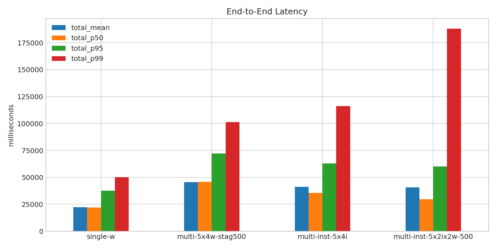
- 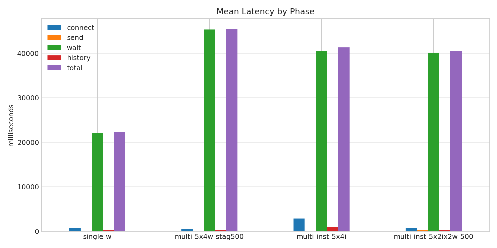
- 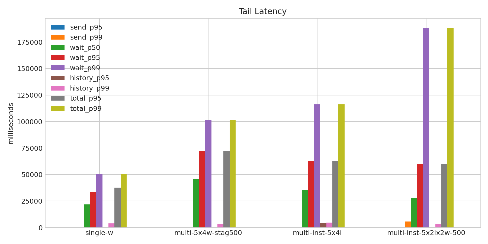
- 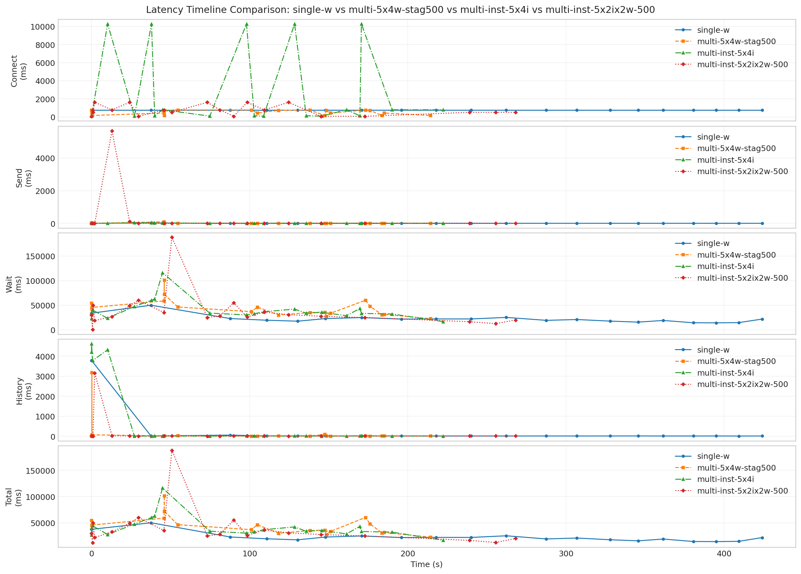
- 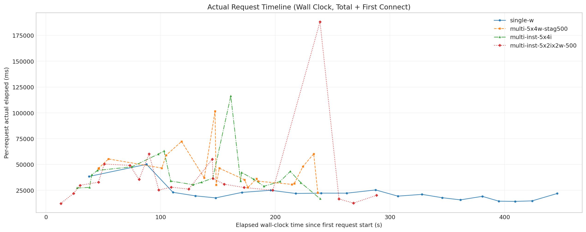
- 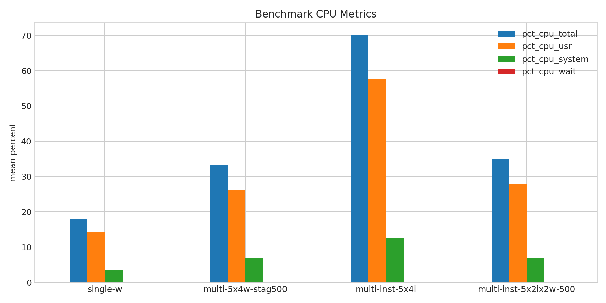
- 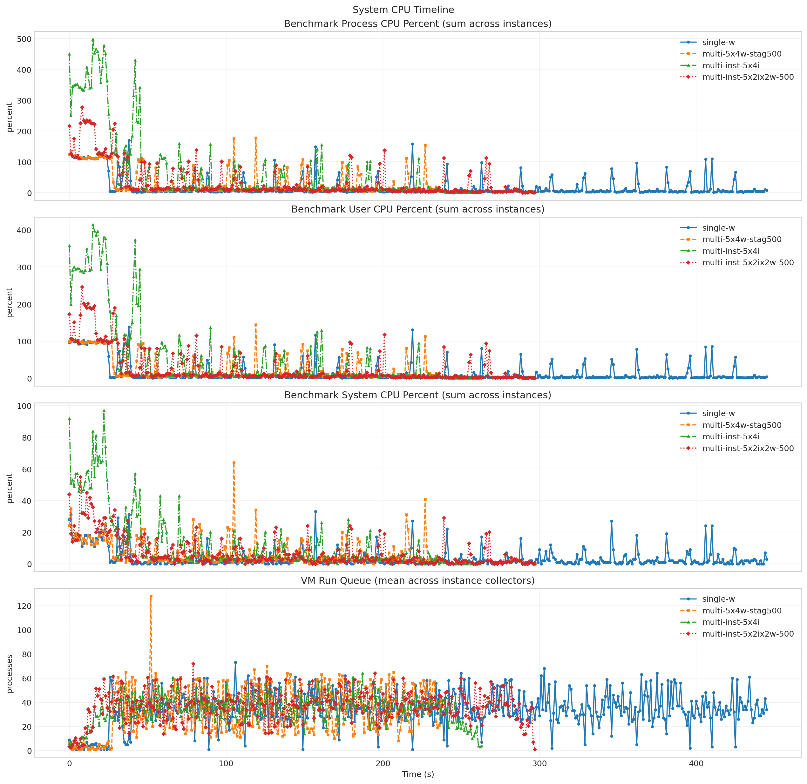
- 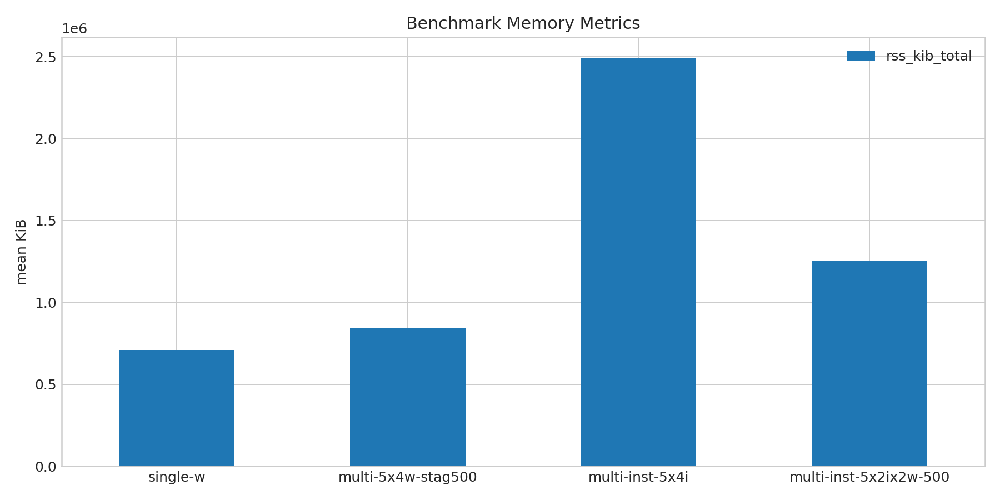
- 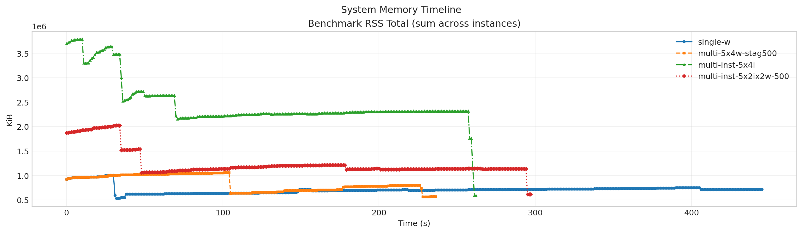
- 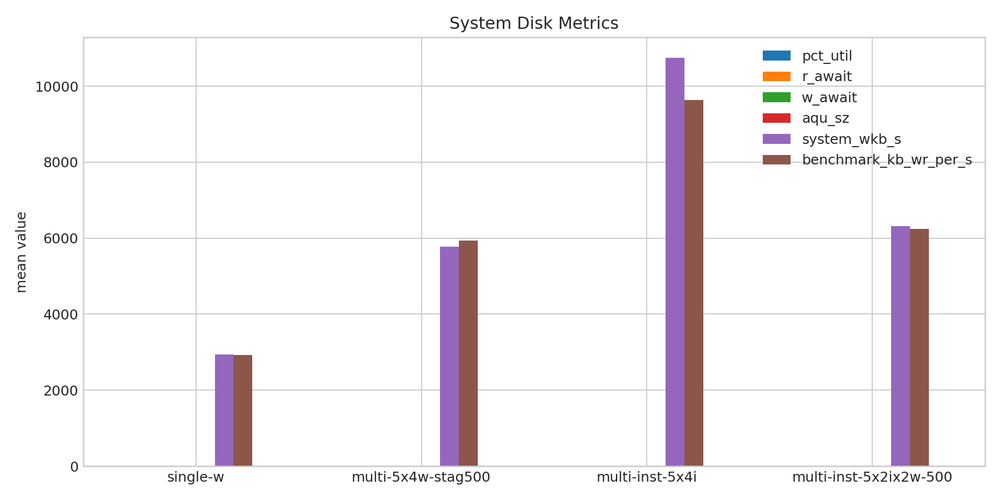
- 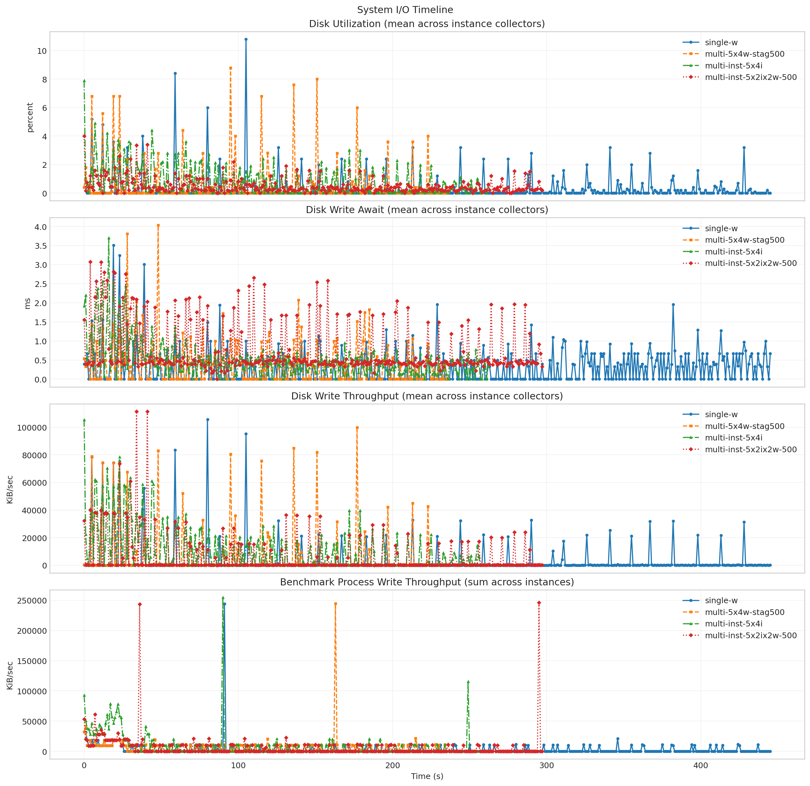
- 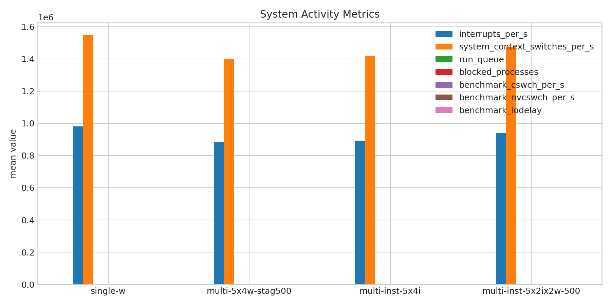
- 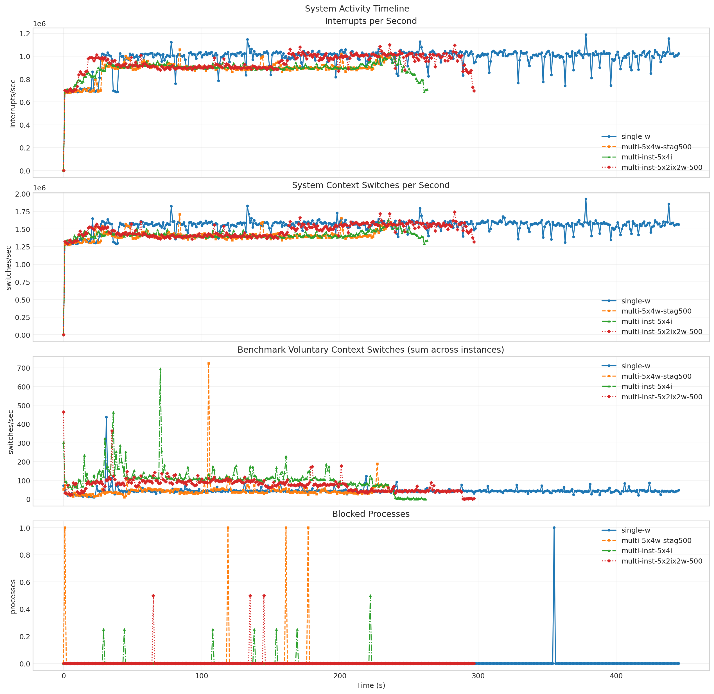

**Run Timing Table**

| scenario | run_dir | run_started_at | run_finished_at | run_wall_clock_sec | first_request_started_at | last_request_finished_at | request_window_sec |
| --- | --- | --- | --- | --- | --- | --- | --- |
| single-w | /root/Zehao/ClawHarness/out/batch_run_1/task-01/20260416T131415Z_vps-docker-qwen3-32b8x2-single-20-worker | 2026-04-16T13:14:22.739492+00:00 | 2026-04-16T13:21:59.548547+00:00 | 456.809 | 2026-04-16T13:14:23.491679+00:00 | 2026-04-16T13:21:49.359766+00:00 | 445.868 |
| multi-5x4w-stag500 | /root/Zehao/ClawHarness/out/batch_run_1/task-01/20260416T133412Z_vps-docker-qwen3-32b8x2-multi-5x4w-stag300-worker | 2026-04-16T13:34:19.925292+00:00 | 2026-04-16T13:38:28.543158+00:00 | 248.618 | 2026-04-16T13:34:20.697749+00:00 | 2026-04-16T13:38:17.748987+00:00 | 237.051 |
| multi-inst-5x4i | /root/Zehao/ClawHarness/out/batch_run_1/task-01/20260416T134818Z_vps-docker-qwen3-32b8x2-single-inst-5x4i-worker | 2026-04-16T13:48:48.059829+00:00 | 2026-04-16T13:53:16.222609+00:00 | 268.163 | 2026-04-16T13:48:48.160427+00:00 | 2026-04-16T13:52:47.266424+00:00 | 239.106 |
| multi-inst-5x2ix2w-500 | /root/Zehao/ClawHarness/out/batch_run_1/task-01/20260416T151137Z_vps-docker-qwen3-32b8x2-multi-inst-5x2ix2w-stag500-worker | 2026-04-16T15:11:52.190626+00:00 | 2026-04-16T15:16:59.298282+00:00 | 307.108 | 2026-04-16T15:11:52.262055+00:00 | 2026-04-16T15:16:40.529854+00:00 | 288.268 |

**Latency Overview Table**

| scenario | total_mean | total_p50 | total_p95 | total_p99 |
| --- | --- | --- | --- | --- |
| single-w | 22293.350 | 21906.624 | 37639.820 | 50101.857 |
| multi-5x4w-stag500 | 45518.749 | 45706.730 | 72247.396 | 101460.015 |
| multi-inst-5x4i | 41323.815 | 35666.556 | 62994.345 | 116246.456 |
| multi-inst-5x2ix2w-500 | 40587.619 | 29778.572 | 60151.180 | 188147.029 |

**Mean Latency by Phase Table**

| scenario | connect | send | wait | history | total |
| --- | --- | --- | --- | --- | --- |
| single-w | 751.843 | 2.710 | 22087.061 | 203.534 | 22293.350 |
| multi-5x4w-stag500 | 521.615 | 9.115 | 45328.164 | 181.429 | 45518.749 |
| multi-inst-5x4i | 2823.002 | 8.259 | 40460.255 | 855.264 | 41323.815 |
| multi-inst-5x2ix2w-500 | 741.252 | 305.765 | 40103.405 | 178.409 | 40587.619 |

**Tail Latency Table**

| scenario | send_p95 | send_p99 | wait_p50 | wait_p95 | wait_p99 | history_p95 | history_p99 | total_p95 | total_p99 |
| --- | --- | --- | --- | --- | --- | --- | --- | --- | --- |
| single-w | 3.820 | 18.924 | 21892.522 | 33852.894 | 50070.473 | 57.372 | 3783.053 | 37639.820 | 50101.857 |
| multi-5x4w-stag500 | 32.403 | 93.356 | 45633.837 | 72229.241 | 101442.409 | 91.340 | 3175.010 | 72247.396 | 101460.015 |
| multi-inst-5x4i | 33.429 | 36.472 | 35297.223 | 62960.027 | 116206.719 | 4313.699 | 4611.702 | 62994.345 | 116246.456 |
| multi-inst-5x2ix2w-500 | 114.873 | 5657.214 | 28027.493 | 60138.124 | 188133.335 | 24.575 | 3156.039 | 60151.180 | 188147.029 |

**System CPU Table**

| scenario | pct_cpu_total | pct_cpu_usr | pct_cpu_system | pct_cpu_wait |
| --- | --- | --- | --- | --- |
| single-w | 17.920 | 14.270 | 3.650 | 0.020 |
| multi-5x4w-stag500 | 33.329 | 26.320 | 7.008 | 0.038 |
| multi-inst-5x4i | 70.132 | 57.626 | 12.505 | 0.115 |
| multi-inst-5x2ix2w-500 | 34.982 | 27.898 | 7.084 | 0.044 |

**System Memory Table**

| scenario | rss_kib_total |
| --- | --- |
| single-w | 710752.870 |
| multi-5x4w-stag500 | 845248.084 |
| multi-inst-5x4i | 2494128.348 |
| multi-inst-5x2ix2w-500 | 1256895.894 |

**System Disk Table**

| scenario | busiest_device | pct_util | r_await | w_await | aqu_sz | system_wkb_s | benchmark_kb_wr_per_s |
| --- | --- | --- | --- | --- | --- | --- | --- |
| single-w | sda | 0.286 | 0.000 | 0.299 | 0.030 | 2934.610 | 2927.148 |
| multi-5x4w-stag500 | sda | 0.535 | 0.004 | 0.358 | 0.056 | 5776.308 | 5943.052 |
| multi-inst-5x4i | sda | 0.814 | 0.041 | 0.509 | 0.127 | 10746.226 | 9641.608 |
| multi-inst-5x2ix2w-500 | sda | 0.502 | 0.000 | 0.780 | 0.149 | 6316.031 | 6241.994 |

**System Activity Table**

| scenario | interrupts_per_s | system_context_switches_per_s | run_queue | blocked_processes | benchmark_cswch_per_s | benchmark_nvcswch_per_s | benchmark_iodelay |
| --- | --- | --- | --- | --- | --- | --- | --- |
| single-w | 980709.007 | 1547219.733 | 33.760 | 0.002 | 44.818 | 11.813 | 0.000 |
| multi-5x4w-stag500 | 883693.550 | 1398899.542 | 33.357 | 0.017 | 45.099 | 18.316 | 0.000 |
| multi-inst-5x4i | 892733.637 | 1417049.303 | 34.286 | 0.008 | 108.554 | 52.412 | 0.000 |
| multi-inst-5x2ix2w-500 | 941026.624 | 1473082.649 | 37.132 | 0.005 | 75.436 | 23.220 | 0.000 |

**System Timeline Peaks Table**

| scenario | benchmark_cpu_peak | benchmark_cpu_peak_t_sec | benchmark_rss_peak_kib | benchmark_rss_peak_t_sec | system_disk_pct_util_peak | system_disk_pct_util_peak_t_sec | system_disk_w_await_peak | system_disk_w_await_peak_t_sec | system_interrupts_peak | system_interrupts_peak_t_sec | system_context_switches_peak | system_context_switches_peak_t_sec | system_run_queue_peak | system_run_queue_peak_t_sec |
| --- | --- | --- | --- | --- | --- | --- | --- | --- | --- | --- | --- | --- | --- | --- |
| single-w | 169.000 | 38.000 | 1005644.000 | 30.000 | 10.800 | 105.000 | 3.510 | 19.000 | 1188898.000 | 378.000 | 1925574.000 | 378.000 | 73.000 | 106.000 |
| multi-5x4w-stag500 | 178.000 | 119.000 | 1059368.000 | 104.000 | 8.800 | 95.000 | 4.030 | 48.000 | 1058823.000 | 84.000 | 1709580.000 | 84.000 | 128.000 | 52.000 |
| multi-inst-5x4i | 498.000 | 15.000 | 3789336.000 | 10.000 | 7.900 | 0.000 | 3.698 | 16.000 | 1030192.250 | 235.000 | 1632803.500 | 235.000 | 64.000 | 187.000 |
| multi-inst-5x2ix2w-500 | 278.000 | 8.000 | 2026228.000 | 34.000 | 4.000 | 0.000 | 3.075 | 4.000 | 1099766.500 | 236.000 | 1738371.000 | 283.000 | 72.000 | 79.000 |
