## `single-w` vs `multi-5x4w-stag500` vs `multi-inst-5x4i`

Generated at: 2026-04-16 23:00:55+08:00

**Run Dirs**

| scenario | run_dir | requests_total | requests_ok | requests_failed |
| --- | --- | --- | --- | --- |
| single-w | /root/Zehao/ClawHarness/out/batch_run_1/task-01/20260416T131415Z_vps-docker-qwen3-32b8x2-single-20-worker | 20 | 20 | 0 |
| multi-5x4w-stag500 | /root/Zehao/ClawHarness/out/batch_run_1/task-01/20260416T134055Z_vps-docker-qwen3-32b8x2-multi-5x4w-stag500-worker | 20 | 20 | 0 |
| multi-inst-5x4i | /root/Zehao/ClawHarness/out/batch_run_1/task-01/20260416T134818Z_vps-docker-qwen3-32b8x2-single-inst-5x4i-worker | 20 | 20 | 0 |

**Run Timing Table**

| scenario | run_dir | run_started_at | run_finished_at | run_wall_clock_sec | first_request_started_at | last_request_finished_at | request_window_sec |
| --- | --- | --- | --- | --- | --- | --- | --- |
| single-w | /root/Zehao/ClawHarness/out/batch_run_1/task-01/20260416T131415Z_vps-docker-qwen3-32b8x2-single-20-worker | 2026-04-16T13:14:22.739492+00:00 | 2026-04-16T13:21:59.548547+00:00 | 456.809 | 2026-04-16T13:14:23.491679+00:00 | 2026-04-16T13:21:49.359766+00:00 | 445.868 |
| multi-5x4w-stag500 | /root/Zehao/ClawHarness/out/batch_run_1/task-01/20260416T134055Z_vps-docker-qwen3-32b8x2-multi-5x4w-stag500-worker | 2026-04-16T13:41:04.048554+00:00 | 2026-04-16T13:45:55.842057+00:00 | 291.794 | 2026-04-16T13:41:04.702548+00:00 | 2026-04-16T13:45:50.947789+00:00 | 286.245 |
| multi-inst-5x4i | /root/Zehao/ClawHarness/out/batch_run_1/task-01/20260416T134818Z_vps-docker-qwen3-32b8x2-single-inst-5x4i-worker | 2026-04-16T13:48:48.059829+00:00 | 2026-04-16T13:53:16.222609+00:00 | 268.163 | 2026-04-16T13:48:48.160427+00:00 | 2026-04-16T13:52:47.266424+00:00 | 239.106 |

**Figures**

- 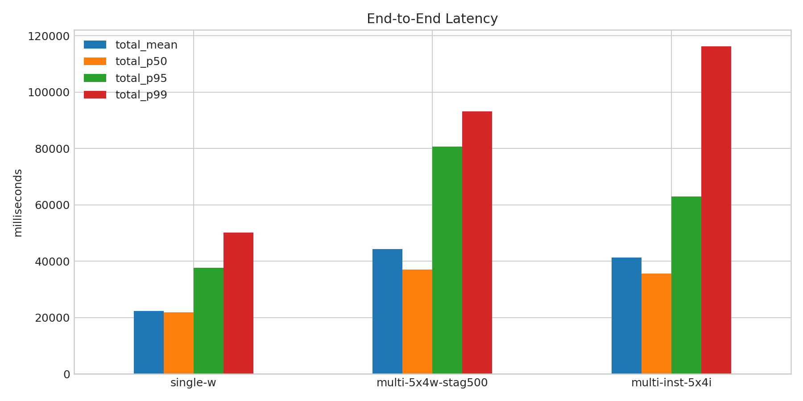
- 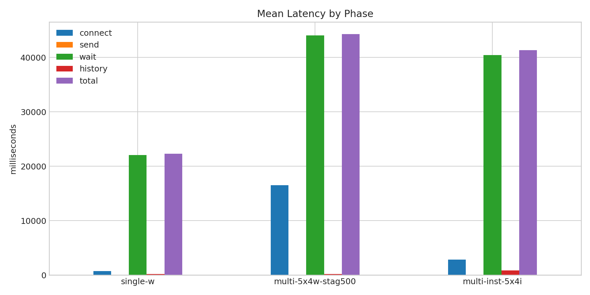
- 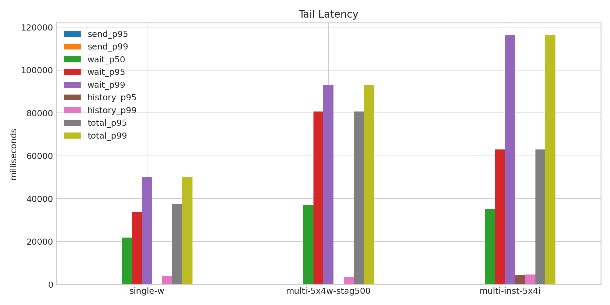
- 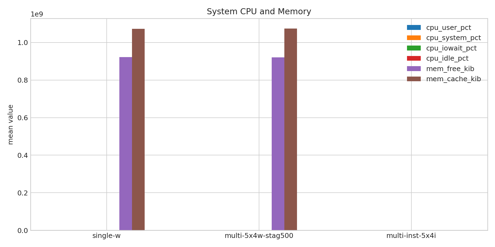
- 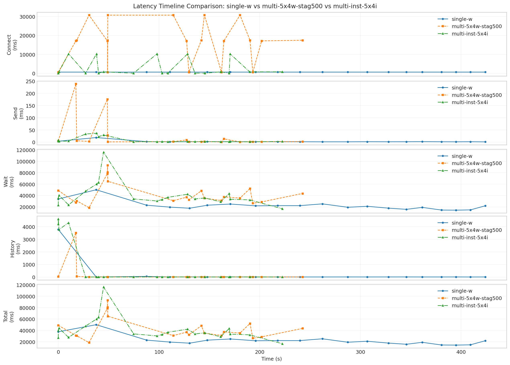
- 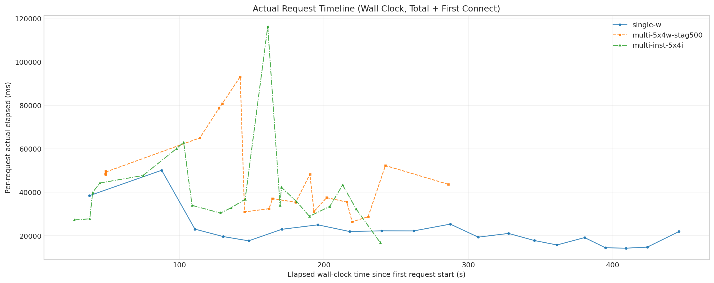
- 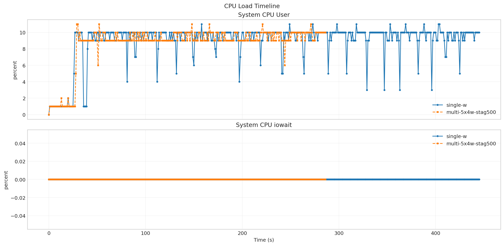
- 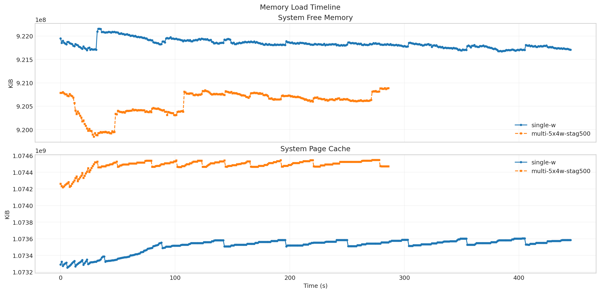
- 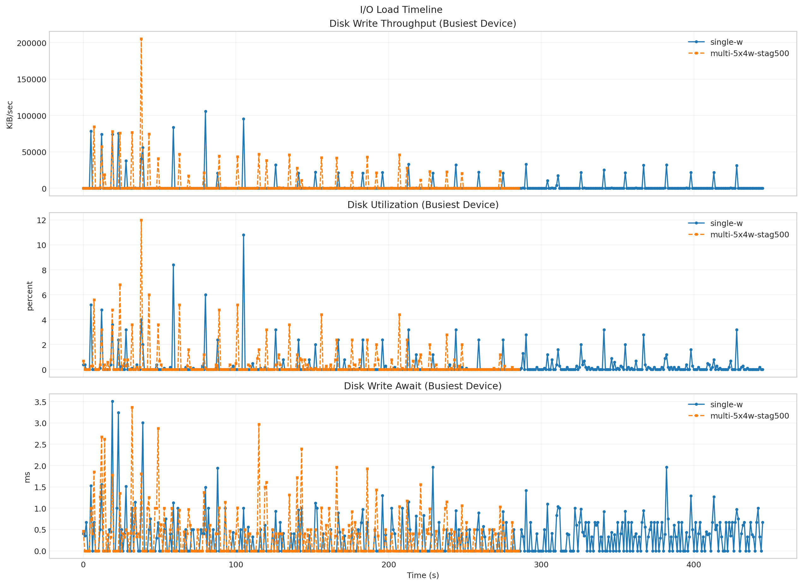
- 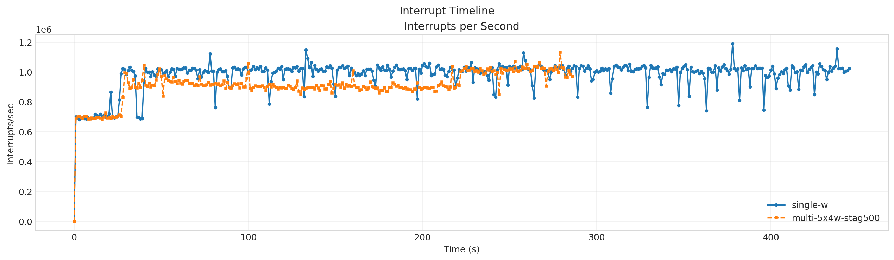
- 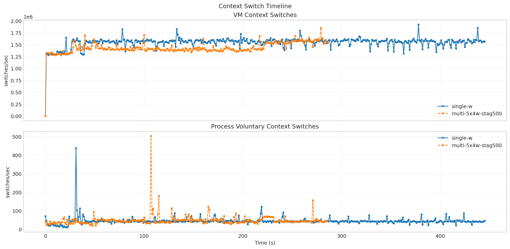
- 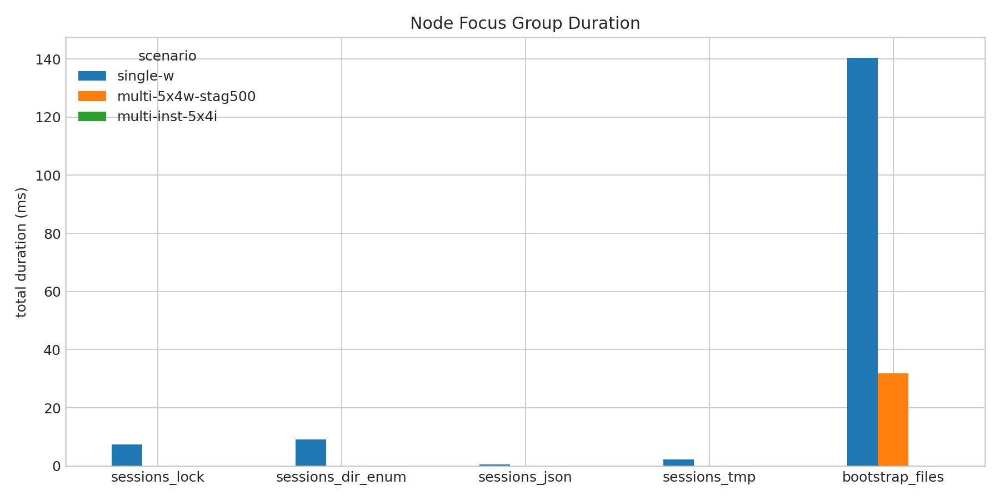
- 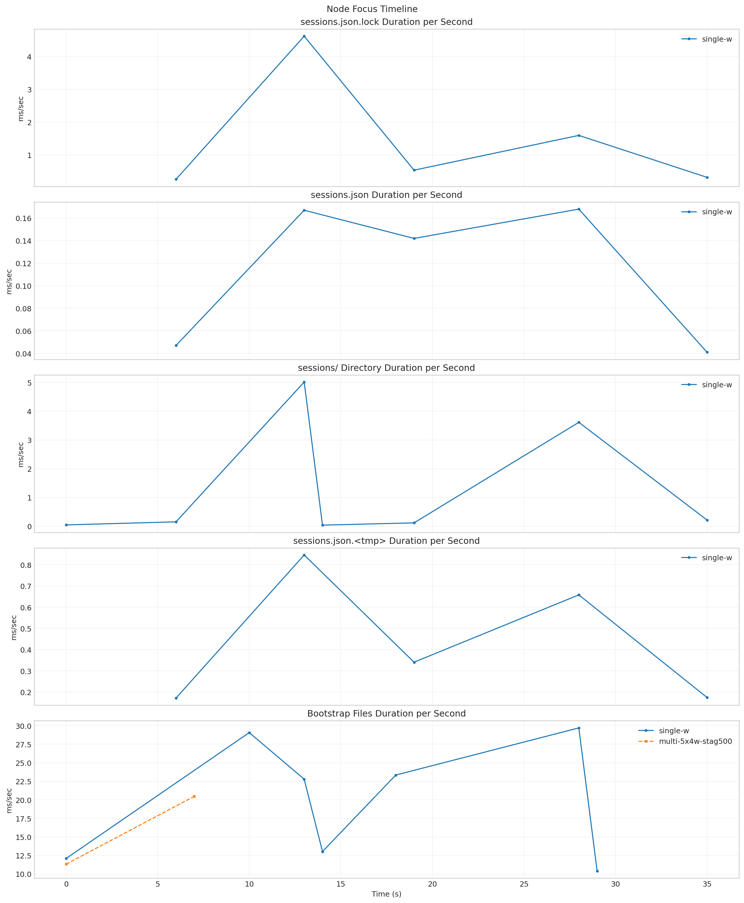
- 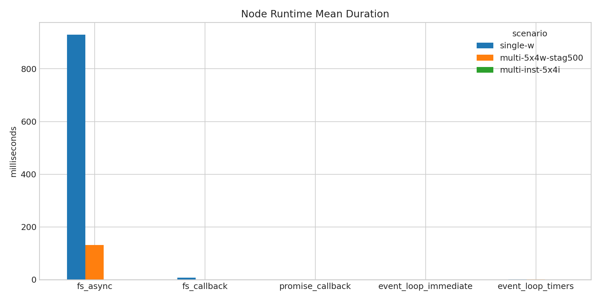
- 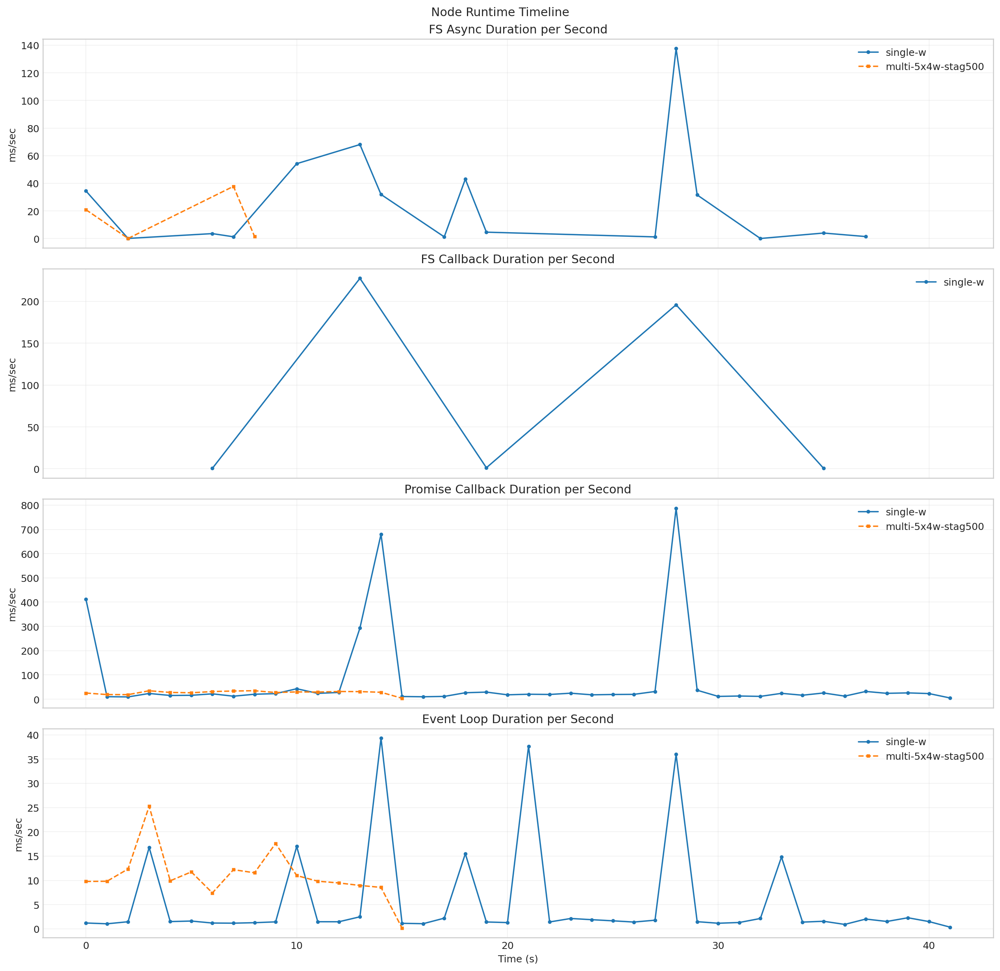

**Latency Overview Table**

| scenario | total_mean | total_p50 | total_p95 | total_p99 |
| --- | --- | --- | --- | --- |
| single-w | 22293.350 | 21906.624 | 37639.820 | 50101.857 |
| multi-5x4w-stag500 | 44304.270 | 37044.969 | 80705.627 | 93148.206 |
| multi-inst-5x4i | 41323.815 | 35666.556 | 62994.345 | 116246.456 |

**Mean Latency by Phase Table**

| scenario | connect | send | wait | history | total |
| --- | --- | --- | --- | --- | --- |
| single-w | 751.843 | 2.710 | 22087.061 | 203.534 | 22293.350 |
| multi-5x4w-stag500 | 16489.151 | 26.274 | 44086.487 | 191.469 | 44304.270 |
| multi-inst-5x4i | 2823.002 | 8.259 | 40460.255 | 855.264 | 41323.815 |

**Tail Latency Table**

| scenario | send_p95 | send_p99 | wait_p50 | wait_p95 | wait_p99 | history_p95 | history_p99 | total_p95 | total_p99 |
| --- | --- | --- | --- | --- | --- | --- | --- | --- | --- |
| single-w | 3.820 | 18.924 | 21892.522 | 33852.894 | 50070.473 | 57.372 | 3783.053 | 37639.820 | 50101.857 |
| multi-5x4w-stag500 | 175.992 | 238.899 | 37016.605 | 80667.520 | 93109.145 | 56.176 | 3519.225 | 80705.627 | 93148.206 |
| multi-inst-5x4i | 33.429 | 36.472 | 35297.223 | 62960.027 | 116206.719 | 4313.699 | 4611.702 | 62994.345 | 116246.456 |

**Machine Metrics Table**

| scenario | cpu_user_pct_mean | cpu_system_pct_mean | cpu_iowait_pct_mean | cpu_idle_pct_mean | mem_free_kib_mean | mem_buff_kib_mean | mem_cache_kib_mean | disk_pct_util_mean | disk_w_await_ms_mean | disk_aqu_sz_mean | interrupts_per_s_mean | context_switches_per_s_mean | run_queue_mean | blocked_processes_mean |
| --- | --- | --- | --- | --- | --- | --- | --- | --- | --- | --- | --- | --- | --- | --- |
| single-w | 8.915 | 10.235 | 0.000 | 80.948 | 921836086.960 | 1597885.632 | 1073516911.785 | 0.286 | 0.299 | 0.030 | 980709.007 | 1547219.733 | 33.760 | 0.002 |
| multi-5x4w-stag500 | 8.589 | 10.265 | 0.000 | 81.160 | 920567155.512 | 1598118.787 | 1074485987.010 | 0.445 | 0.333 | 0.060 | 909736.568 | 1436127.972 | 34.596 | 0.007 |
| multi-inst-5x4i | - | - | - | - | - | - | - | - | - | - | - | - | - | - |

**Process Metrics Table**

| scenario | cpu_percent | rss_kib | kb_wr_per_s | iodelay | cswch_per_s | nvcswch_per_s |
| --- | --- | --- | --- | --- | --- | --- |
| single-w | 17.920 | 710752.870 | 2927.148 | 0.000 | 44.818 | 11.813 |
| multi-5x4w-stag500 | 29.979 | 845271.762 | 4953.748 | 0.000 | 48.409 | 14.584 |
| multi-inst-5x4i | - | - | - | - | - | - |

**NPU Metrics Table**

| scenario | utilization_pct | hbm_usage_pct | aicore_usage_pct | aivector_usage_pct | aicpu_usage_pct | ctrlcpu_usage_pct |
| --- | --- | --- | --- | --- | --- | --- |
| single-w | - | - | - | - | - | - |
| multi-5x4w-stag500 | - | - | - | - | - | - |
| multi-inst-5x4i | - | - | - | - | - | - |

**Disk Metrics Table**

| scenario | busiest_device | pct_util | r_await | w_await | f_await | aqu_sz | wkb_s |
| --- | --- | --- | --- | --- | --- | --- | --- |
| single-w | sda | 0.286 | 0.000 | 0.299 | 0.000 | 0.030 | 2934.610 |
| multi-5x4w-stag500 | sda | 0.445 | 0.003 | 0.333 | 0.000 | 0.060 | 4970.797 |
| multi-inst-5x4i | - | - | - | - | - | - | - |

**System Metrics Table**

| scenario | interrupts_per_s | system_context_switches_per_s | run_queue | perf_cache_misses | perf_context_switches | perf_cpu_migrations | perf_page_faults | perf_unsupported_events | strace_events_per_s_peak | strace_duration_ms_per_s_peak | strace_top_syscall | strace_top_syscall_total_duration_sec |
| --- | --- | --- | --- | --- | --- | --- | --- | --- | --- | --- | --- | --- |
| single-w | 980709.007 | 1547219.733 | 33.760 | - | - | - | - |  | - | - |  | - |
| multi-5x4w-stag500 | 909736.568 | 1436127.972 | 34.596 | - | - | - | - |  | - | - |  | - |
| multi-inst-5x4i | - | - | - | - | - | - | - |  | - | - |  | - |

**Timeline Peaks Table**

| scenario | docker_cpu_peak | docker_cpu_peak_t_sec | docker_mem_peak | docker_mem_peak_t_sec | pidstat_cpu_peak | pidstat_cpu_peak_t_sec | pidstat_rss_peak | pidstat_rss_peak_t_sec | iostat_pct_util_peak | iostat_pct_util_peak_t_sec | iostat_w_await_peak | iostat_w_await_peak_t_sec | vmstat_interrupts_peak | vmstat_interrupts_peak_t_sec | vmstat_context_switches_peak | vmstat_context_switches_peak_t_sec | npu_utilization_peak | npu_utilization_peak_t_sec | npu_hbm_usage_peak | npu_hbm_usage_peak_t_sec | perf_context_switches_peak | perf_context_switches_peak_t_sec |
| --- | --- | --- | --- | --- | --- | --- | --- | --- | --- | --- | --- | --- | --- | --- | --- | --- | --- | --- | --- | --- | --- | --- |
| single-w | 171.260 | 37.914 | 0.050 | 5.055 | 169.000 | 38.000 | 1005644.000 | 30.000 | 10.800 | 105.000 | 3.510 | 19.000 | 1188898.000 | 378.000 | 1925574.000 | 378.000 | - | - | - | - | - | - |
| multi-5x4w-stag500 | 152.340 | 0.000 | 0.050 | 2.524 | 213.000 | 115.000 | 1095796.000 | 106.000 | 12.000 | 38.000 | 3.370 | 32.000 | 1132934.000 | 279.000 | 1855645.000 | 279.000 | - | - | - | - | - | - |
| multi-inst-5x4i | - | - | - | - | - | - | - | - | - | - | - | - | - | - | - | - | - | - | - | - | - | - |

**strace Key Syscalls Table**

| scenario | run_dir | openat_count | openat_total_sec | openat_mean_ms | statx_count | statx_total_sec | statx_mean_ms | newfstatat_count | newfstatat_total_sec | newfstatat_mean_ms | pread64_count | pread64_total_sec | pread64_mean_ms | clone_count | clone_total_sec | clone_mean_ms | sched_yield_count | sched_yield_total_sec | sched_yield_mean_ms | futex_count | futex_total_sec | futex_mean_ms | read_count | read_total_sec | read_mean_ms | write_count | write_total_sec | write_mean_ms | futex_total_sec_per_request | futex_total_sec_per_wall_sec | statx_total_sec_per_request | statx_total_sec_per_wall_sec | openat_total_sec_per_request | openat_total_sec_per_wall_sec | estimated_makespan_sec |
| --- | --- | --- | --- | --- | --- | --- | --- | --- | --- | --- | --- | --- | --- | --- | --- | --- | --- | --- | --- | --- | --- | --- | --- | --- | --- | --- | --- | --- | --- | --- | --- | --- | --- | --- | --- |
| single-w | /root/Zehao/ClawHarness/out/batch_run_1/task-01/20260416T131415Z_vps-docker-qwen3-32b8x2-single-20-worker | - | - | - | - | - | - | - | - | - | - | - | - | - | - | - | - | - | - | - | - | - | - | - | - | - | - | - | - | - | - | - | - | - | 456.809 |
| multi-5x4w-stag500 | /root/Zehao/ClawHarness/out/batch_run_1/task-01/20260416T134055Z_vps-docker-qwen3-32b8x2-multi-5x4w-stag500-worker | - | - | - | - | - | - | - | - | - | - | - | - | - | - | - | - | - | - | - | - | - | - | - | - | - | - | - | - | - | - | - | - | - | 291.794 |
| multi-inst-5x4i | /root/Zehao/ClawHarness/out/batch_run_1/task-01/20260416T134818Z_vps-docker-qwen3-32b8x2-single-inst-5x4i-worker | - | - | - | - | - | - | - | - | - | - | - | - | - | - | - | - | - | - | - | - | - | - | - | - | - | - | - | - | - | - | - | - | - | 268.163 |

**strace Mean Duration Table**

| scenario | single-w | multi-5x4w-stag500 | multi-inst-5x4i |
| --- | --- | --- | --- |
| openat | - | - | - |
| statx | - | - | - |
| newfstatat | - | - | - |
| pread64 | - | - | - |
| clone | - | - | - |
| sched_yield | - | - | - |
| futex | - | - | - |
| read | - | - | - |
| write | - | - | - |

**Gateway Runtime Stage Table**

| scenario | bootstrap_load_mean_ms | skills_mean_ms | context_bundle_mean_ms | execution_admission_wait_mean_ms | reply_dispatch_queue_wait_mean_ms | reply_dispatch_queue_hold_mean_ms | reply_dispatch_pending_mean |
| --- | --- | --- | --- | --- | --- | --- | --- |
| single-w | - | - | - | - | - | - | - |
| multi-5x4w-stag500 | - | - | - | - | - | - | - |
| multi-inst-5x4i | - | - | - | - | - | - | - |

**Node Focus Groups Table**

| scenario | sessions_lock_total_ms | sessions_lock_count | sessions_dir_enum_total_ms | sessions_dir_enum_count | sessions_json_total_ms | sessions_json_count | sessions_tmp_total_ms | sessions_tmp_count | bootstrap_files_total_ms | bootstrap_files_count |
| --- | --- | --- | --- | --- | --- | --- | --- | --- | --- | --- |
| single-w | 7.340 | 44.000 | 9.195 | 25.000 | 0.565 | 11.000 | 2.192 | 44.000 | 140.412 | 124.000 |
| multi-5x4w-stag500 | 0.000 | 0.000 | 0.000 | 0.000 | 0.000 | 0.000 | 0.000 | 0.000 | 31.802 | 42.000 |
| multi-inst-5x4i | - | - | - | - | - | - | - | - | - | - |

**Runtime Category Samples Table**

| scenario | run_dir | sample_count | fs_worker_exec_count | fs_worker_exec_pct | fs_callback_count | fs_callback_pct | event_loop_poll_count | event_loop_poll_pct | microtask_count | microtask_pct | futex_sync_count | futex_sync_pct | worker_message_count | worker_message_pct | json_parse_count | json_parse_pct | libuv_worker_other_count | libuv_worker_other_pct | gateway_main_other_count | gateway_main_other_pct | v8_worker_count | v8_worker_pct | other_count | other_pct |
| --- | --- | --- | --- | --- | --- | --- | --- | --- | --- | --- | --- | --- | --- | --- | --- | --- | --- | --- | --- | --- | --- | --- | --- | --- |
| single-w | /root/Zehao/ClawHarness/out/batch_run_1/task-01/20260416T131415Z_vps-docker-qwen3-32b8x2-single-20-worker | - | - | - | - | - | - | - | - | - | - | - | - | - | - | - | - | - | - | - | - | - | - | - |
| multi-5x4w-stag500 | /root/Zehao/ClawHarness/out/batch_run_1/task-01/20260416T134055Z_vps-docker-qwen3-32b8x2-multi-5x4w-stag500-worker | - | - | - | - | - | - | - | - | - | - | - | - | - | - | - | - | - | - | - | - | - | - | - |
| multi-inst-5x4i | /root/Zehao/ClawHarness/out/batch_run_1/task-01/20260416T134818Z_vps-docker-qwen3-32b8x2-single-inst-5x4i-worker | - | - | - | - | - | - | - | - | - | - | - | - | - | - | - | - | - | - | - | - | - | - | - |

**Runtime Category Percent Table**

| scenario | single-w | multi-5x4w-stag500 | multi-inst-5x4i |
| --- | --- | --- | --- |
| fs_worker_exec | - | - | - |
| fs_callback | - | - | - |
| event_loop_poll | - | - | - |
| microtask | - | - | - |
| futex_sync | - | - | - |
| worker_message | - | - | - |
| json_parse | - | - | - |
| libuv_worker_other | - | - | - |
| gateway_main_other | - | - | - |
| v8_worker | - | - | - |
| other | - | - | - |

**Node Runtime Metrics Table**

| scenario | fs_async_mean_ms | fs_callback_mean_ms | promise_callback_mean_ms | event_loop_immediate_mean_ms | event_loop_timers_mean_ms | fs_async_count | fs_callback_count | promise_callback_count |
| --- | --- | --- | --- | --- | --- | --- | --- | --- |
| single-w | 929.664 | 6.975 | 0.075 | 0.026 | 0.435 | 188925.000 | 61.000 | 39442.000 |
| multi-5x4w-stag500 | 131.618 | 0.000 | 0.022 | 0.117 | 0.400 | 64586.000 | 0.000 | 19573.000 |
| multi-inst-5x4i | - | - | - | - | - | - | - | - |

**Node Runtime Mean Duration Table**

| scenario | single-w | multi-5x4w-stag500 | multi-inst-5x4i |
| --- | --- | --- | --- |
| fs_async | 929.664 | 131.618 | - |
| fs_callback | 6.975 | 0.000 | - |
| promise_callback | 0.075 | 0.022 | - |
| event_loop_immediate | 0.026 | 0.117 | - |
| event_loop_timers | 0.435 | 0.400 | - |

**Top Node FS Paths: `single-w`**

| scenario | count | total_duration_ms |
| --- | --- | --- |
| /home/node/.openclaw/agents/main/sessions/sessions.json.lock | 44 | 7.340 |
| /home/node/.openclaw/agents/main/sessions | 25 | 9.195 |
| /home/node/.openclaw/workspace/USER.md | 18 | 17.650 |
| /home/node/.openclaw/workspace/TOOLS.md | 18 | 18.700 |
| /home/node/.openclaw/workspace/SOUL.md | 18 | 19.660 |

**Node FS Path Categories: `single-w`**

| scenario | count | total_duration_ms |
| --- | --- | --- |
| openclaw_runtime | 308 | 194.533 |
| workspace_bootstrap | 124 | 140.412 |
| git_metadata | 16 | 25.577 |
| dist | 3 | 3.208 |
| workspace_other | 3 | 0.921 |
| markdown_docs | 2 | 5.450 |

**Top Node FS Paths: `multi-5x4w-stag500`**

| scenario | count | total_duration_ms |
| --- | --- | --- |
| /home/node/.openclaw/workspace | 6 | 0.798 |
| /home/node/.openclaw/workspace/state | 6 | 0.767 |
| /home/node/.openclaw/workspace/node-trace-7.json | 6 | 1.177 |
| /home/node/.openclaw/workspace/node-trace-59.json | 6 | 1.590 |
| /home/node/.openclaw/workspace/node-trace-42.json | 6 | 1.934 |

**Node FS Path Categories: `multi-5x4w-stag500`**

| scenario | count | total_duration_ms |
| --- | --- | --- |
| openclaw_runtime | 58 | 20.925 |
| workspace_bootstrap | 42 | 31.802 |
| git_metadata | 6 | 6.501 |
