## `multi-5x4w-stag150` vs `multi-5x4w-stag300` vs `multi-5x4w-stag500`

**Run Dirs**

| scenario | run_dir | instance_num | requests_total | requests_ok | requests_failed |
| --- | --- | --- | --- | --- | --- |
| multi-5x4w-stag150 | /root/Zehao/ClawHarness/out/batch_run_2/task-01/20260416T191524Z_vps-docker-qwen3-235b8x2-multi-5x4w-stag150-request | 1 | 20 | 20 | 0 |
| multi-5x4w-stag300 | /root/Zehao/ClawHarness/out/batch_run_2/task-01/20260416T191836Z_vps-docker-qwen3-235b8x2-multi-5x4w-stag300-request | 1 | 20 | 20 | 0 |
| multi-5x4w-stag500 | /root/Zehao/ClawHarness/out/batch_run_2/task-01/20260416T192209Z_vps-docker-qwen3-235b8x2-multi-5x4w-stag500-request | 1 | 20 | 20 | 0 |

**Aggregation Policy**

- `pidstat` per-process metrics are summed across instances.
- `iostat` and `vmstat` host-wide metrics are averaged across instance collectors.
- This makes multi-instance runs comparable with single-instance runs at the whole-machine level.

**Figures**

- 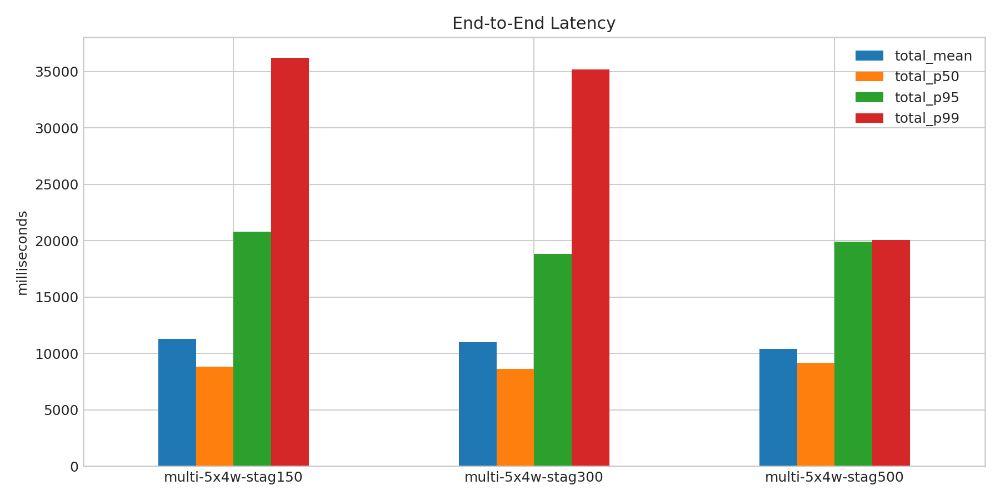
- 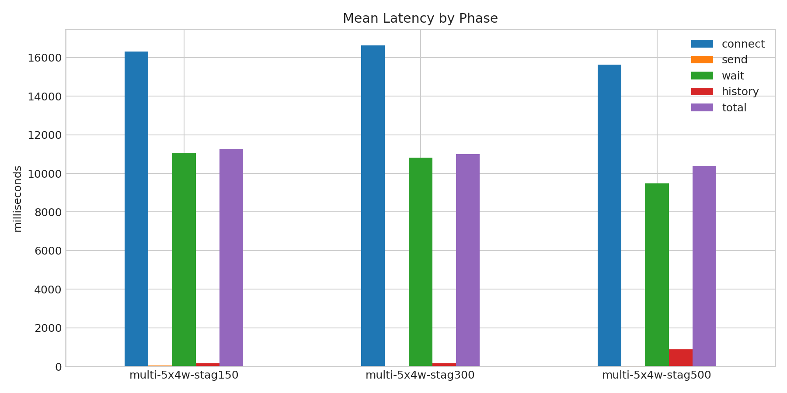
- 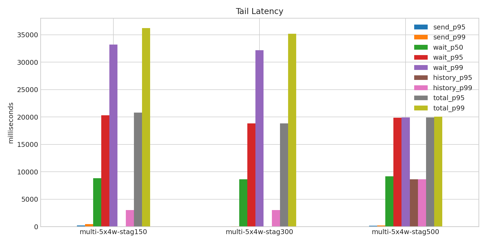
- 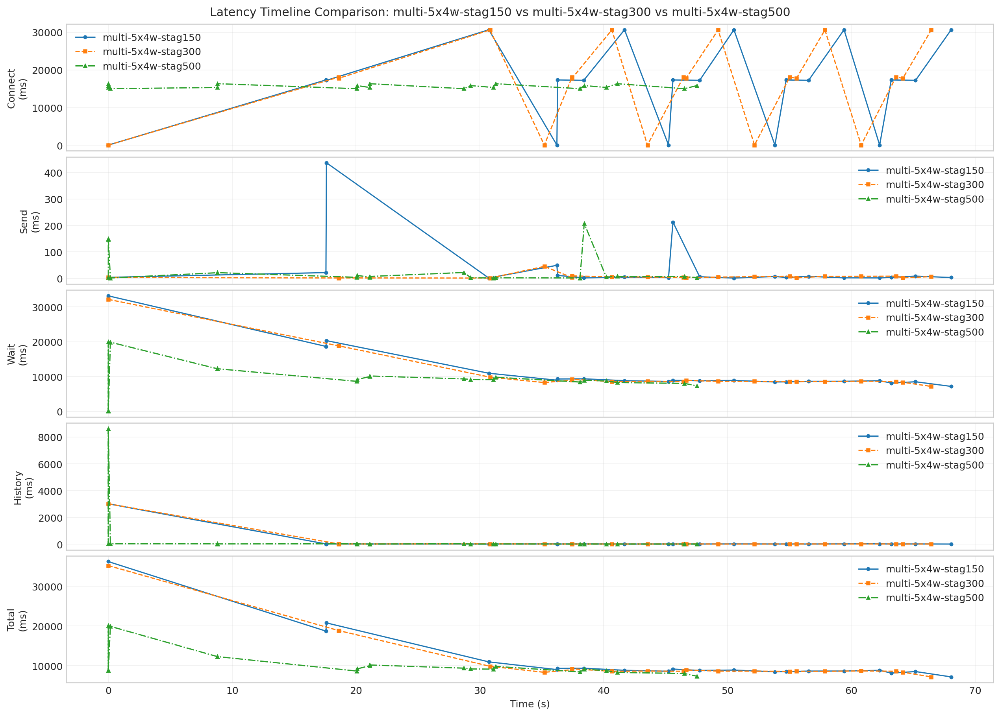
- 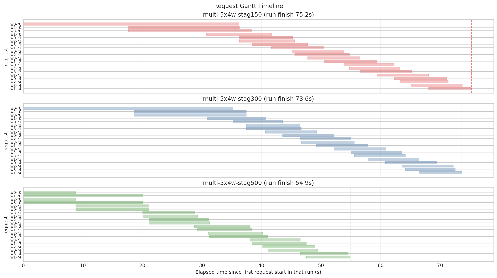
- 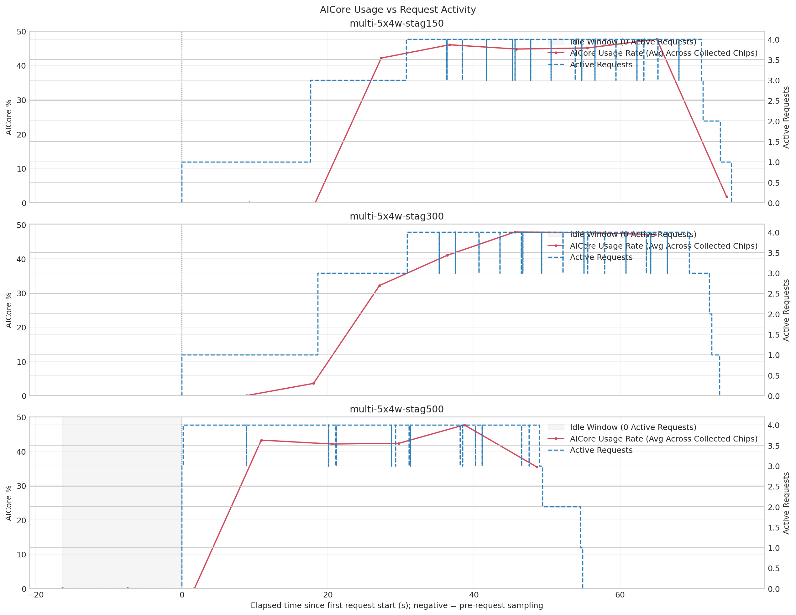
- 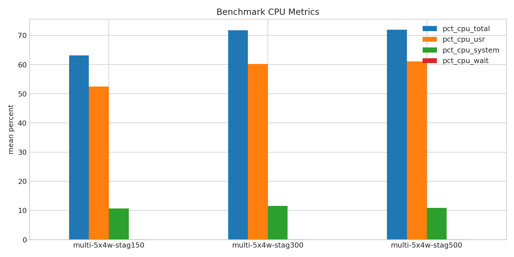
- 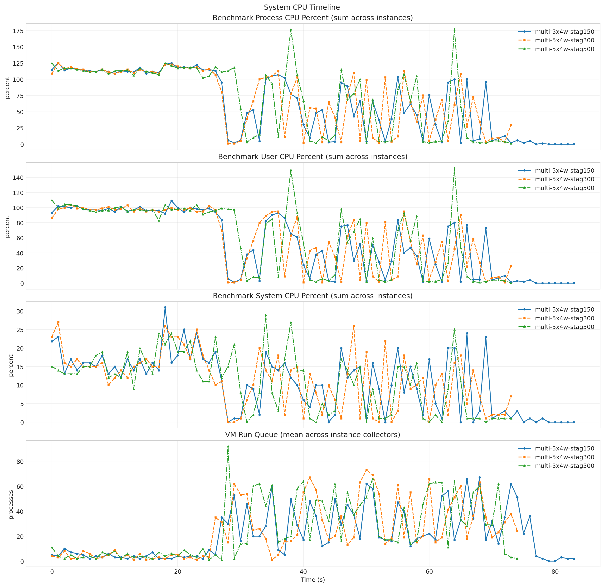
- 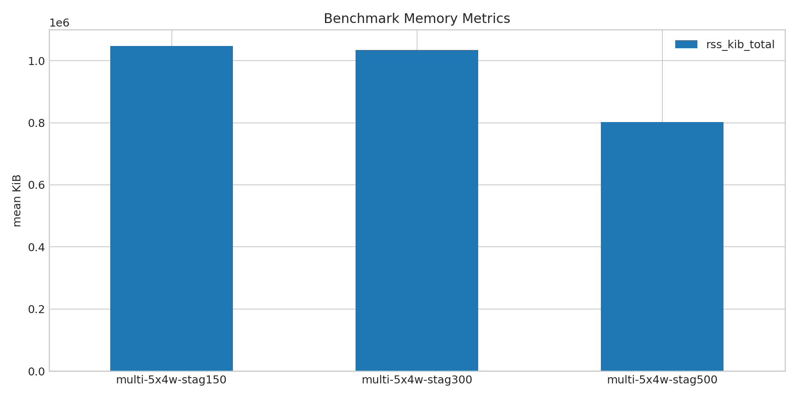
- 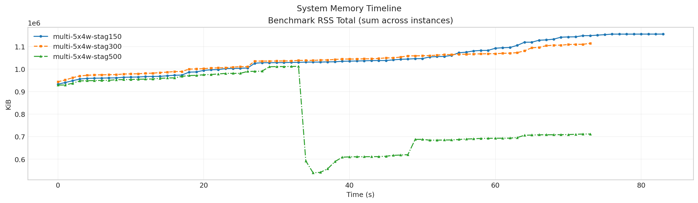
- 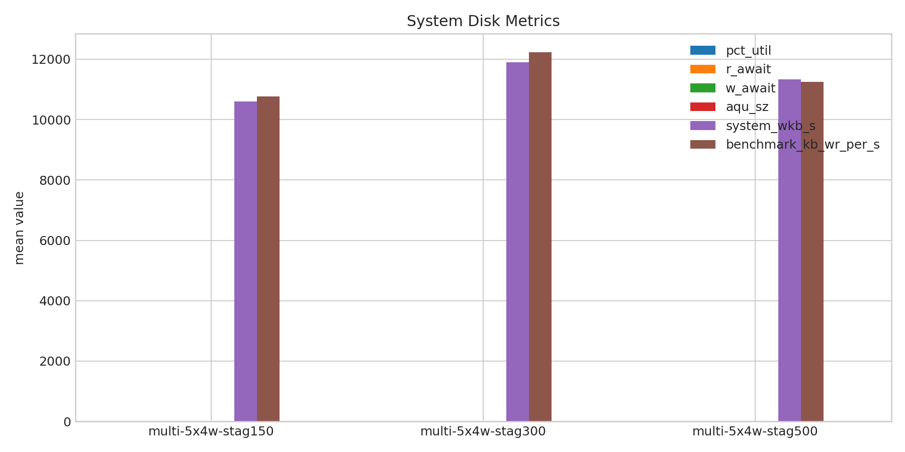
- 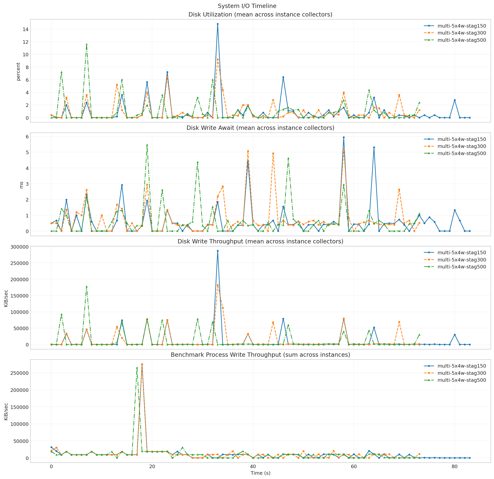
- 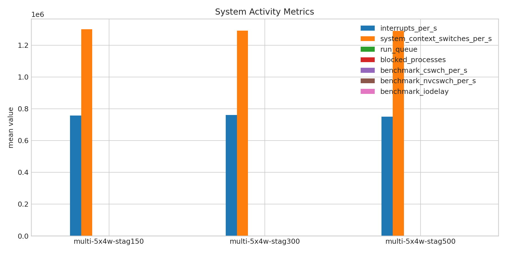
- 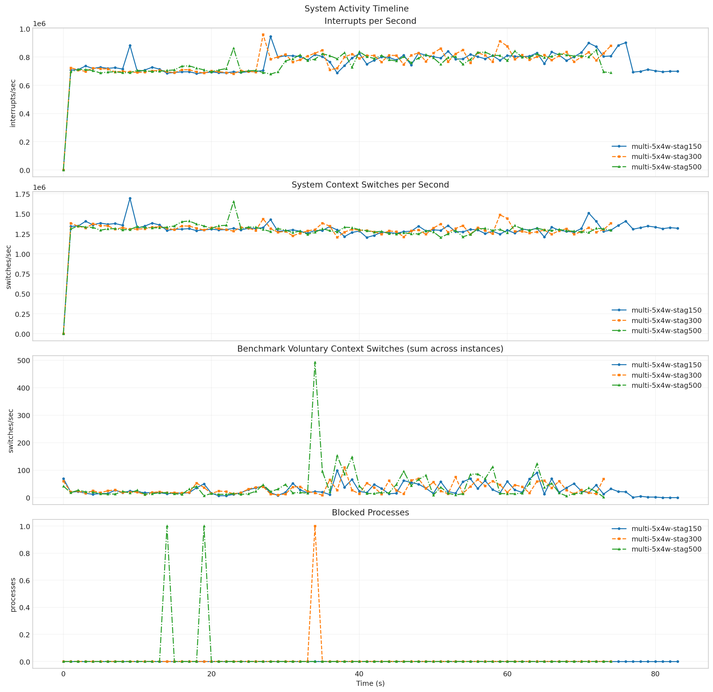
- 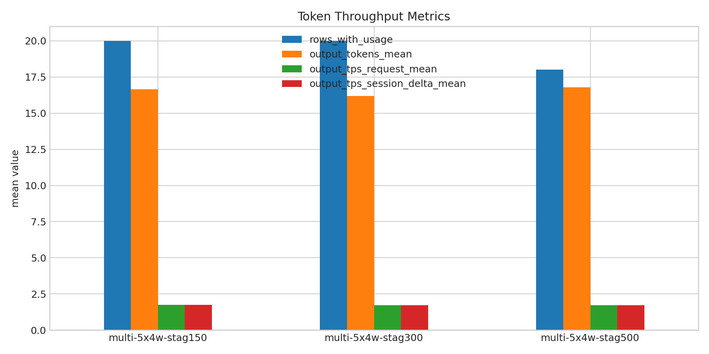
- 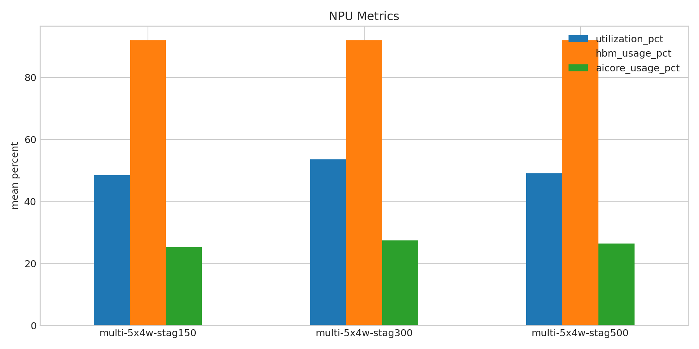
- 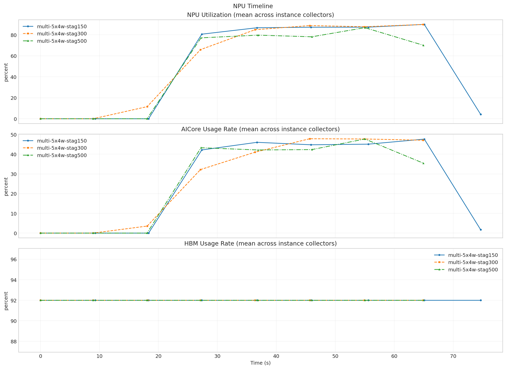

**Run Timing Table**

| scenario | run_dir | run_started_at | run_finished_at | run_wall_clock_sec | first_request_started_at | last_request_finished_at | request_window_sec |
| --- | --- | --- | --- | --- | --- | --- | --- |
| multi-5x4w-stag150 | /root/Zehao/ClawHarness/out/batch_run_2/task-01/20260416T191524Z_vps-docker-qwen3-235b8x2-multi-5x4w-stag150-request | 2026-04-16T19:15:32.904246+00:00 | 2026-04-16T19:17:05.624362+00:00 | 92.720 | 2026-04-16T19:15:32.969523+00:00 | 2026-04-16T19:16:48.204478+00:00 | 75.235 |
| multi-5x4w-stag300 | /root/Zehao/ClawHarness/out/batch_run_2/task-01/20260416T191836Z_vps-docker-qwen3-235b8x2-multi-5x4w-stag300-request | 2026-04-16T19:18:44.760926+00:00 | 2026-04-16T19:20:06.170923+00:00 | 81.410 | 2026-04-16T19:18:44.834034+00:00 | 2026-04-16T19:19:58.460647+00:00 | 73.627 |
| multi-5x4w-stag500 | /root/Zehao/ClawHarness/out/batch_run_2/task-01/20260416T192209Z_vps-docker-qwen3-235b8x2-multi-5x4w-stag500-request | 2026-04-16T19:22:19.067103+00:00 | 2026-04-16T19:23:37.597116+00:00 | 78.530 | 2026-04-16T19:22:35.411254+00:00 | 2026-04-16T19:23:30.284609+00:00 | 54.873 |

**Latency Overview Table**

| scenario | total_mean | total_p50 | total_p95 | total_p99 |
| --- | --- | --- | --- | --- |
| multi-5x4w-stag150 | 11274.565 | 8832.690 | 20774.481 | 36223.634 |
| multi-5x4w-stag300 | 10988.212 | 8625.531 | 18839.169 | 35207.326 |
| multi-5x4w-stag500 | 10380.260 | 9172.508 | 19902.753 | 20081.845 |

**Mean Latency by Phase Table**

| scenario | connect | send | wait | history | total |
| --- | --- | --- | --- | --- | --- |
| multi-5x4w-stag150 | 16318.043 | 39.708 | 11074.394 | 160.424 | 11274.565 |
| multi-5x4w-stag300 | 16632.086 | 7.039 | 10820.907 | 160.218 | 10988.212 |
| multi-5x4w-stag500 | 15635.413 | 31.763 | 9474.687 | 873.770 | 10380.260 |

**Tail Latency Table**

| scenario | send_p95 | send_p99 | wait_p50 | wait_p95 | wait_p99 | history_p95 | history_p99 | total_p95 | total_p99 |
| --- | --- | --- | --- | --- | --- | --- | --- | --- | --- |
| multi-5x4w-stag150 | 212.629 | 436.667 | 8821.875 | 20327.447 | 33205.830 | 19.084 | 3013.742 | 20774.481 | 36223.634 |
| multi-5x4w-stag300 | 9.502 | 45.343 | 8613.919 | 18823.830 | 32186.110 | 17.505 | 3017.172 | 18839.169 | 35207.326 |
| multi-5x4w-stag500 | 149.812 | 207.624 | 9145.180 | 19874.123 | 19915.018 | 8620.867 | 8622.728 | 19902.753 | 20081.845 |

**System CPU Table**

| scenario | pct_cpu_total | pct_cpu_usr | pct_cpu_system | pct_cpu_wait |
| --- | --- | --- | --- | --- |
| multi-5x4w-stag150 | 63.153 | 52.489 | 10.664 | 0.119 |
| multi-5x4w-stag300 | 71.770 | 60.176 | 11.595 | 0.095 |
| multi-5x4w-stag500 | 71.959 | 61.068 | 10.892 | 0.122 |

**System Memory Table**

| scenario | rss_kib_total |
| --- | --- |
| multi-5x4w-stag150 | 1047496.714 |
| multi-5x4w-stag300 | 1034261.405 |
| multi-5x4w-stag500 | 801675.135 |

**System Disk Table**

| scenario | busiest_device | pct_util | r_await | w_await | aqu_sz | system_wkb_s | benchmark_kb_wr_per_s |
| --- | --- | --- | --- | --- | --- | --- | --- |
| multi-5x4w-stag150 | sda | 0.799 | 0.036 | 0.613 | 0.134 | 10602.143 | 10767.520 |
| multi-5x4w-stag300 | sda | 0.930 | 0.081 | 0.773 | 0.165 | 11906.703 | 12233.622 |
| multi-5x4w-stag500 | sda | 0.927 | 0.000 | 0.602 | 0.151 | 11338.270 | 11251.622 |

**System Activity Table**

| scenario | interrupts_per_s | system_context_switches_per_s | run_queue | blocked_processes | benchmark_cswch_per_s | benchmark_nvcswch_per_s | benchmark_iodelay |
| --- | --- | --- | --- | --- | --- | --- | --- |
| multi-5x4w-stag150 | 757181.298 | 1300447.857 | 21.143 | 0.000 | 28.575 | 53.016 | 0.000 |
| multi-5x4w-stag300 | 760300.827 | 1291161.453 | 23.893 | 0.013 | 32.662 | 44.473 | 0.000 |
| multi-5x4w-stag500 | 751041.573 | 1290073.813 | 25.173 | 0.027 | 40.824 | 53.378 | 0.000 |

**Token Throughput Table**

| scenario | rows_with_usage | output_tokens_mean | output_tps_request_mean | output_tps_session_delta_mean |
| --- | --- | --- | --- | --- |
| multi-5x4w-stag150 | 20 | 16.650 | 1.732 | 1.732 |
| multi-5x4w-stag300 | 20 | 16.200 | 1.708 | 1.708 |
| multi-5x4w-stag500 | 18 | 16.778 | 1.722 | 1.722 |

**NPU Table**

| scenario | utilization_pct | hbm_usage_pct | aicore_usage_pct |
| --- | --- | --- | --- |
| multi-5x4w-stag150 | 48.493 | 92.000 | 25.257 |
| multi-5x4w-stag300 | 53.625 | 92.000 | 27.414 |
| multi-5x4w-stag500 | 49.016 | 92.000 | 26.352 |

**System Timeline Peaks Table**

| scenario | benchmark_cpu_peak | benchmark_cpu_peak_t_sec | benchmark_rss_peak_kib | benchmark_rss_peak_t_sec | system_disk_pct_util_peak | system_disk_pct_util_peak_t_sec | system_disk_w_await_peak | system_disk_w_await_peak_t_sec | system_interrupts_peak | system_interrupts_peak_t_sec | system_context_switches_peak | system_context_switches_peak_t_sec | system_run_queue_peak | system_run_queue_peak_t_sec | npu_utilization_peak | npu_utilization_peak_t_sec | npu_aicore_peak | npu_aicore_peak_t_sec | npu_hbm_peak | npu_hbm_peak_t_sec |
| --- | --- | --- | --- | --- | --- | --- | --- | --- | --- | --- | --- | --- | --- | --- | --- | --- | --- | --- | --- | --- |
| multi-5x4w-stag150 | 125.000 | 1.000 | 1155160.000 | 80.000 | 14.800 | 33.000 | 5.940 | 58.000 | 945961.000 | 28.000 | 1693719.000 | 9.000 | 67.000 | 68.000 | 90.000 | 65.103 | 47.625 | 65.103 | 92.000 | 0.000 |
| multi-5x4w-stag300 | 125.000 | 1.000 | 1114172.000 | 73.000 | 9.200 | 33.000 | 5.200 | 58.000 | 959556.000 | 27.000 | 1488124.000 | 59.000 | 73.000 | 50.000 | 89.938 | 64.909 | 47.812 | 45.665 | 92.000 | 0.000 |
| multi-5x4w-stag500 | 177.000 | 38.000 | 1011980.000 | 33.000 | 11.600 | 7.000 | 5.470 | 19.000 | 862663.000 | 23.000 | 1654555.000 | 23.000 | 92.000 | 28.000 | 86.875 | 55.021 | 47.688 | 55.021 | 92.000 | 0.000 |
