## `multi-5x4w-stag150` vs `multi-5x4w-stag300` vs `multi-5x4w-stag500`

**Run Dirs**

| scenario | run_dir | instance_num | requests_total | requests_ok | requests_failed |
| --- | --- | --- | --- | --- | --- |
| multi-5x4w-stag150 | /root/Zehao/ClawHarness/out/batch_run_2/task-01/20260416T191335Z_vps-docker-qwen3-235b8x2-multi-5x4w-stag150-worker | 1 | 20 | 20 | 0 |
| multi-5x4w-stag300 | /root/Zehao/ClawHarness/out/batch_run_2/task-01/20260416T191705Z_vps-docker-qwen3-235b8x2-multi-5x4w-stag300-worker | 1 | 20 | 20 | 0 |
| multi-5x4w-stag500 | /root/Zehao/ClawHarness/out/batch_run_2/task-01/20260416T192006Z_vps-docker-qwen3-235b8x2-multi-5x4w-stag500-worker | 1 | 20 | 20 | 0 |

**Aggregation Policy**

- `pidstat` per-process metrics are summed across instances.
- `iostat` and `vmstat` host-wide metrics are averaged across instance collectors.
- This makes multi-instance runs comparable with single-instance runs at the whole-machine level.

**Figures**

- 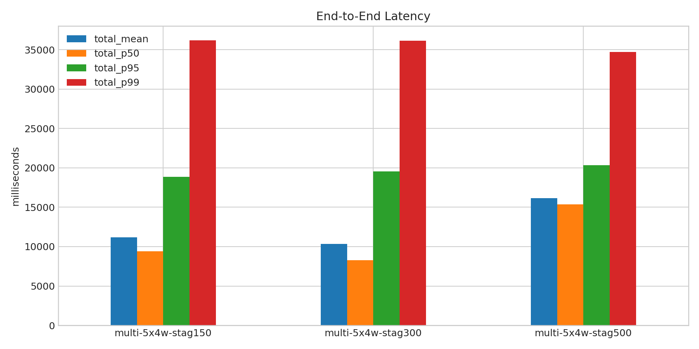
- 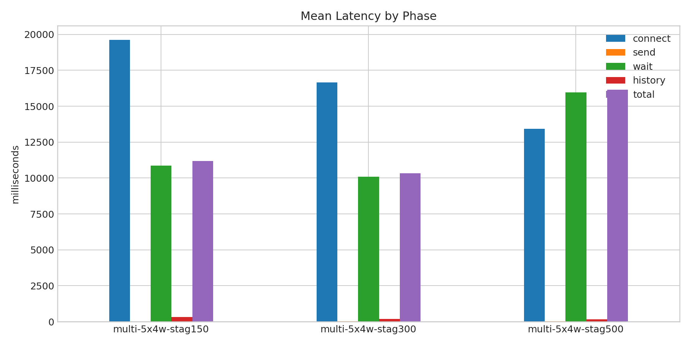
- 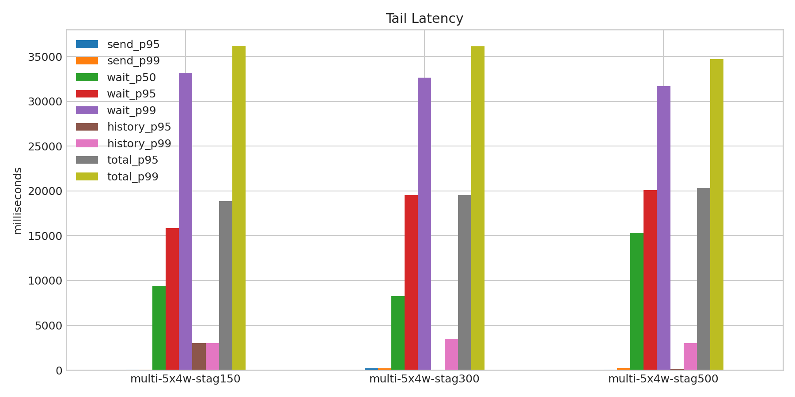
- 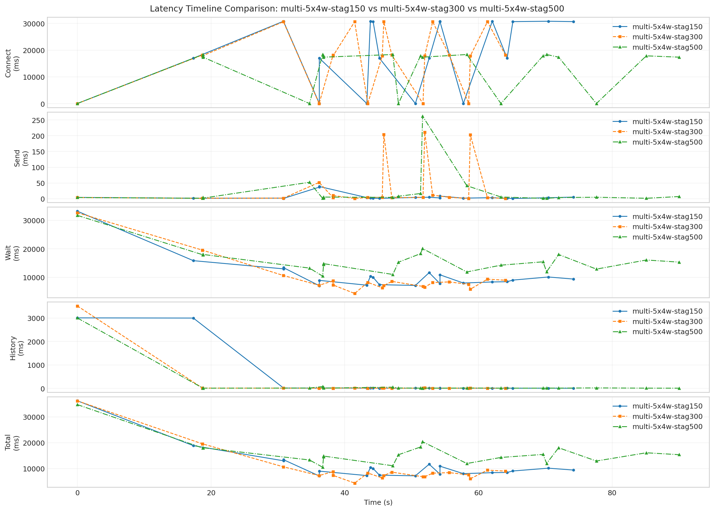
- 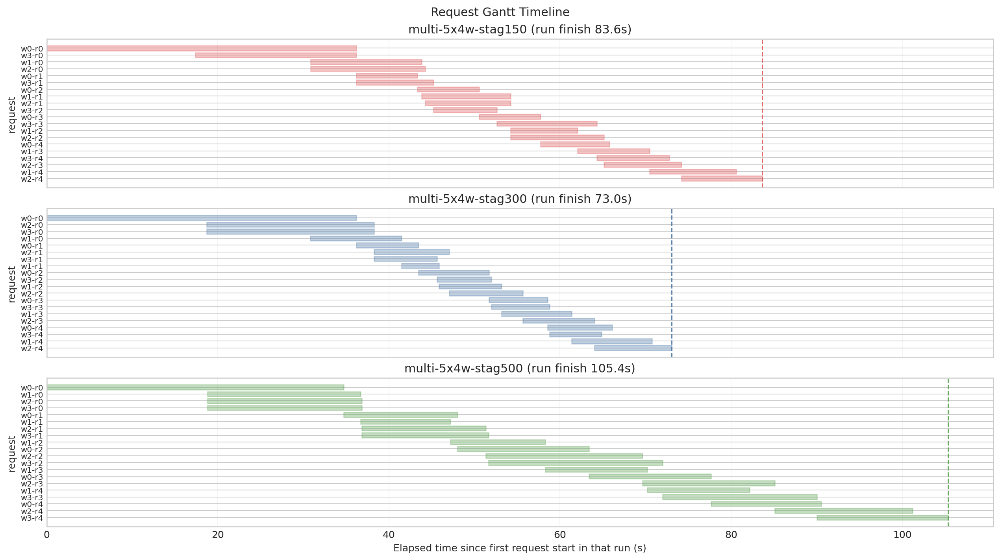
- 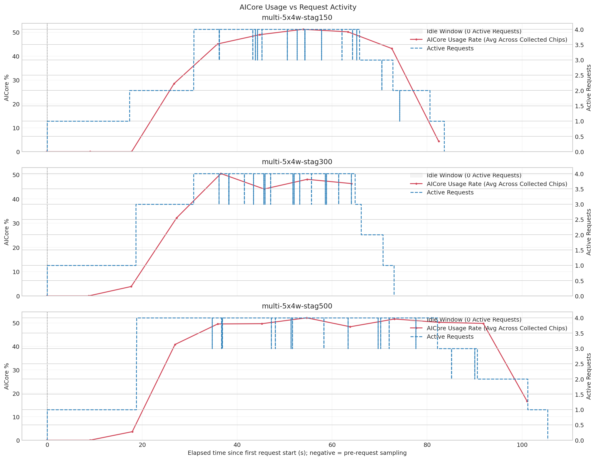
- 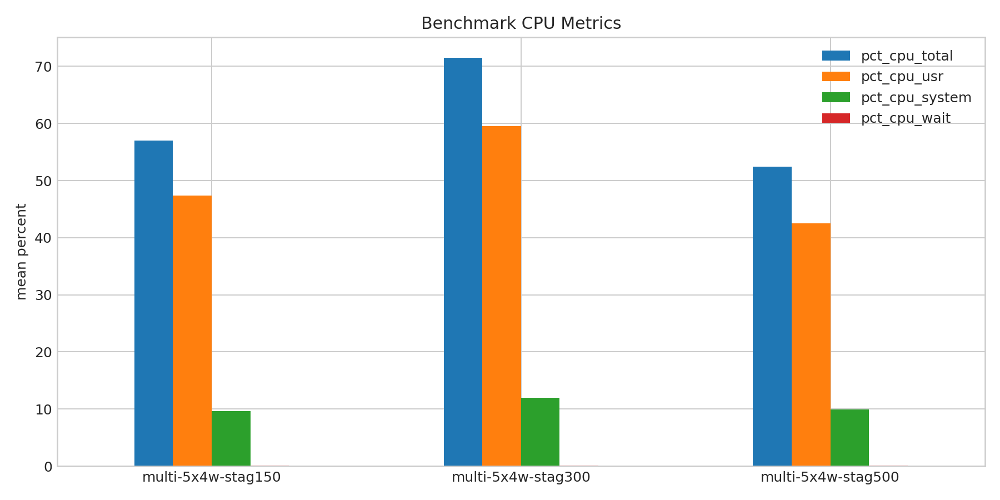
- 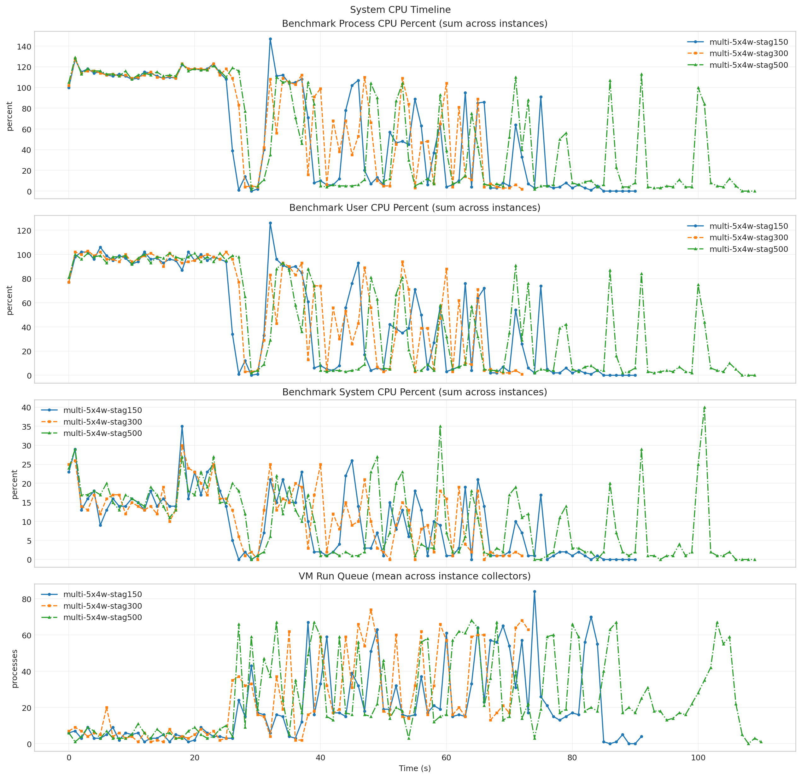
- 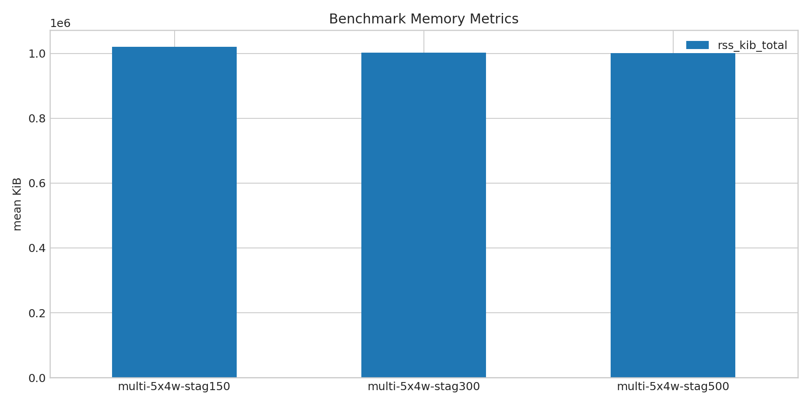
- 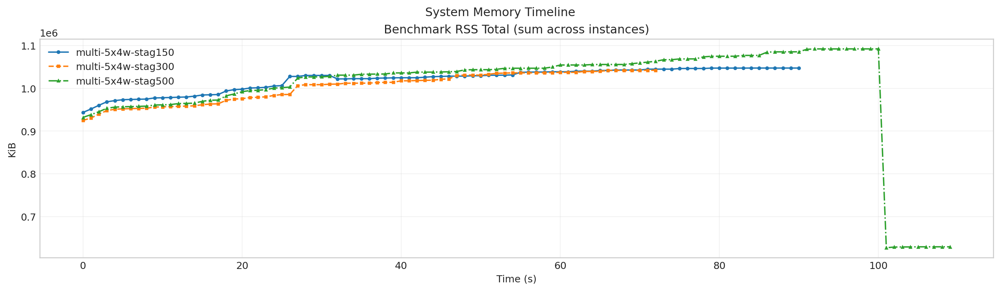
- 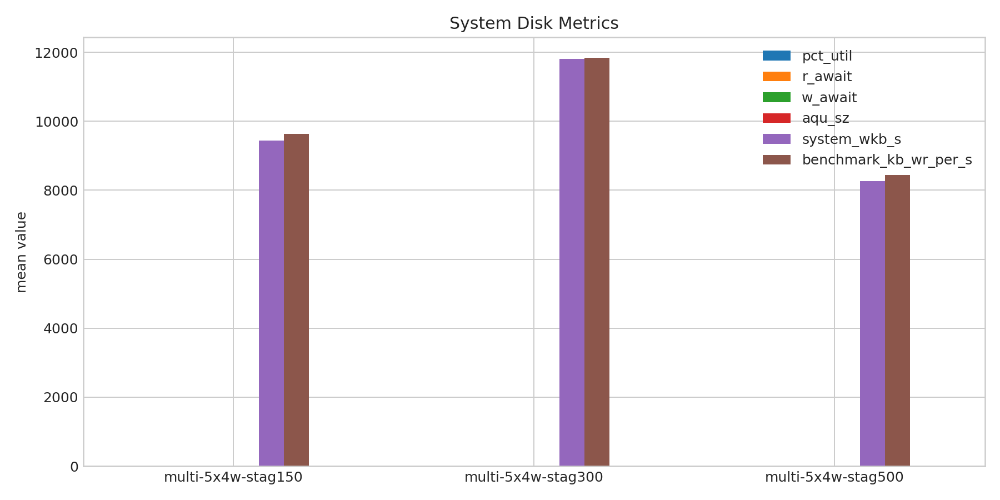
- 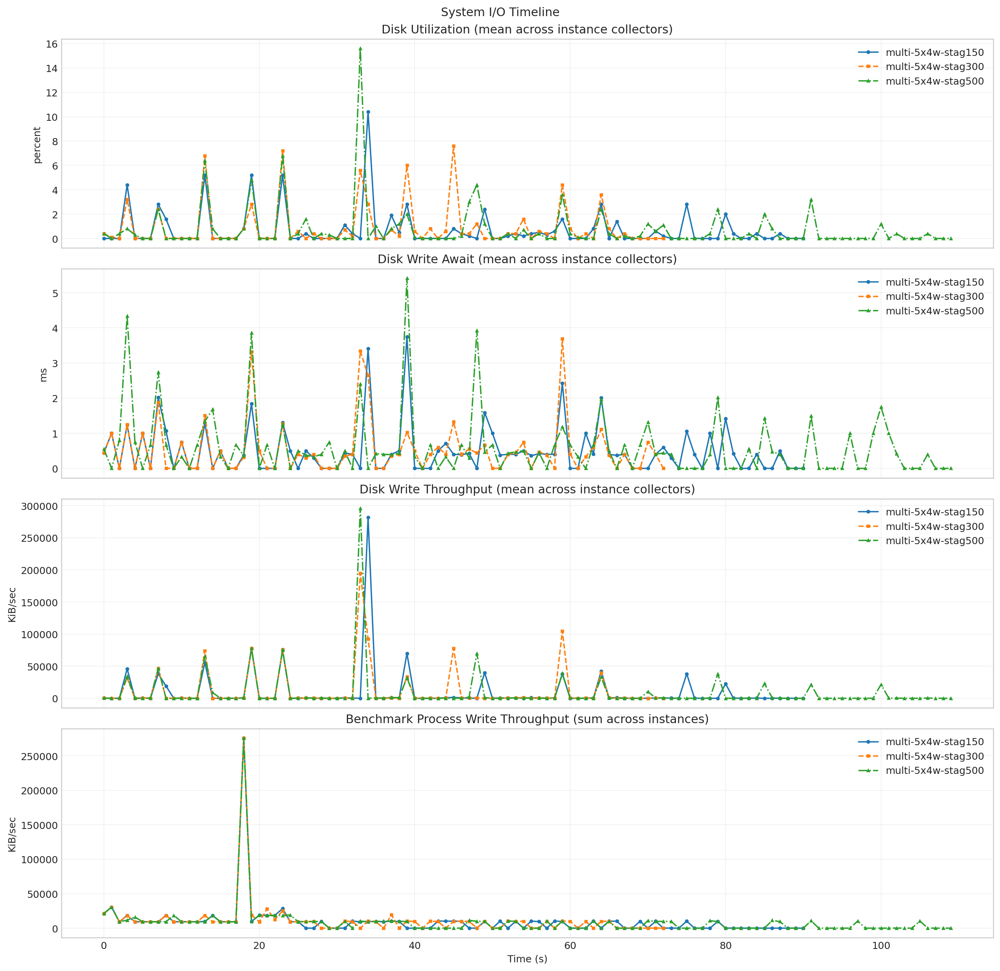
- 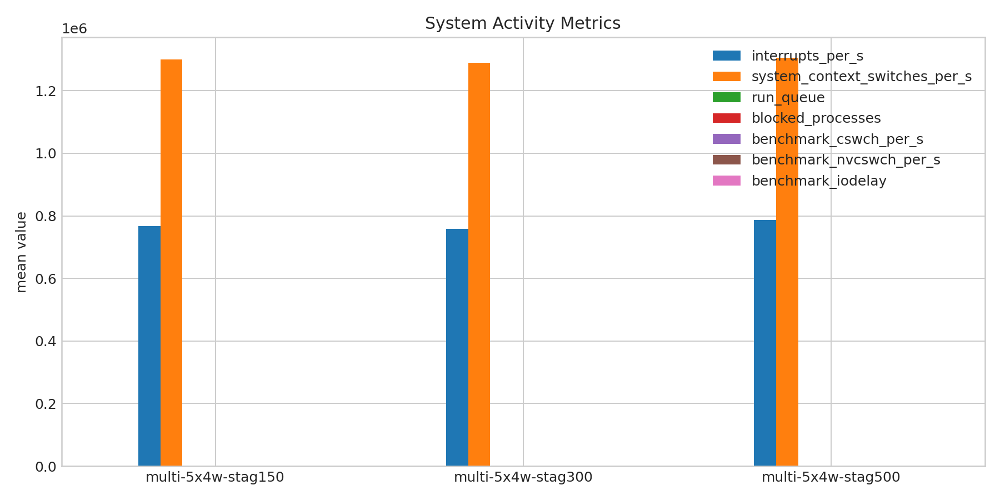
- 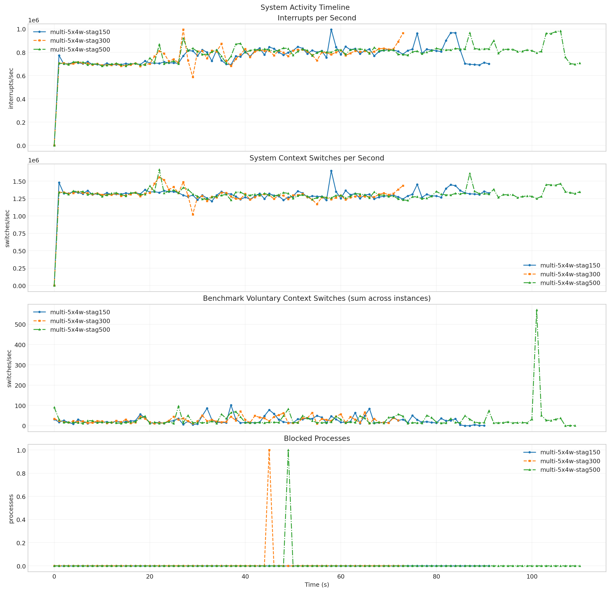
- 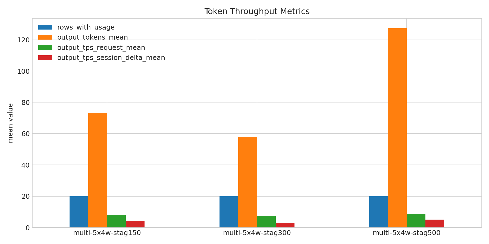
- 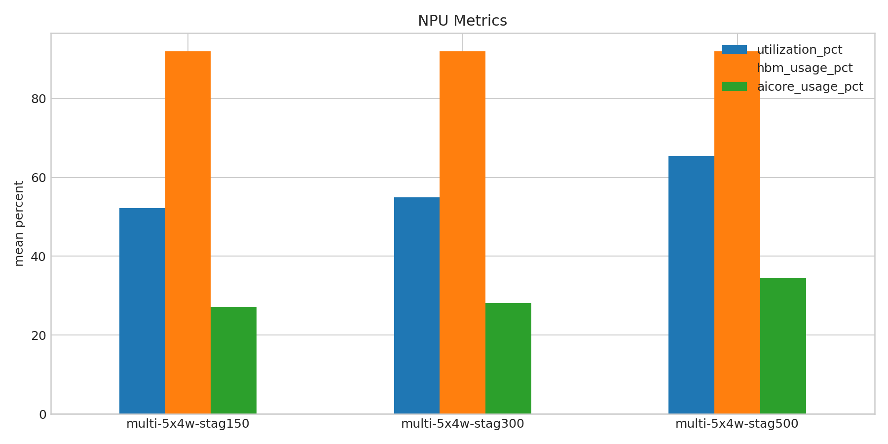
- 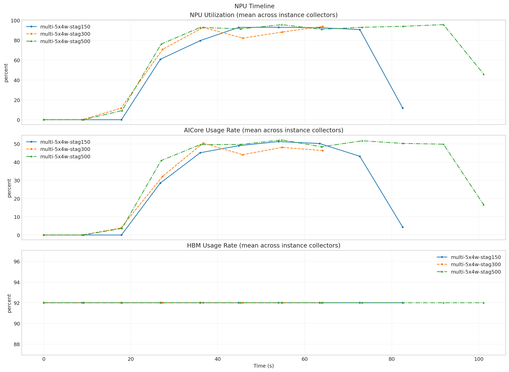

**Run Timing Table**

| scenario | run_dir | run_started_at | run_finished_at | run_wall_clock_sec | first_request_started_at | last_request_finished_at | request_window_sec |
| --- | --- | --- | --- | --- | --- | --- | --- |
| multi-5x4w-stag150 | /root/Zehao/ClawHarness/out/batch_run_2/task-01/20260416T191335Z_vps-docker-qwen3-235b8x2-multi-5x4w-stag150-worker | 2026-04-16T19:13:43.915238+00:00 | 2026-04-16T19:15:24.144063+00:00 | 100.229 | 2026-04-16T19:13:43.997157+00:00 | 2026-04-16T19:15:07.609081+00:00 | 83.612 |
| multi-5x4w-stag300 | /root/Zehao/ClawHarness/out/batch_run_2/task-01/20260416T191705Z_vps-docker-qwen3-235b8x2-multi-5x4w-stag300-worker | 2026-04-16T19:17:14.468539+00:00 | 2026-04-16T19:18:36.061995+00:00 | 81.593 | 2026-04-16T19:17:14.533229+00:00 | 2026-04-16T19:18:27.572256+00:00 | 73.039 |
| multi-5x4w-stag500 | /root/Zehao/ClawHarness/out/batch_run_2/task-01/20260416T192006Z_vps-docker-qwen3-235b8x2-multi-5x4w-stag500-worker | 2026-04-16T19:20:14.994463+00:00 | 2026-04-16T19:22:09.410353+00:00 | 114.416 | 2026-04-16T19:20:15.065341+00:00 | 2026-04-16T19:22:00.442789+00:00 | 105.377 |

**Latency Overview Table**

| scenario | total_mean | total_p50 | total_p95 | total_p99 |
| --- | --- | --- | --- | --- |
| multi-5x4w-stag150 | 11184.935 | 9411.613 | 18846.211 | 36199.361 |
| multi-5x4w-stag300 | 10324.010 | 8262.372 | 19565.767 | 36169.209 |
| multi-5x4w-stag500 | 16145.761 | 15351.649 | 20348.885 | 34730.049 |

**Mean Latency by Phase Table**

| scenario | connect | send | wait | history | total |
| --- | --- | --- | --- | --- | --- |
| multi-5x4w-stag150 | 19619.977 | 6.521 | 10869.464 | 308.909 | 11184.935 |
| multi-5x4w-stag300 | 16668.928 | 36.590 | 10101.808 | 185.572 | 10324.010 |
| multi-5x4w-stag500 | 13417.075 | 21.579 | 15956.947 | 167.194 | 16145.761 |

**Tail Latency Table**

| scenario | send_p95 | send_p99 | wait_p50 | wait_p95 | wait_p99 | history_p95 | history_p99 | total_p95 | total_p99 |
| --- | --- | --- | --- | --- | --- | --- | --- | --- | --- |
| multi-5x4w-stag150 | 36.925 | 38.809 | 9401.150 | 15844.746 | 33186.869 | 2999.827 | 3008.152 | 18846.211 | 36199.361 |
| multi-5x4w-stag300 | 203.883 | 211.251 | 8251.930 | 19548.877 | 32647.252 | 26.531 | 3517.998 | 19565.767 | 36169.209 |
| multi-5x4w-stag500 | 52.226 | 261.887 | 15336.905 | 20079.978 | 31720.558 | 76.778 | 3005.485 | 20348.885 | 34730.049 |

**System CPU Table**

| scenario | pct_cpu_total | pct_cpu_usr | pct_cpu_system | pct_cpu_wait |
| --- | --- | --- | --- | --- |
| multi-5x4w-stag150 | 57.028 | 47.347 | 9.680 | 0.066 |
| multi-5x4w-stag300 | 71.507 | 59.562 | 11.945 | 0.096 |
| multi-5x4w-stag500 | 52.427 | 42.482 | 9.945 | 0.136 |

**System Memory Table**

| scenario | rss_kib_total |
| --- | --- |
| multi-5x4w-stag150 | 1020664.220 |
| multi-5x4w-stag300 | 1002665.479 |
| multi-5x4w-stag500 | 1001194.618 |

**System Disk Table**

| scenario | busiest_device | pct_util | r_await | w_await | aqu_sz | system_wkb_s | benchmark_kb_wr_per_s |
| --- | --- | --- | --- | --- | --- | --- | --- |
| multi-5x4w-stag150 | sda | 0.687 | 0.011 | 0.493 | 0.117 | 9444.835 | 9626.762 |
| multi-5x4w-stag300 | sda | 0.908 | 0.027 | 0.536 | 0.173 | 11802.192 | 11841.973 |
| multi-5x4w-stag500 | sda | 0.718 | 0.000 | 0.595 | 0.114 | 8257.273 | 8448.800 |

**System Activity Table**

| scenario | interrupts_per_s | system_context_switches_per_s | run_queue | blocked_processes | benchmark_cswch_per_s | benchmark_nvcswch_per_s | benchmark_iodelay |
| --- | --- | --- | --- | --- | --- | --- | --- |
| multi-5x4w-stag150 | 766953.337 | 1300919.641 | 20.543 | 0.000 | 25.810 | 35.678 | 0.000 |
| multi-5x4w-stag300 | 758531.919 | 1288652.541 | 24.473 | 0.014 | 28.192 | 50.301 | 0.000 |
| multi-5x4w-stag500 | 786040.730 | 1305552.270 | 25.459 | 0.009 | 30.582 | 56.709 | 0.000 |

**Token Throughput Table**

| scenario | rows_with_usage | output_tokens_mean | output_tps_request_mean | output_tps_session_delta_mean |
| --- | --- | --- | --- | --- |
| multi-5x4w-stag150 | 20 | 73.400 | 8.043 | 4.342 |
| multi-5x4w-stag300 | 20 | 57.850 | 7.370 | 2.920 |
| multi-5x4w-stag500 | 20 | 127.400 | 8.643 | 5.092 |

**NPU Table**

| scenario | utilization_pct | hbm_usage_pct | aicore_usage_pct |
| --- | --- | --- | --- |
| multi-5x4w-stag150 | 52.163 | 92.000 | 27.156 |
| multi-5x4w-stag300 | 54.961 | 92.000 | 28.117 |
| multi-5x4w-stag500 | 65.427 | 92.000 | 34.385 |

**System Timeline Peaks Table**

| scenario | benchmark_cpu_peak | benchmark_cpu_peak_t_sec | benchmark_rss_peak_kib | benchmark_rss_peak_t_sec | system_disk_pct_util_peak | system_disk_pct_util_peak_t_sec | system_disk_w_await_peak | system_disk_w_await_peak_t_sec | system_interrupts_peak | system_interrupts_peak_t_sec | system_context_switches_peak | system_context_switches_peak_t_sec | system_run_queue_peak | system_run_queue_peak_t_sec | npu_utilization_peak | npu_utilization_peak_t_sec | npu_aicore_peak | npu_aicore_peak_t_sec | npu_hbm_peak | npu_hbm_peak_t_sec |
| --- | --- | --- | --- | --- | --- | --- | --- | --- | --- | --- | --- | --- | --- | --- | --- | --- | --- | --- | --- | --- |
| multi-5x4w-stag150 | 147.000 | 32.000 | 1047384.000 | 84.000 | 10.400 | 34.000 | 3.750 | 39.000 | 995382.000 | 58.000 | 1648899.000 | 58.000 | 84.000 | 74.000 | 93.062 | 53.977 | 51.250 | 53.977 | 92.000 | 0.000 |
| multi-5x4w-stag300 | 128.000 | 1.000 | 1042224.000 | 72.000 | 7.600 | 45.000 | 3.690 | 59.000 | 995508.000 | 27.000 | 1557847.000 | 22.000 | 74.000 | 48.000 | 93.938 | 64.129 | 50.438 | 36.644 | 92.000 | 0.000 |
| multi-5x4w-stag500 | 129.000 | 1.000 | 1092216.000 | 100.000 | 15.600 | 33.000 | 5.410 | 39.000 | 984179.000 | 106.000 | 1665592.000 | 22.000 | 68.000 | 64.000 | 95.750 | 91.905 | 52.188 | 54.734 | 92.000 | 0.000 |
