## `multi-5x4w-stag150` vs `multi-5x4w-stag300` vs `multi-5x4w-stag500`

**Run Dirs**

| scenario | run_dir | instance_num | requests_total | requests_ok | requests_failed |
| --- | --- | --- | --- | --- | --- |
| multi-5x4w-stag150 | /root/Zehao/ClawHarness/out/batch_run_3/task-01/20260417T095109Z_vps-docker-qwen3-235b8x2-multi-5x4w-stag150-request | 1 | 20 | 20 | 0 |
| multi-5x4w-stag300 | /root/Zehao/ClawHarness/out/batch_run_3/task-01/20260417T095400Z_vps-docker-qwen3-235b8x2-multi-5x4w-stag300-request | 1 | 20 | 20 | 0 |
| multi-5x4w-stag500 | /root/Zehao/ClawHarness/out/batch_run_3/task-01/20260417T095802Z_vps-docker-qwen3-235b8x2-multi-5x4w-stag500-request | 1 | 20 | 20 | 0 |

**Aggregation Policy**

- `pidstat` per-process metrics are summed across instances.
- `iostat` and `vmstat` host-wide metrics are averaged across instance collectors.
- This makes multi-instance runs comparable with single-instance runs at the whole-machine level.

**Figures**

- 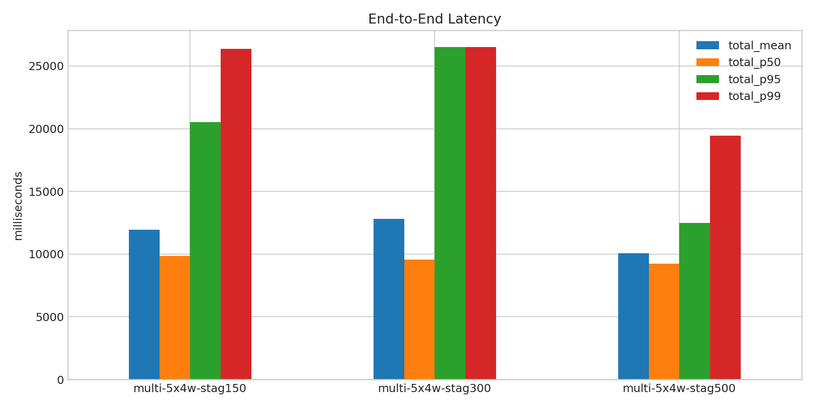
- 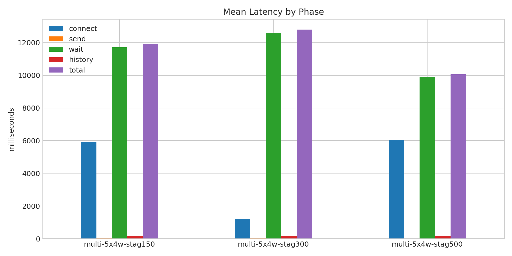
- 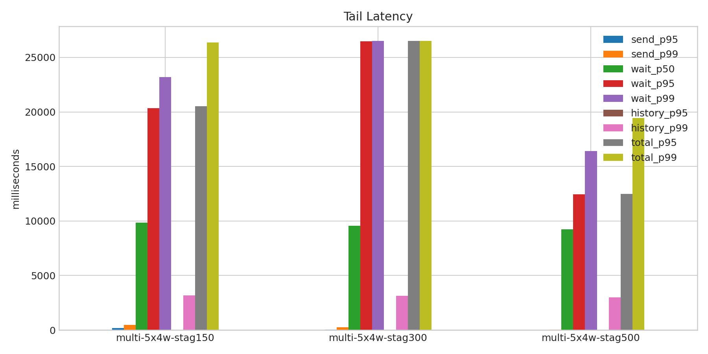
- 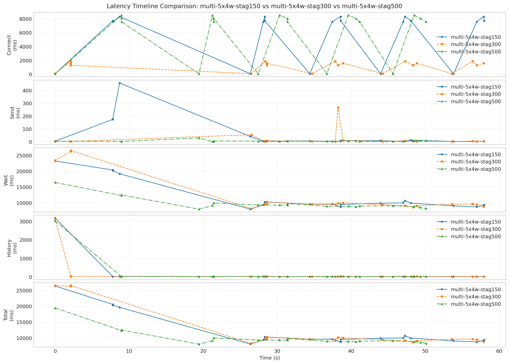
- 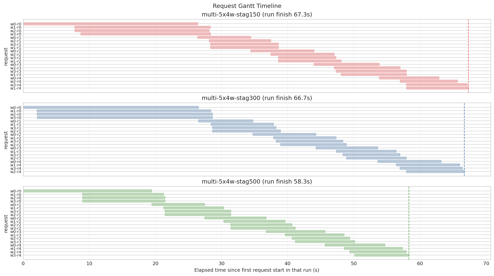
- 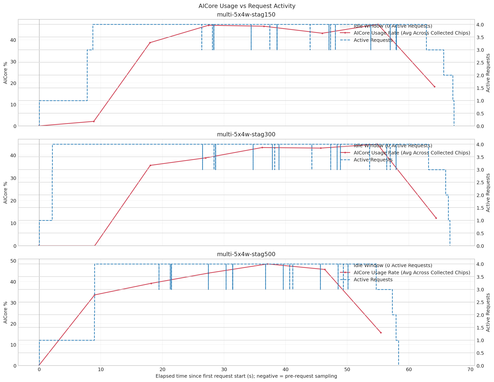
- 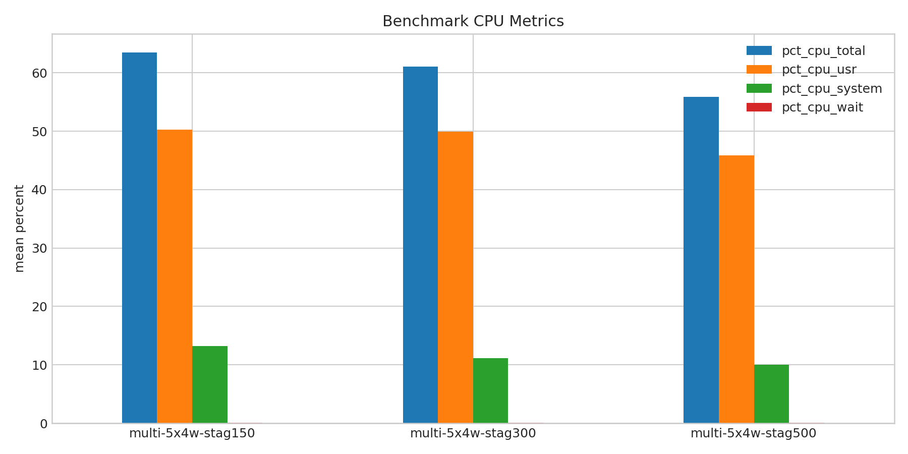
- 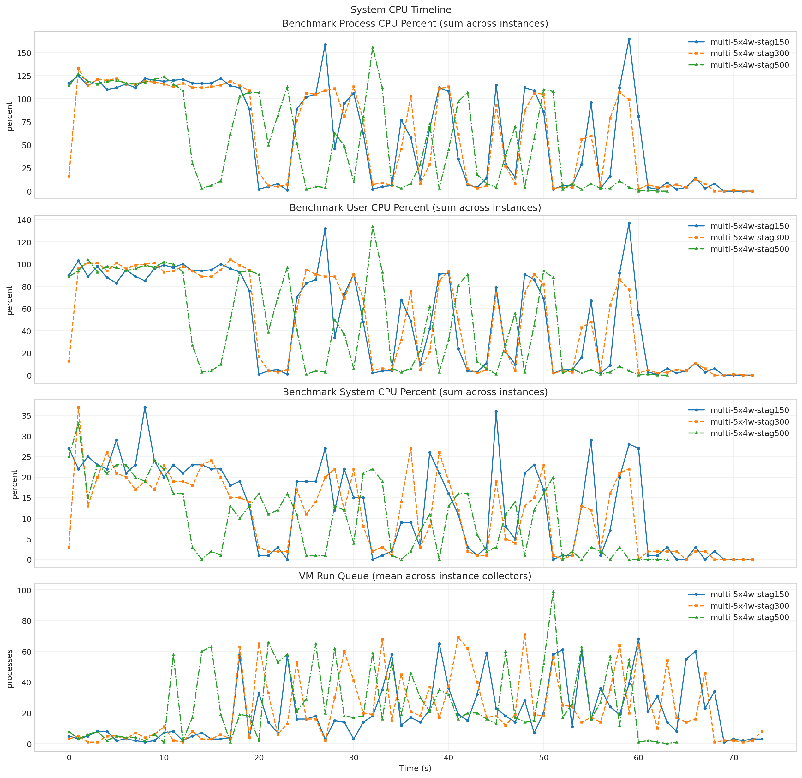
- 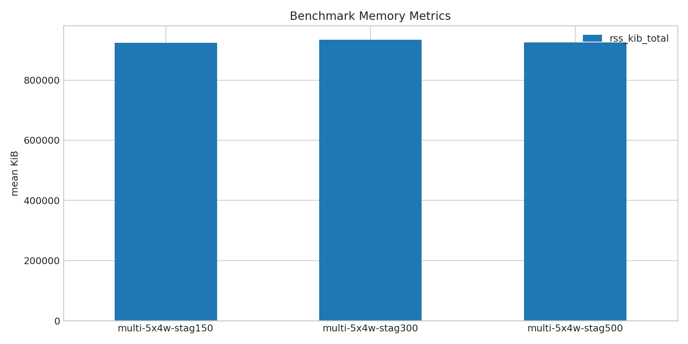
- 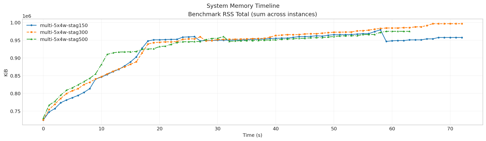
- 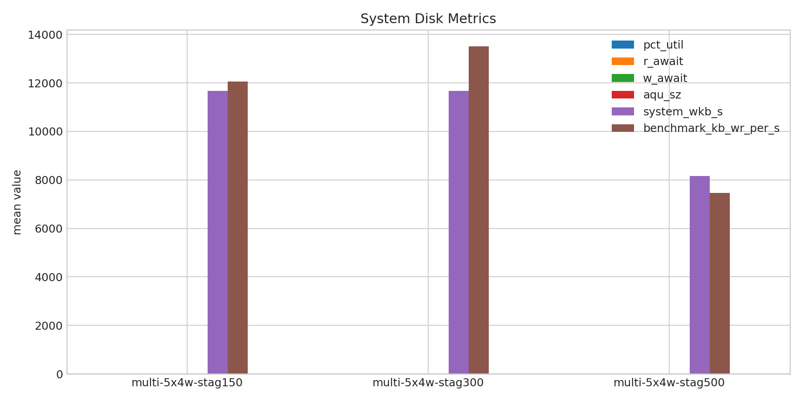
- 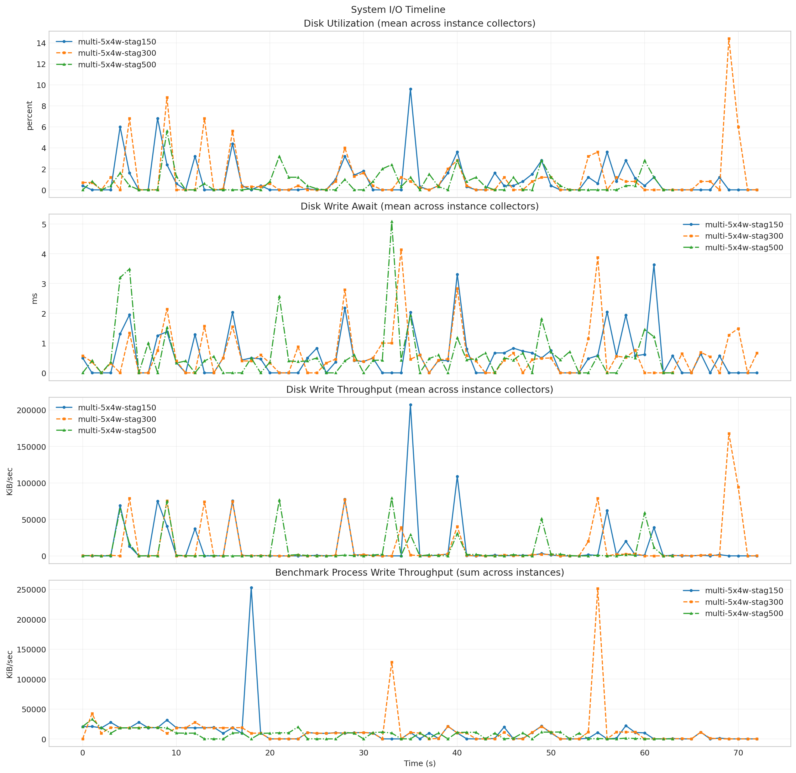
- 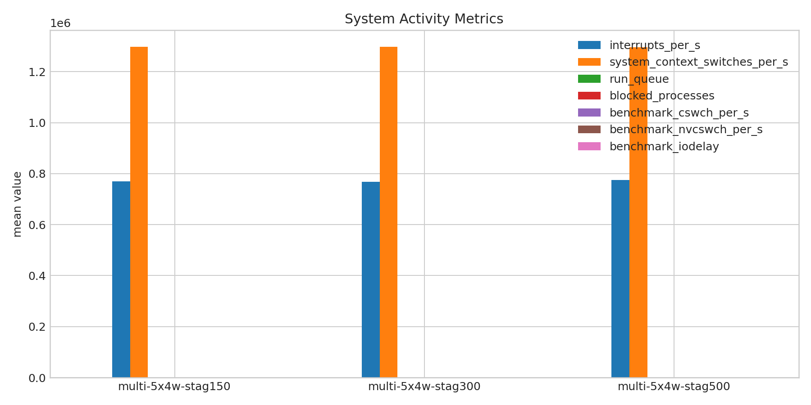
- 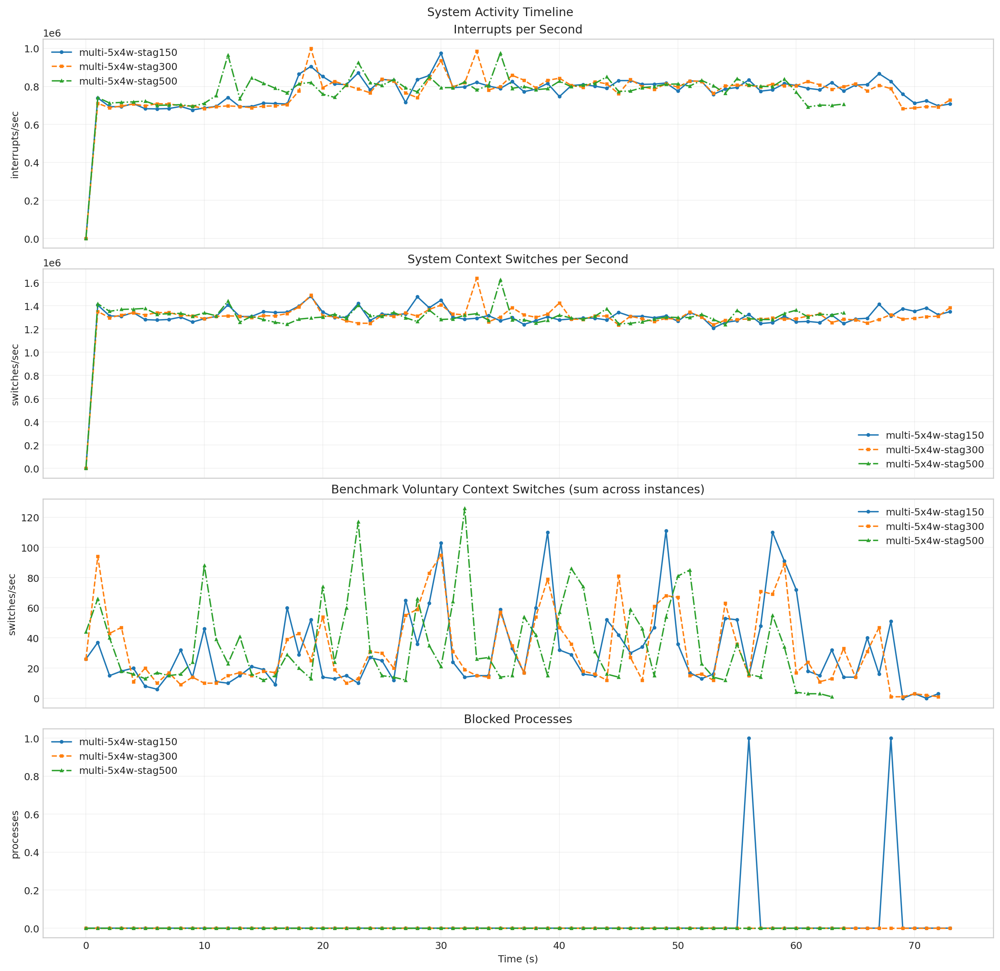
- 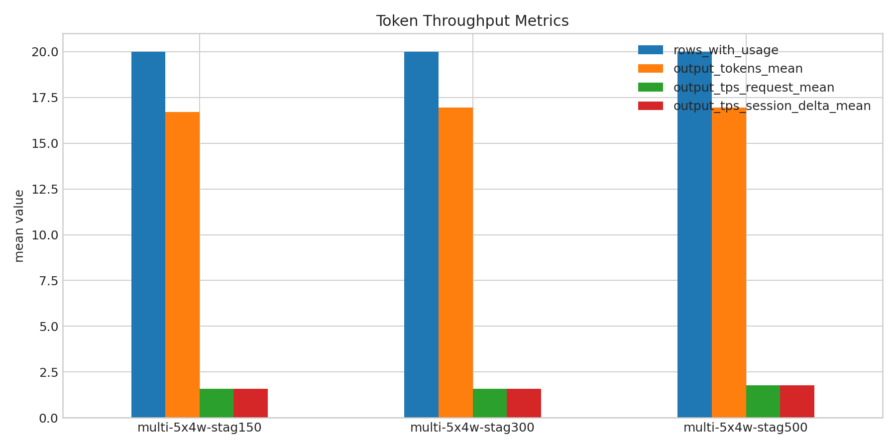
- 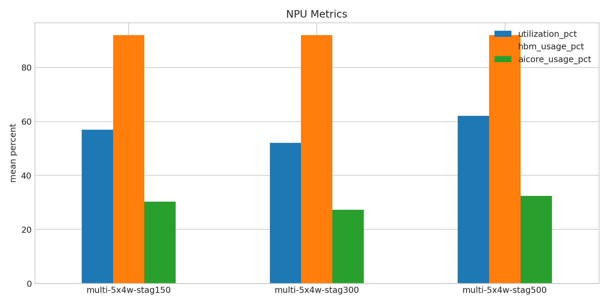
- 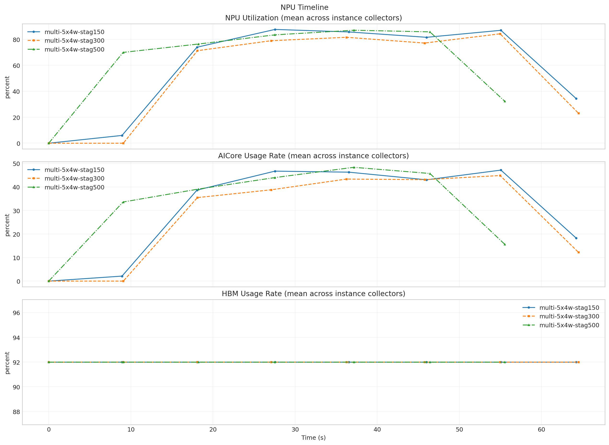

**Run Timing Table**

| scenario | run_dir | run_started_at | run_finished_at | run_wall_clock_sec | first_request_started_at | last_request_finished_at | request_window_sec |
| --- | --- | --- | --- | --- | --- | --- | --- |
| multi-5x4w-stag150 | /root/Zehao/ClawHarness/out/batch_run_3/task-01/20260417T095109Z_vps-docker-qwen3-235b8x2-multi-5x4w-stag150-request | 2026-04-17T09:51:16.462465+00:00 | 2026-04-17T09:52:37.583981+00:00 | 81.122 | 2026-04-17T09:51:16.526977+00:00 | 2026-04-17T09:52:23.849462+00:00 | 67.322 |
| multi-5x4w-stag300 | /root/Zehao/ClawHarness/out/batch_run_3/task-01/20260417T095400Z_vps-docker-qwen3-235b8x2-multi-5x4w-stag300-request | 2026-04-17T09:54:08.752564+00:00 | 2026-04-17T09:55:28.813895+00:00 | 80.061 | 2026-04-17T09:54:08.822865+00:00 | 2026-04-17T09:55:15.507232+00:00 | 66.684 |
| multi-5x4w-stag500 | /root/Zehao/ClawHarness/out/batch_run_3/task-01/20260417T095802Z_vps-docker-qwen3-235b8x2-multi-5x4w-stag500-request | 2026-04-17T09:58:09.681480+00:00 | 2026-04-17T09:59:20.953831+00:00 | 71.272 | 2026-04-17T09:58:09.746683+00:00 | 2026-04-17T09:59:08.069477+00:00 | 58.323 |

**Latency Overview Table**

| scenario | total_mean | total_p50 | total_p95 | total_p99 |
| --- | --- | --- | --- | --- |
| multi-5x4w-stag150 | 11934.222 | 9855.098 | 20542.859 | 26375.973 |
| multi-5x4w-stag300 | 12796.805 | 9572.294 | 26506.011 | 26514.537 |
| multi-5x4w-stag500 | 10067.963 | 9249.640 | 12467.021 | 19433.761 |

**Mean Latency by Phase Table**

| scenario | connect | send | wait | history | total |
| --- | --- | --- | --- | --- | --- |
| multi-5x4w-stag150 | 5911.578 | 46.066 | 11719.881 | 168.240 | 11934.222 |
| multi-5x4w-stag300 | 1203.033 | 19.066 | 12612.294 | 165.403 | 12796.805 |
| multi-5x4w-stag500 | 6041.591 | 5.625 | 9904.054 | 158.251 | 10067.963 |

**Tail Latency Table**

| scenario | send_p95 | send_p99 | wait_p50 | wait_p95 | wait_p99 | history_p95 | history_p99 | total_p95 | total_p99 |
| --- | --- | --- | --- | --- | --- | --- | --- | --- | --- |
| multi-5x4w-stag150 | 176.612 | 456.838 | 9839.183 | 20360.119 | 23193.995 | 16.762 | 3177.779 | 20542.859 | 26375.973 |
| multi-5x4w-stag300 | 54.262 | 264.763 | 9561.867 | 26487.444 | 26501.746 | 16.476 | 3126.225 | 26506.011 | 26514.537 |
| multi-5x4w-stag500 | 8.957 | 29.428 | 9240.930 | 12456.642 | 16416.381 | 15.963 | 3013.230 | 12467.021 | 19433.761 |

**System CPU Table**

| scenario | pct_cpu_total | pct_cpu_usr | pct_cpu_system | pct_cpu_wait |
| --- | --- | --- | --- | --- |
| multi-5x4w-stag150 | 63.493 | 50.315 | 13.178 | 0.068 |
| multi-5x4w-stag300 | 61.068 | 49.890 | 11.178 | 0.068 |
| multi-5x4w-stag500 | 55.875 | 45.828 | 10.047 | 0.062 |

**System Memory Table**

| scenario | rss_kib_total |
| --- | --- |
| multi-5x4w-stag150 | 923945.479 |
| multi-5x4w-stag300 | 934133.589 |
| multi-5x4w-stag500 | 925797.062 |

**System Disk Table**

| scenario | busiest_device | pct_util | r_await | w_await | aqu_sz | system_wkb_s | benchmark_kb_wr_per_s |
| --- | --- | --- | --- | --- | --- | --- | --- |
| multi-5x4w-stag150 | sda | 0.963 | 0.000 | 0.572 | 0.150 | 11678.027 | 12049.644 |
| multi-5x4w-stag300 | sda | 1.158 | 0.014 | 0.598 | 0.129 | 11680.055 | 13510.082 |
| multi-5x4w-stag500 | sda | 0.667 | 0.000 | 0.617 | 0.112 | 8156.875 | 7456.188 |

**System Activity Table**

| scenario | interrupts_per_s | system_context_switches_per_s | run_queue | blocked_processes | benchmark_cswch_per_s | benchmark_nvcswch_per_s | benchmark_iodelay |
| --- | --- | --- | --- | --- | --- | --- | --- |
| multi-5x4w-stag150 | 769508.135 | 1297752.311 | 20.432 | 0.027 | 31.932 | 37.164 | 0.000 |
| multi-5x4w-stag300 | 768428.986 | 1297167.122 | 22.405 | 0.000 | 31.767 | 40.493 | 0.000 |
| multi-5x4w-stag500 | 775116.108 | 1295361.923 | 25.631 | 0.000 | 35.156 | 35.406 | 0.000 |

**Token Throughput Table**

| scenario | rows_with_usage | output_tokens_mean | output_tps_request_mean | output_tps_session_delta_mean |
| --- | --- | --- | --- | --- |
| multi-5x4w-stag150 | 20 | 16.700 | 1.584 | 1.584 |
| multi-5x4w-stag300 | 20 | 16.950 | 1.590 | 1.590 |
| multi-5x4w-stag500 | 20 | 16.950 | 1.763 | 1.763 |

**NPU Table**

| scenario | utilization_pct | hbm_usage_pct | aicore_usage_pct |
| --- | --- | --- | --- |
| multi-5x4w-stag150 | 57.008 | 92.000 | 30.297 |
| multi-5x4w-stag300 | 52.031 | 92.000 | 27.242 |
| multi-5x4w-stag500 | 62.125 | 92.000 | 32.366 |

**System Timeline Peaks Table**

| scenario | benchmark_cpu_peak | benchmark_cpu_peak_t_sec | benchmark_rss_peak_kib | benchmark_rss_peak_t_sec | system_disk_pct_util_peak | system_disk_pct_util_peak_t_sec | system_disk_w_await_peak | system_disk_w_await_peak_t_sec | system_interrupts_peak | system_interrupts_peak_t_sec | system_context_switches_peak | system_context_switches_peak_t_sec | system_run_queue_peak | system_run_queue_peak_t_sec | npu_utilization_peak | npu_utilization_peak_t_sec | npu_aicore_peak | npu_aicore_peak_t_sec | npu_hbm_peak | npu_hbm_peak_t_sec |
| --- | --- | --- | --- | --- | --- | --- | --- | --- | --- | --- | --- | --- | --- | --- | --- | --- | --- | --- | --- | --- |
| multi-5x4w-stag150 | 165.000 | 59.000 | 979496.000 | 58.000 | 9.600 | 35.000 | 3.630 | 61.000 | 974403.000 | 30.000 | 1481621.000 | 19.000 | 68.000 | 60.000 | 87.625 | 27.550 | 47.188 | 55.063 | 92.000 | 0.000 |
| multi-5x4w-stag300 | 133.000 | 1.000 | 996608.000 | 70.000 | 14.400 | 69.000 | 4.140 | 34.000 | 999343.000 | 19.000 | 1635993.000 | 33.000 | 71.000 | 48.000 | 84.250 | 54.968 | 44.875 | 54.968 | 92.000 | 0.000 |
| multi-5x4w-stag500 | 156.000 | 32.000 | 975012.000 | 59.000 | 5.600 | 9.000 | 5.080 | 33.000 | 973963.000 | 35.000 | 1623638.000 | 35.000 | 99.000 | 51.000 | 87.000 | 37.151 | 48.375 | 37.151 | 92.000 | 0.000 |
