## `multi-5x4w-stag150` vs `multi-5x4w-stag300` vs `multi-5x4w-stag500`

**Run Dirs**

| scenario | run_dir | instance_num | requests_total | requests_ok | requests_failed |
| --- | --- | --- | --- | --- | --- |
| multi-5x4w-stag150 | /root/Zehao/ClawHarness/out/batch_run_3/task-01/20260417T094851Z_vps-docker-qwen3-235b8x2-multi-5x4w-stag150-worker | 1 | 20 | 20 | 0 |
| multi-5x4w-stag300 | /root/Zehao/ClawHarness/out/batch_run_3/task-01/20260417T095237Z_vps-docker-qwen3-235b8x2-multi-5x4w-stag300-worker | 1 | 20 | 20 | 0 |
| multi-5x4w-stag500 | /root/Zehao/ClawHarness/out/batch_run_3/task-01/20260417T095528Z_vps-docker-qwen3-235b8x2-multi-5x4w-stag500-worker | 1 | 20 | 20 | 0 |

**Aggregation Policy**

- `pidstat` per-process metrics are summed across instances.
- `iostat` and `vmstat` host-wide metrics are averaged across instance collectors.
- This makes multi-instance runs comparable with single-instance runs at the whole-machine level.

**Figures**

- 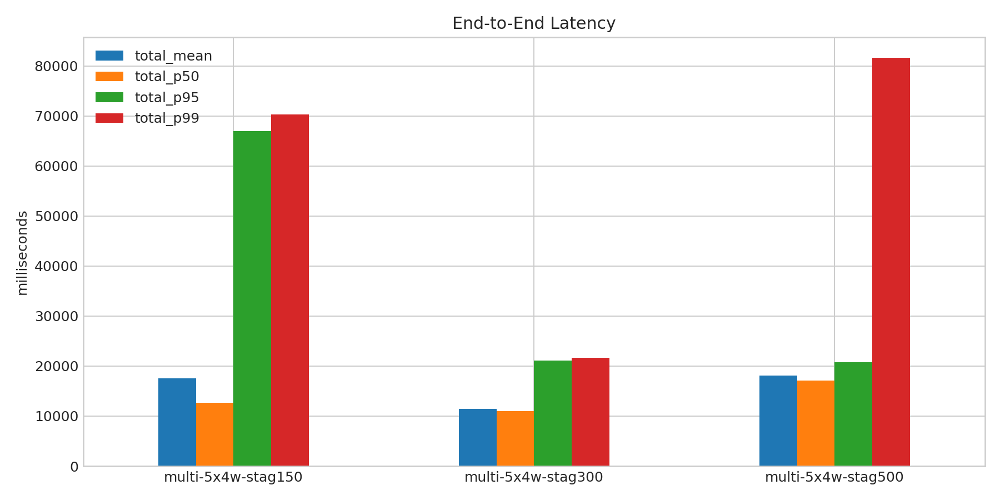
- 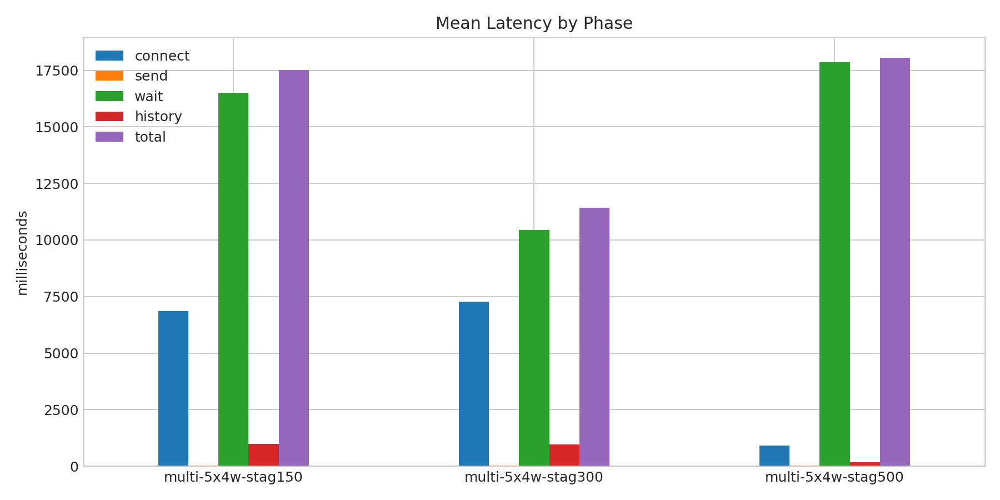
- 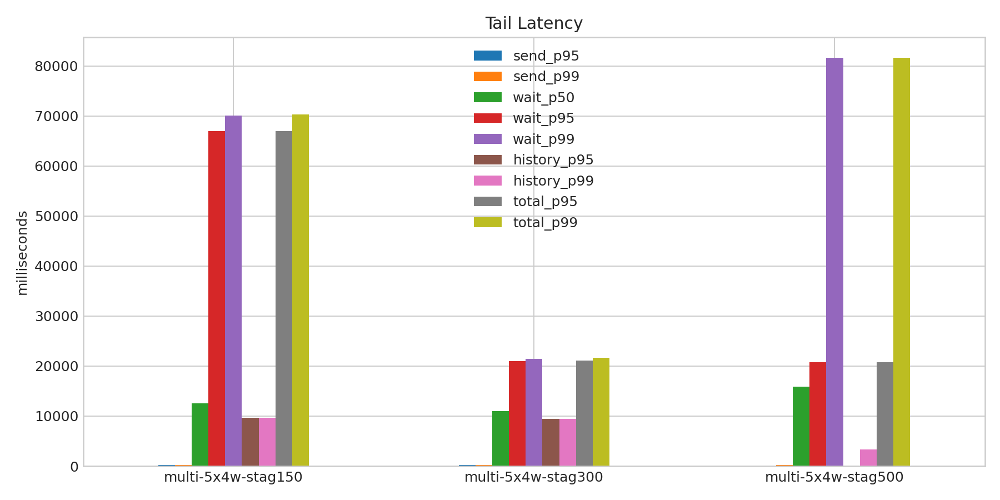
- 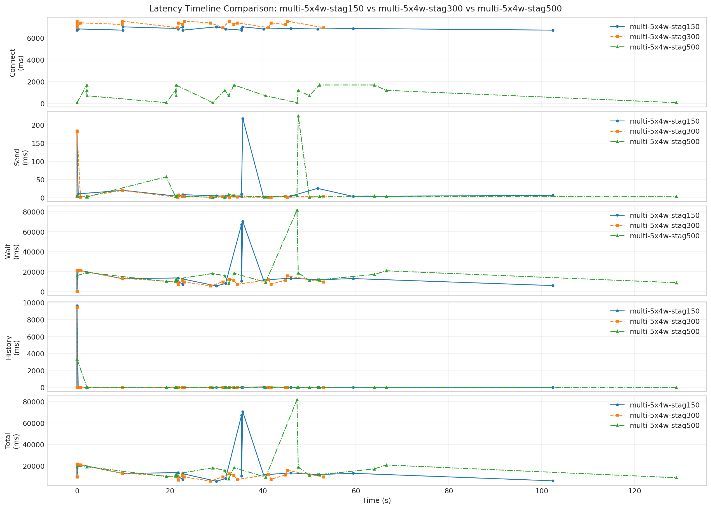
- 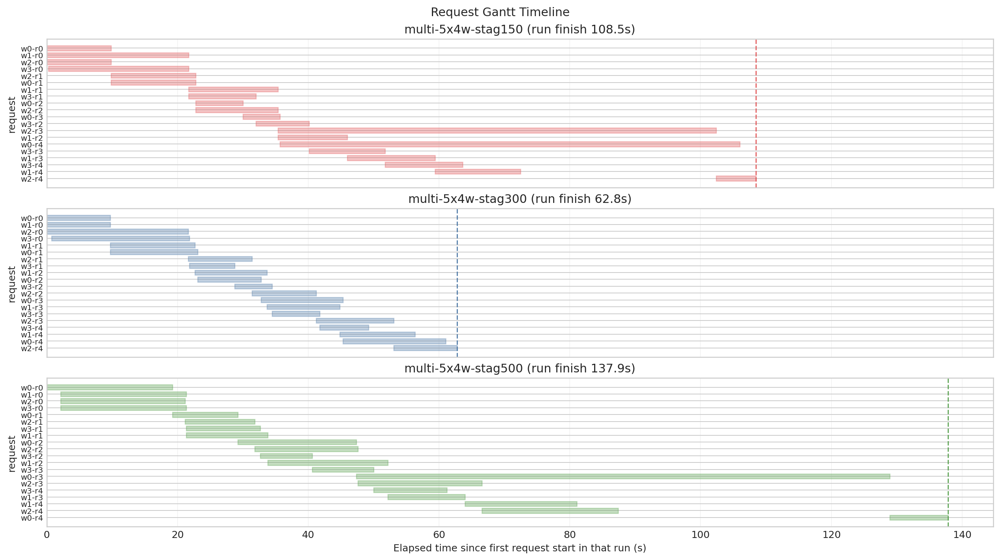
- 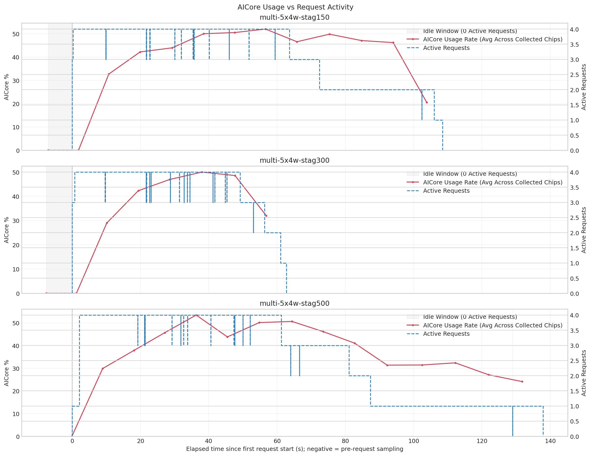
- 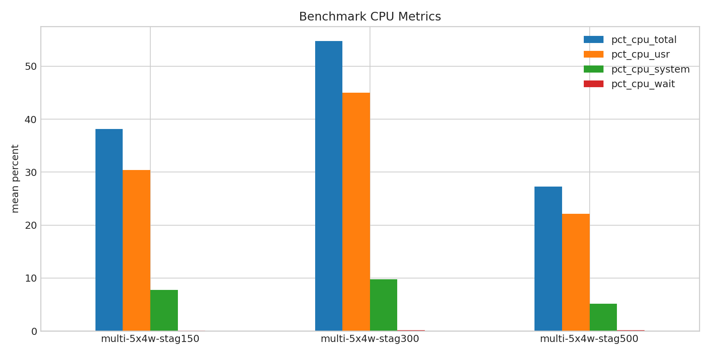
- 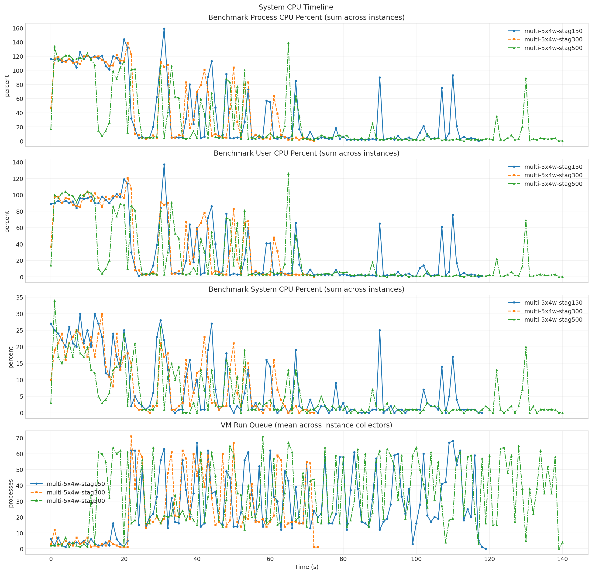
- 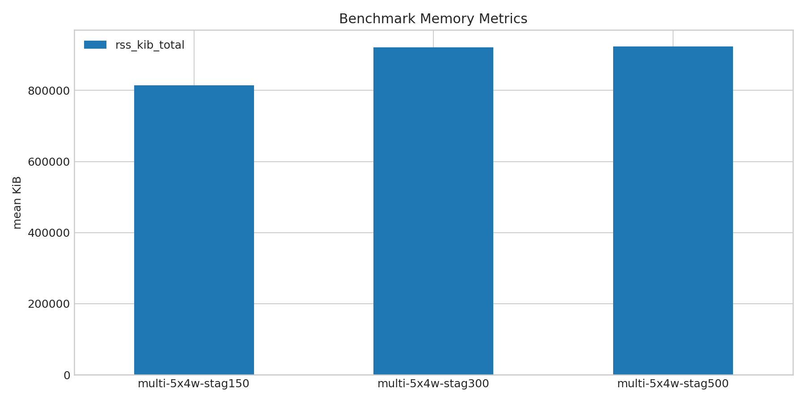
- 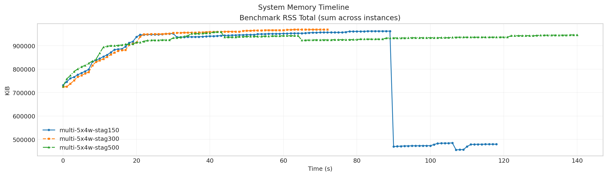
- 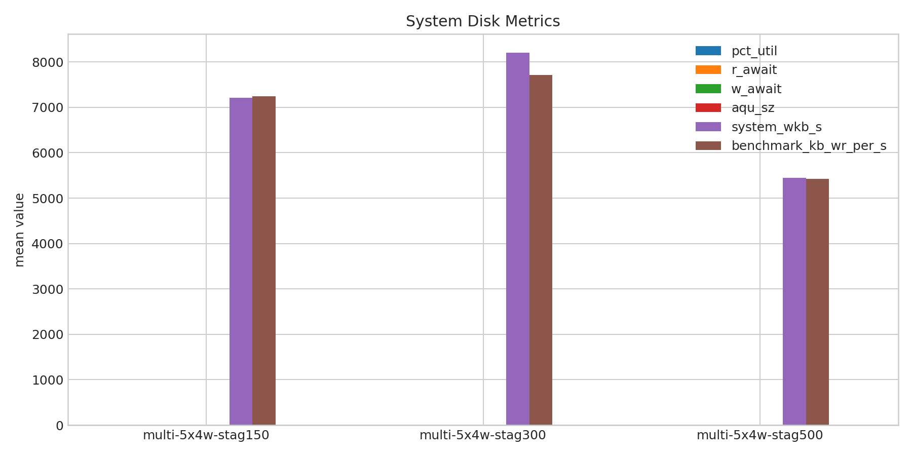
- 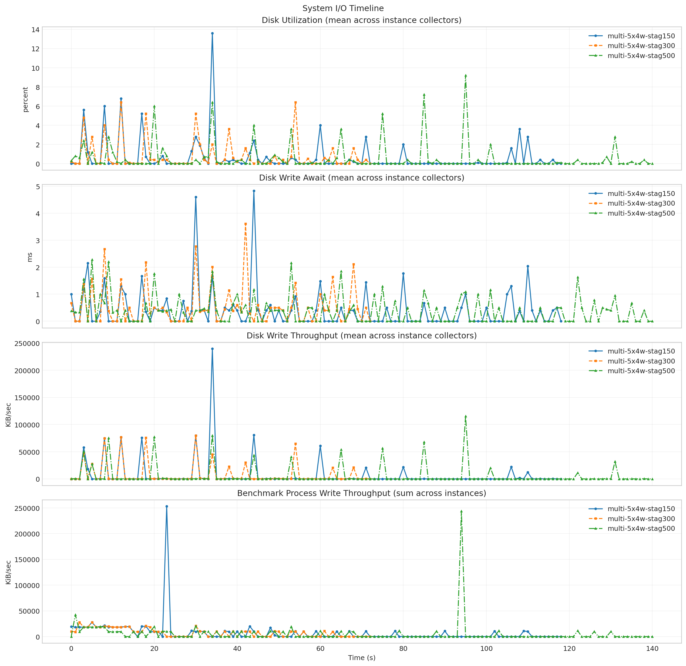
- 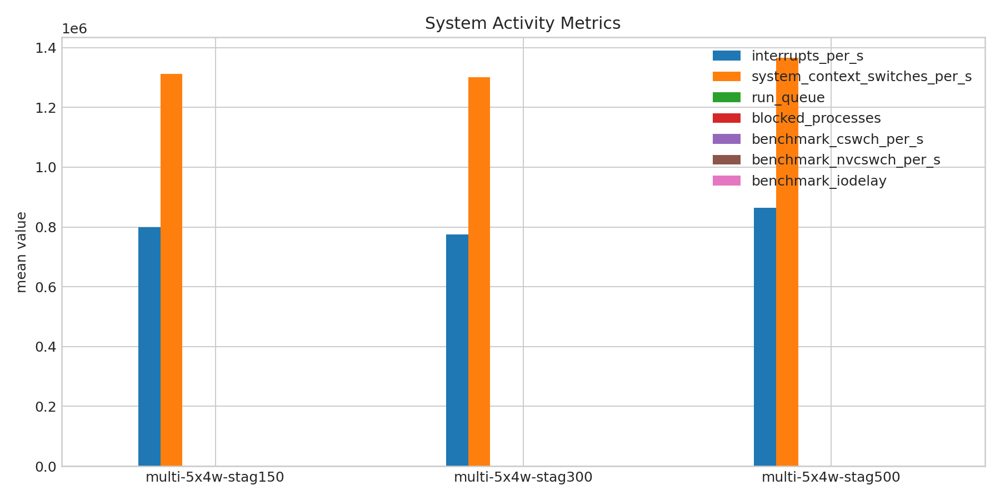
- 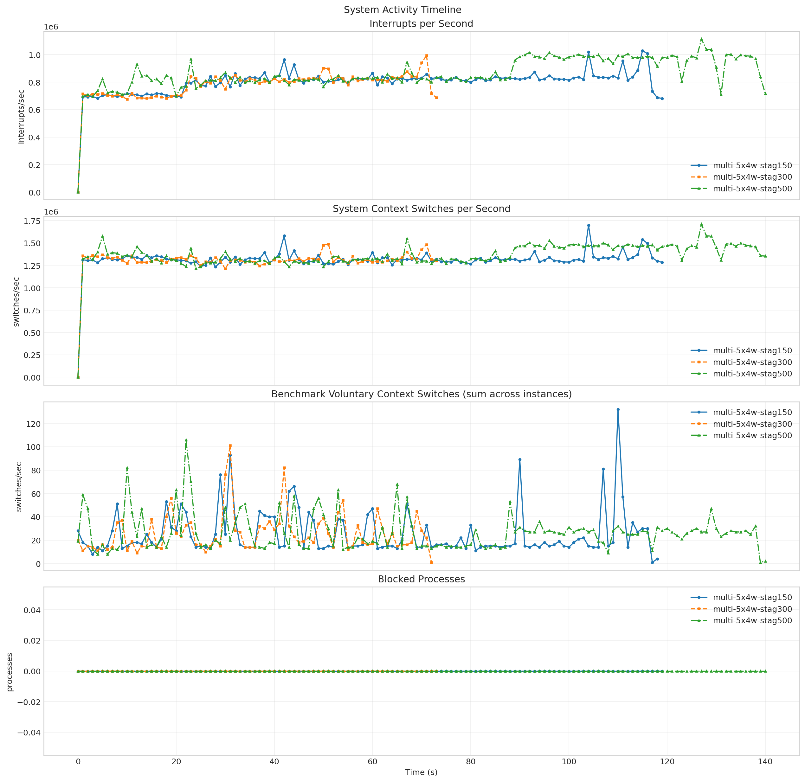
- 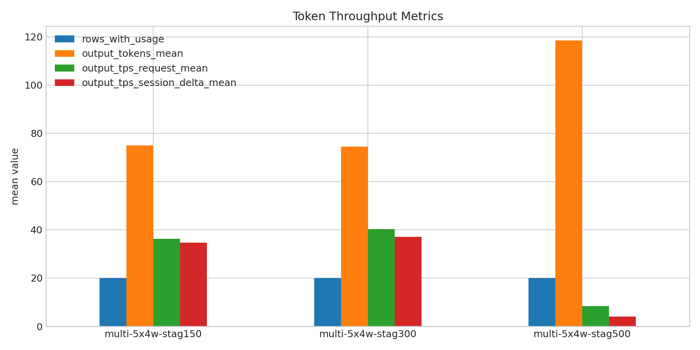
- 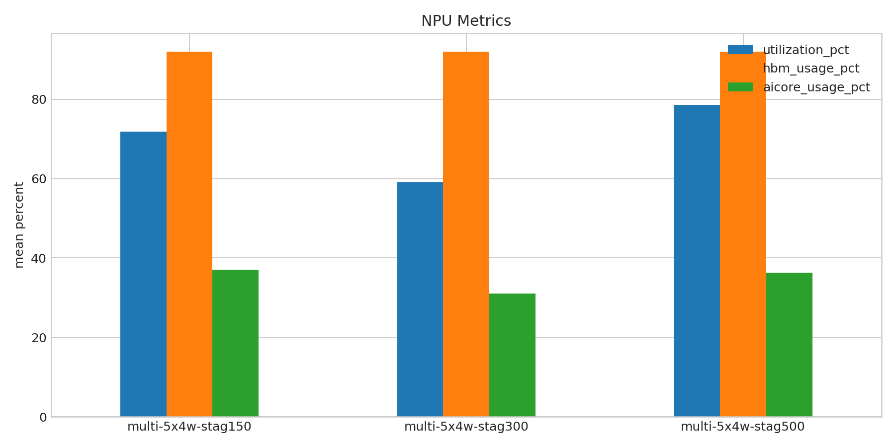
- 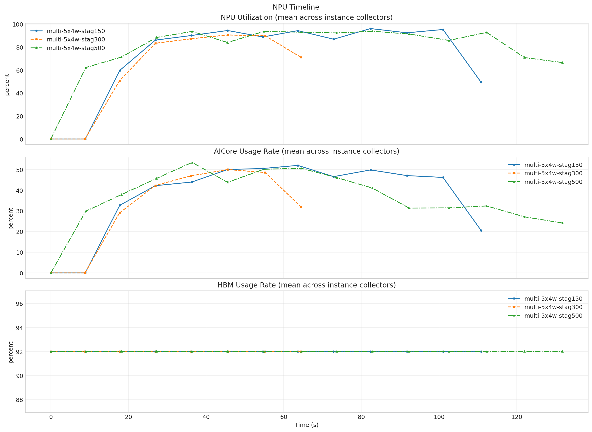

**Run Timing Table**

| scenario | run_dir | run_started_at | run_finished_at | run_wall_clock_sec | first_request_started_at | last_request_finished_at | request_window_sec |
| --- | --- | --- | --- | --- | --- | --- | --- |
| multi-5x4w-stag150 | /root/Zehao/ClawHarness/out/batch_run_3/task-01/20260417T094851Z_vps-docker-qwen3-235b8x2-multi-5x4w-stag150-worker | 2026-04-17T09:49:00.261743+00:00 | 2026-04-17T09:51:09.198506+00:00 | 128.937 | 2026-04-17T09:49:07.279466+00:00 | 2026-04-17T09:50:55.729550+00:00 | 108.450 |
| multi-5x4w-stag300 | /root/Zehao/ClawHarness/out/batch_run_3/task-01/20260417T095237Z_vps-docker-qwen3-235b8x2-multi-5x4w-stag300-worker | 2026-04-17T09:52:46.168760+00:00 | 2026-04-17T09:54:00.107097+00:00 | 73.938 | 2026-04-17T09:52:53.710029+00:00 | 2026-04-17T09:53:56.462400+00:00 | 62.752 |
| multi-5x4w-stag500 | /root/Zehao/ClawHarness/out/batch_run_3/task-01/20260417T095528Z_vps-docker-qwen3-235b8x2-multi-5x4w-stag500-worker | 2026-04-17T09:55:37.130519+00:00 | 2026-04-17T09:58:02.372163+00:00 | 145.242 | 2026-04-17T09:55:37.201684+00:00 | 2026-04-17T09:57:55.071923+00:00 | 137.870 |

**Latency Overview Table**

| scenario | total_mean | total_p50 | total_p95 | total_p99 |
| --- | --- | --- | --- | --- |
| multi-5x4w-stag150 | 17514.409 | 12623.553 | 67009.629 | 70347.320 |
| multi-5x4w-stag300 | 11429.201 | 11043.751 | 21058.254 | 21649.955 |
| multi-5x4w-stag500 | 18057.520 | 17138.977 | 20794.795 | 81624.964 |

**Mean Latency by Phase Table**

| scenario | connect | send | wait | history | total |
| --- | --- | --- | --- | --- | --- |
| multi-5x4w-stag150 | 6856.433 | 36.192 | 16505.584 | 972.598 | 17514.409 |
| multi-5x4w-stag300 | 7276.471 | 22.633 | 10450.431 | 956.100 | 11429.201 |
| multi-5x4w-stag500 | 916.172 | 17.353 | 17864.290 | 175.840 | 18057.520 |

**Tail Latency Table**

| scenario | send_p95 | send_p99 | wait_p50 | wait_p95 | wait_p99 | history_p95 | history_p99 | total_p95 | total_p99 |
| --- | --- | --- | --- | --- | --- | --- | --- | --- | --- |
| multi-5x4w-stag150 | 183.825 | 217.819 | 12600.134 | 66998.670 | 70122.295 | 9613.873 | 9619.610 | 67009.629 | 70347.320 |
| multi-5x4w-stag300 | 181.194 | 184.134 | 11024.746 | 21047.440 | 21452.439 | 9467.531 | 9469.831 | 21058.254 | 21649.955 |
| multi-5x4w-stag500 | 57.318 | 225.306 | 15873.769 | 20784.866 | 81611.582 | 31.986 | 3332.910 | 20794.795 | 81624.964 |

**System CPU Table**

| scenario | pct_cpu_total | pct_cpu_usr | pct_cpu_system | pct_cpu_wait |
| --- | --- | --- | --- | --- |
| multi-5x4w-stag150 | 38.109 | 30.370 | 7.739 | 0.059 |
| multi-5x4w-stag300 | 54.753 | 44.986 | 9.767 | 0.123 |
| multi-5x4w-stag500 | 27.262 | 22.135 | 5.128 | 0.163 |

**System Memory Table**

| scenario | rss_kib_total |
| --- | --- |
| multi-5x4w-stag150 | 814683.866 |
| multi-5x4w-stag300 | 921722.411 |
| multi-5x4w-stag500 | 923725.220 |

**System Disk Table**

| scenario | busiest_device | pct_util | r_await | w_await | aqu_sz | system_wkb_s | benchmark_kb_wr_per_s |
| --- | --- | --- | --- | --- | --- | --- | --- |
| multi-5x4w-stag150 | sda | 0.609 | 0.000 | 0.401 | 0.104 | 7208.471 | 7242.588 |
| multi-5x4w-stag300 | sda | 0.774 | 0.000 | 0.526 | 0.089 | 8204.219 | 7714.247 |
| multi-5x4w-stag500 | sda | 0.513 | 0.000 | 0.370 | 0.054 | 5447.972 | 5420.539 |

**System Activity Table**

| scenario | interrupts_per_s | system_context_switches_per_s | run_queue | blocked_processes | benchmark_cswch_per_s | benchmark_nvcswch_per_s | benchmark_iodelay |
| --- | --- | --- | --- | --- | --- | --- | --- |
| multi-5x4w-stag150 | 799591.942 | 1312613.642 | 27.208 | 0.000 | 25.294 | 31.782 | 0.000 |
| multi-5x4w-stag300 | 775075.986 | 1300403.865 | 23.216 | 0.000 | 25.699 | 51.164 | 0.000 |
| multi-5x4w-stag500 | 864150.319 | 1365902.106 | 33.305 | 0.000 | 26.298 | 57.709 | 0.000 |

**Token Throughput Table**

| scenario | rows_with_usage | output_tokens_mean | output_tps_request_mean | output_tps_session_delta_mean |
| --- | --- | --- | --- | --- |
| multi-5x4w-stag150 | 20 | 74.950 | 36.226 | 34.666 |
| multi-5x4w-stag300 | 20 | 74.450 | 40.374 | 37.044 |
| multi-5x4w-stag500 | 20 | 118.500 | 8.338 | 4.116 |

**NPU Table**

| scenario | utilization_pct | hbm_usage_pct | aicore_usage_pct |
| --- | --- | --- | --- |
| multi-5x4w-stag150 | 71.817 | 92.000 | 37.038 |
| multi-5x4w-stag300 | 59.102 | 92.000 | 31.102 |
| multi-5x4w-stag500 | 78.650 | 92.000 | 36.337 |

**System Timeline Peaks Table**

| scenario | benchmark_cpu_peak | benchmark_cpu_peak_t_sec | benchmark_rss_peak_kib | benchmark_rss_peak_t_sec | system_disk_pct_util_peak | system_disk_pct_util_peak_t_sec | system_disk_w_await_peak | system_disk_w_await_peak_t_sec | system_interrupts_peak | system_interrupts_peak_t_sec | system_context_switches_peak | system_context_switches_peak_t_sec | system_run_queue_peak | system_run_queue_peak_t_sec | npu_utilization_peak | npu_utilization_peak_t_sec | npu_aicore_peak | npu_aicore_peak_t_sec | npu_hbm_peak | npu_hbm_peak_t_sec |
| --- | --- | --- | --- | --- | --- | --- | --- | --- | --- | --- | --- | --- | --- | --- | --- | --- | --- | --- | --- | --- |
| multi-5x4w-stag150 | 159.000 | 31.000 | 962360.000 | 87.000 | 13.600 | 34.000 | 4.830 | 44.000 | 1028497.000 | 115.000 | 1697498.000 | 104.000 | 68.000 | 110.000 | 96.125 | 82.367 | 52.000 | 63.632 | 92.000 | 0.000 |
| multi-5x4w-stag300 | 139.000 | 21.000 | 969040.000 | 63.000 | 6.400 | 12.000 | 3.610 | 42.000 | 993394.000 | 71.000 | 1489069.000 | 51.000 | 71.000 | 22.000 | 90.562 | 45.573 | 50.000 | 45.573 | 92.000 | 0.000 |
| multi-5x4w-stag500 | 139.000 | 65.000 | 958860.000 | 43.000 | 9.200 | 95.000 | 2.280 | 5.000 | 1113503.000 | 127.000 | 1710253.000 | 127.000 | 71.000 | 58.000 | 93.812 | 82.785 | 53.438 | 36.386 | 92.000 | 0.000 |
