## `single-w` vs `multi-5x4w-stag500` vs `multi-inst-5x4i` vs `multi-inst-5x2ix2w-500`

**Run Dirs**

| scenario | run_dir | instance_num | requests_total | requests_ok | requests_failed |
| --- | --- | --- | --- | --- | --- |
| single-w | /root/Zehao/ClawHarness/out/batch_run_3/task-01/20260417T094403Z_vps-docker-qwen3-235b8x2-single-20-worker | 1 | 20 | 20 | 0 |
| multi-5x4w-stag500 | /root/Zehao/ClawHarness/out/batch_run_3/task-01/20260417T095528Z_vps-docker-qwen3-235b8x2-multi-5x4w-stag500-worker | 1 | 20 | 20 | 0 |
| multi-inst-5x4i | /root/Zehao/ClawHarness/out/batch_run_3/task-01/20260417T095921Z_vps-docker-qwen3-235b8x2-single-inst-5x4i-worker | 4 | 20 | 20 | 0 |
| multi-inst-5x2ix2w-500 | /root/Zehao/ClawHarness/out/batch_run_3/task-01/20260417T100858Z_vps-docker-qwen3-235b8x2-multi-inst-5x2ix2w-stag500-worker | 2 | 20 | 20 | 0 |

**Aggregation Policy**

- `pidstat` per-process metrics are summed across instances.
- `iostat` and `vmstat` host-wide metrics are averaged across instance collectors.
- This makes multi-instance runs comparable with single-instance runs at the whole-machine level.

**Figures**

- 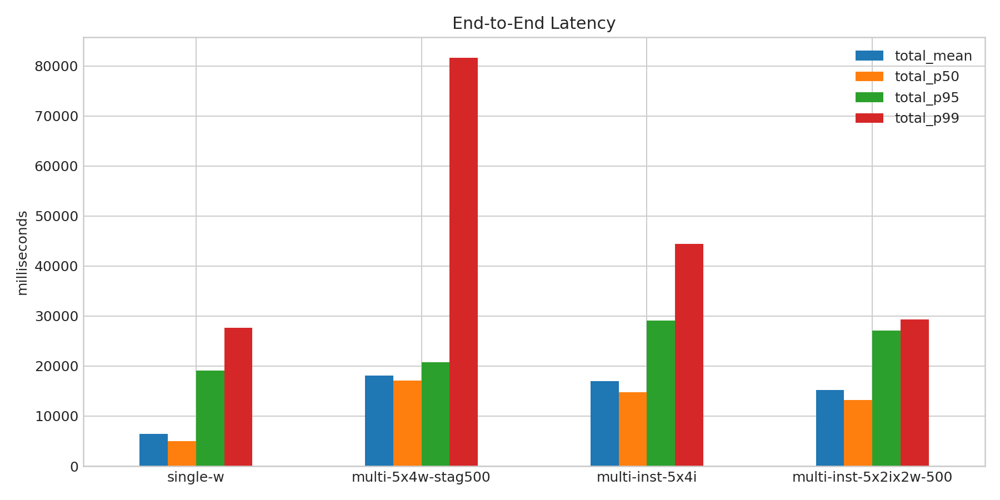
- 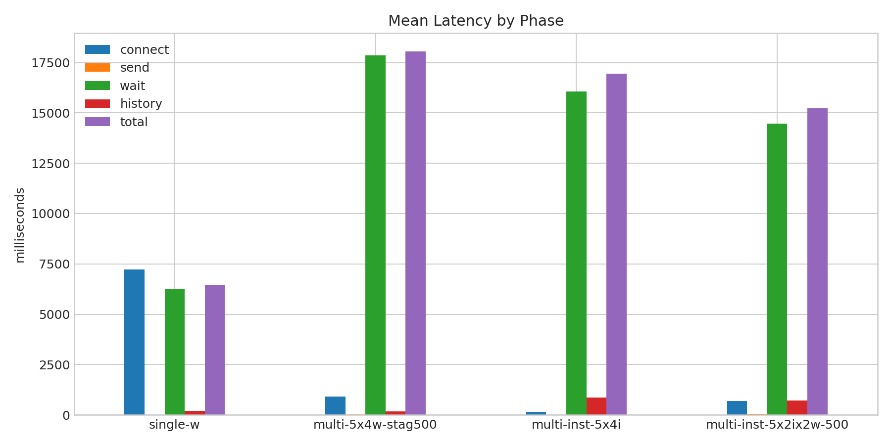
- 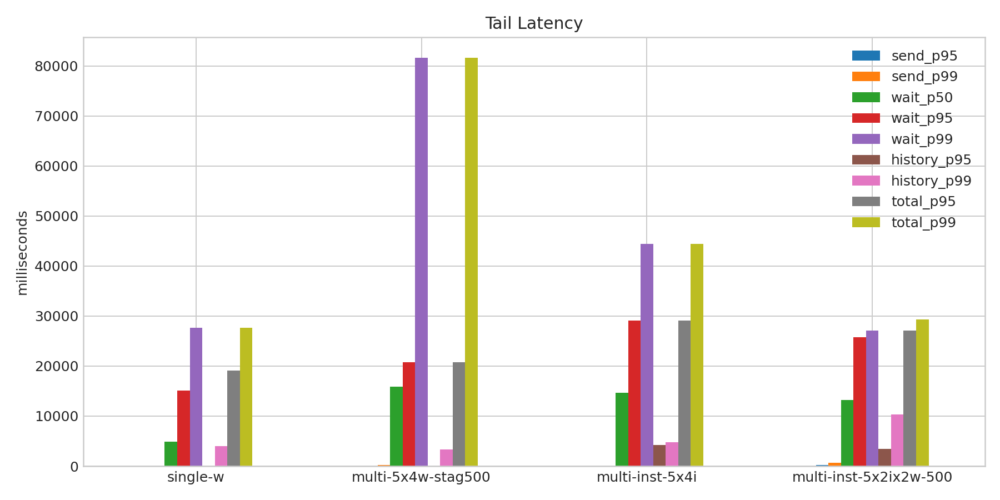
- 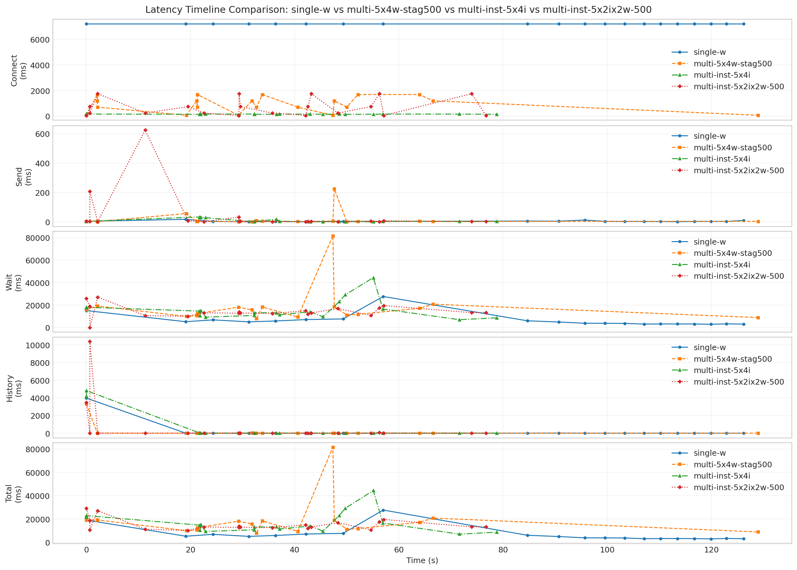
- 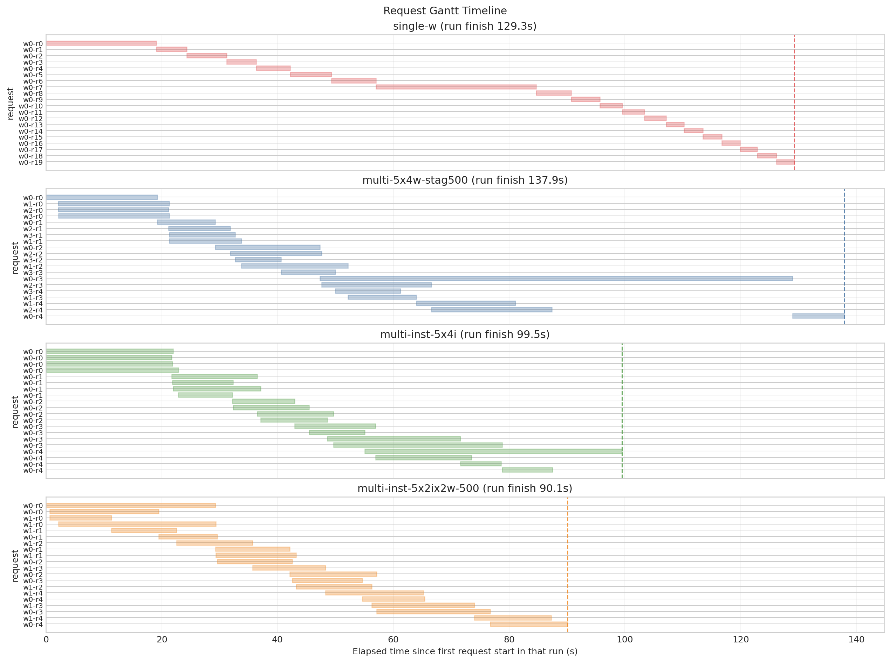
- 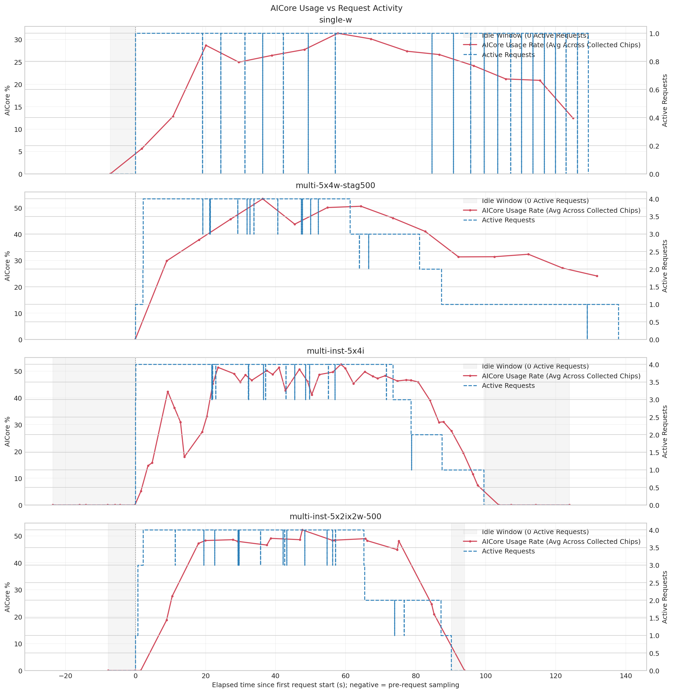
- 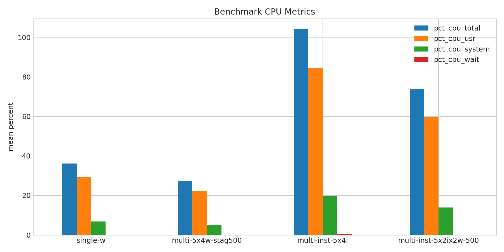
- 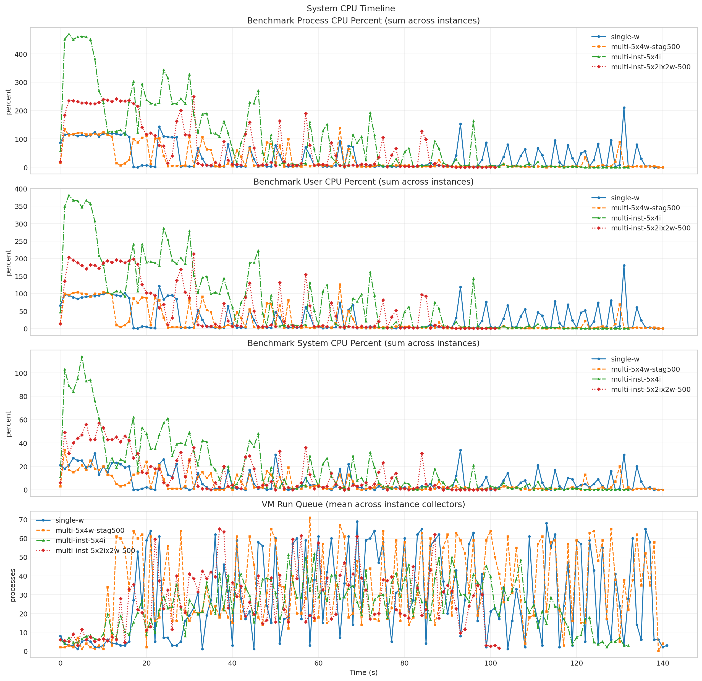
- 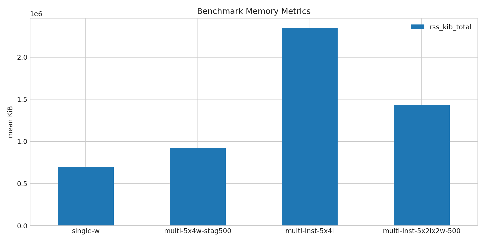
- 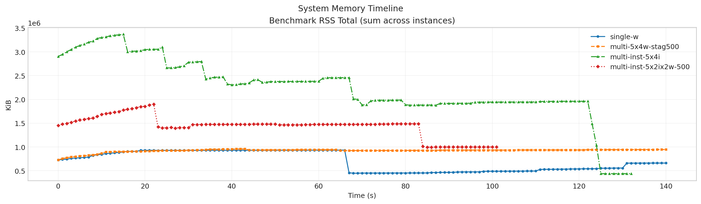
- 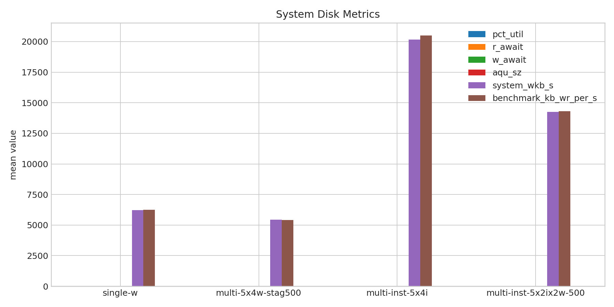
- 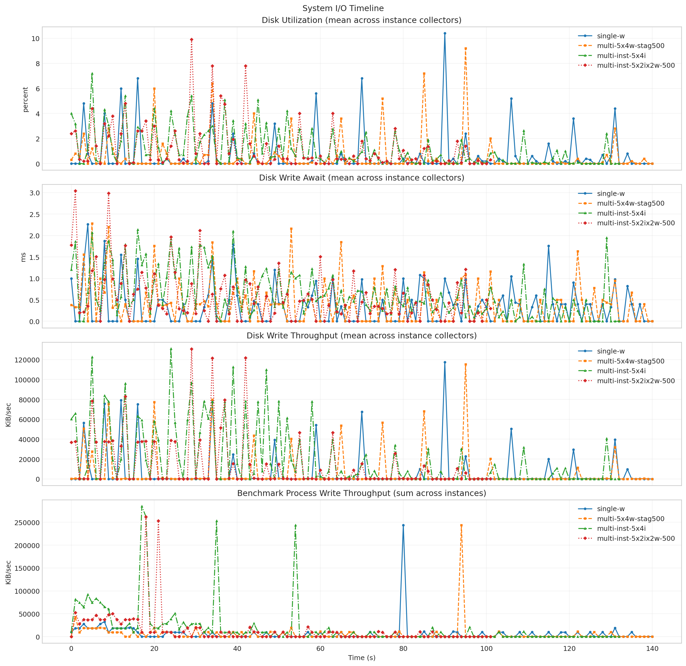
- 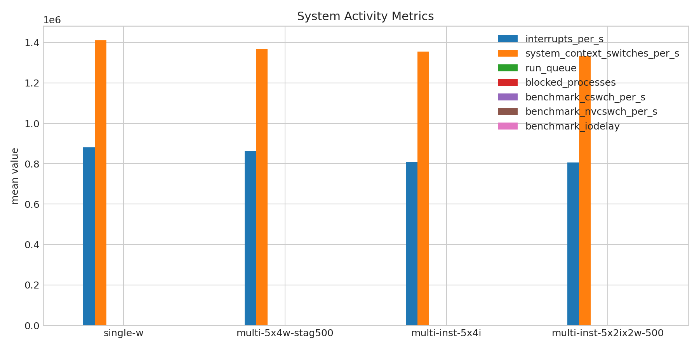
- 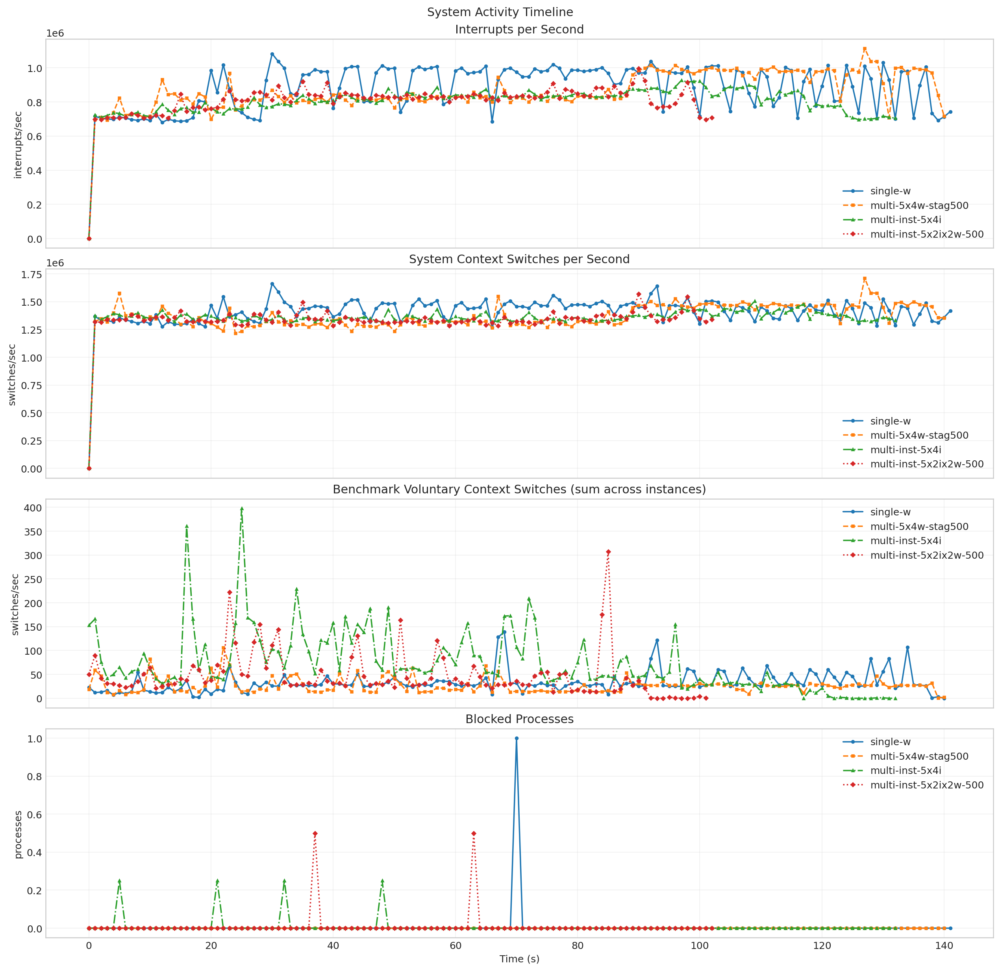
- 
- 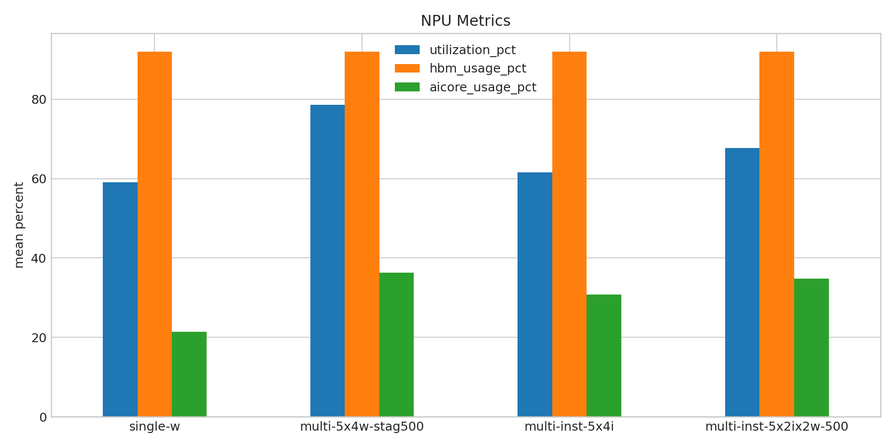
- 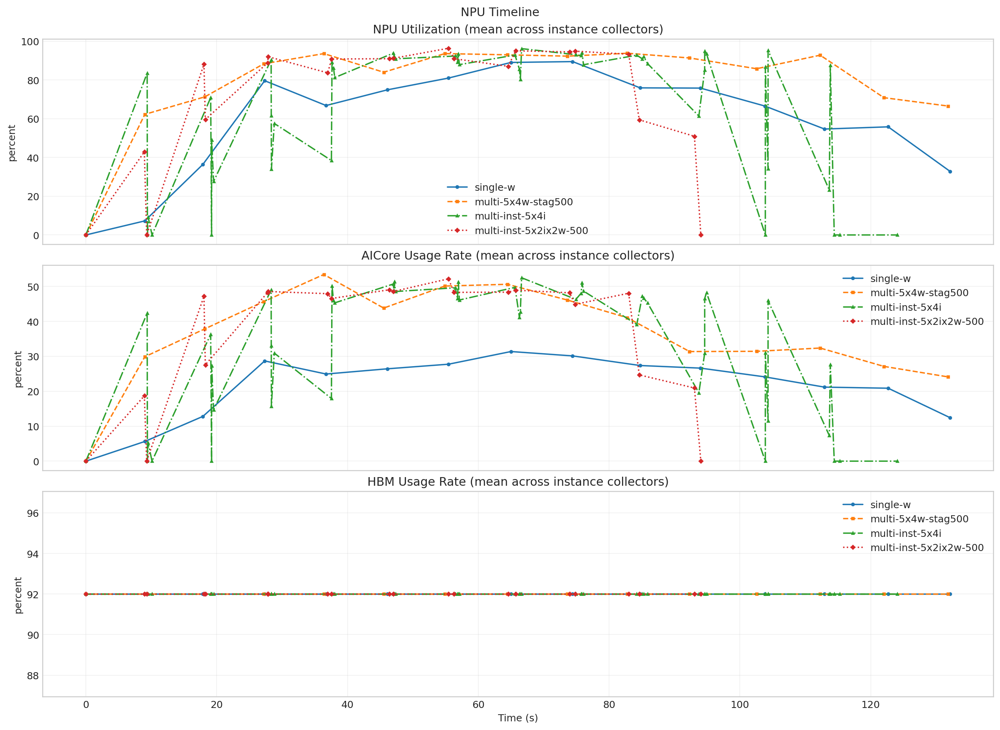

**Run Timing Table**

| scenario | run_dir | run_started_at | run_finished_at | run_wall_clock_sec | first_request_started_at | last_request_finished_at | request_window_sec |
| --- | --- | --- | --- | --- | --- | --- | --- |
| single-w | /root/Zehao/ClawHarness/out/batch_run_3/task-01/20260417T094403Z_vps-docker-qwen3-235b8x2-single-20-worker | 2026-04-17T09:44:12.057519+00:00 | 2026-04-17T09:46:35.017522+00:00 | 142.960 | 2026-04-17T09:44:19.271621+00:00 | 2026-04-17T09:46:28.550811+00:00 | 129.279 |
| multi-5x4w-stag500 | /root/Zehao/ClawHarness/out/batch_run_3/task-01/20260417T095528Z_vps-docker-qwen3-235b8x2-multi-5x4w-stag500-worker | 2026-04-17T09:55:37.130519+00:00 | 2026-04-17T09:58:02.372163+00:00 | 145.242 | 2026-04-17T09:55:37.201684+00:00 | 2026-04-17T09:57:55.071923+00:00 | 137.870 |
| multi-inst-5x4i | /root/Zehao/ClawHarness/out/batch_run_3/task-01/20260417T095921Z_vps-docker-qwen3-235b8x2-single-inst-5x4i-worker | 2026-04-17T09:59:53.069073+00:00 | 2026-04-17T10:02:12.155674+00:00 | 139.087 | 2026-04-17T09:59:53.230402+00:00 | 2026-04-17T10:01:32.701214+00:00 | 99.471 |
| multi-inst-5x2ix2w-500 | /root/Zehao/ClawHarness/out/batch_run_3/task-01/20260417T100858Z_vps-docker-qwen3-235b8x2-multi-inst-5x2ix2w-stag500-worker | 2026-04-17T10:09:14.708357+00:00 | 2026-04-17T10:11:01.096814+00:00 | 106.388 | 2026-04-17T10:09:14.776319+00:00 | 2026-04-17T10:10:44.903638+00:00 | 90.127 |

**Latency Overview Table**

| scenario | total_mean | total_p50 | total_p95 | total_p99 |
| --- | --- | --- | --- | --- |
| single-w | 6463.907 | 4960.111 | 19077.865 | 27671.770 |
| multi-5x4w-stag500 | 18057.520 | 17138.977 | 20794.795 | 81624.964 |
| multi-inst-5x4i | 16953.204 | 14750.209 | 29105.079 | 44384.492 |
| multi-inst-5x2ix2w-500 | 15220.521 | 13250.743 | 27143.663 | 29289.514 |

**Mean Latency by Phase Table**

| scenario | connect | send | wait | history | total |
| --- | --- | --- | --- | --- | --- |
| single-w | 7213.745 | 4.949 | 6251.778 | 207.136 | 6463.907 |
| multi-5x4w-stag500 | 916.172 | 17.353 | 17864.290 | 175.840 | 18057.520 |
| multi-inst-5x4i | 155.630 | 9.290 | 16072.201 | 871.674 | 16953.204 |
| multi-inst-5x2ix2w-500 | 698.846 | 46.316 | 14468.703 | 705.463 | 15220.521 |

**Tail Latency Table**

| scenario | send_p95 | send_p99 | wait_p50 | wait_p95 | wait_p99 | history_p95 | history_p99 | total_p95 | total_p99 |
| --- | --- | --- | --- | --- | --- | --- | --- | --- | --- |
| single-w | 12.813 | 17.486 | 4932.883 | 15093.321 | 27660.346 | 22.146 | 3979.985 | 19077.865 | 27671.770 |
| multi-5x4w-stag500 | 57.318 | 225.306 | 15873.769 | 20784.866 | 81611.582 | 31.986 | 3332.910 | 20794.795 | 81624.964 |
| multi-inst-5x4i | 31.824 | 33.747 | 14677.987 | 29097.284 | 44372.283 | 4190.817 | 4823.283 | 29105.079 | 44384.492 |
| multi-inst-5x2ix2w-500 | 208.830 | 624.851 | 13238.532 | 25805.592 | 27129.037 | 3479.221 | 10387.212 | 27143.663 | 29289.514 |

**System CPU Table**

| scenario | pct_cpu_total | pct_cpu_usr | pct_cpu_system | pct_cpu_wait |
| --- | --- | --- | --- | --- |
| single-w | 36.085 | 29.213 | 6.872 | 0.142 |
| multi-5x4w-stag500 | 27.262 | 22.135 | 5.128 | 0.163 |
| multi-inst-5x4i | 104.186 | 84.647 | 19.539 | 0.271 |
| multi-inst-5x2ix2w-500 | 73.765 | 59.863 | 13.902 | 0.088 |

**System Memory Table**

| scenario | rss_kib_total |
| --- | --- |
| single-w | 698423.830 |
| multi-5x4w-stag500 | 923725.220 |
| multi-inst-5x4i | 2348106.970 |
| multi-inst-5x2ix2w-500 | 1434337.255 |

**System Disk Table**

| scenario | busiest_device | pct_util | r_await | w_await | aqu_sz | system_wkb_s | benchmark_kb_wr_per_s |
| --- | --- | --- | --- | --- | --- | --- | --- |
| single-w | sda | 0.598 | 0.000 | 0.323 | 0.051 | 6219.291 | 6262.610 |
| multi-5x4w-stag500 | sda | 0.513 | 0.000 | 0.370 | 0.054 | 5447.972 | 5420.539 |
| multi-inst-5x4i | sda | 1.133 | 0.016 | 0.646 | 0.362 | 20175.376 | 20503.219 |
| multi-inst-5x2ix2w-500 | sda | 1.185 | 0.000 | 0.564 | 0.155 | 14254.000 | 14321.529 |

**System Activity Table**

| scenario | interrupts_per_s | system_context_switches_per_s | run_queue | blocked_processes | benchmark_cswch_per_s | benchmark_nvcswch_per_s | benchmark_iodelay |
| --- | --- | --- | --- | --- | --- | --- | --- |
| single-w | 881022.000 | 1410798.345 | 28.261 | 0.007 | 32.929 | 68.404 | 0.000 |
| multi-5x4w-stag500 | 864150.319 | 1365902.106 | 33.305 | 0.000 | 26.298 | 57.709 | 0.000 |
| multi-inst-5x4i | 808216.391 | 1355873.085 | 25.125 | 0.008 | 77.919 | 120.578 | 0.000 |
| multi-inst-5x2ix2w-500 | 806590.985 | 1332261.995 | 26.534 | 0.010 | 46.990 | 46.294 | 0.000 |

**Token Throughput Table**

| scenario | rows_with_usage | output_tokens_mean | output_tps_request_mean | output_tps_session_delta_mean |
| --- | --- | --- | --- | --- |
| single-w | 20 | 80.800 | 15.747 | 9.408 |
| multi-5x4w-stag500 | 20 | 118.500 | 8.338 | 4.116 |
| multi-inst-5x4i | 20 | 91.150 | 6.942 | 4.717 |
| multi-inst-5x2ix2w-500 | 20 | 114.150 | 52.806 | 50.616 |

**NPU Table**

| scenario | utilization_pct | hbm_usage_pct | aicore_usage_pct |
| --- | --- | --- | --- |
| single-w | 59.083 | 92.000 | 21.358 |
| multi-5x4w-stag500 | 78.650 | 92.000 | 36.337 |
| multi-inst-5x4i | 61.524 | 92.000 | 30.849 |
| multi-inst-5x2ix2w-500 | 67.756 | 92.000 | 34.861 |

**System Timeline Peaks Table**

| scenario | benchmark_cpu_peak | benchmark_cpu_peak_t_sec | benchmark_rss_peak_kib | benchmark_rss_peak_t_sec | system_disk_pct_util_peak | system_disk_pct_util_peak_t_sec | system_disk_w_await_peak | system_disk_w_await_peak_t_sec | system_interrupts_peak | system_interrupts_peak_t_sec | system_context_switches_peak | system_context_switches_peak_t_sec | system_run_queue_peak | system_run_queue_peak_t_sec | npu_utilization_peak | npu_utilization_peak_t_sec | npu_aicore_peak | npu_aicore_peak_t_sec | npu_hbm_peak | npu_hbm_peak_t_sec |
| --- | --- | --- | --- | --- | --- | --- | --- | --- | --- | --- | --- | --- | --- | --- | --- | --- | --- | --- | --- | --- |
| single-w | 210.000 | 131.000 | 934328.000 | 65.000 | 10.400 | 90.000 | 2.260 | 4.000 | 1082605.000 | 30.000 | 1662831.000 | 30.000 | 69.000 | 69.000 | 89.500 | 74.426 | 31.375 | 64.999 | 92.000 | 0.000 |
| multi-5x4w-stag500 | 139.000 | 65.000 | 958860.000 | 43.000 | 9.200 | 95.000 | 2.280 | 5.000 | 1113503.000 | 127.000 | 1710253.000 | 127.000 | 71.000 | 58.000 | 93.812 | 82.785 | 53.438 | 36.386 | 92.000 | 0.000 |
| multi-inst-5x4i | 470.000 | 2.000 | 3370684.000 | 15.000 | 7.200 | 5.000 | 2.138 | 16.000 | 926861.000 | 97.000 | 1506629.750 | 109.000 | 51.750 | 59.000 | 96.188 | 66.622 | 52.500 | 66.622 | 92.000 | 0.000 |
| multi-inst-5x2ix2w-500 | 249.000 | 31.000 | 1902256.000 | 22.000 | 9.900 | 29.000 | 3.040 | 1.000 | 996503.000 | 90.000 | 1569265.000 | 90.000 | 65.000 | 37.000 | 96.375 | 55.435 | 52.188 | 55.435 | 92.000 | 0.000 |
