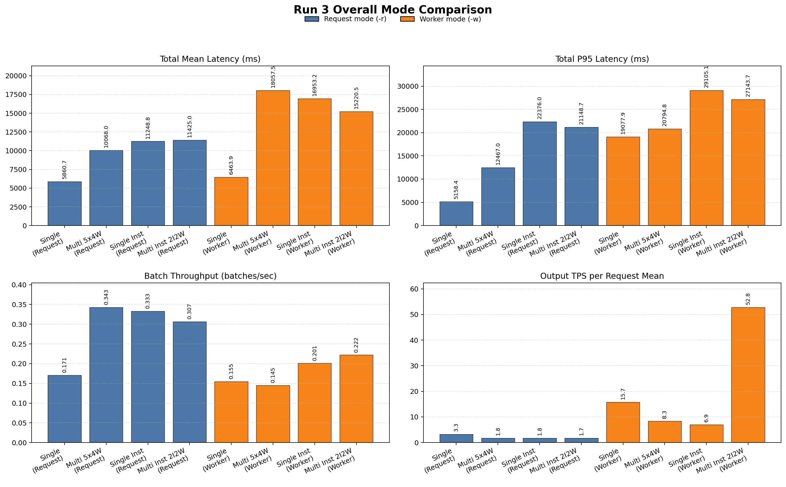
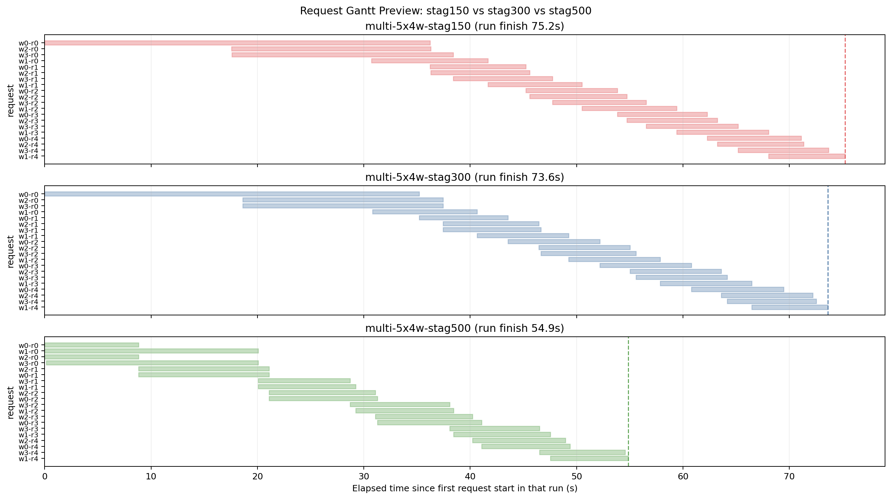
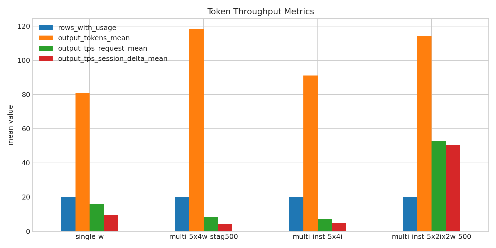
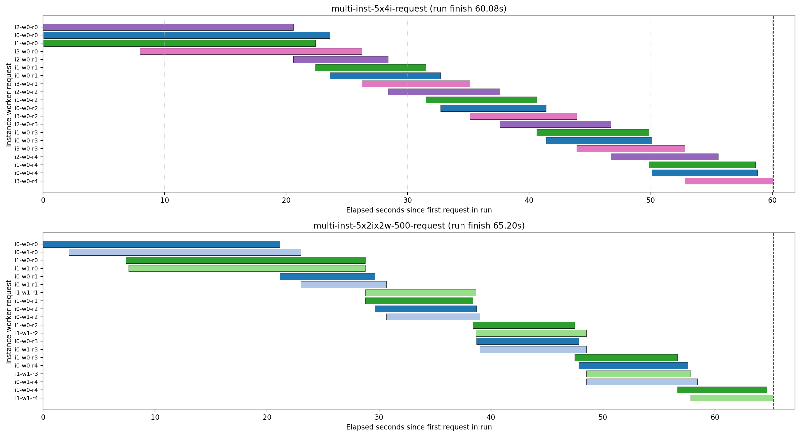
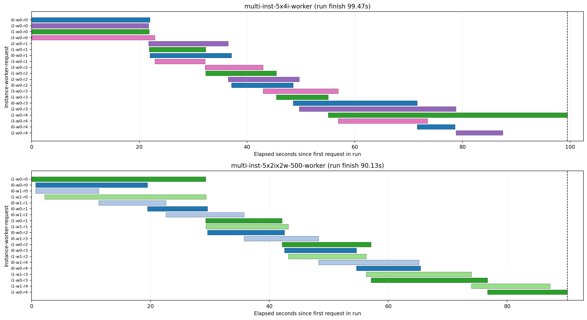

# Run 3 结论

本页汇总 `out/batch_run_3/task-01` 在 `task_01_openclaw_comprehension` 上的对比结果，重点回答三个问题：

1. `per-request` 和 `per-worker` 下各自哪种模式最好。
2. 每种模式的负载形式是什么。
3. 为什么 `multi-5x4w` 在不同 stagger 下会出现明显差异。

补充说明：`out/batch_run_3/task-01` 里还包含 `multi-inst-5x2ix2w-stag300-request` 和 `multi-inst-5x2ix2w-stag300-worker` 两组未导出到现有 `res` 对比页的结果。我额外核对了它们的关键指标：

- `multi-inst-5x2ix2w-stag300-request`: `total_mean = 17558.0ms`，`total_p95 = 63346.0ms`，`request_window = 141.4s`
- `multi-inst-5x2ix2w-stag300-worker`: `total_mean = 15399.8ms`，`total_p95 = 23534.1ms`，`request_window = 108.9s`

它们都没有优于本文选出的最佳方案，所以最终推荐不变。

原始对比报告见：

- [SingleW-SingleQ-SingleInstW-SingleInstReq/summary.md](./SingleW-SingleQ-SingleInstW-SingleInstReq/summary.md)
- [SingleW-Mul5x4w-Single5x4i-Mul5x2ix2w-500-req/summary.md](./SingleW-Mul5x4w-Single5x4i-Mul5x2ix2w-500-req/summary.md)
- [SingleW-Mul5x4w-Single5x4i-Mul5x2ix2w-500-worker/summary.md](./SingleW-Mul5x4w-Single5x4i-Mul5x2ix2w-500-worker/summary.md)
- [Multi-5x4w-Stag150-300-500-request/summary.md](./Multi-5x4w-Stag150-300-500-request/summary.md)
- [Multi-5x4w-Stag150-300-500-worker/summary.md](./Multi-5x4w-Stag150-300-500-worker/summary.md)

## 一页结论

### 结论 1：`per-request` 下，绝对最佳是 `single-r`，并发压测下最佳折中是 `multi-5x4w-stag500-request`

- 如果把用户体感放在第一位，`single-r` 最好：`total_mean = 5860.7ms`，`total_p95 = 5158.4ms`，也是 `per-request` 四种模式里唯一把 `P95` 压到约 `5.2s` 的方案。
- 如果要求 20 个请求更快跑完，而不是只看单请求体感，那么 `multi-5x4w-stag500-request` 更实用：`request_window = 58.3s`，整批吞吐约 `0.343 req/s`，是本轮 `per-request` 并发方案里最快，同时 `total_mean = 10068ms`、`total_p95 = 12467ms` 也明显优于 `single-inst-r` 和 `multi-inst-5x2ix2w-500-r`。
- 因此，`per-request` 可以分成两个判断：
  - 延迟优先：`single-r`
  - 并发吞吐与稳定性折中：`multi-5x4w-stag500-request`

### 结论 2：`per-worker` 下，绝对最佳是 `single-w`，并发压测下最佳折中是 `multi-5x4w-stag300-worker`

- 如果只看用户时延和尾延，`single-w` 最好：`total_mean = 6463.9ms`，`total_p95 = 19077.9ms`，明显好于其他 `worker` 类并发方案。
- 但 `single-w` 只有单 worker 串行，不适合代表高并发 worker 负载。
- 在真正的并发 `per-worker` 方案里，`multi-5x4w-stag300-worker` 最均衡：`total_mean = 11429.2ms`，`total_p95 = 21058.3ms`，整批窗口 `62.8s`，比 `stag150` 和 `stag500` 更稳，也比 `single-inst-w` / `multi-inst-5x2ix2w-500-w` 更低延迟。
- `multi-inst-5x2ix2w-500-worker` 的 `output_tps_request_mean = 52.8` 很高，但它的 `total_mean = 15220.5ms`、`total_p95 = 27143.7ms` 仍然明显更差，且 `worker` 模式下输出 token 数本身变化较大，不能只凭 token 速率判定“用户体验最好”。

### 结论 3：`multi-5x4w` 的 stagger 很关键

- `per-request` 下，`stag500` 明显最佳。`stag150` 和 `stag300` 都出现了更长的首批拖尾，导致 `P95/P99` 更差。
- `per-worker` 下，`stag300` 最稳。`stag150` 有两个超长尾请求把整批拖到 `108.5s`；`stag500` 又因为后半段出现极长尾，把 `P99` 拉到 `81.6s`。
- 说明相同的总并发数下，session 复用与请求节奏的耦合会放大尾部风险，`worker` 模式不能简单照搬 `request` 模式的最佳 stagger。

## 总览图

下图把本次 8 个主模式放在一张图里，对比平均时延、`P95`、整批完成速率和单请求 token 速率。

读图时需要注意两点：

- 蓝色是 `request` 模式，橙色是 `worker` 模式。
- `worker` 模式下 `output_tokens_mean` 明显更高，说明 session 复用后实际生成长度变了，所以 token 速率只能做辅助指标，不能压过时延和尾延。

## 各模式的负载形式

### `per-request` 组

| 模式 | 负载形式 | 解释 |
| --- | --- | --- |
| `single-r` | `1 instance x 1 worker x 20 requests`，`session_mode=per_request` | 单实例、单 worker、20 个串行请求，每个请求新建 session。 |
| `multi-5x4w-stag150/300/500-request` | `1 instance x 4 workers x 5 requests`，`worker_stagger_ms=150/300/500`，`session_mode=per_request` | 单实例 4 路并发，每个 worker 串行做 5 个请求；每个请求都是新 session。 |
| `single-inst-r` | `4 instances x 1 worker x 5 requests`，`session_mode=per_request` | 4 个实例并行，每个实例内部是单 worker 串行，共计 20 请求。 |
| `multi-inst-5x2ix2w-stag300/500-r` | `2 instances x 2 workers x 5 requests`，`worker_stagger_ms=300/500`，`session_mode=per_request` | 2 个实例，每实例 2 路并发 worker，总计 4 条并发 lane。 |

### `per-worker` 组

| 模式 | 负载形式 | 解释 |
| --- | --- | --- |
| `single-w` | `1 instance x 1 worker x 20 requests`，`session_mode=per_worker` | 单 worker 串行复用同一个 session。 |
| `multi-5x4w-stag150/300/500-worker` | `1 instance x 4 workers x 5 requests`，`session_mode=per_worker` | 4 个 worker 各自维护自己的 session，每个 worker 连续发 5 个请求。 |
| `single-inst-w` | `4 instances x 1 worker x 5 requests`，`session_mode=per_worker` | 4 个实例并行，每实例内单 worker 复用自己的 session。 |
| `multi-inst-5x2ix2w-stag300/500-w` | `2 instances x 2 workers x 5 requests`，`worker_stagger_ms=300/500`，`session_mode=per_worker` | 2 个实例、每实例 2 个 worker，各自复用自己的 session。 |

## `per-request` 结果分析

### 综合表

| 模式 | total_mean ms | total_p95 ms | total_p99 ms | request_window s | batch throughput req/s | output_tps_request_mean |
| --- | ---: | ---: | ---: | ---: | ---: | ---: |
| `single-r` | 5860.7 | 5158.4 | 24784.4 | 117.2 | 0.171 | 3.267 |
| `multi-5x4w-stag500-request` | 10068.0 | 12467.0 | 19433.8 | 58.3 | 0.343 | 1.763 |
| `single-inst-r` | 11248.8 | 22376.0 | 23549.8 | 60.1 | 0.333 | 1.760 |
| `multi-inst-5x2ix2w-500-r` | 11425.0 | 21148.7 | 21372.8 | 65.2 | 0.307 | 1.713 |

### 判断

- `single-r` 是最干净的低延迟基线。它没有多 worker 抢占，也没有多实例分流带来的额外系统开销，所以平均值和 `P95` 都是最优。
- `multi-5x4w-stag500-request` 是并发版本里最好的。相比另外两个并发 `request` 方案，它在均值、`P95` 和整批完成时间上同时领先。
- `single-inst-r` 和 `multi-inst-5x2ix2w-500-r` 没有把时延换成更好的吞吐，反而把 CPU、内存、磁盘写入量明显抬高，收益不如单实例 4 worker。

### 为什么 `multi-5x4w-stag500-request` 优于 `stag150/stag300`

`multi-5x4w` 在 `request` 模式下的 stagger 对比如下：

| 模式 | total_mean ms | total_p95 ms | total_p99 ms | request_window s | output_tps_request_mean |
| --- | ---: | ---: | ---: | ---: | ---: |
| `stag150` | 11934.2 | 20542.9 | 26376.0 | 67.3 | 1.584 |
| `stag300` | 12796.8 | 26506.0 | 26514.5 | 66.7 | 1.590 |
| `stag500` | 10068.0 | 12467.0 | 19433.8 | 58.3 | 1.763 |

从请求甘特图可以看出，`stag500` 的负载爬升最平滑，后续请求重叠更均匀，长尾更少：

结论是：在 `per-request` 下，适当拉开 worker 启动间隔可以减少首批请求互相挤压，`500ms` 是这组三档里最好的点。

## `per-worker` 结果分析

### 综合表

| 模式 | total_mean ms | total_p95 ms | total_p99 ms | request_window s | batch throughput req/s | output_tps_request_mean |
| --- | ---: | ---: | ---: | ---: | ---: | ---: |
| `single-w` | 6463.9 | 19077.9 | 27671.8 | 129.3 | 0.155 | 15.747 |
| `multi-5x4w-stag300-worker` | 11429.2 | 21058.3 | 21650.0 | 62.8 | 0.319 | 40.374 |
| `single-inst-w` | 16953.2 | 29105.1 | 44384.5 | 99.5 | 0.201 | 6.942 |
| `multi-inst-5x2ix2w-500-w` | 15220.5 | 27143.7 | 29289.5 | 90.1 | 0.222 | 52.806 |

### 判断

- `single-w` 的绝对延迟最好，但这是最低并发基线，不代表高并发 worker 负载。
- 在真正的并发 `per-worker` 方案里，`multi-5x4w-stag300-worker` 是最平衡的：
  - 均值最低。
  - `P95/P99` 最稳。
  - 整批完成时间也最快。
- `single-inst-w` 和 `multi-inst-5x2ix2w-500-w` 都把系统资源占用明显推高了，但用户时延没有改善，说明实例拆分不是这个 workload 的优先方向。

### 为什么 `multi-5x4w-stag300-worker` 最稳

`multi-5x4w` 在 `worker` 模式下的 stagger 对比如下：

| 模式 | total_mean ms | total_p95 ms | total_p99 ms | request_window s | output_tps_request_mean |
| --- | ---: | ---: | ---: | ---: | ---: |
| `stag150` | 17514.4 | 67009.6 | 70347.3 | 108.5 | 36.226 |
| `stag300` | 11429.2 | 21058.3 | 21650.0 | 62.8 | 40.374 |
| `stag500` | 18057.5 | 20794.8 | 81625.0 | 137.9 | 8.338 |

`stag300` 的请求排布最均匀，没有出现 `stag150` 那种中段两条超长尾，也没有出现 `stag500` 那种后半段单条极长尾把总时长拖到 `137.9s`：

它的尾延也最稳定，尤其是 `P99` 没有像 `stag150`/`stag500` 一样爆掉：

## 两类模式的直接对照

`request` 和 `worker` 的直接对照说明了一个很重要的事实：`worker` 复用 session 之后，输出 token 数和 token 速率会明显升高，但代价是尾延更难控制。

`single` 和 `single-inst` 的端到端延迟对照：

并发主模式在 `worker` 侧的 token 指标对照：

因此在解释 `worker` 模式时，应优先看：

1. `total_mean`
2. `total_p95`
3. `total_p99`
4. `request_window`
5. `output_tps_request_mean`

而不是只看单独的 token 速率峰值。

## 多实例专项对比：`5x4i` vs `5x2ix2w`

这一节只讨论两种多实例方案：

- `5x4i`: `4 instances x 1 worker x 5 requests`
- `5x2ix2w`: `2 instances x 2 workers x 5 requests`

二者总请求数都为 20，但并发组织方式不同：

- `5x4i` 是把 20 个请求拆成 4 条独立串行 lane，每个实例内部没有 worker 竞争。
- `5x2ix2w` 是把 20 个请求拆成 2 个实例，每个实例内部有 2 条 worker lane 同时推进。

核心区别不是“总并发数”，而是“实例间分摊”与“实例内竞争”的比例。

### `per-request` 下的多实例对比

| 模式 | total_mean ms | total_p95 ms | total_p99 ms | request_window s | batch throughput req/s | connect mean ms | wait mean ms | history mean ms |
| --- | ---: | ---: | ---: | ---: | ---: | ---: | ---: | ---: |
| `multi-inst-5x4i-request` | 11248.8 | 22376.0 | 23549.8 | 60.1 | 0.333 | 2124.4 | 10352.4 | 885.8 |
| `multi-inst-5x2ix2w-500-request` | 11425.0 | 21148.7 | 21372.8 | 65.2 | 0.307 | 4147.4 | 10844.5 | 571.6 |

结论：`per-request` 下两者整体接近，但 `5x4i` 略优。

- `5x4i` 的整批完成更快：`60.1s` 对 `65.2s`。
- `5x4i` 的平均时延也略低：`11.25s` 对 `11.43s`。
- `5x2ix2w` 的 `P95/P99` 略好，但差距不大，且它的 `connect` 开销明显更重，说明实例内双 worker 并发没有换来更好的总体验。

专项甘特图如下：

从甘特图看，二者形态差异很明确：

- `5x4i-request` 是 4 条非常清晰的串行 lane。每个实例各做 5 个请求，lane 内几乎没有额外扰动，所以整体节奏比较规则。
- `5x2ix2w-500-request` 是 2 个实例、每实例 2 条 lane 的交错结构。图上能看到每个实例内部两条 worker lane 在同一时间段重叠推进，首批请求更长，后续也更容易出现局部堆叠。
- 这解释了为什么 `5x2ix2w-request` 的 `connect mean` 更高，整批完成也更慢一些：实例数更少意味着每个实例内部承担了更多并发竞争。

所以在 `per-request` 下，多实例如果只在 `5x4i` 和 `5x2ix2w` 二选一，优先级应为：

1. `5x4i-request`
2. `5x2ix2w-request`

### `per-worker` 下的多实例对比

| 模式 | total_mean ms | total_p95 ms | total_p99 ms | request_window s | batch throughput req/s | wait mean ms | history mean ms | output_tps_request_mean |
| --- | ---: | ---: | ---: | ---: | ---: | ---: | ---: | ---: |
| `multi-inst-5x4i-worker` | 16953.2 | 29105.1 | 44384.5 | 99.5 | 0.201 | 16072.2 | 871.7 | 6.942 |
| `multi-inst-5x2ix2w-500-worker` | 15220.5 | 27143.7 | 29289.5 | 90.1 | 0.222 | 14468.7 | 705.5 | 52.806 |

结论：`per-worker` 下反过来是 `5x2ix2w` 明显更好。

- `5x2ix2w-worker` 的平均时延更低：`15.22s` 对 `16.95s`。
- `5x2ix2w-worker` 的 `P95/P99` 更低，尤其 `P99` 从 `44.38s` 降到 `29.29s`，改善非常明显。
- `5x2ix2w-worker` 的整批完成时间也更短：`90.1s` 对 `99.5s`。

专项甘特图如下：

从甘特图看，差异比 `per-request` 更明显：

- `5x4i-worker` 中 4 条 lane 虽然早期推进整齐，但后半段出现了非常突出的单 lane 长尾，尤其某个实例在第 4 个请求附近拖到了接近整批结束。这直接把 `run finish` 拉到 `99.5s`，也是 `P99` 爆高的主要原因。
- `5x2ix2w-worker` 虽然每个实例内部有双 worker 交叠，但整体分布更均匀，没有 `5x4i-worker` 那种“单实例单 lane 独自拖很久”的尾部结构。
- 换句话说，在 `per-worker` 下，复用 session 之后，单实例只挂 1 个 worker 的 `5x4i` 更容易把偶发长尾完整保留在单 lane 上；而 `5x2ix2w` 的双 lane 结构反而更容易把长尾摊薄。

所以在 `per-worker` 下，多实例如果只在 `5x4i` 和 `5x2ix2w` 二选一，优先级应为：

1. `5x2ix2w-worker`
2. `5x4i-worker`

### 多实例专项总结

把两侧放在一起看，可以得到一个比较稳定的判断：

- `per-request`: 更偏向 `5x4i`
- `per-worker`: 更偏向 `5x2ix2w`

原因在于 session 语义不同：

- `per-request` 每个请求都是新 session，此时减少实例内竞争更重要，所以 `4 instance x 1 worker` 更自然。
- `per-worker` 每个 worker 复用一个 session，此时单 lane 的偶发长尾会被保留并持续放大，因此 `2 instance x 2 worker` 反而更能摊平尾部风险。

## 最终建议

### 如果目标是最低用户时延

- `per-request` 选 `single-r`
- `per-worker` 选 `single-w`

### 如果目标是更贴近并发线上负载的折中方案

- `per-request` 选 `multi-5x4w-stag500-request`
- `per-worker` 选 `multi-5x4w-stag300-worker`

### 如果后续只保留两条推荐配置

- 低延迟基线：`single-r`
- 并发压测主配置：`multi-5x4w-stag500-request`

原因很简单：本轮结果里，多实例方案没有显著改善用户时延，`worker` 复用又会把尾延放大；最稳的主线仍然是 `per-request`，而且单实例 4 worker + `500ms` stagger 的性价比最高。