## `multi-5x4w-stag150` vs `multi-5x4w-stag300` vs `multi-5x4w-stag500`

**Run Dirs**

| scenario | run_dir | instance_num | requests_total | requests_ok | requests_failed |
| --- | --- | --- | --- | --- | --- |
| multi-5x4w-stag150 | /root/Zehao/ClawHarness/out/batch_run_4/task-01/20260417T135108Z_vps-docker-qwen3-235b8x2-multi-5x4w-stag150-request | 1 | 20 | 20 | 0 |
| multi-5x4w-stag300 | /root/Zehao/ClawHarness/out/batch_run_4/task-01/20260417T135318Z_vps-docker-qwen3-235b8x2-multi-5x4w-stag300-request | 1 | 20 | 20 | 0 |
| multi-5x4w-stag500 | /root/Zehao/ClawHarness/out/batch_run_4/task-01/20260417T135537Z_vps-docker-qwen3-235b8x2-multi-5x4w-stag500-request | 1 | 20 | 20 | 0 |

**Aggregation Policy**

- `pidstat` per-process metrics are summed across instances.
- `iostat` and `vmstat` host-wide metrics are averaged across instance collectors.
- This makes multi-instance runs comparable with single-instance runs at the whole-machine level.

**Figures**

- 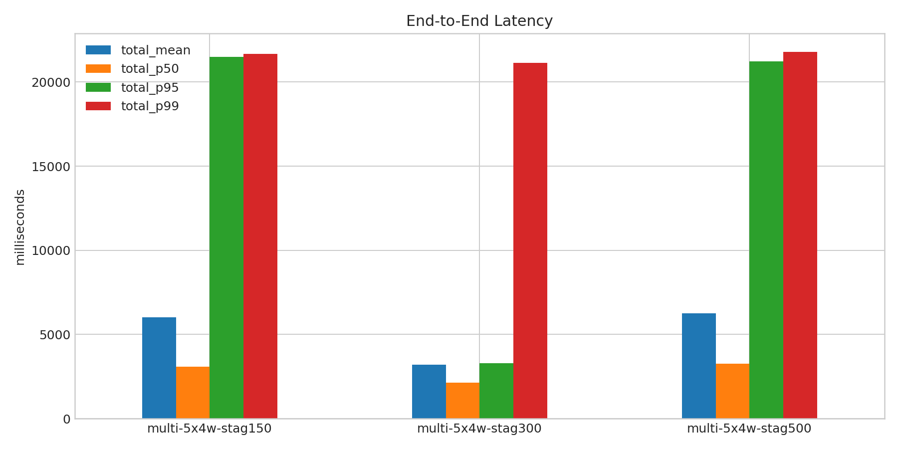
- 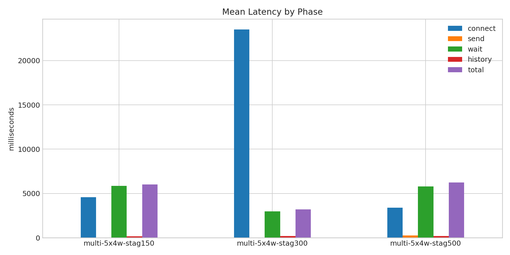
- 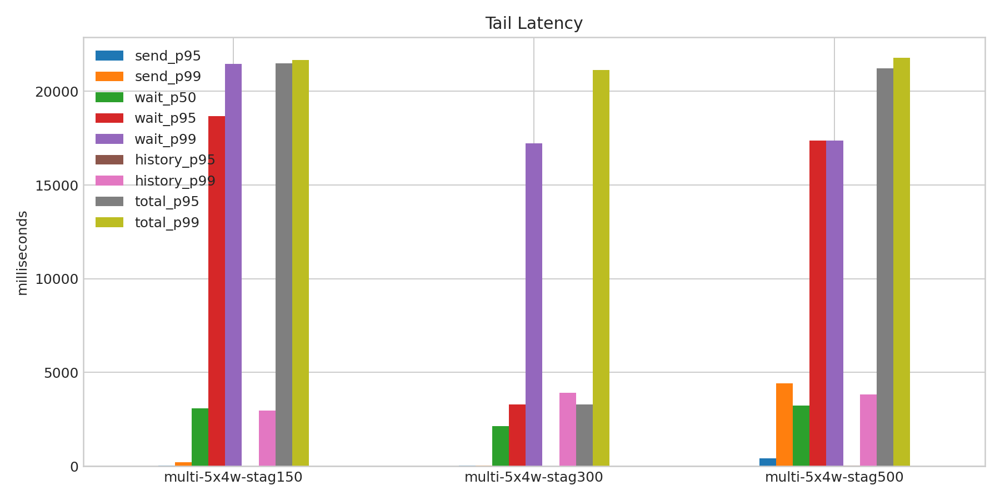
- 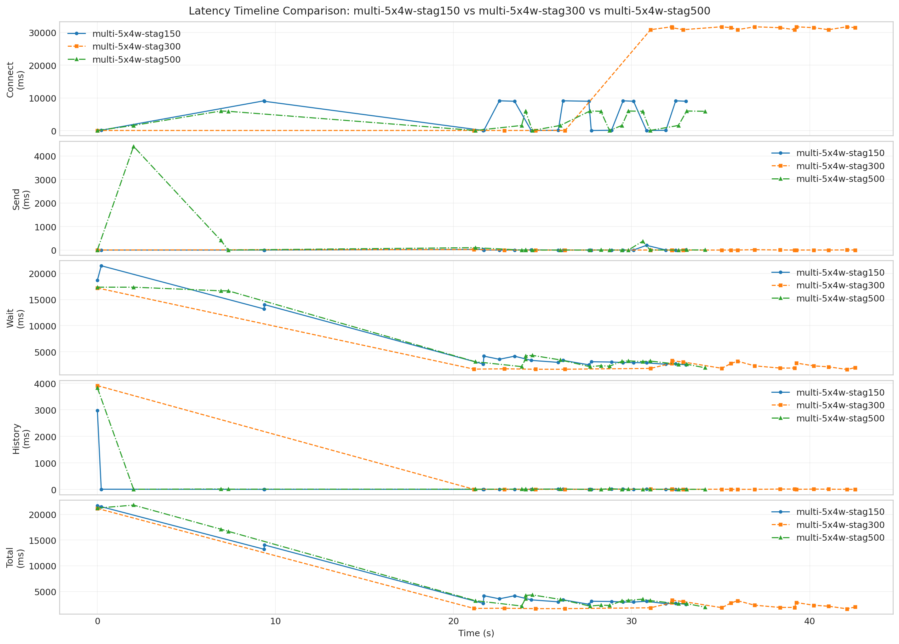
- 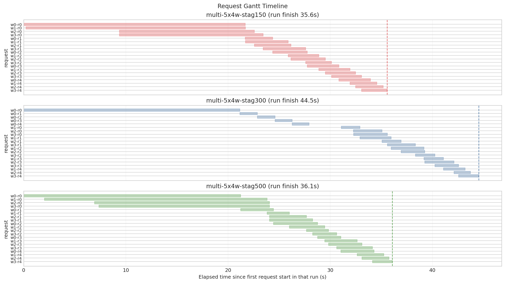
- 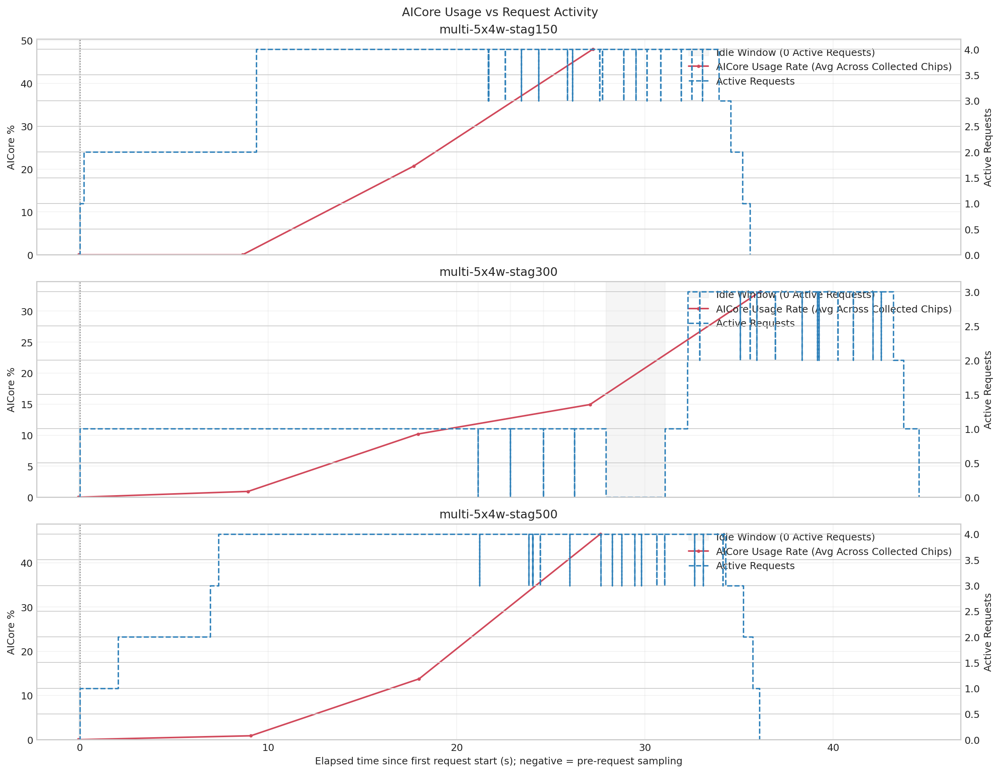
- 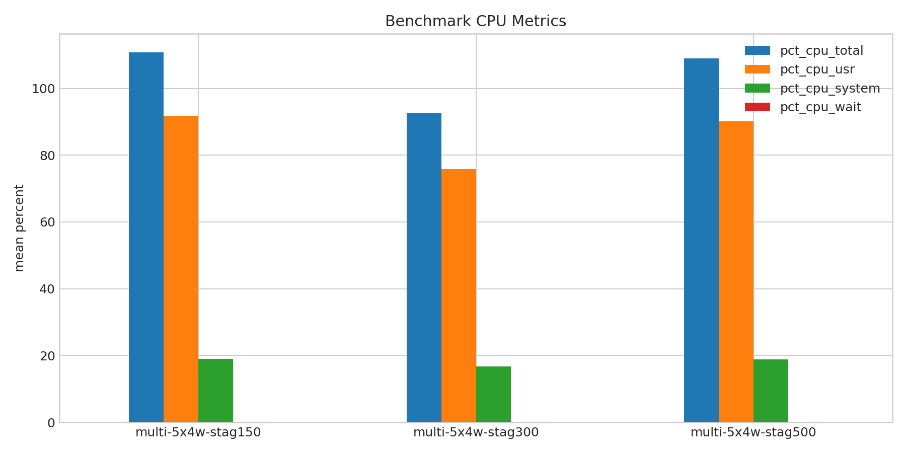
- 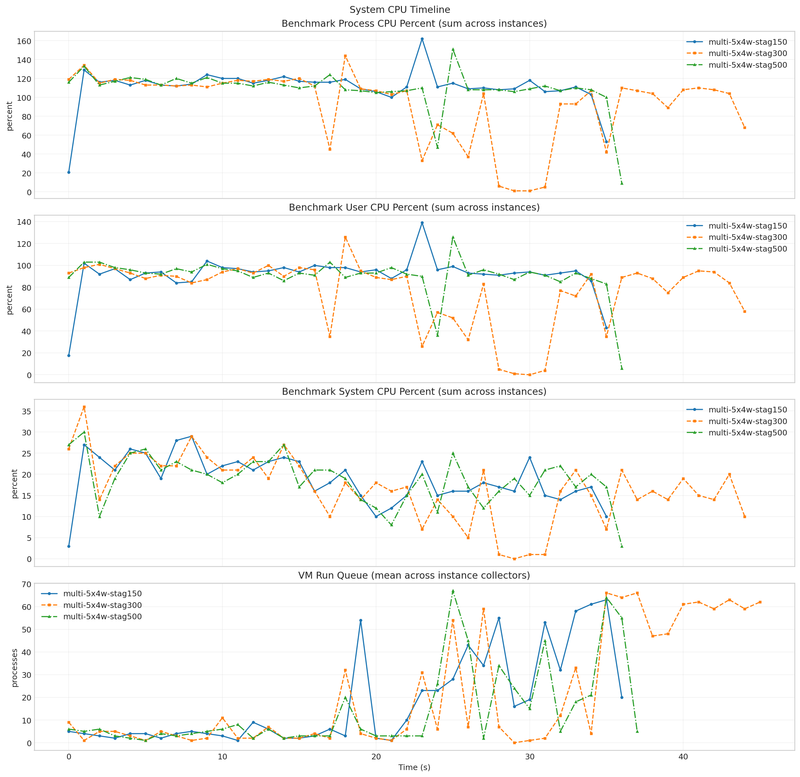
- 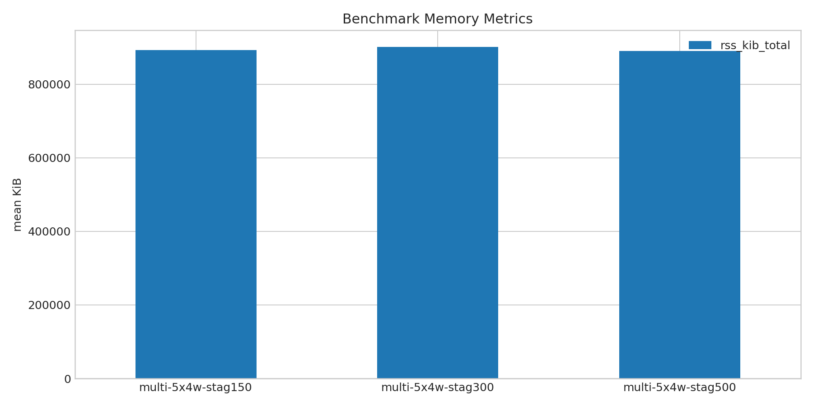
- 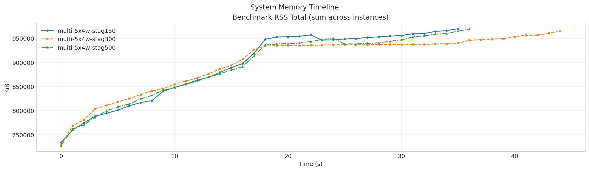
- 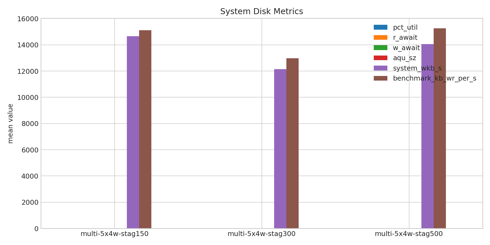
- 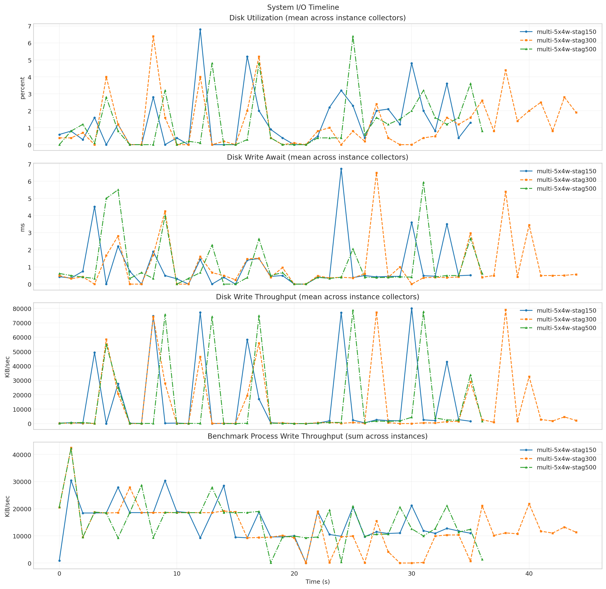
- 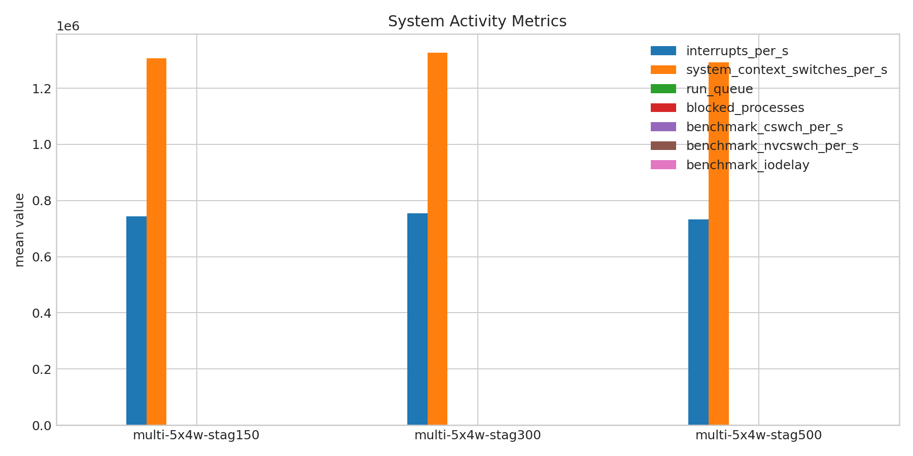
- 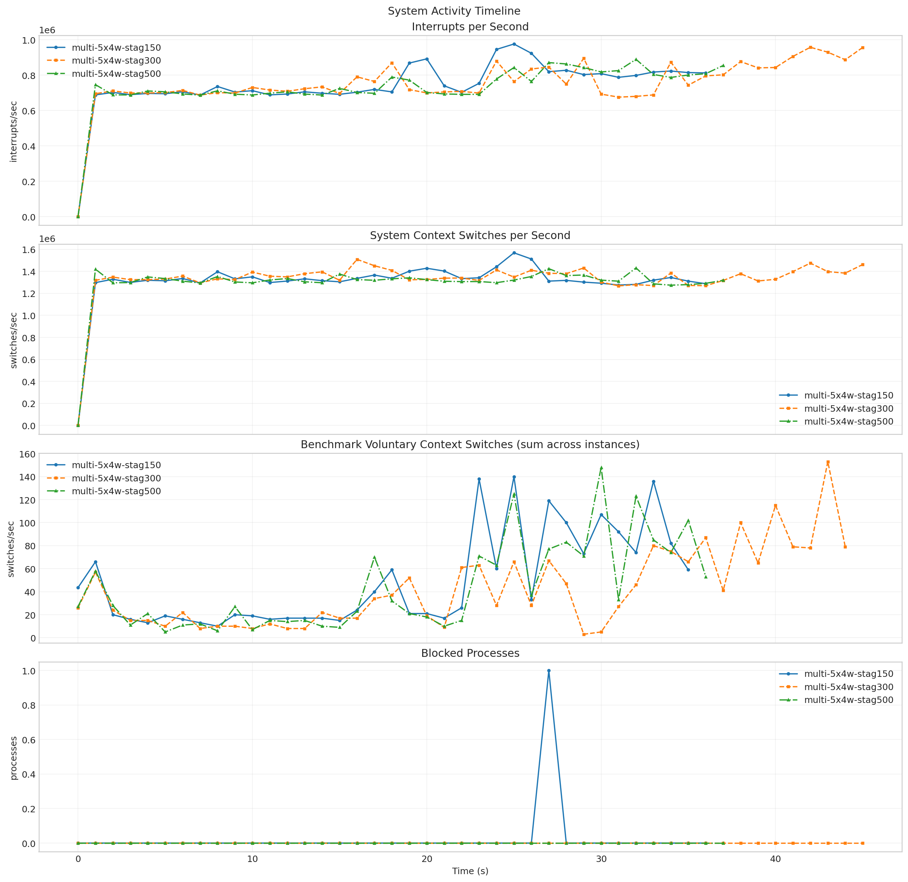
- 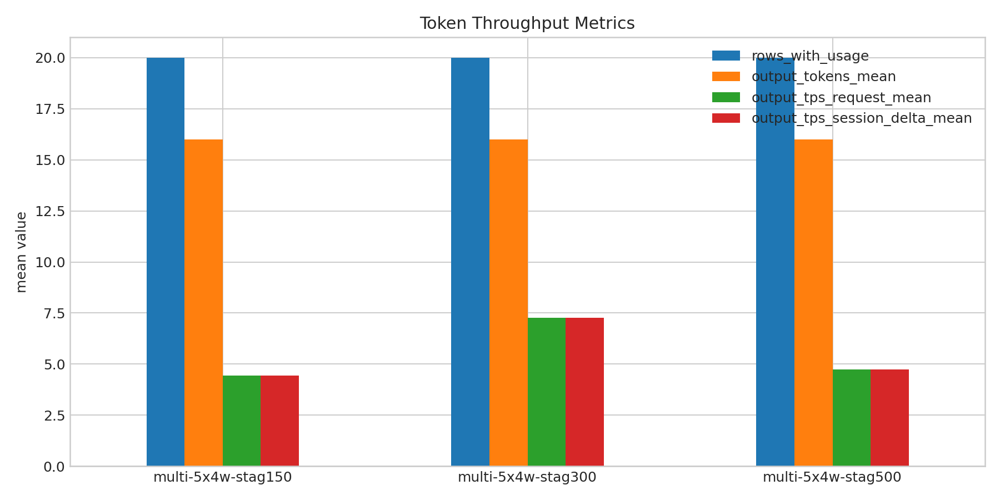
- 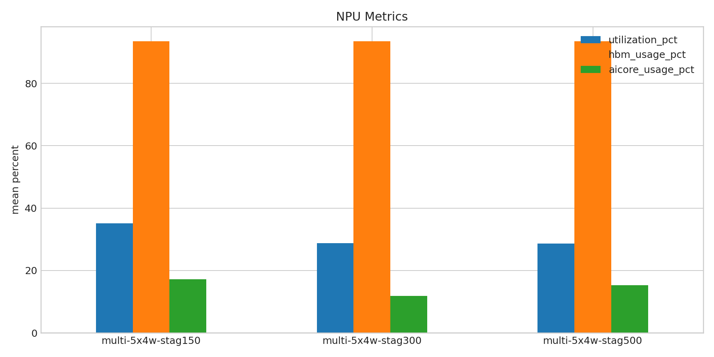
- 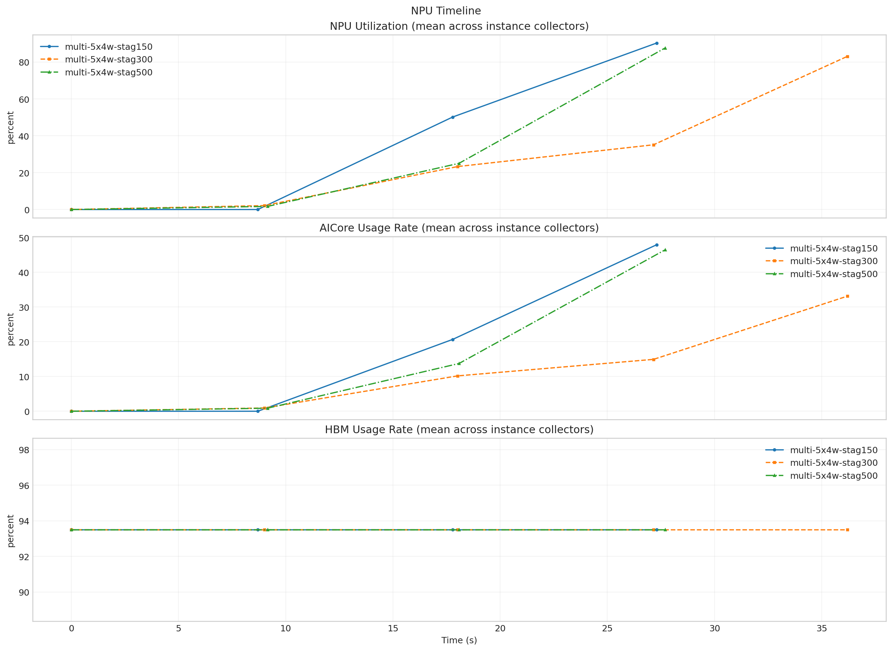

**Run Timing Table**

| scenario | run_dir | run_started_at | run_finished_at | run_wall_clock_sec | first_request_started_at | last_request_finished_at | request_window_sec |
| --- | --- | --- | --- | --- | --- | --- | --- |
| multi-5x4w-stag150 | /root/Zehao/ClawHarness/out/batch_run_4/task-01/20260417T135108Z_vps-docker-qwen3-235b8x2-multi-5x4w-stag150-request | 2026-04-17T13:51:16.493644+00:00 | 2026-04-17T13:52:00.757676+00:00 | 44.264 | 2026-04-17T13:51:16.558219+00:00 | 2026-04-17T13:51:52.127874+00:00 | 35.570 |
| multi-5x4w-stag300 | /root/Zehao/ClawHarness/out/batch_run_4/task-01/20260417T135318Z_vps-docker-qwen3-235b8x2-multi-5x4w-stag300-request | 2026-04-17T13:53:25.652973+00:00 | 2026-04-17T13:54:18.561406+00:00 | 52.908 | 2026-04-17T13:53:25.722408+00:00 | 2026-04-17T13:54:10.262434+00:00 | 44.540 |
| multi-5x4w-stag500 | /root/Zehao/ClawHarness/out/batch_run_4/task-01/20260417T135537Z_vps-docker-qwen3-235b8x2-multi-5x4w-stag500-request | 2026-04-17T13:55:44.330650+00:00 | 2026-04-17T13:56:28.199288+00:00 | 43.869 | 2026-04-17T13:55:44.402296+00:00 | 2026-04-17T13:56:20.479295+00:00 | 36.077 |

**Latency Overview Table**

| scenario | total_mean | total_p50 | total_p95 | total_p99 |
| --- | --- | --- | --- | --- |
| multi-5x4w-stag150 | 6013.654 | 3098.864 | 21487.595 | 21670.827 |
| multi-5x4w-stag300 | 3189.655 | 2133.527 | 3306.148 | 21145.874 |
| multi-5x4w-stag500 | 6249.994 | 3272.718 | 21220.160 | 21792.138 |

**Mean Latency by Phase Table**

| scenario | connect | send | wait | history | total |
| --- | --- | --- | --- | --- | --- |
| multi-5x4w-stag150 | 4577.452 | 14.532 | 5842.571 | 156.511 | 6013.654 |
| multi-5x4w-stag300 | 23516.871 | 4.551 | 2982.032 | 203.032 | 3189.655 |
| multi-5x4w-stag500 | 3400.160 | 268.155 | 5780.848 | 200.956 | 6249.994 |

**Tail Latency Table**

| scenario | send_p95 | send_p99 | wait_p50 | wait_p95 | wait_p99 | history_p95 | history_p99 | total_p95 | total_p99 |
| --- | --- | --- | --- | --- | --- | --- | --- | --- | --- |
| multi-5x4w-stag150 | 30.207 | 201.566 | 3089.196 | 18691.624 | 21477.083 | 15.525 | 2974.789 | 21487.595 | 21670.827 |
| multi-5x4w-stag300 | 18.684 | 24.810 | 2121.413 | 3293.714 | 17226.913 | 14.767 | 3914.796 | 3306.148 | 21145.874 |
| multi-5x4w-stag500 | 413.900 | 4409.743 | 3227.596 | 17373.795 | 17380.856 | 26.197 | 3835.357 | 21220.160 | 21792.138 |

**System CPU Table**

| scenario | pct_cpu_total | pct_cpu_usr | pct_cpu_system | pct_cpu_wait |
| --- | --- | --- | --- | --- |
| multi-5x4w-stag150 | 110.800 | 91.856 | 18.944 | 0.167 |
| multi-5x4w-stag300 | 92.511 | 75.844 | 16.667 | 0.111 |
| multi-5x4w-stag500 | 108.946 | 90.162 | 18.784 | 0.108 |

**System Memory Table**

| scenario | rss_kib_total |
| --- | --- |
| multi-5x4w-stag150 | 893093.000 |
| multi-5x4w-stag300 | 901634.311 |
| multi-5x4w-stag500 | 890973.730 |

**System Disk Table**

| scenario | busiest_device | pct_util | r_await | w_await | aqu_sz | system_wkb_s | benchmark_kb_wr_per_s |
| --- | --- | --- | --- | --- | --- | --- | --- |
| multi-5x4w-stag150 | sda | 1.383 | 0.000 | 1.004 | 0.234 | 14669.667 | 15109.297 |
| multi-5x4w-stag300 | sda | 1.260 | 0.000 | 1.020 | 0.200 | 12141.067 | 12974.844 |
| multi-5x4w-stag500 | sda | 1.243 | 0.000 | 1.107 | 0.242 | 14063.568 | 15262.811 |

**System Activity Table**

| scenario | interrupts_per_s | system_context_switches_per_s | run_queue | blocked_processes | benchmark_cswch_per_s | benchmark_nvcswch_per_s | benchmark_iodelay |
| --- | --- | --- | --- | --- | --- | --- | --- |
| multi-5x4w-stag150 | 744389.946 | 1306381.676 | 18.027 | 0.027 | 48.849 | 91.777 | 0.000 |
| multi-5x4w-stag300 | 754174.413 | 1326418.522 | 21.413 | 0.000 | 42.200 | 58.422 | 0.000 |
| multi-5x4w-stag500 | 731952.526 | 1291726.316 | 14.105 | 0.000 | 43.514 | 65.081 | 0.000 |

**Token Throughput Table**

| scenario | rows_with_usage | output_tokens_mean | output_tps_request_mean | output_tps_session_delta_mean |
| --- | --- | --- | --- | --- |
| multi-5x4w-stag150 | 20 | 16.000 | 4.440 | 4.440 |
| multi-5x4w-stag300 | 20 | 16.000 | 7.257 | 7.257 |
| multi-5x4w-stag500 | 20 | 16.000 | 4.744 | 4.744 |

**NPU Table**

| scenario | utilization_pct | hbm_usage_pct | aicore_usage_pct |
| --- | --- | --- | --- |
| multi-5x4w-stag150 | 35.125 | 93.500 | 17.156 |
| multi-5x4w-stag300 | 28.725 | 93.500 | 11.838 |
| multi-5x4w-stag500 | 28.609 | 93.500 | 15.281 |

**System Timeline Peaks Table**

| scenario | benchmark_cpu_peak | benchmark_cpu_peak_t_sec | benchmark_rss_peak_kib | benchmark_rss_peak_t_sec | system_disk_pct_util_peak | system_disk_pct_util_peak_t_sec | system_disk_w_await_peak | system_disk_w_await_peak_t_sec | system_interrupts_peak | system_interrupts_peak_t_sec | system_context_switches_peak | system_context_switches_peak_t_sec | system_run_queue_peak | system_run_queue_peak_t_sec | npu_utilization_peak | npu_utilization_peak_t_sec | npu_aicore_peak | npu_aicore_peak_t_sec | npu_hbm_peak | npu_hbm_peak_t_sec |
| --- | --- | --- | --- | --- | --- | --- | --- | --- | --- | --- | --- | --- | --- | --- | --- | --- | --- | --- | --- | --- |
| multi-5x4w-stag150 | 162.000 | 23.000 | 969872.000 | 35.000 | 6.800 | 12.000 | 6.720 | 24.000 | 976196.000 | 25.000 | 1568066.000 | 25.000 | 63.000 | 35.000 | 90.312 | 27.298 | 47.938 | 27.298 | 93.500 | 0.000 |
| multi-5x4w-stag300 | 144.000 | 18.000 | 964636.000 | 44.000 | 6.400 | 8.000 | 6.490 | 27.000 | 957741.000 | 42.000 | 1508868.000 | 16.000 | 66.000 | 35.000 | 83.062 | 36.189 | 33.125 | 36.189 | 93.500 | 0.000 |
| multi-5x4w-stag500 | 151.000 | 25.000 | 968888.000 | 36.000 | 6.400 | 25.000 | 5.940 | 31.000 | 889589.000 | 32.000 | 1430881.000 | 32.000 | 67.000 | 25.000 | 87.688 | 27.701 | 46.500 | 27.701 | 93.500 | 0.000 |
