## `multi-5x4w-stag150` vs `multi-5x4w-stag300` vs `multi-5x4w-stag500`

**Run Dirs**

| scenario | run_dir | instance_num | requests_total | requests_ok | requests_failed |
| --- | --- | --- | --- | --- | --- |
| multi-5x4w-stag150 | /root/Zehao/ClawHarness/out/batch_run_4/task-01/20260417T134948Z_vps-docker-qwen3-235b8x2-multi-5x4w-stag150-worker | 1 | 20 | 20 | 0 |
| multi-5x4w-stag300 | /root/Zehao/ClawHarness/out/batch_run_4/task-01/20260417T135200Z_vps-docker-qwen3-235b8x2-multi-5x4w-stag300-worker | 1 | 20 | 20 | 0 |
| multi-5x4w-stag500 | /root/Zehao/ClawHarness/out/batch_run_4/task-01/20260417T135418Z_vps-docker-qwen3-235b8x2-multi-5x4w-stag500-worker | 1 | 20 | 20 | 0 |

**Aggregation Policy**

- `pidstat` per-process metrics are summed across instances.
- `iostat` and `vmstat` host-wide metrics are averaged across instance collectors.
- This makes multi-instance runs comparable with single-instance runs at the whole-machine level.

**Figures**

- 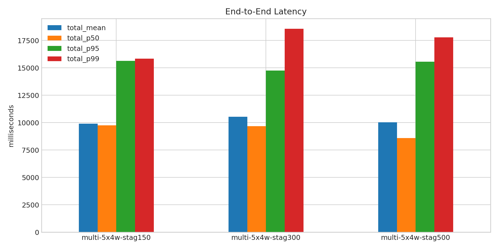
- 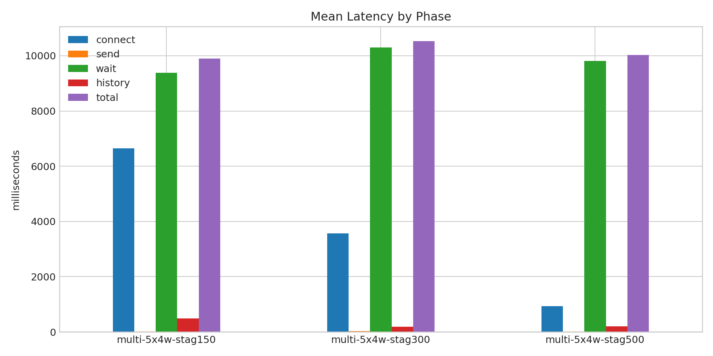
- 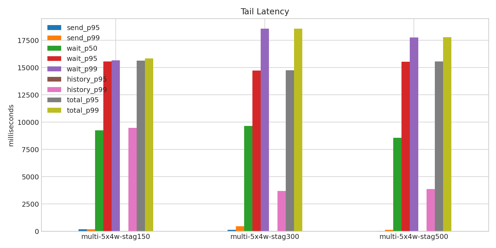
- 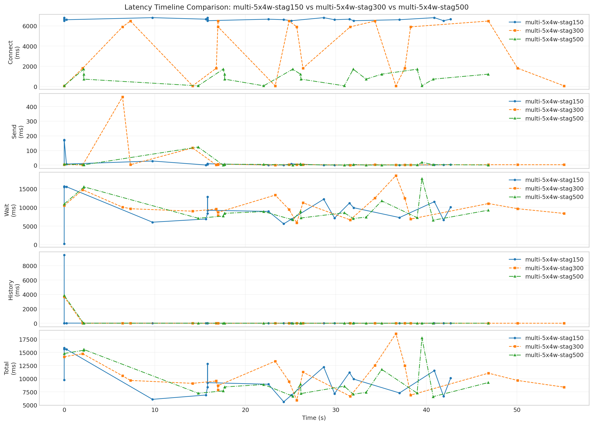
- 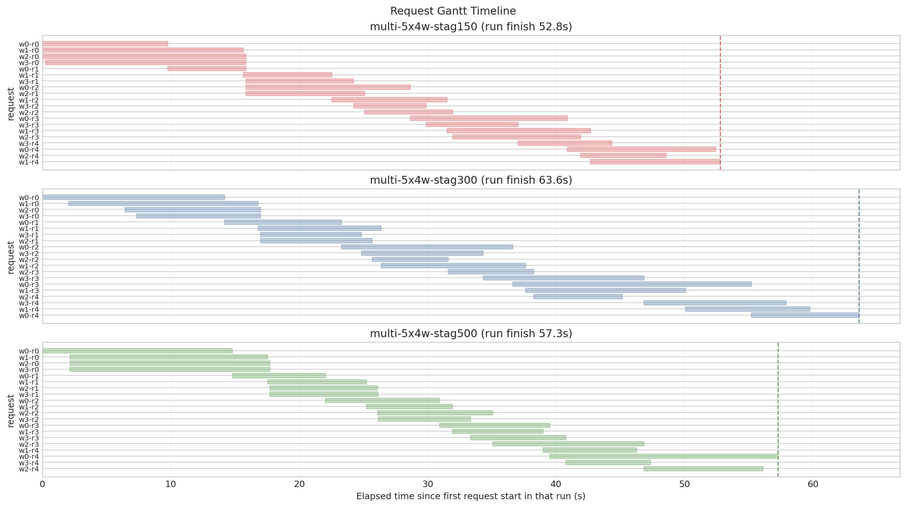
- 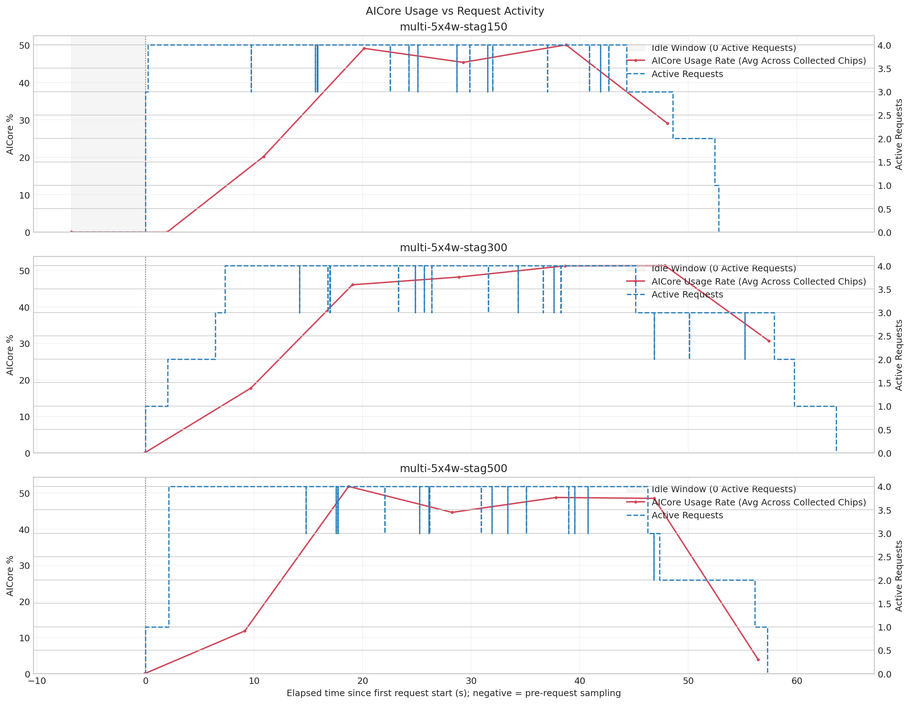
- 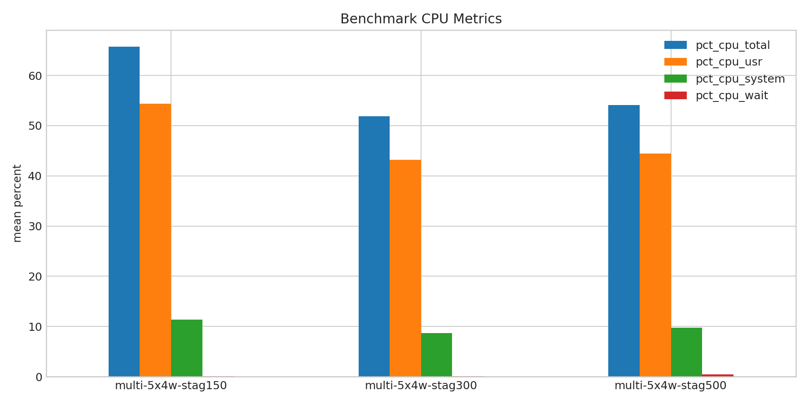
- 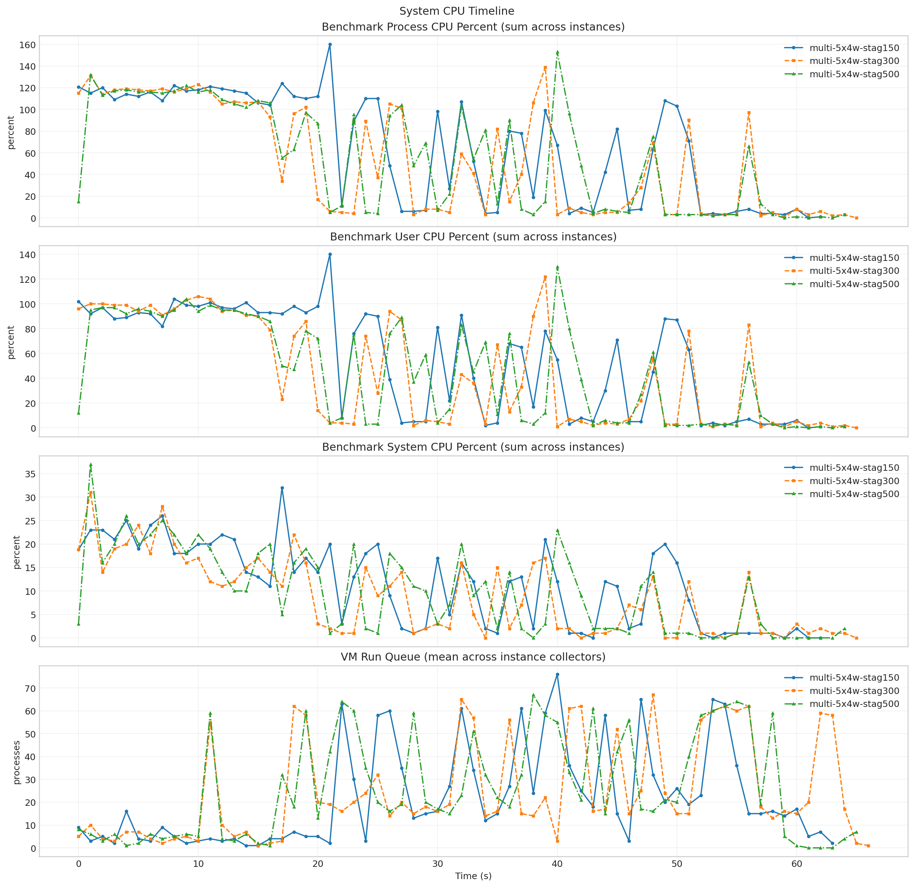
- 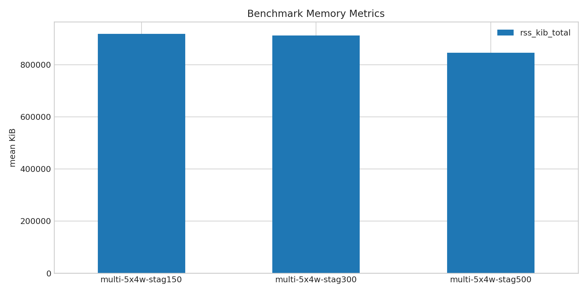
- 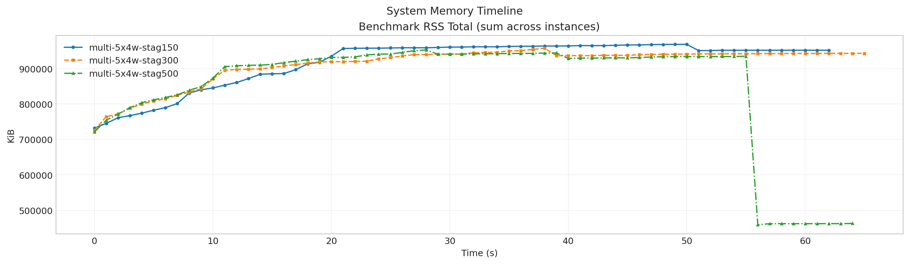
- 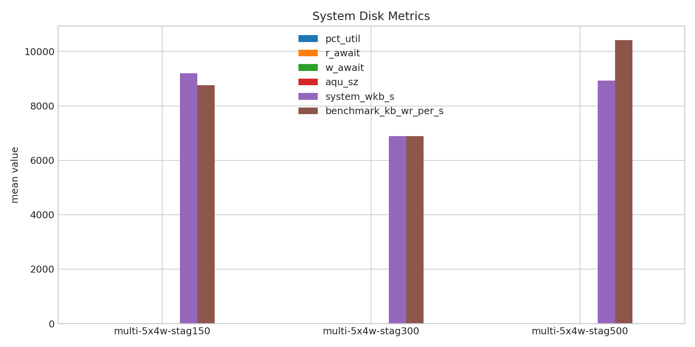
- 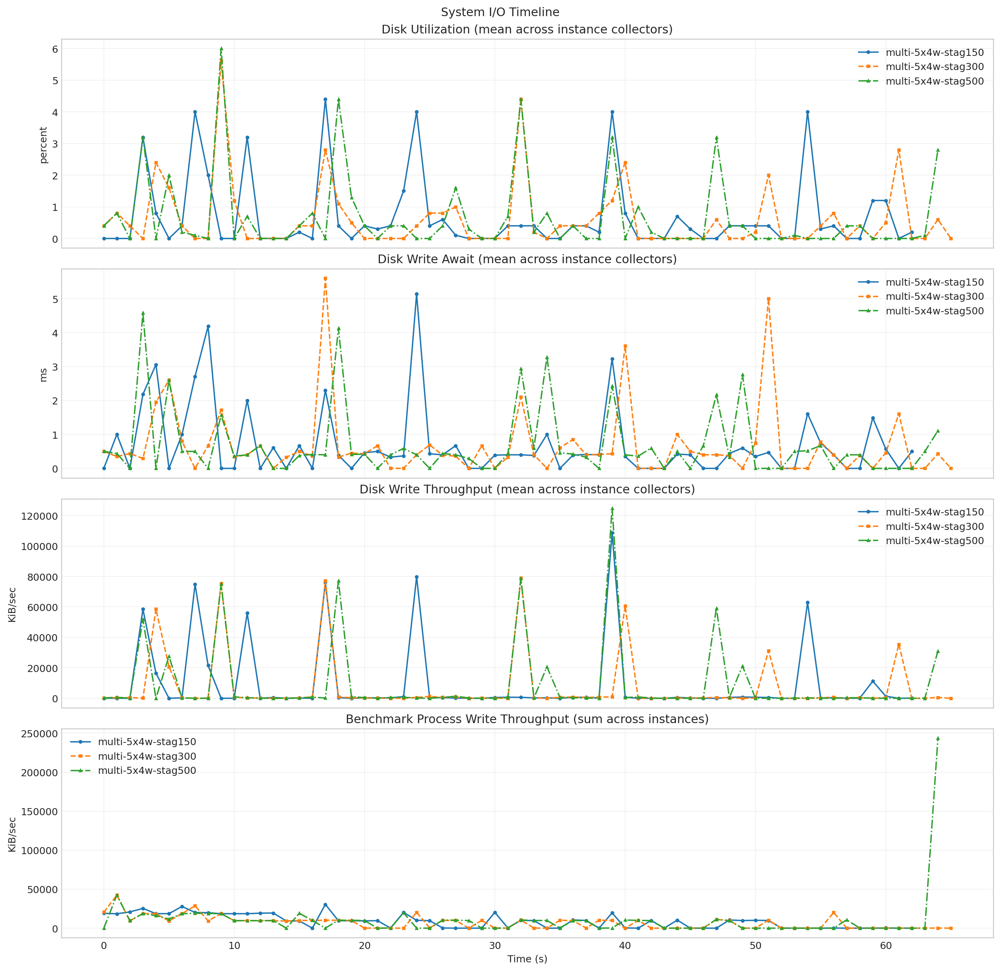
- 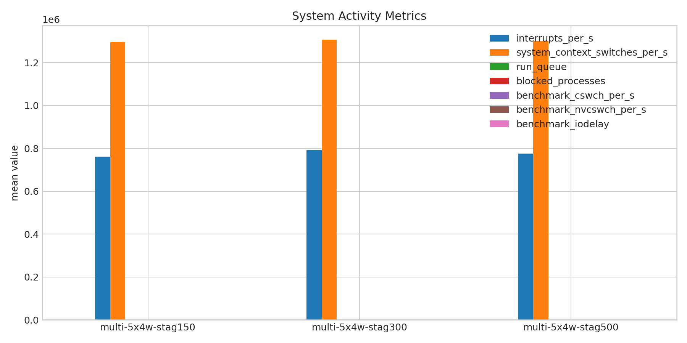
- 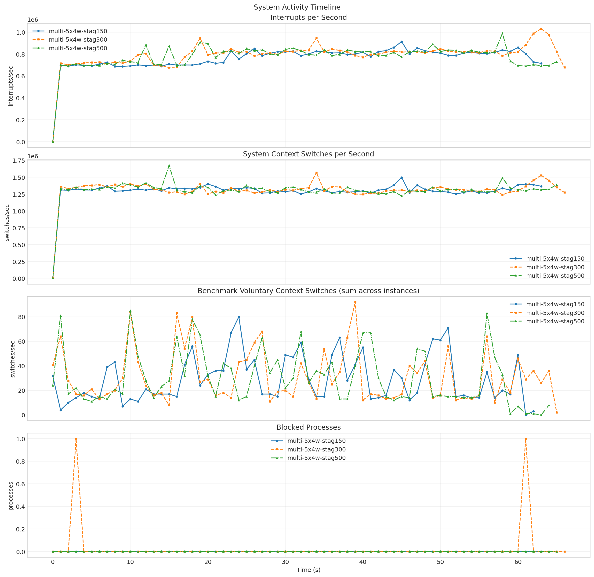
- 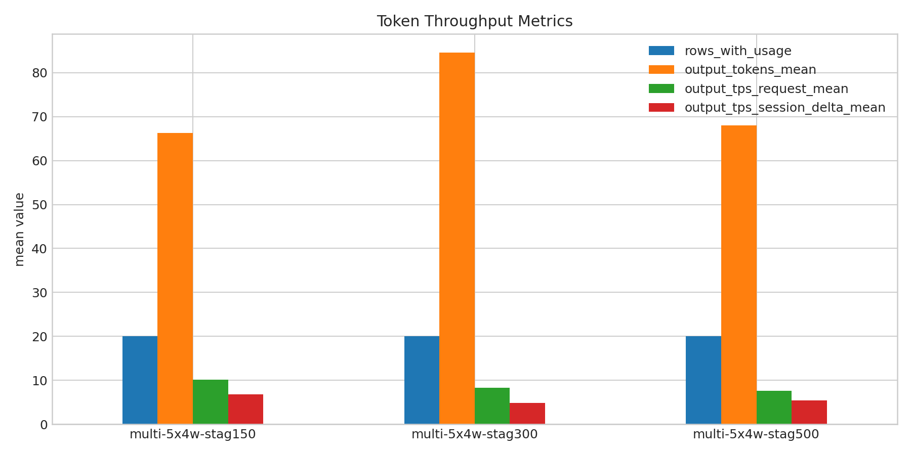
- 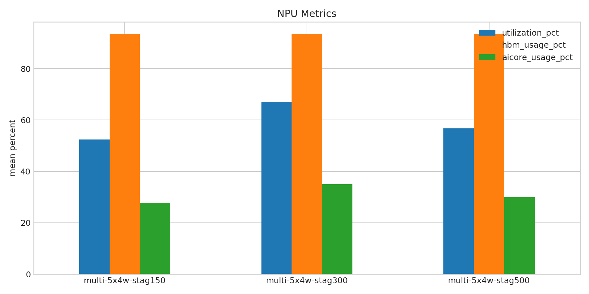
- 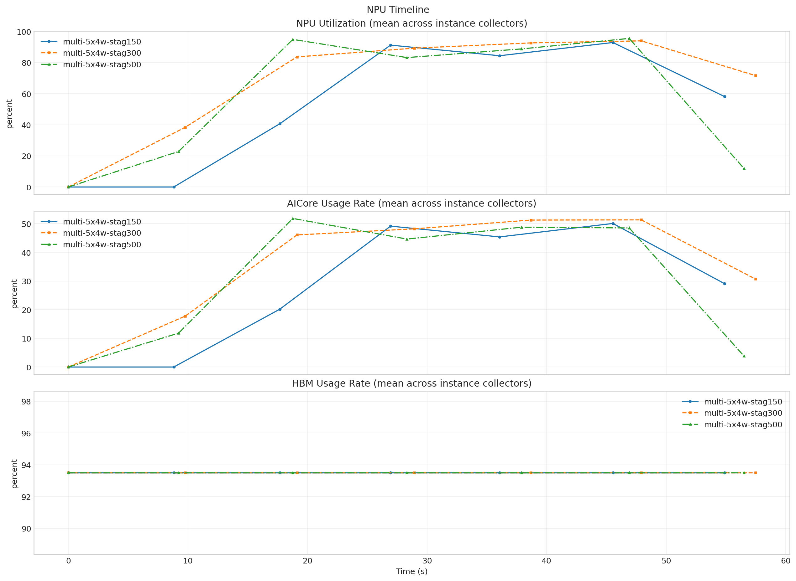

**Run Timing Table**

| scenario | run_dir | run_started_at | run_finished_at | run_wall_clock_sec | first_request_started_at | last_request_finished_at | request_window_sec |
| --- | --- | --- | --- | --- | --- | --- | --- |
| multi-5x4w-stag150 | /root/Zehao/ClawHarness/out/batch_run_4/task-01/20260417T134948Z_vps-docker-qwen3-235b8x2-multi-5x4w-stag150-worker | 2026-04-17T13:49:57.119999+00:00 | 2026-04-17T13:51:07.904777+00:00 | 70.785 | 2026-04-17T13:50:03.936045+00:00 | 2026-04-17T13:50:56.718002+00:00 | 52.782 |
| multi-5x4w-stag300 | /root/Zehao/ClawHarness/out/batch_run_4/task-01/20260417T135200Z_vps-docker-qwen3-235b8x2-multi-5x4w-stag300-worker | 2026-04-17T13:52:08.019987+00:00 | 2026-04-17T13:53:18.460655+00:00 | 70.441 | 2026-04-17T13:52:08.086455+00:00 | 2026-04-17T13:53:11.689935+00:00 | 63.603 |
| multi-5x4w-stag500 | /root/Zehao/ClawHarness/out/batch_run_4/task-01/20260417T135418Z_vps-docker-qwen3-235b8x2-multi-5x4w-stag500-worker | 2026-04-17T13:54:27.021504+00:00 | 2026-04-17T13:55:36.898371+00:00 | 69.877 | 2026-04-17T13:54:27.092274+00:00 | 2026-04-17T13:55:24.380321+00:00 | 57.288 |

**Latency Overview Table**

| scenario | total_mean | total_p50 | total_p95 | total_p99 |
| --- | --- | --- | --- | --- |
| multi-5x4w-stag150 | 9892.484 | 9749.402 | 15646.001 | 15835.807 |
| multi-5x4w-stag300 | 10530.203 | 9674.466 | 14747.619 | 18570.033 |
| multi-5x4w-stag500 | 10026.616 | 8580.281 | 15561.519 | 17774.751 |

**Mean Latency by Phase Table**

| scenario | connect | send | wait | history | total |
| --- | --- | --- | --- | --- | --- |
| multi-5x4w-stag150 | 6651.934 | 21.557 | 9387.924 | 482.968 | 9892.484 |
| multi-5x4w-stag300 | 3566.262 | 31.804 | 10307.378 | 190.969 | 10530.203 |
| multi-5x4w-stag500 | 934.921 | 10.162 | 9814.524 | 201.893 | 10026.616 |

**Tail Latency Table**

| scenario | send_p95 | send_p99 | wait_p50 | wait_p95 | wait_p99 | history_p95 | history_p99 | total_p95 | total_p99 |
| --- | --- | --- | --- | --- | --- | --- | --- | --- | --- |
| multi-5x4w-stag150 | 169.899 | 172.571 | 9235.794 | 15556.042 | 15653.996 | 22.066 | 9473.329 | 15646.001 | 15835.807 |
| multi-5x4w-stag300 | 117.859 | 465.855 | 9657.164 | 14733.891 | 18561.513 | 17.375 | 3679.393 | 14747.619 | 18570.033 |
| multi-5x4w-stag500 | 19.564 | 123.881 | 8568.670 | 15544.922 | 17748.113 | 15.214 | 3866.449 | 15561.519 | 17774.751 |

**System CPU Table**

| scenario | pct_cpu_total | pct_cpu_usr | pct_cpu_system | pct_cpu_wait |
| --- | --- | --- | --- | --- |
| multi-5x4w-stag150 | 65.727 | 54.381 | 11.346 | 0.063 |
| multi-5x4w-stag300 | 51.877 | 43.228 | 8.649 | 0.061 |
| multi-5x4w-stag500 | 54.123 | 44.400 | 9.723 | 0.446 |

**System Memory Table**

| scenario | rss_kib_total |
| --- | --- |
| multi-5x4w-stag150 | 918309.206 |
| multi-5x4w-stag300 | 912011.636 |
| multi-5x4w-stag500 | 845903.815 |

**System Disk Table**

| scenario | busiest_device | pct_util | r_await | w_await | aqu_sz | system_wkb_s | benchmark_kb_wr_per_s |
| --- | --- | --- | --- | --- | --- | --- | --- |
| multi-5x4w-stag150 | sda | 0.686 | 0.000 | 0.695 | 0.134 | 9202.159 | 8753.423 |
| multi-5x4w-stag300 | sda | 0.598 | 0.000 | 0.660 | 0.102 | 6881.818 | 6884.958 |
| multi-5x4w-stag500 | sda | 0.654 | 0.000 | 0.671 | 0.117 | 8936.185 | 10418.585 |

**System Activity Table**

| scenario | interrupts_per_s | system_context_switches_per_s | run_queue | blocked_processes | benchmark_cswch_per_s | benchmark_nvcswch_per_s | benchmark_iodelay |
| --- | --- | --- | --- | --- | --- | --- | --- |
| multi-5x4w-stag150 | 761304.312 | 1296139.812 | 21.641 | 0.000 | 29.074 | 38.846 | 0.000 |
| multi-5x4w-stag300 | 791675.284 | 1307475.851 | 24.478 | 0.030 | 31.145 | 32.462 | 0.000 |
| multi-5x4w-stag500 | 775645.258 | 1302836.848 | 26.030 | 0.000 | 30.323 | 164.123 | 0.000 |

**Token Throughput Table**

| scenario | rows_with_usage | output_tokens_mean | output_tps_request_mean | output_tps_session_delta_mean |
| --- | --- | --- | --- | --- |
| multi-5x4w-stag150 | 20 | 66.350 | 10.140 | 6.764 |
| multi-5x4w-stag300 | 20 | 84.600 | 8.348 | 4.869 |
| multi-5x4w-stag500 | 20 | 68.000 | 7.645 | 5.454 |

**NPU Table**

| scenario | utilization_pct | hbm_usage_pct | aicore_usage_pct |
| --- | --- | --- | --- |
| multi-5x4w-stag150 | 52.464 | 93.500 | 27.688 |
| multi-5x4w-stag300 | 67.062 | 93.500 | 35.036 |
| multi-5x4w-stag500 | 56.732 | 93.500 | 29.911 |

**System Timeline Peaks Table**

| scenario | benchmark_cpu_peak | benchmark_cpu_peak_t_sec | benchmark_rss_peak_kib | benchmark_rss_peak_t_sec | system_disk_pct_util_peak | system_disk_pct_util_peak_t_sec | system_disk_w_await_peak | system_disk_w_await_peak_t_sec | system_interrupts_peak | system_interrupts_peak_t_sec | system_context_switches_peak | system_context_switches_peak_t_sec | system_run_queue_peak | system_run_queue_peak_t_sec | npu_utilization_peak | npu_utilization_peak_t_sec | npu_aicore_peak | npu_aicore_peak_t_sec | npu_hbm_peak | npu_hbm_peak_t_sec |
| --- | --- | --- | --- | --- | --- | --- | --- | --- | --- | --- | --- | --- | --- | --- | --- | --- | --- | --- | --- | --- |
| multi-5x4w-stag150 | 160.000 | 21.000 | 968116.000 | 50.000 | 4.400 | 17.000 | 5.140 | 24.000 | 913700.000 | 45.000 | 1497125.000 | 45.000 | 76.000 | 40.000 | 92.875 | 45.548 | 50.062 | 45.548 | 93.500 | 0.000 |
| multi-5x4w-stag300 | 139.000 | 39.000 | 957288.000 | 38.000 | 5.600 | 9.000 | 5.600 | 17.000 | 1030646.000 | 63.000 | 1569692.000 | 34.000 | 67.000 | 48.000 | 93.938 | 47.925 | 51.312 | 47.925 | 93.500 | 0.000 |
| multi-5x4w-stag500 | 153.000 | 40.000 | 952264.000 | 28.000 | 6.000 | 9.000 | 4.580 | 3.000 | 989430.000 | 58.000 | 1675411.000 | 15.000 | 67.000 | 38.000 | 95.500 | 46.913 | 51.812 | 18.776 | 93.500 | 0.000 |
