## `multi-inst-25x1dx4ix1w-stag150` vs `multi-inst-25x1dx4ix1w-stag300` vs `multi-inst-25x1dx4ix1w-stag500`

**Run Dirs**

| scenario | run_dir | instance_num | requests_total | requests_ok | requests_failed |
| --- | --- | --- | --- | --- | --- |
| multi-inst-25x1dx4ix1w-stag150 | /root/Zehao/ClawHarness/out/batch_run_5/task-01/20260420T150108Z_vps-docker-qwen3-235b-multi-inst-25x1dx4ix1w-stag150-worker | 1 | 100 | 100 | 0 |
| multi-inst-25x1dx4ix1w-stag300 | /root/Zehao/ClawHarness/out/batch_run_5/task-01/20260420T151815Z_vps-docker-qwen3-235b-multi-inst-25x1dx4ix1w-stag300-worker | 1 | 100 | 100 | 0 |
| multi-inst-25x1dx4ix1w-stag500 | /root/Zehao/ClawHarness/out/batch_run_5/task-01/20260420T153103Z_vps-docker-qwen3-235b-multi-inst-25x1dx4ix1w-stag500-worker | 1 | 100 | 100 | 0 |

**Aggregation Policy**

- `pidstat` per-process metrics are summed across instances.
- `iostat` and `vmstat` host-wide metrics are averaged across instance collectors.
- This makes multi-instance runs comparable with single-instance runs at the whole-machine level.

**Figures**

- 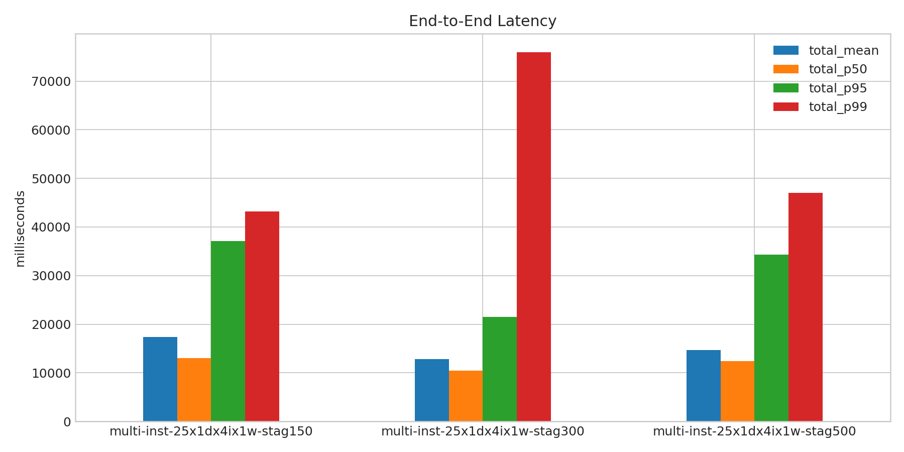
- 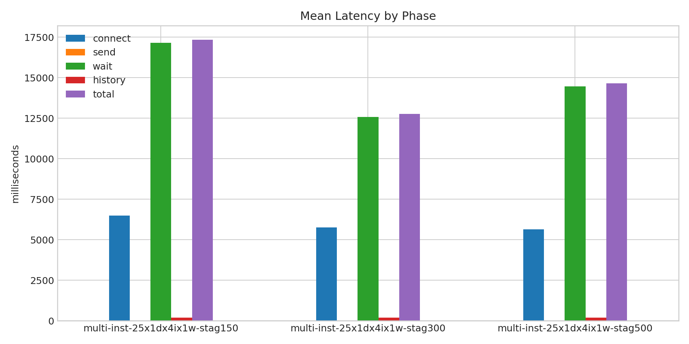
- 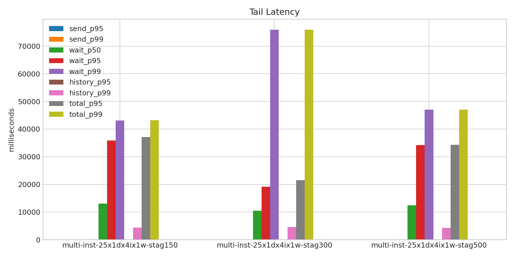
- 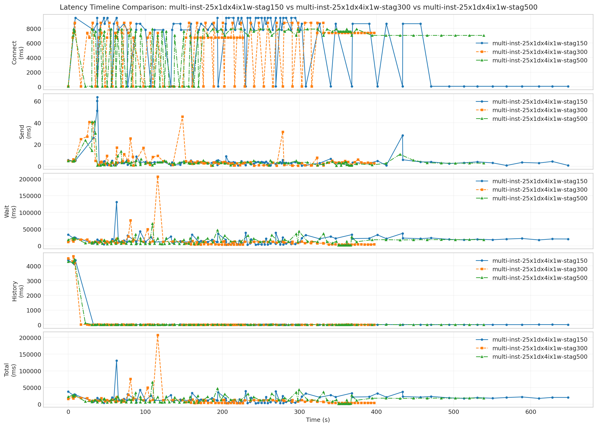
- 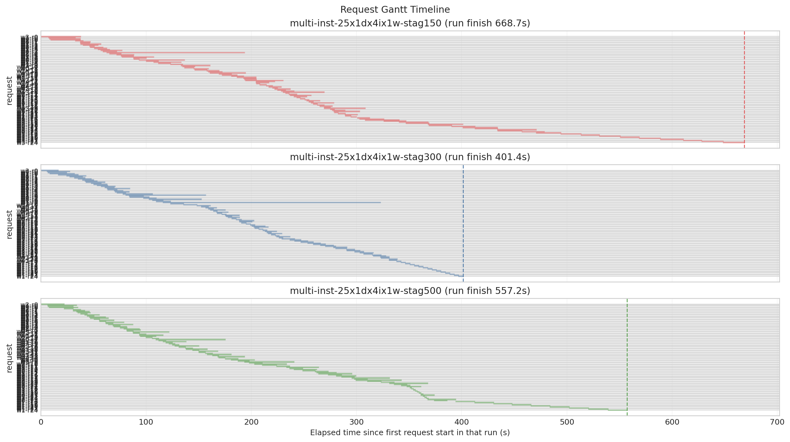
- 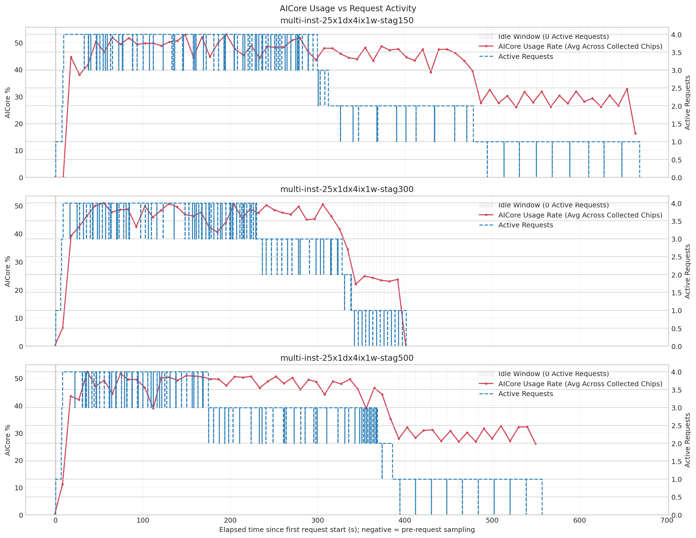
- 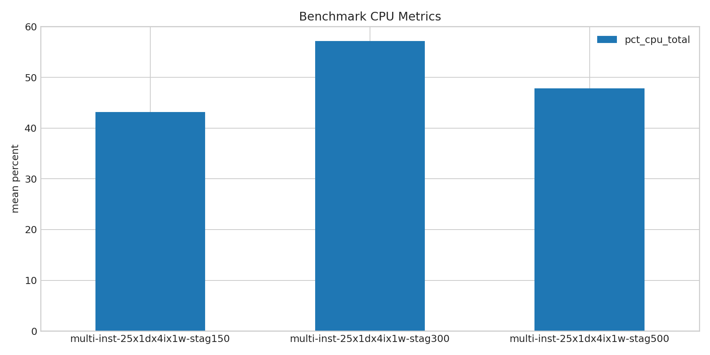
- 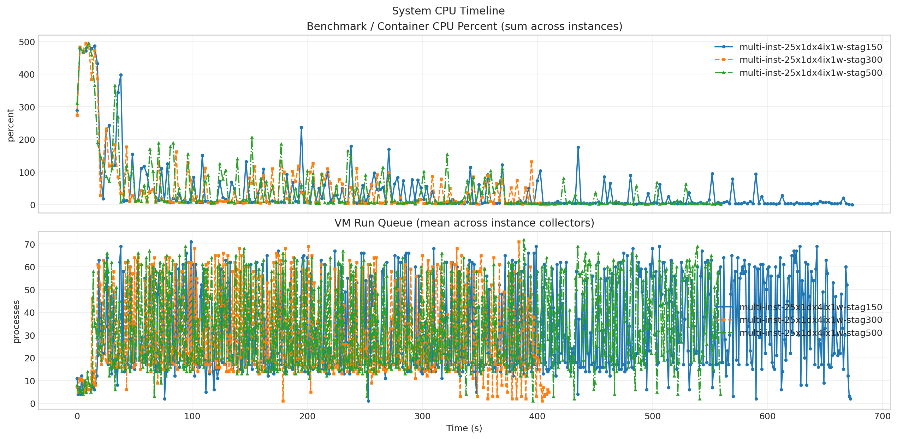
- 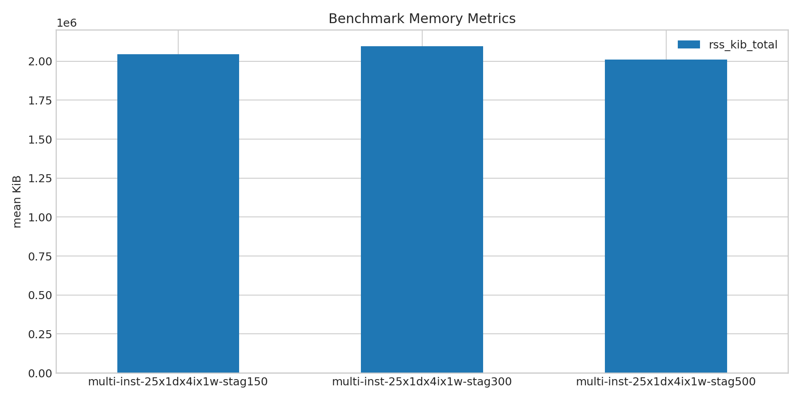
- 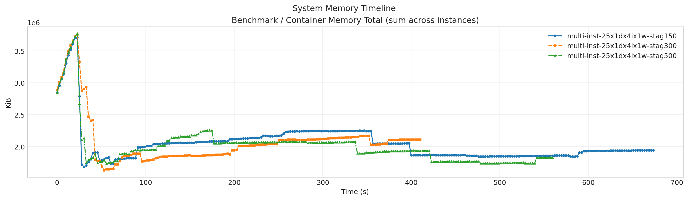
- 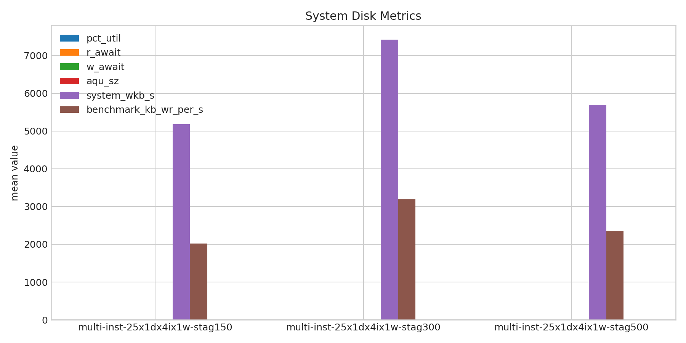
- 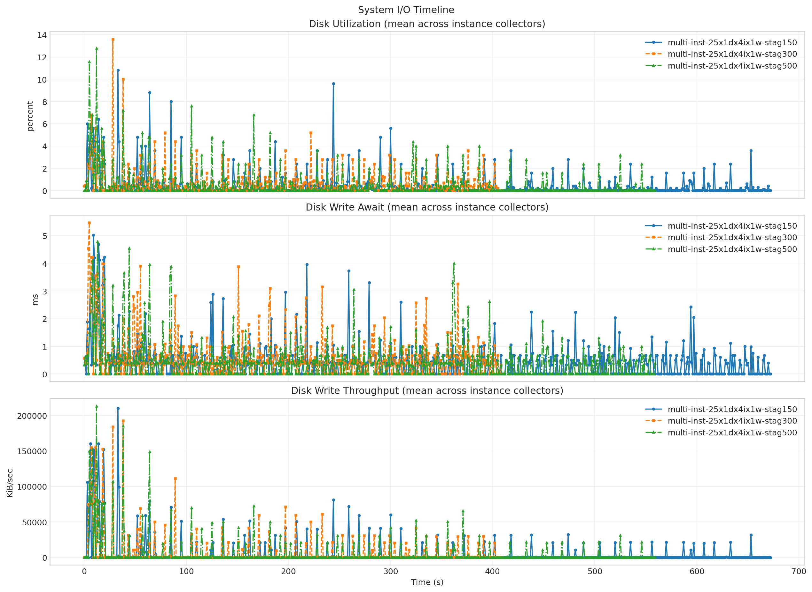
- 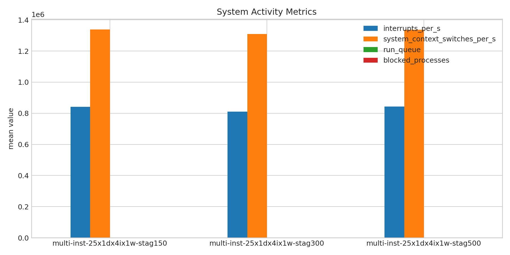
- 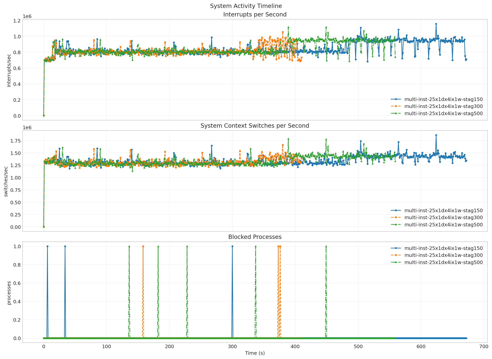
- 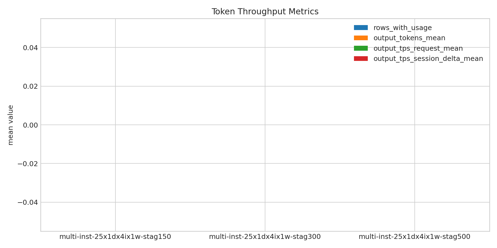
- 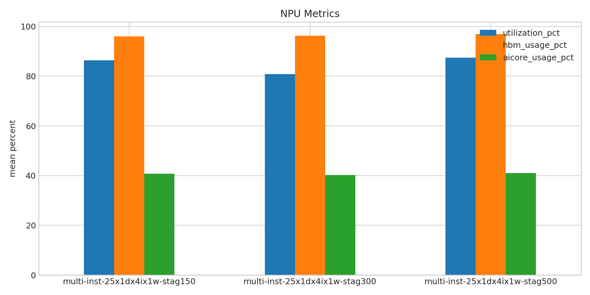
- 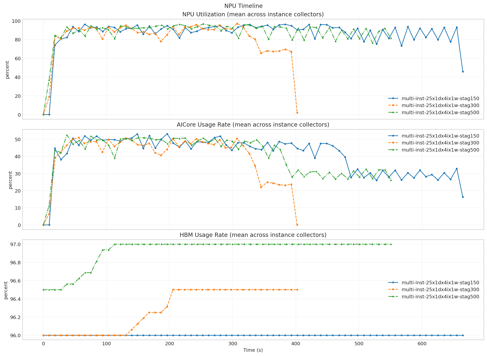

**Run Timing Table**

| scenario | run_dir | run_started_at | run_finished_at | run_wall_clock_sec | first_request_started_at | last_request_finished_at | request_window_sec |
| --- | --- | --- | --- | --- | --- | --- | --- |
| multi-inst-25x1dx4ix1w-stag150 | /root/Zehao/ClawHarness/out/batch_run_5/task-01/20260420T150108Z_vps-docker-qwen3-235b-multi-inst-25x1dx4ix1w-stag150-worker | 2026-04-20T15:01:17.067384+00:00 | 2026-04-20T15:12:48.819452+00:00 | 691.752 | 2026-04-20T15:01:17.577751+00:00 | 2026-04-20T15:12:26.290608+00:00 | 668.713 |
| multi-inst-25x1dx4ix1w-stag300 | /root/Zehao/ClawHarness/out/batch_run_5/task-01/20260420T151815Z_vps-docker-qwen3-235b-multi-inst-25x1dx4ix1w-stag300-worker | 2026-04-20T15:18:24.219405+00:00 | 2026-04-20T15:25:31.657047+00:00 | 427.438 | 2026-04-20T15:18:25.186520+00:00 | 2026-04-20T15:25:06.563772+00:00 | 401.377 |
| multi-inst-25x1dx4ix1w-stag500 | /root/Zehao/ClawHarness/out/batch_run_5/task-01/20260420T153103Z_vps-docker-qwen3-235b-multi-inst-25x1dx4ix1w-stag500-worker | 2026-04-20T15:31:12.180525+00:00 | 2026-04-20T15:40:57.872852+00:00 | 585.692 | 2026-04-20T15:31:13.248357+00:00 | 2026-04-20T15:40:30.400265+00:00 | 557.152 |

**Latency Overview Table**

| scenario | total_mean | total_p50 | total_p95 | total_p99 |
| --- | --- | --- | --- | --- |
| multi-inst-25x1dx4ix1w-stag150 | 17346.340 | 13036.481 | 37091.060 | 43158.570 |
| multi-inst-25x1dx4ix1w-stag300 | 12770.337 | 10450.899 | 21527.008 | 75964.006 |
| multi-inst-25x1dx4ix1w-stag500 | 14649.957 | 12456.189 | 34271.329 | 47058.792 |

**Mean Latency by Phase Table**

| scenario | connect | send | wait | history | total |
| --- | --- | --- | --- | --- | --- |
| multi-inst-25x1dx4ix1w-stag150 | 6496.875 | 5.463 | 17159.936 | 180.900 | 17346.340 |
| multi-inst-25x1dx4ix1w-stag300 | 5753.347 | 5.692 | 12579.386 | 185.222 | 12770.337 |
| multi-inst-25x1dx4ix1w-stag500 | 5649.086 | 4.581 | 14463.244 | 182.092 | 14649.957 |

**Tail Latency Table**

| scenario | send_p95 | send_p99 | wait_p50 | wait_p95 | wait_p99 | history_p95 | history_p99 | total_p95 | total_p99 |
| --- | --- | --- | --- | --- | --- | --- | --- | --- | --- |
| multi-inst-25x1dx4ix1w-stag150 | 9.262 | 60.071 | 13024.056 | 35866.128 | 43141.538 | 18.669 | 4385.515 | 37091.060 | 43158.570 |
| multi-inst-25x1dx4ix1w-stag300 | 25.597 | 40.733 | 10440.565 | 19164.082 | 75930.298 | 18.645 | 4522.730 | 21527.008 | 75964.006 |
| multi-inst-25x1dx4ix1w-stag500 | 13.643 | 40.919 | 12446.958 | 34261.942 | 47041.983 | 22.523 | 4289.627 | 34271.329 | 47058.792 |

**System CPU Table**

| scenario | pct_cpu_total | pct_cpu_usr | pct_cpu_system | pct_cpu_wait |
| --- | --- | --- | --- | --- |
| multi-inst-25x1dx4ix1w-stag150 | 43.167 | - | - | - |
| multi-inst-25x1dx4ix1w-stag300 | 57.193 | - | - | - |
| multi-inst-25x1dx4ix1w-stag500 | 47.836 | - | - | - |

**System Memory Table**

| scenario | rss_kib_total |
| --- | --- |
| multi-inst-25x1dx4ix1w-stag150 | 2045288.724 |
| multi-inst-25x1dx4ix1w-stag300 | 2096482.970 |
| multi-inst-25x1dx4ix1w-stag500 | 2009671.477 |

**System Disk Table**

| scenario | busiest_device | pct_util | r_await | w_await | aqu_sz | system_wkb_s | benchmark_kb_wr_per_s |
| --- | --- | --- | --- | --- | --- | --- | --- |
| multi-inst-25x1dx4ix1w-stag150 | sda | 0.429 | 0.000 | 0.417 | 0.083 | 5180.030 | 2016.721 |
| multi-inst-25x1dx4ix1w-stag300 | sda | 0.605 | 0.012 | 0.602 | 0.130 | 7422.761 | 3193.078 |
| multi-inst-25x1dx4ix1w-stag500 | sda | 0.487 | 0.000 | 0.428 | 0.088 | 5700.329 | 2357.017 |

**System Activity Table**

| scenario | interrupts_per_s | system_context_switches_per_s | run_queue | blocked_processes | benchmark_cswch_per_s | benchmark_nvcswch_per_s | benchmark_iodelay |
| --- | --- | --- | --- | --- | --- | --- | --- |
| multi-inst-25x1dx4ix1w-stag150 | 841980.144 | 1338637.929 | 32.163 | 0.004 | - | - | - |
| multi-inst-25x1dx4ix1w-stag300 | 809593.895 | 1309665.985 | 30.710 | 0.007 | - | - | - |
| multi-inst-25x1dx4ix1w-stag500 | 842955.488 | 1337455.441 | 33.129 | 0.009 | - | - | - |

**Token Throughput Table**

| scenario | rows_with_usage | output_tokens_mean | output_tps_request_mean | output_tps_session_delta_mean |
| --- | --- | --- | --- | --- |
| multi-inst-25x1dx4ix1w-stag150 | 0 | 0.000 | 0.000 | 0.000 |
| multi-inst-25x1dx4ix1w-stag300 | 0 | 0.000 | 0.000 | 0.000 |
| multi-inst-25x1dx4ix1w-stag500 | 0 | 0.000 | 0.000 | 0.000 |

**NPU Table**

| scenario | utilization_pct | hbm_usage_pct | aicore_usage_pct |
| --- | --- | --- | --- |
| multi-inst-25x1dx4ix1w-stag150 | 86.379 | 96.000 | 40.805 |
| multi-inst-25x1dx4ix1w-stag300 | 80.825 | 96.283 | 40.264 |
| multi-inst-25x1dx4ix1w-stag500 | 87.436 | 96.929 | 40.951 |

**System Timeline Peaks Table**

| scenario | benchmark_cpu_peak | benchmark_cpu_peak_t_sec | benchmark_rss_peak_kib | benchmark_rss_peak_t_sec | system_disk_pct_util_peak | system_disk_pct_util_peak_t_sec | system_disk_w_await_peak | system_disk_w_await_peak_t_sec | system_interrupts_peak | system_interrupts_peak_t_sec | system_context_switches_peak | system_context_switches_peak_t_sec | system_run_queue_peak | system_run_queue_peak_t_sec | npu_utilization_peak | npu_utilization_peak_t_sec | npu_aicore_peak | npu_aicore_peak_t_sec | npu_hbm_peak | npu_hbm_peak_t_sec |
| --- | --- | --- | --- | --- | --- | --- | --- | --- | --- | --- | --- | --- | --- | --- | --- | --- | --- | --- | --- | --- |
| multi-inst-25x1dx4ix1w-stag150 | 488.470 | 10.112 | 3709861.888 | 22.766 | 10.800 | 33.000 | 5.020 | 9.000 | 1157562.000 | 624.000 | 1862573.000 | 624.000 | 71.000 | 99.000 | 96.188 | 65.640 | 53.062 | 196.095 | 96.000 | 0.000 |
| multi-inst-25x1dx4ix1w-stag300 | 494.260 | 7.586 | 3755999.232 | 22.765 | 13.600 | 28.000 | 5.470 | 5.000 | 1053661.000 | 380.000 | 1661652.000 | 380.000 | 71.000 | 384.000 | 97.000 | 306.897 | 50.875 | 56.068 | 96.500 | 205.401 |
| multi-inst-25x1dx4ix1w-stag500 | 494.880 | 10.115 | 3770679.296 | 22.776 | 12.800 | 12.000 | 4.790 | 13.000 | 1114377.000 | 389.000 | 1787602.000 | 389.000 | 72.000 | 388.000 | 96.688 | 253.384 | 52.375 | 37.372 | 97.000 | 112.938 |
