## `multi-inst-25x2dx2ix1w-stag150` vs `multi-inst-25x2dx2ix1w-stag300` vs `multi-inst-25x2dx2ix1w-stag500`

**Run Dirs**

| scenario | run_dir | instance_num | requests_total | requests_ok | requests_failed |
| --- | --- | --- | --- | --- | --- |
| multi-inst-25x2dx2ix1w-stag150 | /root/Zehao/ClawHarness/out/batch_run_5/task-01/20260420T141951Z_vps-docker-qwen3-235b-multi-inst-25x2dx2ix1w-stag150-worker | 2 | 100 | 100 | 0 |
| multi-inst-25x2dx2ix1w-stag300 | /root/Zehao/ClawHarness/out/batch_run_5/task-01/20260420T143434Z_vps-docker-qwen3-235b-multi-inst-25x2dx2ix1w-stag300-worker | 2 | 100 | 100 | 0 |
| multi-inst-25x2dx2ix1w-stag500 | /root/Zehao/ClawHarness/out/batch_run_5/task-01/20260420T144926Z_vps-docker-qwen3-235b-multi-inst-25x2dx2ix1w-stag500-worker | 2 | 100 | 100 | 0 |

**Aggregation Policy**

- `pidstat` per-process metrics are summed across instances.
- `iostat` and `vmstat` host-wide metrics are averaged across instance collectors.
- This makes multi-instance runs comparable with single-instance runs at the whole-machine level.

**Figures**

- 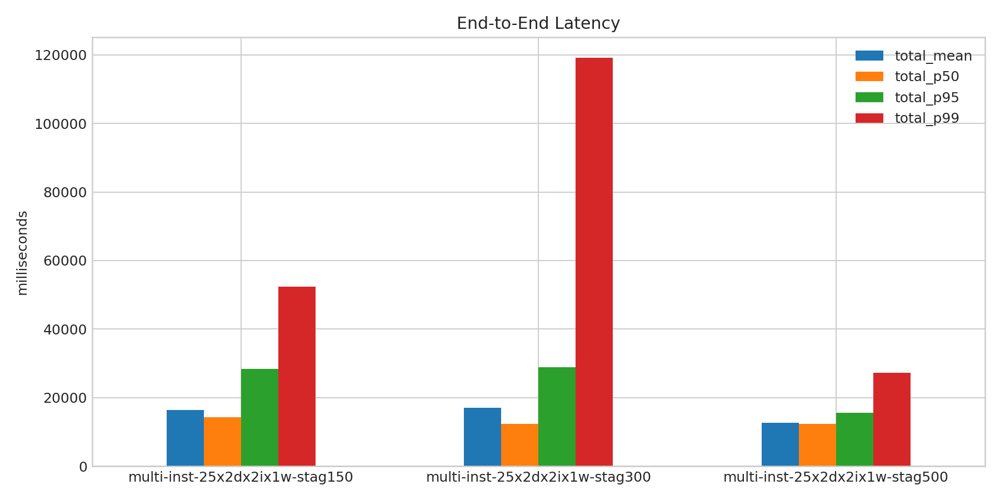
- 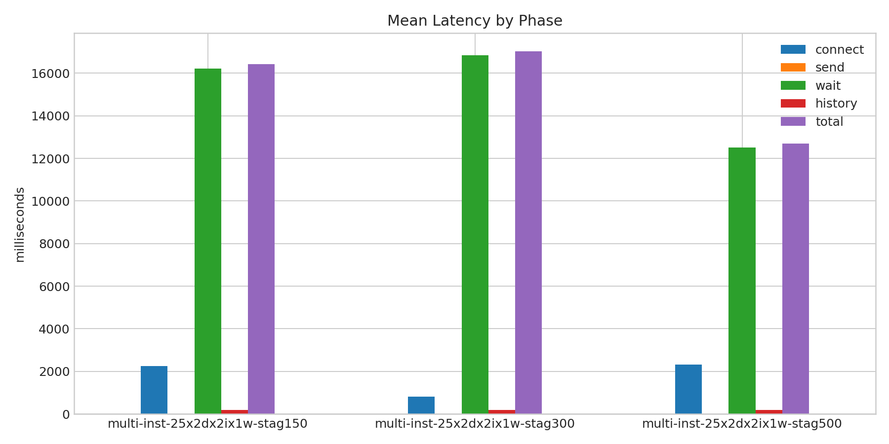
- 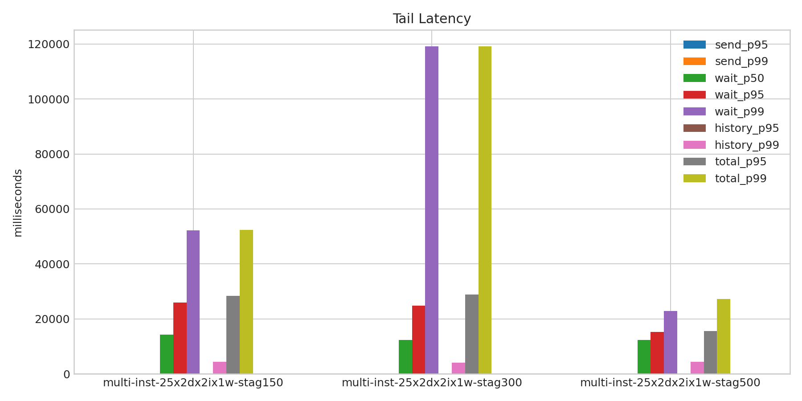
- 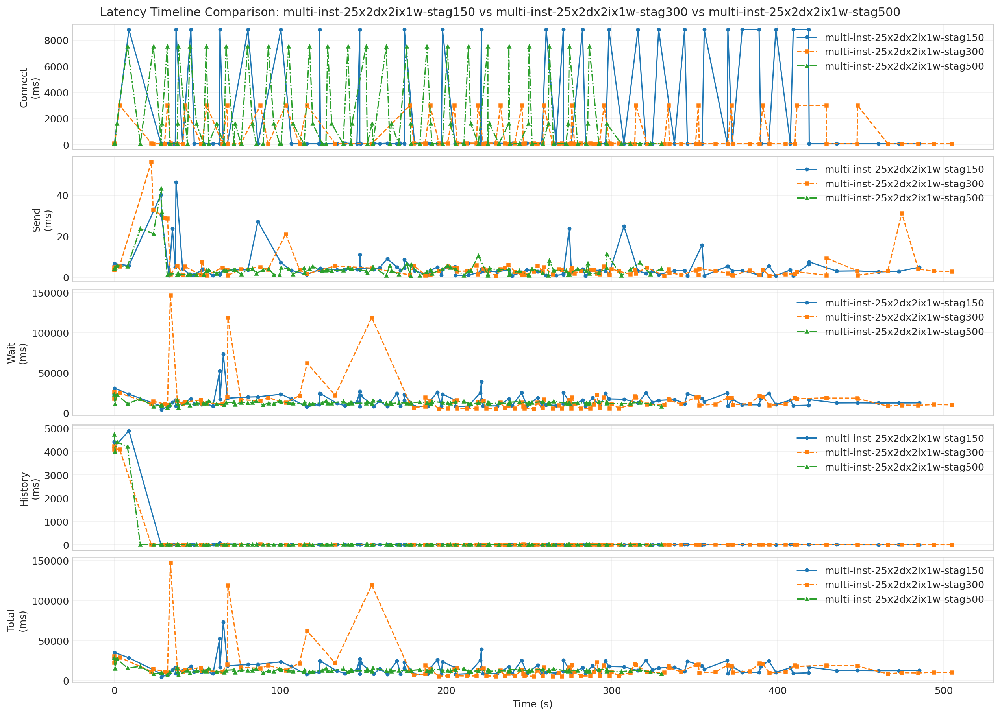
- 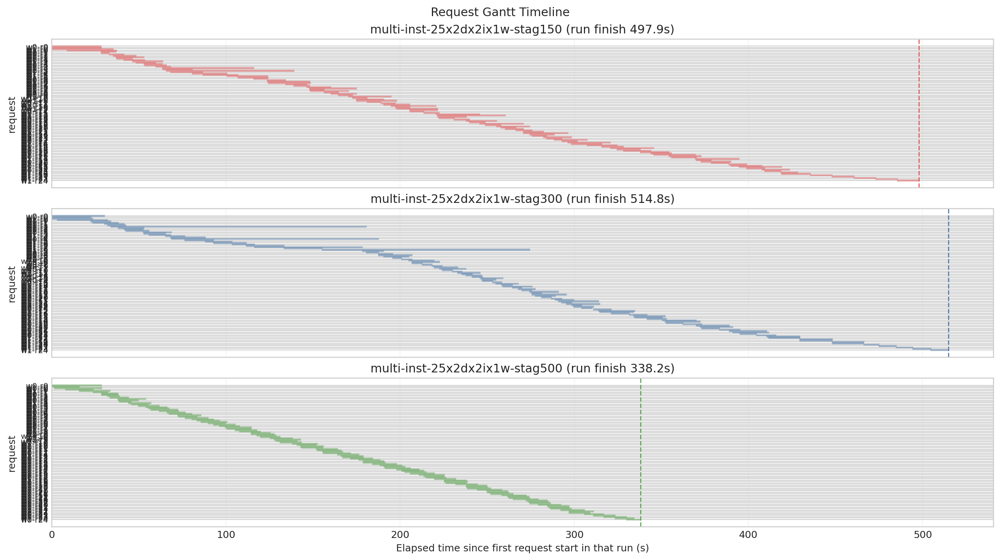
- 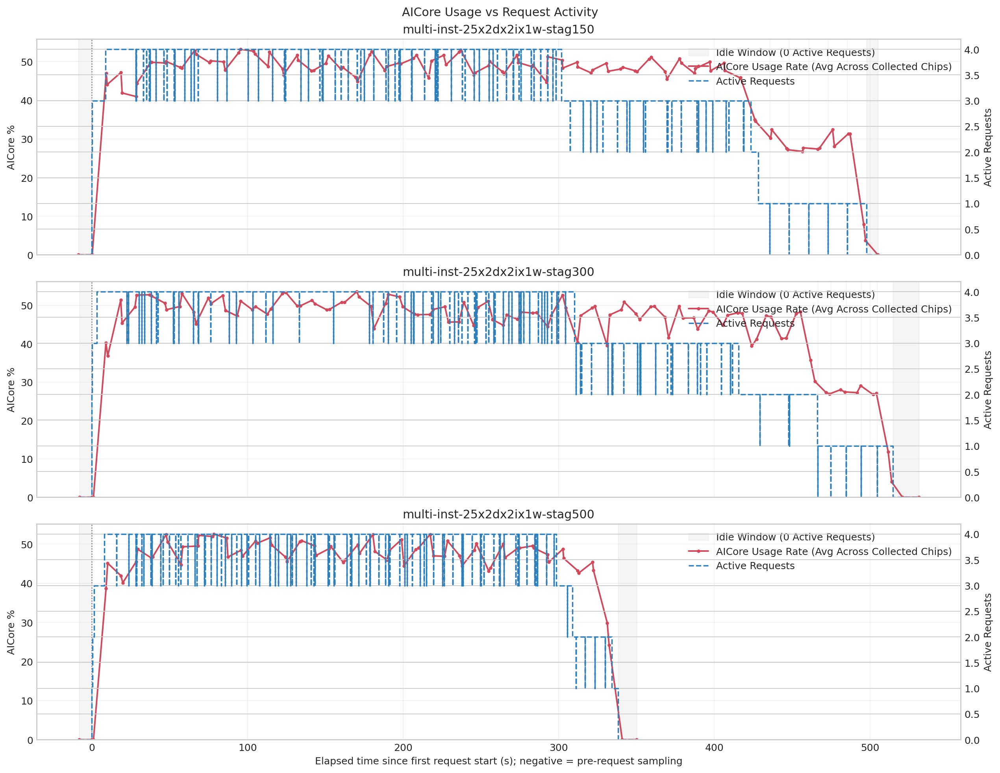
- 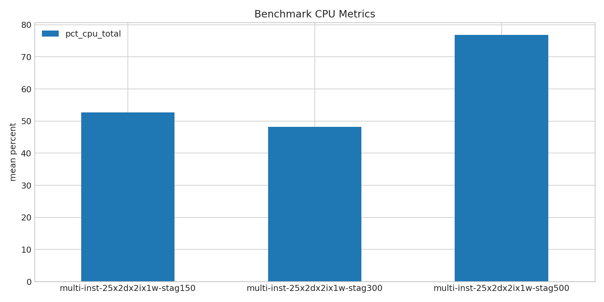
- 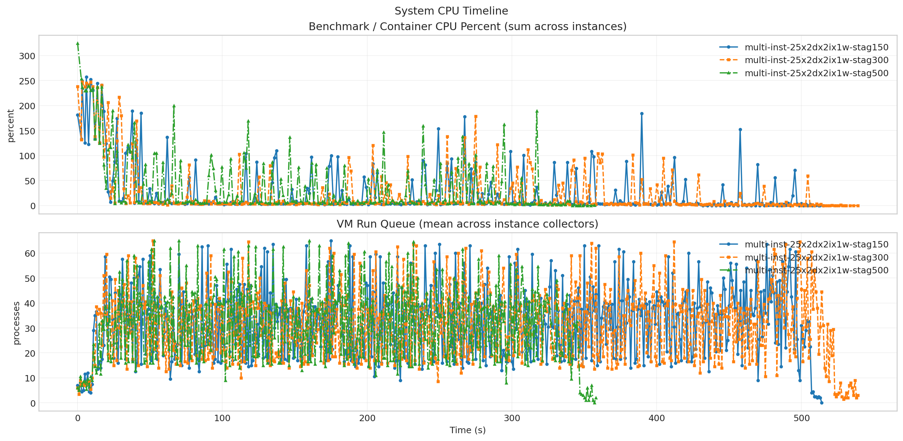
- 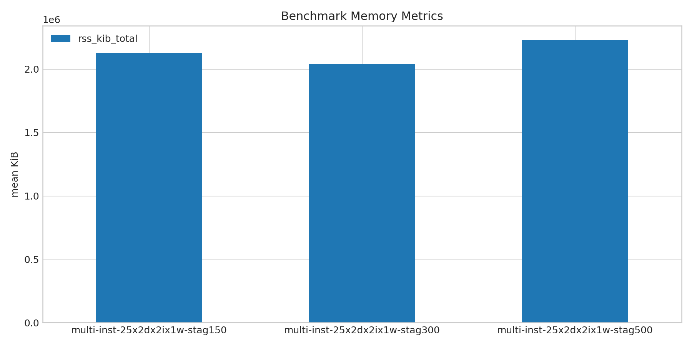
- 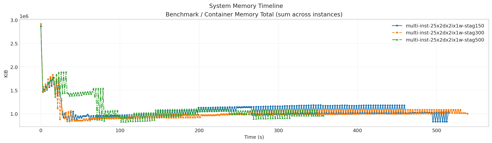
- 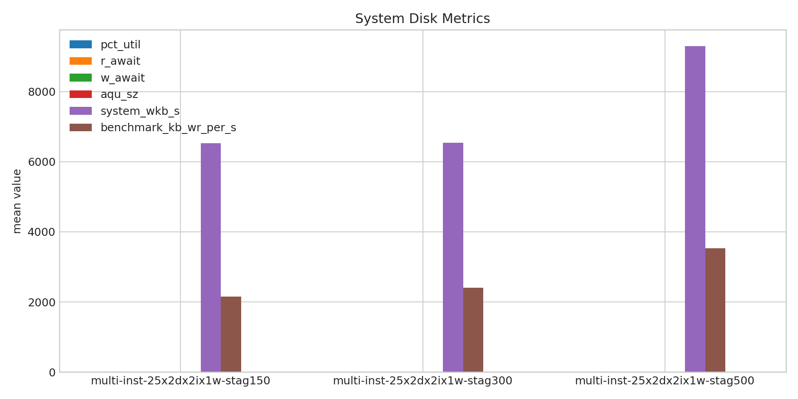
- 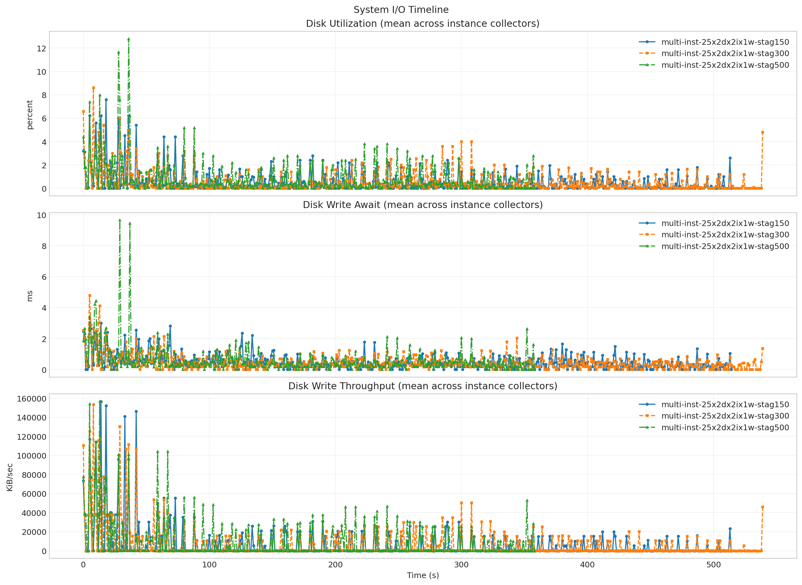
- 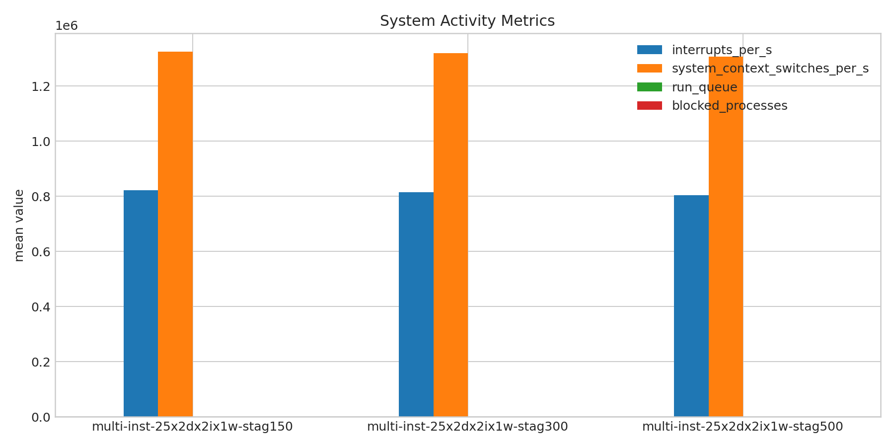
- 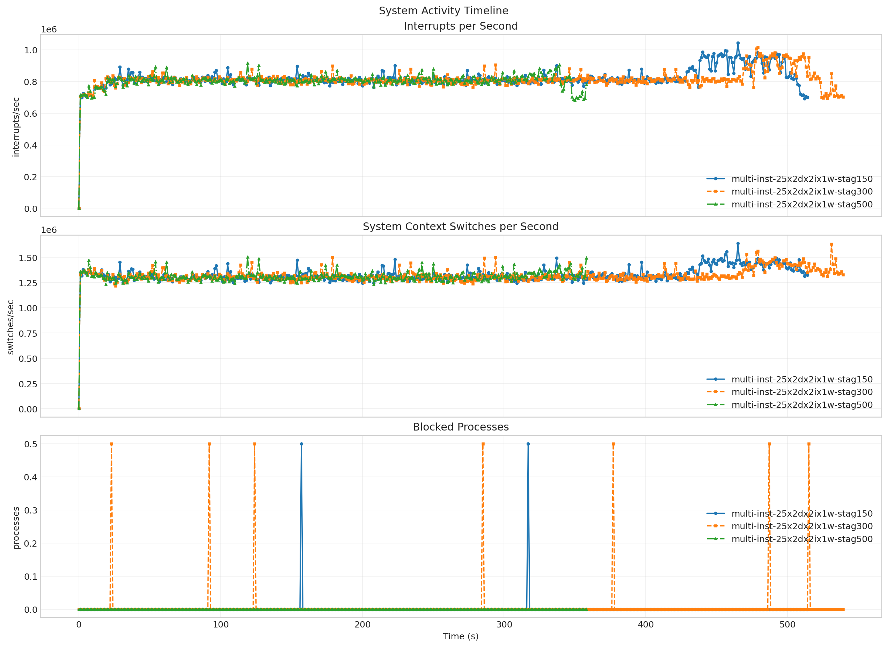
- 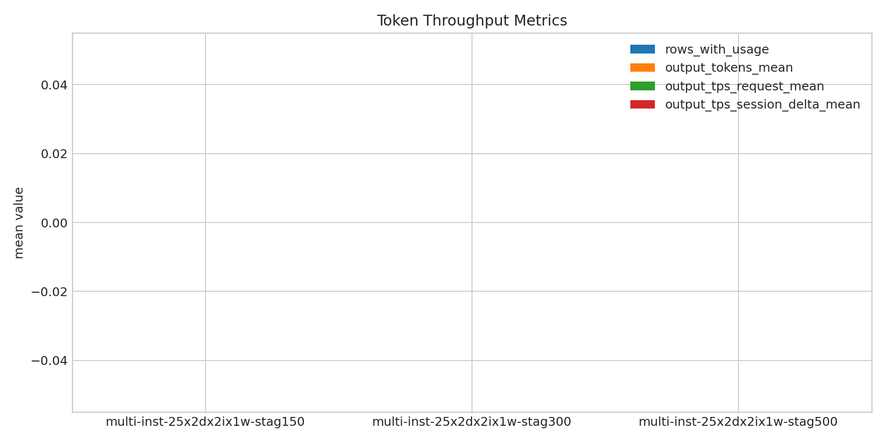
- 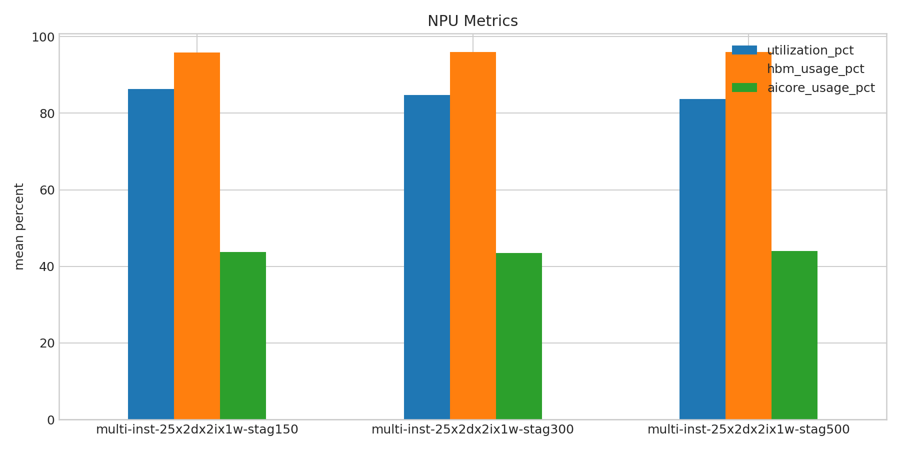
- 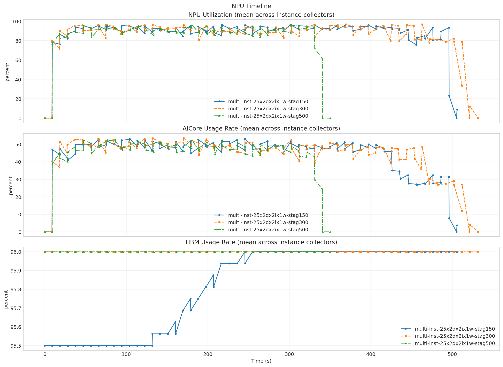

**Run Timing Table**

| scenario | run_dir | run_started_at | run_finished_at | run_wall_clock_sec | first_request_started_at | last_request_finished_at | request_window_sec |
| --- | --- | --- | --- | --- | --- | --- | --- |
| multi-inst-25x2dx2ix1w-stag150 | /root/Zehao/ClawHarness/out/batch_run_5/task-01/20260420T141951Z_vps-docker-qwen3-235b-multi-inst-25x2dx2ix1w-stag150-worker | 2026-04-20T14:20:07.936208+00:00 | 2026-04-20T14:28:55.478108+00:00 | 527.542 | 2026-04-20T14:20:08.020802+00:00 | 2026-04-20T14:28:25.925260+00:00 | 497.904 |
| multi-inst-25x2dx2ix1w-stag300 | /root/Zehao/ClawHarness/out/batch_run_5/task-01/20260420T143434Z_vps-docker-qwen3-235b-multi-inst-25x2dx2ix1w-stag300-worker | 2026-04-20T14:34:50.469038+00:00 | 2026-04-20T14:43:58.030255+00:00 | 547.561 | 2026-04-20T14:34:50.559830+00:00 | 2026-04-20T14:43:25.403014+00:00 | 514.843 |
| multi-inst-25x2dx2ix1w-stag500 | /root/Zehao/ClawHarness/out/batch_run_5/task-01/20260420T144926Z_vps-docker-qwen3-235b-multi-inst-25x2dx2ix1w-stag500-worker | 2026-04-20T14:49:42.870884+00:00 | 2026-04-20T14:55:53.047390+00:00 | 370.177 | 2026-04-20T14:49:42.940011+00:00 | 2026-04-20T14:55:21.120355+00:00 | 338.180 |

**Latency Overview Table**

| scenario | total_mean | total_p50 | total_p95 | total_p99 |
| --- | --- | --- | --- | --- |
| multi-inst-25x2dx2ix1w-stag150 | 16422.690 | 14241.344 | 28386.496 | 52350.918 |
| multi-inst-25x2dx2ix1w-stag300 | 17031.578 | 12336.427 | 28903.039 | 119168.651 |
| multi-inst-25x2dx2ix1w-stag500 | 12696.395 | 12318.753 | 15518.988 | 27211.727 |

**Mean Latency by Phase Table**

| scenario | connect | send | wait | history | total |
| --- | --- | --- | --- | --- | --- |
| multi-inst-25x2dx2ix1w-stag150 | 2258.205 | 5.349 | 16229.890 | 187.412 | 16422.690 |
| multi-inst-25x2dx2ix1w-stag300 | 810.202 | 4.909 | 16851.285 | 175.343 | 17031.578 |
| multi-inst-25x2dx2ix1w-stag500 | 2311.869 | 4.329 | 12508.649 | 183.377 | 12696.395 |

**Tail Latency Table**

| scenario | send_p95 | send_p99 | wait_p50 | wait_p95 | wait_p99 | history_p95 | history_p99 | total_p95 | total_p99 |
| --- | --- | --- | --- | --- | --- | --- | --- | --- | --- |
| multi-inst-25x2dx2ix1w-stag150 | 23.631 | 40.140 | 14228.331 | 25871.679 | 52259.498 | 37.436 | 4419.945 | 28386.496 | 52350.918 |
| multi-inst-25x2dx2ix1w-stag300 | 21.080 | 32.878 | 12320.655 | 24788.229 | 119147.450 | 29.307 | 4109.373 | 28903.039 | 119168.651 |
| multi-inst-25x2dx2ix1w-stag500 | 10.526 | 31.706 | 12285.103 | 15217.580 | 22792.475 | 17.965 | 4413.615 | 15518.988 | 27211.727 |

**System CPU Table**

| scenario | pct_cpu_total | pct_cpu_usr | pct_cpu_system | pct_cpu_wait |
| --- | --- | --- | --- | --- |
| multi-inst-25x2dx2ix1w-stag150 | 52.671 | - | - | - |
| multi-inst-25x2dx2ix1w-stag300 | 48.157 | - | - | - |
| multi-inst-25x2dx2ix1w-stag500 | 76.842 | - | - | - |

**System Memory Table**

| scenario | rss_kib_total |
| --- | --- |
| multi-inst-25x2dx2ix1w-stag150 | 2127885.630 |
| multi-inst-25x2dx2ix1w-stag300 | 2041567.537 |
| multi-inst-25x2dx2ix1w-stag500 | 2230756.284 |

**System Disk Table**

| scenario | busiest_device | pct_util | r_await | w_await | aqu_sz | system_wkb_s | benchmark_kb_wr_per_s |
| --- | --- | --- | --- | --- | --- | --- | --- |
| multi-inst-25x2dx2ix1w-stag150 | sda | 0.536 | 0.000 | 0.474 | 0.102 | 6530.199 | 2147.051 |
| multi-inst-25x2dx2ix1w-stag300 | sda | 0.517 | 0.002 | 0.451 | 0.096 | 6546.844 | 2405.134 |
| multi-inst-25x2dx2ix1w-stag500 | sda | 0.829 | 0.010 | 0.592 | 0.143 | 9302.209 | 3527.293 |

**System Activity Table**

| scenario | interrupts_per_s | system_context_switches_per_s | run_queue | blocked_processes | benchmark_cswch_per_s | benchmark_nvcswch_per_s | benchmark_iodelay |
| --- | --- | --- | --- | --- | --- | --- | --- |
| multi-inst-25x2dx2ix1w-stag150 | 822249.316 | 1325298.973 | 32.310 | 0.002 | - | - | - |
| multi-inst-25x2dx2ix1w-stag300 | 814277.379 | 1319069.481 | 30.994 | 0.007 | - | - | - |
| multi-inst-25x2dx2ix1w-stag500 | 803880.982 | 1306945.387 | 30.880 | 0.000 | - | - | - |

**Token Throughput Table**

| scenario | rows_with_usage | output_tokens_mean | output_tps_request_mean | output_tps_session_delta_mean |
| --- | --- | --- | --- | --- |
| multi-inst-25x2dx2ix1w-stag150 | 0 | 0.000 | 0.000 | 0.000 |
| multi-inst-25x2dx2ix1w-stag300 | 0 | 0.000 | 0.000 | 0.000 |
| multi-inst-25x2dx2ix1w-stag500 | 0 | 0.000 | 0.000 | 0.000 |

**NPU Table**

| scenario | utilization_pct | hbm_usage_pct | aicore_usage_pct |
| --- | --- | --- | --- |
| multi-inst-25x2dx2ix1w-stag150 | 86.328 | 95.812 | 43.804 |
| multi-inst-25x2dx2ix1w-stag300 | 84.824 | 96.000 | 43.551 |
| multi-inst-25x2dx2ix1w-stag500 | 83.686 | 96.000 | 44.028 |

**System Timeline Peaks Table**

| scenario | benchmark_cpu_peak | benchmark_cpu_peak_t_sec | benchmark_rss_peak_kib | benchmark_rss_peak_t_sec | system_disk_pct_util_peak | system_disk_pct_util_peak_t_sec | system_disk_w_await_peak | system_disk_w_await_peak_t_sec | system_interrupts_peak | system_interrupts_peak_t_sec | system_context_switches_peak | system_context_switches_peak_t_sec | system_run_queue_peak | system_run_queue_peak_t_sec | npu_utilization_peak | npu_utilization_peak_t_sec | npu_aicore_peak | npu_aicore_peak_t_sec | npu_hbm_peak | npu_hbm_peak_t_sec |
| --- | --- | --- | --- | --- | --- | --- | --- | --- | --- | --- | --- | --- | --- | --- | --- | --- | --- | --- | --- | --- |
| multi-inst-25x2dx2ix1w-stag150 | 257.010 | 6.036 | 2865758.208 | 0.000 | 7.600 | 18.000 | 3.040 | 5.000 | 1044405.500 | 465.000 | 1638942.500 | 465.000 | 65.000 | 175.000 | 96.438 | 330.577 | 53.188 | 104.115 | 96.000 | 245.478 |
| multi-inst-25x2dx2ix1w-stag300 | 247.080 | 9.060 | 2915041.280 | 0.000 | 8.600 | 8.000 | 4.790 | 5.000 | 1015944.000 | 479.000 | 1632391.000 | 531.000 | 65.000 | 52.000 | 96.875 | 369.210 | 53.562 | 170.308 | 96.000 | 0.000 |
| multi-inst-25x2dx2ix1w-stag500 | 324.650 | 0.000 | 2884632.576 | 0.000 | 12.800 | 36.000 | 9.660 | 29.000 | 915567.000 | 119.000 | 1503106.000 | 119.000 | 65.000 | 53.000 | 96.250 | 180.598 | 52.562 | 86.478 | 96.000 | 0.000 |
