## `multi-inst-25x2ix2w-stag150` vs `multi-inst-25x2ix2w-stag300` vs `multi-inst-25x2ix2w-stag500`

**Run Dirs**

| scenario | run_dir | instance_num | requests_total | requests_ok | requests_failed |
| --- | --- | --- | --- | --- | --- |
| multi-inst-25x2ix2w-stag150 | /root/Zehao/ClawHarness/out/batch_run_5/task-01/20260420T134347Z_vps-docker-qwen3-235b-multi-inst-25x2ix2w-stag150-worker | 2 | 100 | 100 | 0 |
| multi-inst-25x2ix2w-stag300 | /root/Zehao/ClawHarness/out/batch_run_5/task-01/20260420T135500Z_vps-docker-qwen3-235b-multi-inst-25x2ix2w-stag300-worker | 2 | 100 | 100 | 0 |
| multi-inst-25x2ix2w-stag500 | /root/Zehao/ClawHarness/out/batch_run_5/task-01/20260420T140612Z_vps-docker-qwen3-235b-multi-inst-25x2ix2w-stag500-worker | 2 | 100 | 100 | 0 |

**Aggregation Policy**

- `pidstat` per-process metrics are summed across instances.
- `iostat` and `vmstat` host-wide metrics are averaged across instance collectors.
- This makes multi-instance runs comparable with single-instance runs at the whole-machine level.

**Figures**

- 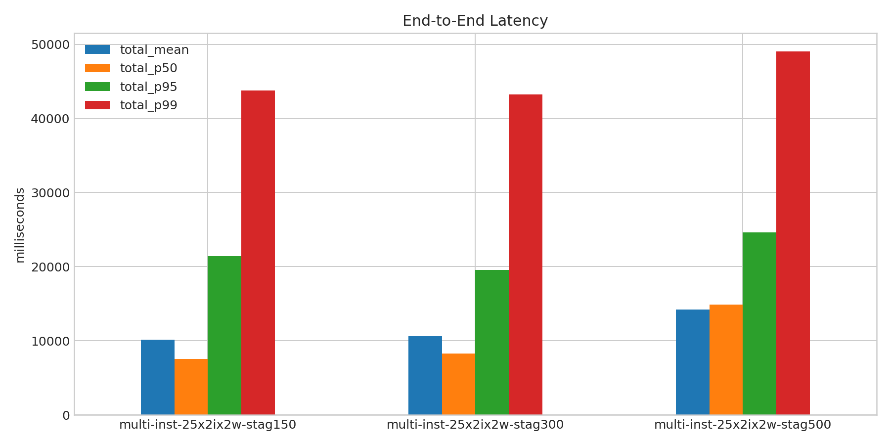
- 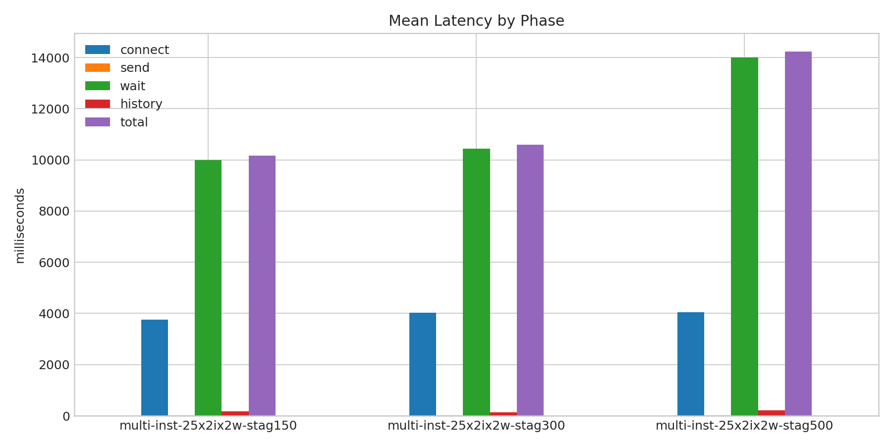
- 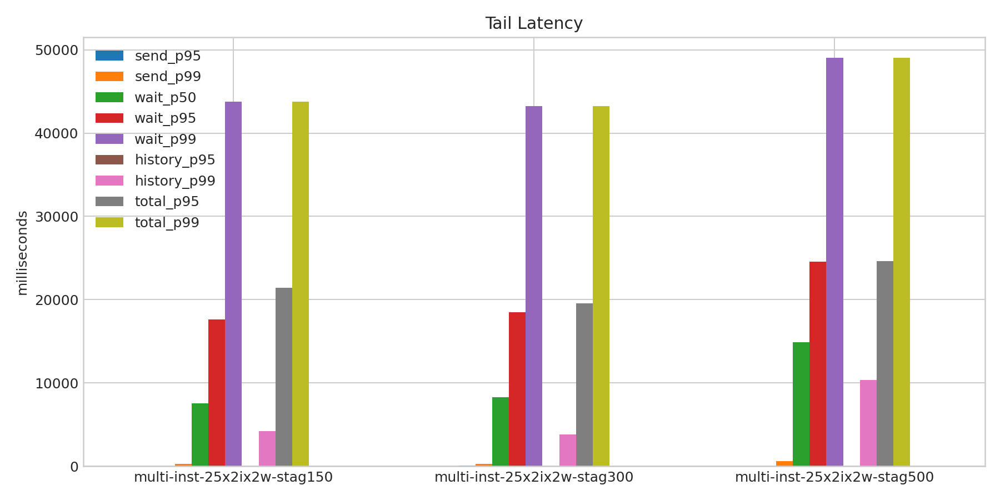
- 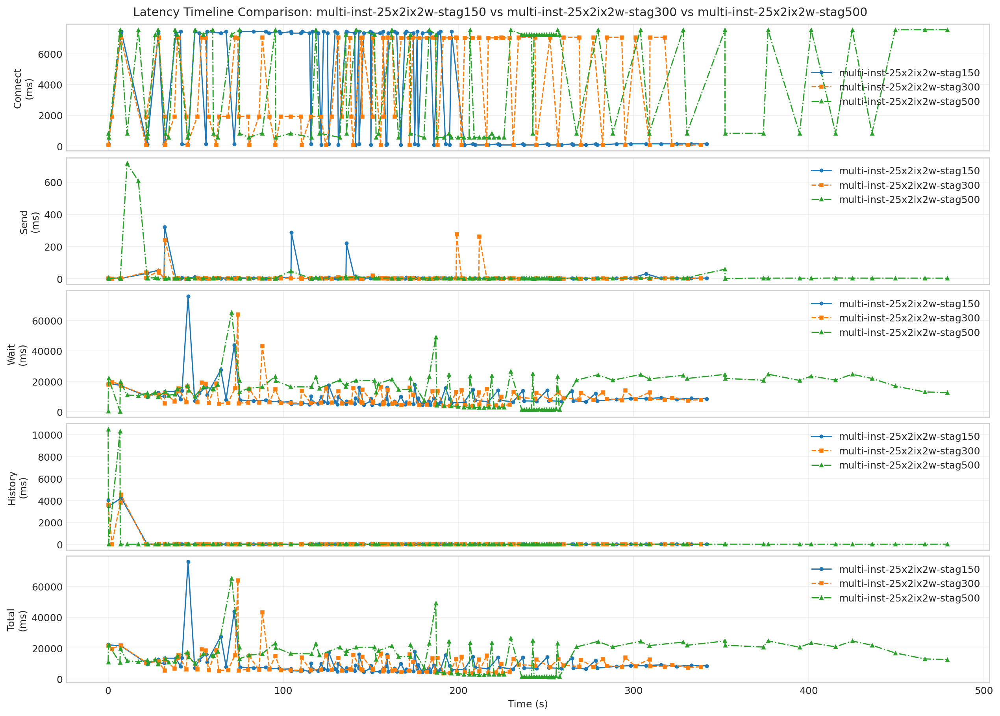
- 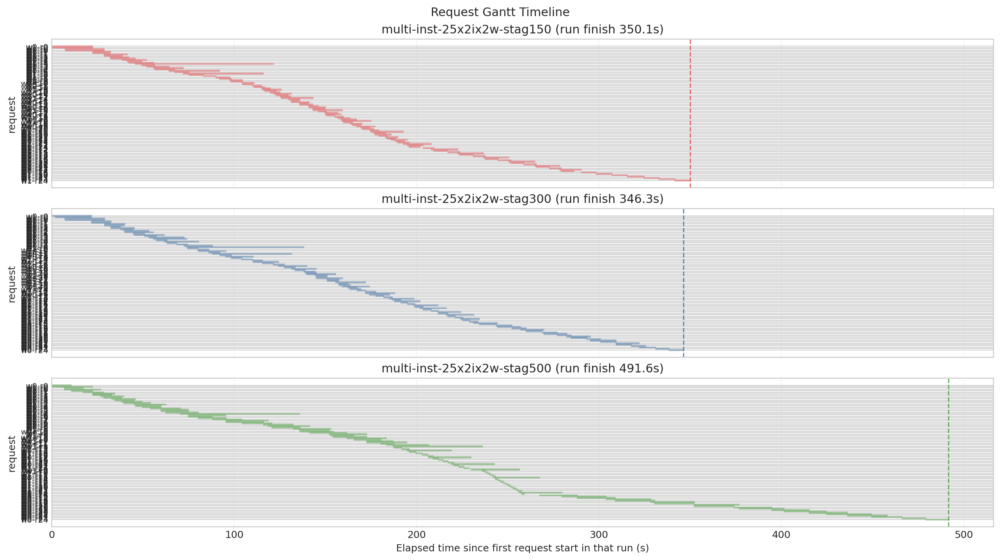
- 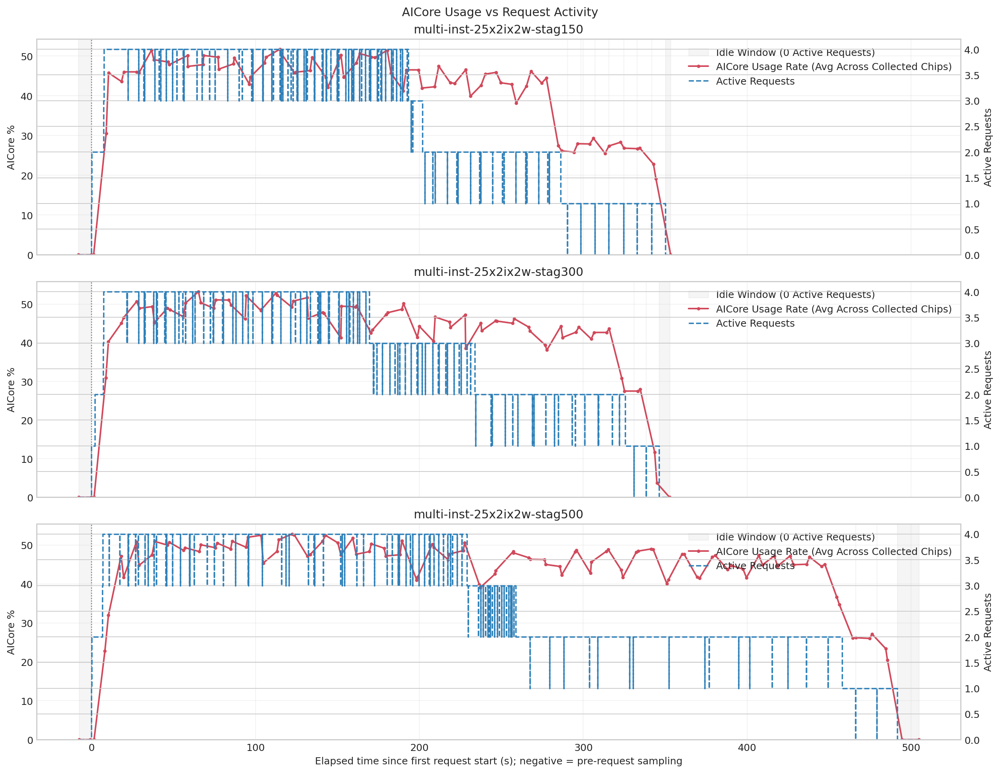
- 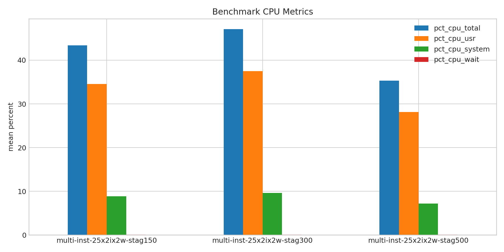
- 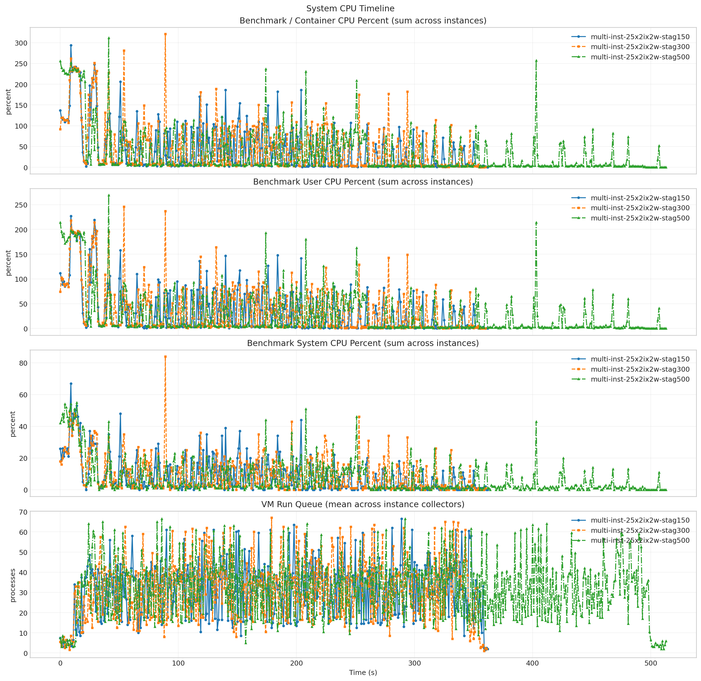
- 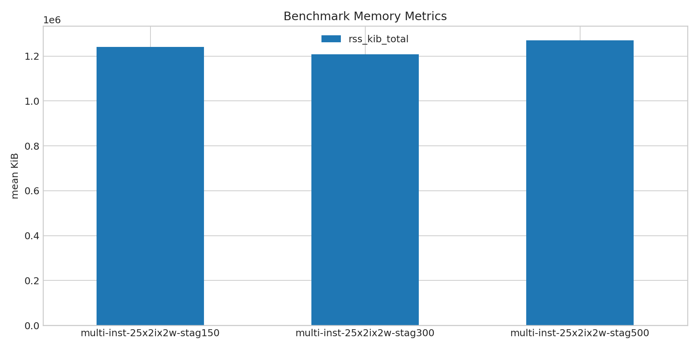
- 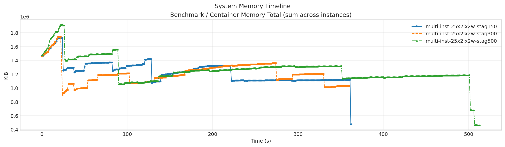
- 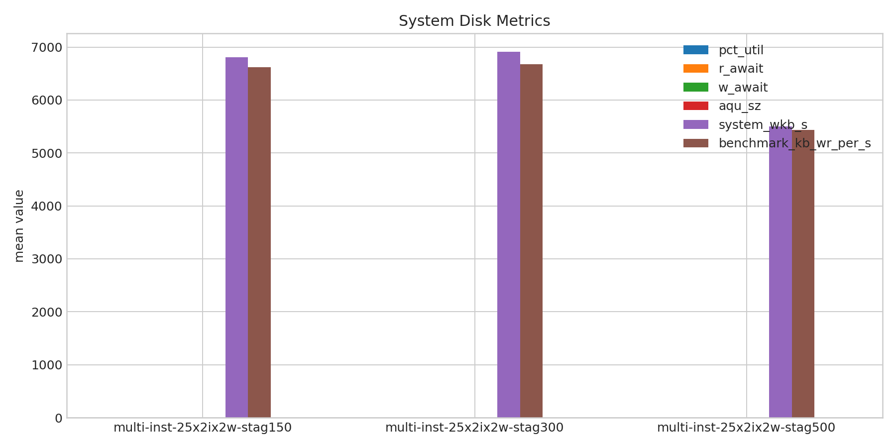
- 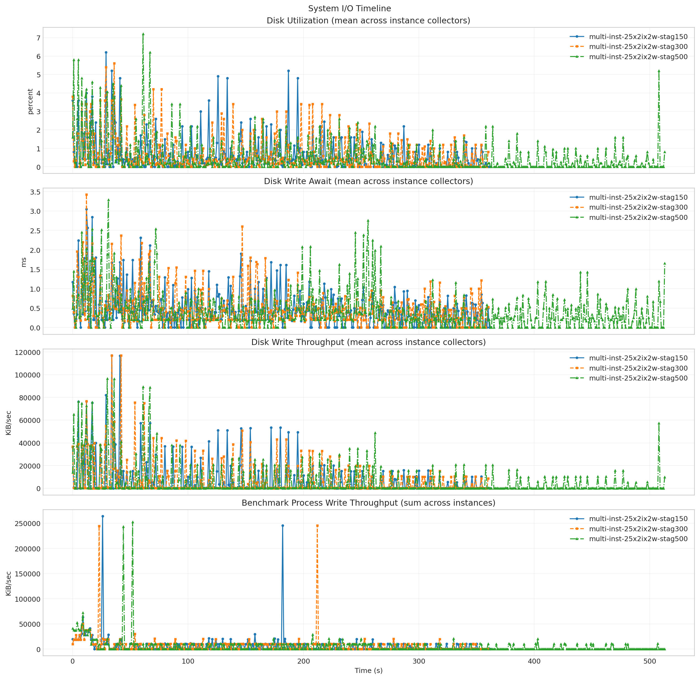
- 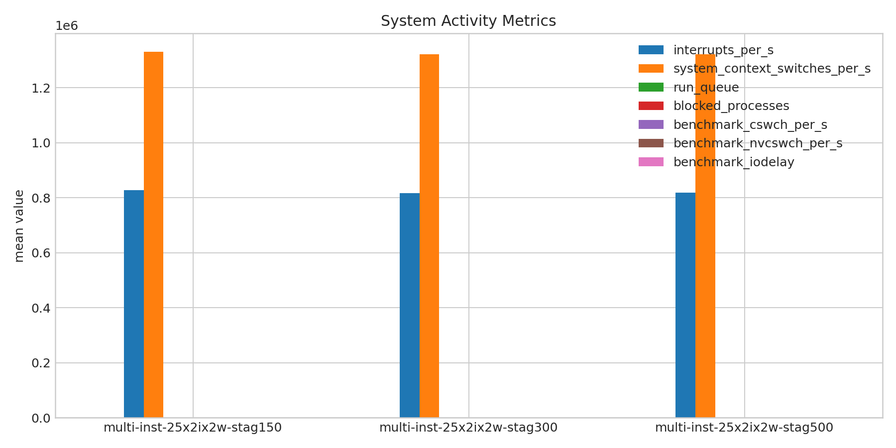
- 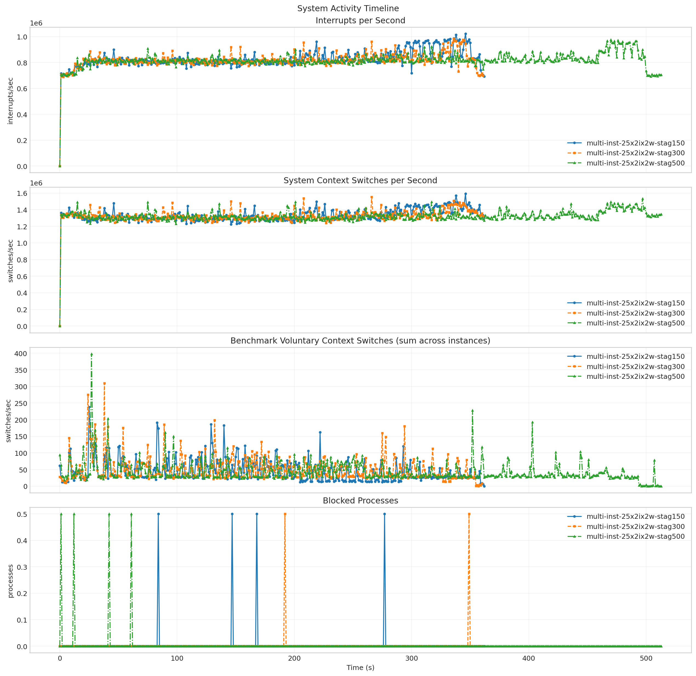
- 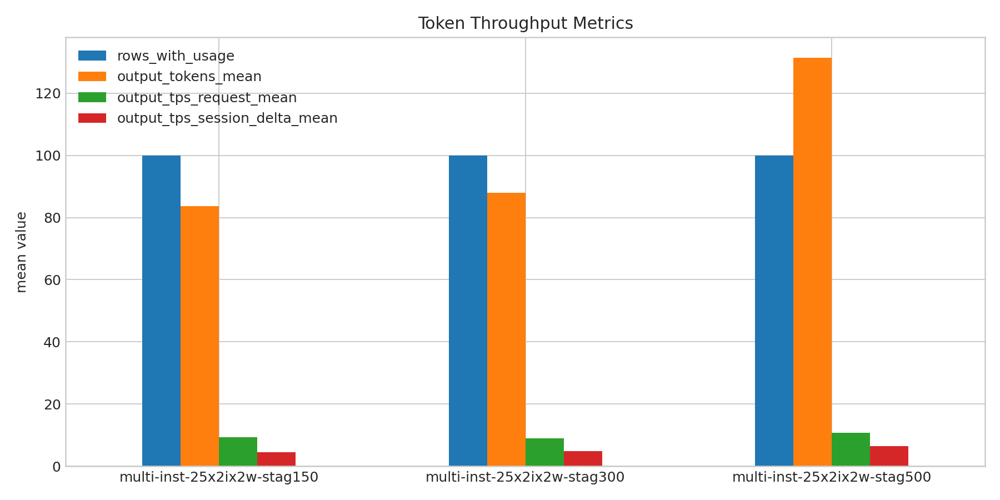
- 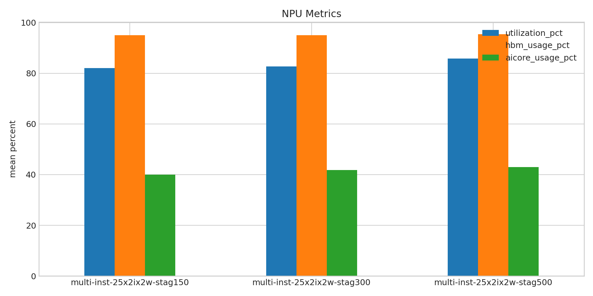
- 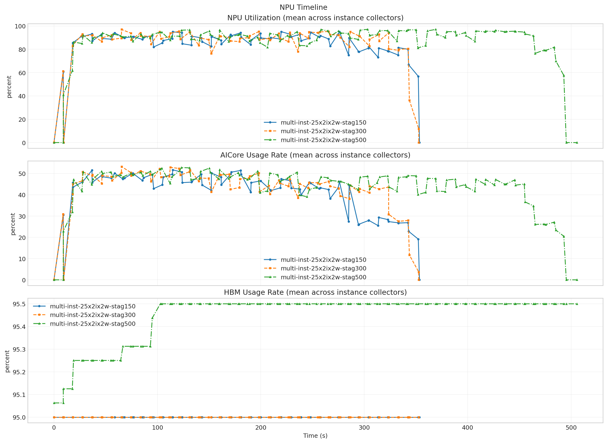

**Run Timing Table**

| scenario | run_dir | run_started_at | run_finished_at | run_wall_clock_sec | first_request_started_at | last_request_finished_at | request_window_sec |
| --- | --- | --- | --- | --- | --- | --- | --- |
| multi-inst-25x2ix2w-stag150 | /root/Zehao/ClawHarness/out/batch_run_5/task-01/20260420T134347Z_vps-docker-qwen3-235b-multi-inst-25x2ix2w-stag150-worker | 2026-04-20T13:44:03.573236+00:00 | 2026-04-20T13:50:11.215167+00:00 | 367.642 | 2026-04-20T13:44:03.640332+00:00 | 2026-04-20T13:49:53.772229+00:00 | 350.132 |
| multi-inst-25x2ix2w-stag300 | /root/Zehao/ClawHarness/out/batch_run_5/task-01/20260420T135500Z_vps-docker-qwen3-235b-multi-inst-25x2ix2w-stag300-worker | 2026-04-20T13:55:15.952829+00:00 | 2026-04-20T14:01:25.010506+00:00 | 369.058 | 2026-04-20T13:55:16.023138+00:00 | 2026-04-20T14:01:02.293645+00:00 | 346.271 |
| multi-inst-25x2ix2w-stag500 | /root/Zehao/ClawHarness/out/batch_run_5/task-01/20260420T140612Z_vps-docker-qwen3-235b-multi-inst-25x2ix2w-stag500-worker | 2026-04-20T14:06:27.214079+00:00 | 2026-04-20T14:15:05.829235+00:00 | 518.615 | 2026-04-20T14:06:28.039077+00:00 | 2026-04-20T14:14:39.671904+00:00 | 491.633 |

**Latency Overview Table**

| scenario | total_mean | total_p50 | total_p95 | total_p99 |
| --- | --- | --- | --- | --- |
| multi-inst-25x2ix2w-stag150 | 10164.477 | 7546.438 | 21443.974 | 43798.672 |
| multi-inst-25x2ix2w-stag300 | 10585.110 | 8269.535 | 19529.335 | 43253.250 |
| multi-inst-25x2ix2w-stag500 | 14234.744 | 14867.862 | 24593.755 | 49043.411 |

**Mean Latency by Phase Table**

| scenario | connect | send | wait | history | total |
| --- | --- | --- | --- | --- | --- |
| multi-inst-25x2ix2w-stag150 | 3750.030 | 13.279 | 9984.842 | 166.316 | 10164.477 |
| multi-inst-25x2ix2w-stag300 | 4030.526 | 12.014 | 10443.978 | 129.082 | 10585.110 |
| multi-inst-25x2ix2w-stag500 | 4052.876 | 17.690 | 14000.414 | 216.601 | 14234.744 |

**Tail Latency Table**

| scenario | send_p95 | send_p99 | wait_p50 | wait_p95 | wait_p99 | history_p95 | history_p99 | total_p95 | total_p99 |
| --- | --- | --- | --- | --- | --- | --- | --- | --- | --- |
| multi-inst-25x2ix2w-stag150 | 36.134 | 287.773 | 7537.527 | 17648.778 | 43784.406 | 14.602 | 4199.388 | 21443.974 | 43798.672 |
| multi-inst-25x2ix2w-stag300 | 37.879 | 263.395 | 8259.421 | 18498.190 | 43240.202 | 18.018 | 3834.907 | 19529.335 | 43253.250 |
| multi-inst-25x2ix2w-stag500 | 13.064 | 607.758 | 14856.026 | 24575.436 | 49032.395 | 16.033 | 10314.694 | 24593.755 | 49043.411 |

**System CPU Table**

| scenario | pct_cpu_total | pct_cpu_usr | pct_cpu_system | pct_cpu_wait |
| --- | --- | --- | --- | --- |
| multi-inst-25x2ix2w-stag150 | 43.417 | 34.576 | 8.841 | 0.058 |
| multi-inst-25x2ix2w-stag300 | 47.117 | 37.483 | 9.634 | 0.058 |
| multi-inst-25x2ix2w-stag500 | 35.332 | 28.122 | 7.210 | 0.039 |

**System Memory Table**

| scenario | rss_kib_total |
| --- | --- |
| multi-inst-25x2ix2w-stag150 | 1241407.016 |
| multi-inst-25x2ix2w-stag300 | 1208486.515 |
| multi-inst-25x2ix2w-stag500 | 1270060.897 |

**System Disk Table**

| scenario | busiest_device | pct_util | r_await | w_await | aqu_sz | system_wkb_s | benchmark_kb_wr_per_s |
| --- | --- | --- | --- | --- | --- | --- | --- |
| multi-inst-25x2ix2w-stag150 | sda | 0.620 | 0.013 | 0.448 | 0.096 | 6806.423 | 6620.971 |
| multi-inst-25x2ix2w-stag300 | sda | 0.644 | 0.003 | 0.465 | 0.094 | 6911.128 | 6676.697 |
| multi-inst-25x2ix2w-stag500 | sda | 0.489 | 0.000 | 0.406 | 0.075 | 5502.977 | 5434.809 |

**System Activity Table**

| scenario | interrupts_per_s | system_context_switches_per_s | run_queue | blocked_processes | benchmark_cswch_per_s | benchmark_nvcswch_per_s | benchmark_iodelay |
| --- | --- | --- | --- | --- | --- | --- | --- |
| multi-inst-25x2ix2w-stag150 | 827078.305 | 1331003.568 | 31.162 | 0.006 | 44.724 | 28.720 | 0.000 |
| multi-inst-25x2ix2w-stag300 | 817087.835 | 1321615.663 | 30.873 | 0.003 | 50.442 | 30.807 | 0.000 |
| multi-inst-25x2ix2w-stag500 | 819283.966 | 1321281.156 | 31.830 | 0.004 | 42.759 | 20.387 | 0.000 |

**Token Throughput Table**

| scenario | rows_with_usage | output_tokens_mean | output_tps_request_mean | output_tps_session_delta_mean |
| --- | --- | --- | --- | --- |
| multi-inst-25x2ix2w-stag150 | 100 | 83.660 | 9.367 | 4.400 |
| multi-inst-25x2ix2w-stag300 | 100 | 87.950 | 9.032 | 4.856 |
| multi-inst-25x2ix2w-stag500 | 100 | 131.430 | 10.737 | 6.366 |

**NPU Table**

| scenario | utilization_pct | hbm_usage_pct | aicore_usage_pct |
| --- | --- | --- | --- |
| multi-inst-25x2ix2w-stag150 | 82.044 | 95.000 | 39.965 |
| multi-inst-25x2ix2w-stag300 | 82.779 | 95.000 | 41.784 |
| multi-inst-25x2ix2w-stag500 | 85.807 | 95.446 | 43.034 |

**System Timeline Peaks Table**

| scenario | benchmark_cpu_peak | benchmark_cpu_peak_t_sec | benchmark_rss_peak_kib | benchmark_rss_peak_t_sec | system_disk_pct_util_peak | system_disk_pct_util_peak_t_sec | system_disk_w_await_peak | system_disk_w_await_peak_t_sec | system_interrupts_peak | system_interrupts_peak_t_sec | system_context_switches_peak | system_context_switches_peak_t_sec | system_run_queue_peak | system_run_queue_peak_t_sec | npu_utilization_peak | npu_utilization_peak_t_sec | npu_aicore_peak | npu_aicore_peak_t_sec | npu_hbm_peak | npu_hbm_peak_t_sec |
| --- | --- | --- | --- | --- | --- | --- | --- | --- | --- | --- | --- | --- | --- | --- | --- | --- | --- | --- | --- | --- |
| multi-inst-25x2ix2w-stag150 | 294.000 | 9.000 | 1722988.000 | 24.000 | 6.200 | 29.000 | 3.050 | 12.000 | 1022746.000 | 346.000 | 1590379.500 | 346.000 | 66.500 | 289.000 | 95.062 | 219.775 | 51.688 | 114.983 | 95.000 | 0.000 |
| multi-inst-25x2ix2w-stag300 | 321.000 | 89.000 | 1742364.000 | 22.000 | 5.600 | 36.000 | 3.420 | 12.000 | 984411.000 | 336.000 | 1552910.500 | 266.000 | 67.000 | 179.000 | 97.000 | 65.363 | 53.250 | 65.363 | 95.000 | 0.000 |
| multi-inst-25x2ix2w-stag500 | 312.000 | 41.000 | 1915264.000 | 24.000 | 7.200 | 61.000 | 3.290 | 31.000 | 976120.500 | 470.000 | 1533704.000 | 497.000 | 66.500 | 86.000 | 97.125 | 303.267 | 52.812 | 123.129 | 95.500 | 102.799 |
