## `multi-25x4w-stag150` vs `multi-25x4w-stag300` vs `multi-25x4w-stag500`

**Run Dirs**

| scenario | run_dir | instance_num | requests_total | requests_ok | requests_failed |
| --- | --- | --- | --- | --- | --- |
| multi-25x4w-stag150 | /root/Zehao/ClawHarness/out/batch_run_5/task-01/20260420T130112Z_vps-docker-qwen3-235b-multi-25x4w-stag150-request | 1 | 100 | 100 | 0 |
| multi-25x4w-stag300 | /root/Zehao/ClawHarness/out/batch_run_5/task-01/20260420T131245Z_vps-docker-qwen3-235b-multi-25x4w-stag300-request | 1 | 100 | 100 | 0 |
| multi-25x4w-stag500 | /root/Zehao/ClawHarness/out/batch_run_5/task-01/20260420T132533Z_vps-docker-qwen3-235b-multi-25x4w-stag500-request | 1 | 100 | 100 | 0 |

**Aggregation Policy**

- `pidstat` per-process metrics are summed across instances.
- `iostat` and `vmstat` host-wide metrics are averaged across instance collectors.
- This makes multi-instance runs comparable with single-instance runs at the whole-machine level.

**Figures**

- 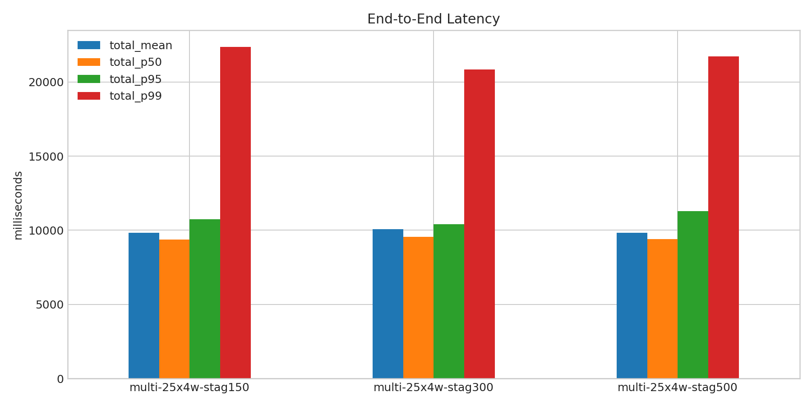
- 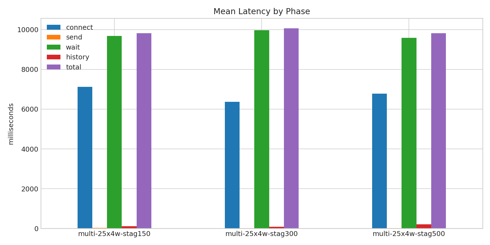
- 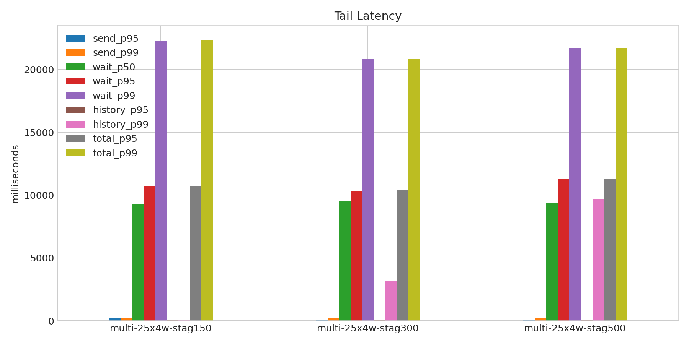
- 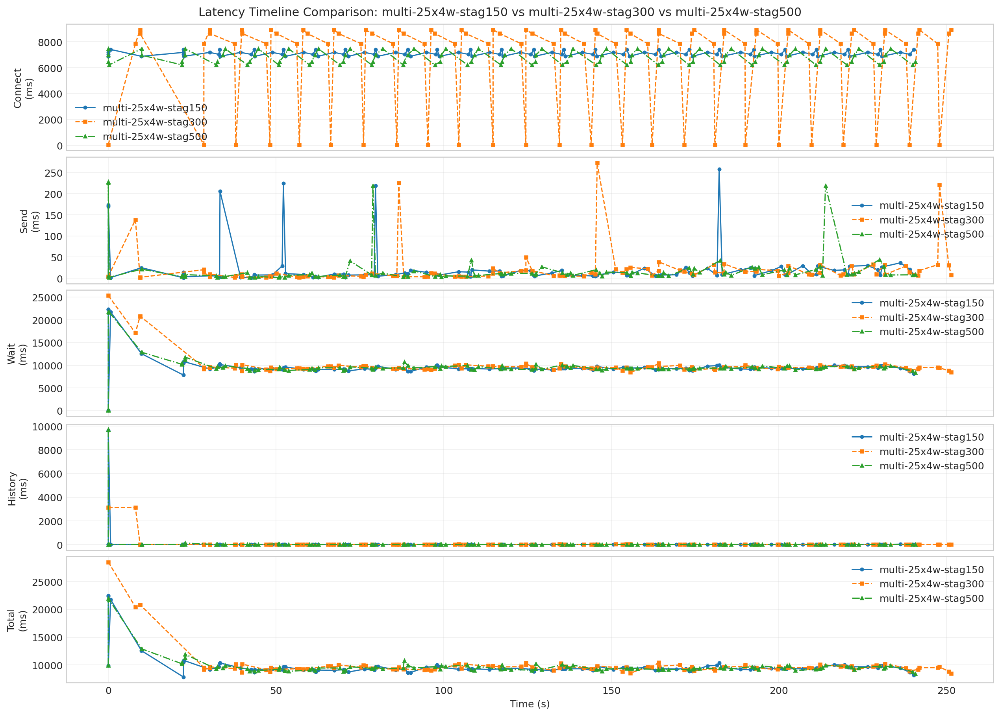
- 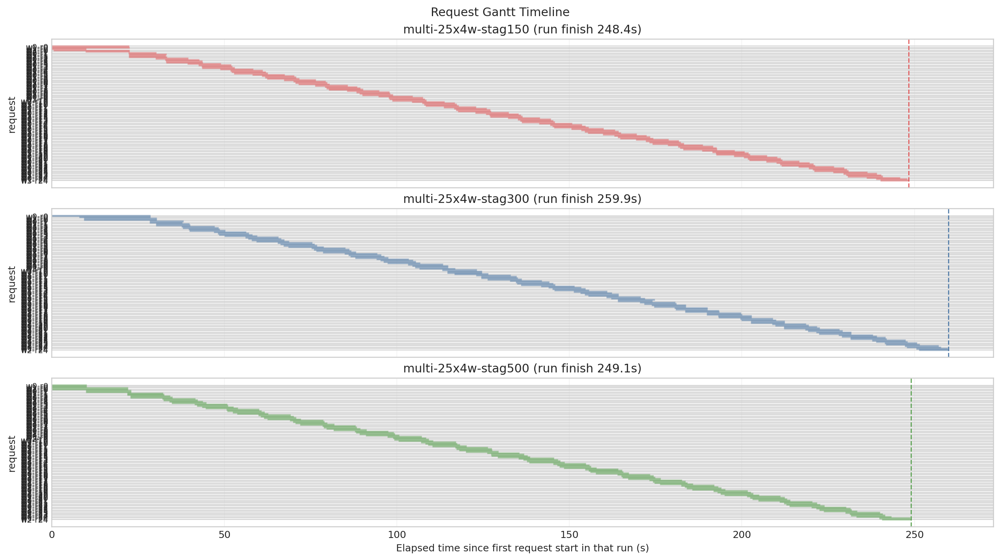
- 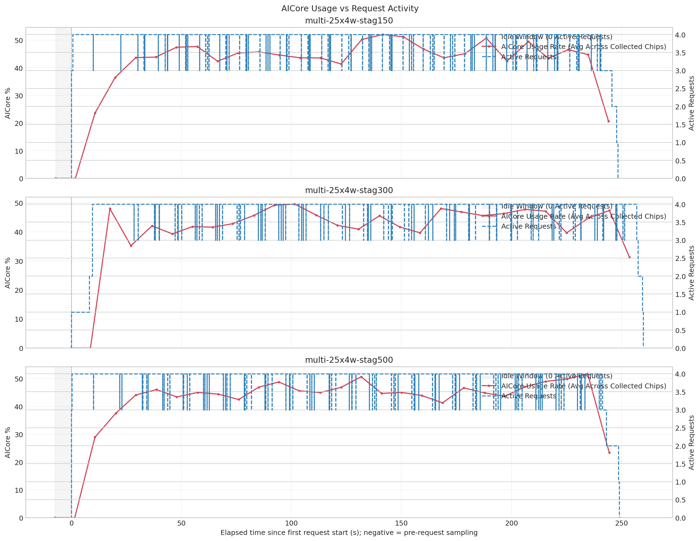
- 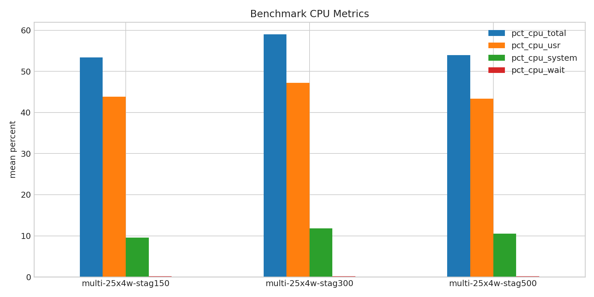
- 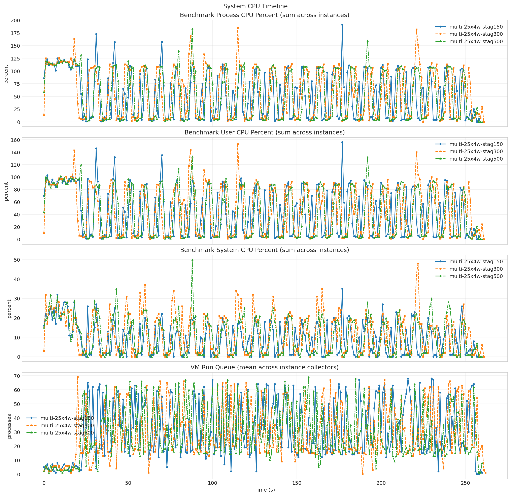
- 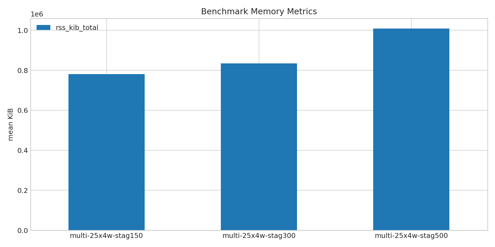
- 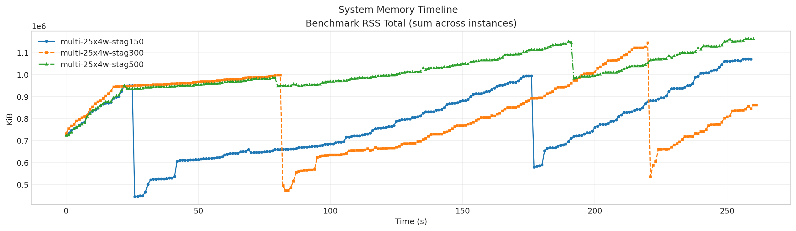
- 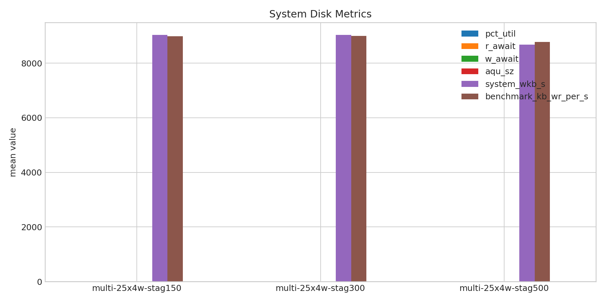
- 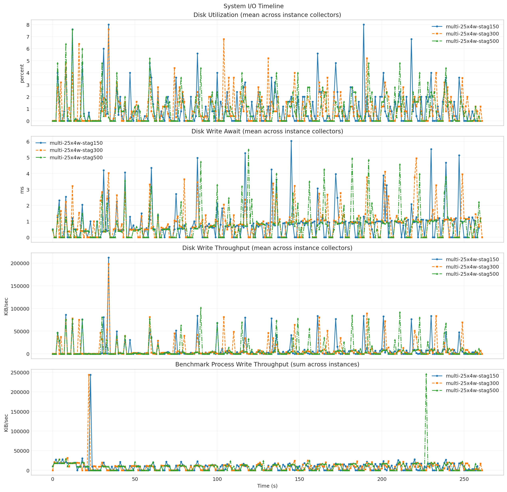
- 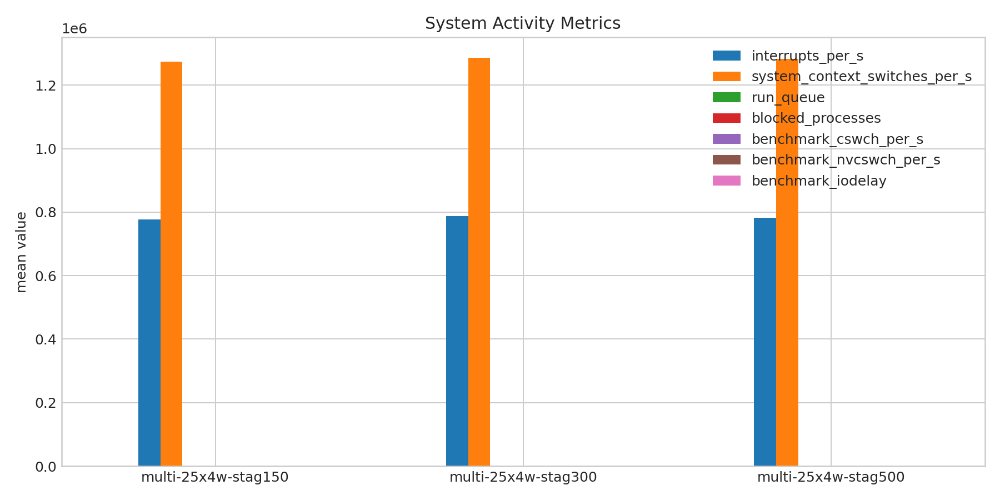
- 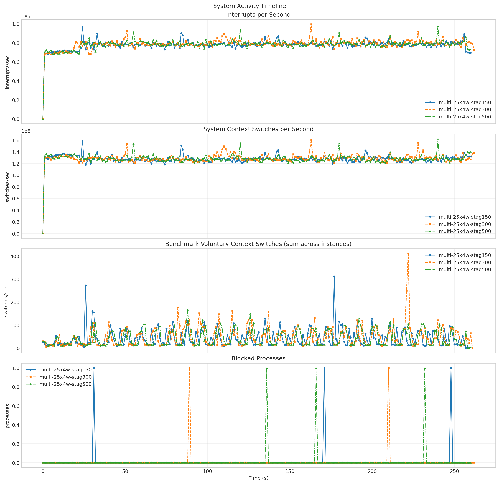
- 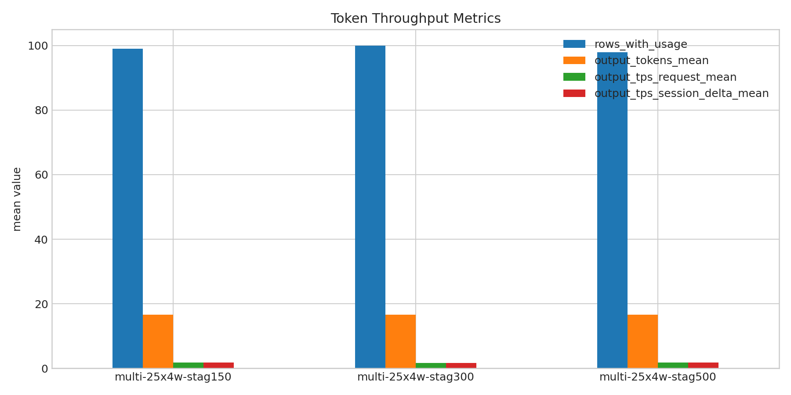
- 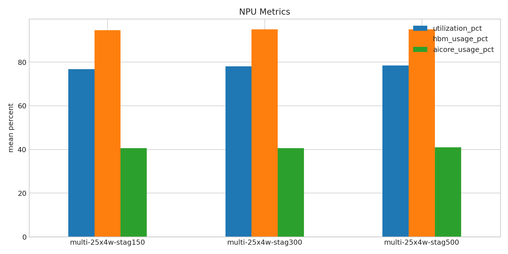
- 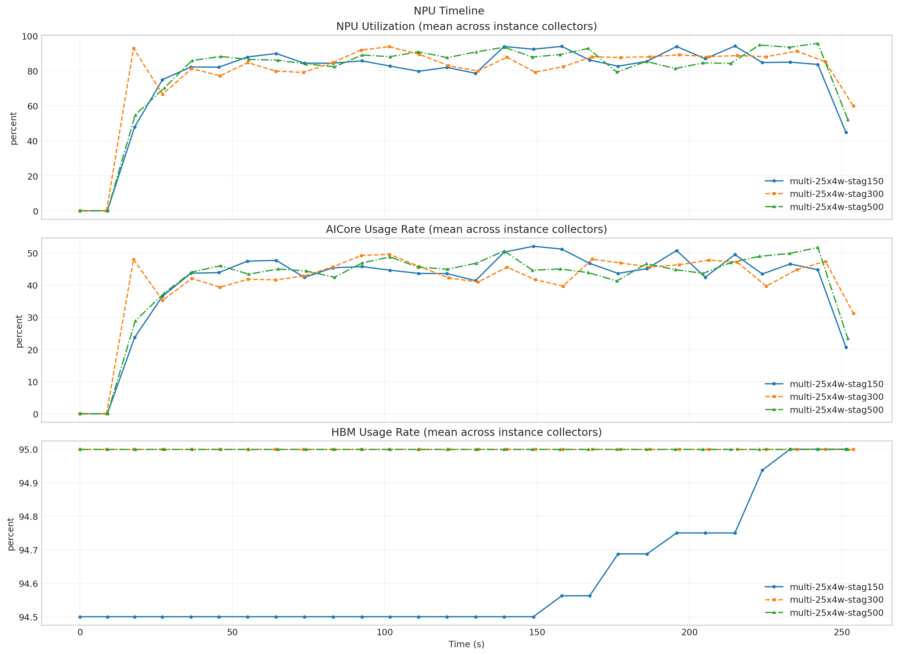

**Run Timing Table**

| scenario | run_dir | run_started_at | run_finished_at | run_wall_clock_sec | first_request_started_at | last_request_finished_at | request_window_sec |
| --- | --- | --- | --- | --- | --- | --- | --- |
| multi-25x4w-stag150 | /root/Zehao/ClawHarness/out/batch_run_5/task-01/20260420T130112Z_vps-docker-qwen3-235b-multi-25x4w-stag150-request | 2026-04-20T13:01:20.223295+00:00 | 2026-04-20T13:05:48.231211+00:00 | 268.008 | 2026-04-20T13:01:27.404507+00:00 | 2026-04-20T13:05:35.798067+00:00 | 248.394 |
| multi-25x4w-stag300 | /root/Zehao/ClawHarness/out/batch_run_5/task-01/20260420T131245Z_vps-docker-qwen3-235b-multi-25x4w-stag300-request | 2026-04-20T13:12:53.802852+00:00 | 2026-04-20T13:17:23.421376+00:00 | 269.619 | 2026-04-20T13:12:53.868240+00:00 | 2026-04-20T13:17:13.748515+00:00 | 259.880 |
| multi-25x4w-stag500 | /root/Zehao/ClawHarness/out/batch_run_5/task-01/20260420T132533Z_vps-docker-qwen3-235b-multi-25x4w-stag500-request | 2026-04-20T13:25:41.795349+00:00 | 2026-04-20T13:30:10.959344+00:00 | 269.164 | 2026-04-20T13:25:49.265092+00:00 | 2026-04-20T13:29:58.331433+00:00 | 249.066 |

**Latency Overview Table**

| scenario | total_mean | total_p50 | total_p95 | total_p99 |
| --- | --- | --- | --- | --- |
| multi-25x4w-stag150 | 9818.022 | 9359.022 | 10740.895 | 22369.279 |
| multi-25x4w-stag300 | 10068.444 | 9569.892 | 10414.612 | 20843.874 |
| multi-25x4w-stag500 | 9819.878 | 9417.068 | 11295.614 | 21724.197 |

**Mean Latency by Phase Table**

| scenario | connect | send | wait | history | total |
| --- | --- | --- | --- | --- | --- |
| multi-25x4w-stag150 | 7125.057 | 23.622 | 9685.547 | 108.809 | 9818.022 |
| multi-25x4w-stag300 | 6370.838 | 20.584 | 9968.892 | 78.930 | 10068.444 |
| multi-25x4w-stag500 | 6780.303 | 19.943 | 9591.069 | 208.826 | 9819.878 |

**Tail Latency Table**

| scenario | send_p95 | send_p99 | wait_p50 | wait_p95 | wait_p99 | history_p95 | history_p99 | total_p95 | total_p99 |
| --- | --- | --- | --- | --- | --- | --- | --- | --- | --- |
| multi-25x4w-stag150 | 169.912 | 224.419 | 9326.863 | 10720.867 | 22268.056 | 22.491 | 39.837 | 10740.895 | 22369.279 |
| multi-25x4w-stag300 | 38.459 | 225.592 | 9522.569 | 10350.269 | 20828.750 | 39.084 | 3129.247 | 10414.612 | 20843.874 |
| multi-25x4w-stag500 | 42.924 | 225.228 | 9381.231 | 11281.706 | 21695.922 | 26.114 | 9692.420 | 11295.614 | 21724.197 |

**System CPU Table**

| scenario | pct_cpu_total | pct_cpu_usr | pct_cpu_system | pct_cpu_wait |
| --- | --- | --- | --- | --- |
| multi-25x4w-stag150 | 53.385 | 43.812 | 9.572 | 0.192 |
| multi-25x4w-stag300 | 59.031 | 47.202 | 11.828 | 0.156 |
| multi-25x4w-stag500 | 53.938 | 43.379 | 10.559 | 0.146 |

**System Memory Table**

| scenario | rss_kib_total |
| --- | --- |
| multi-25x4w-stag150 | 780335.692 |
| multi-25x4w-stag300 | 834568.305 |
| multi-25x4w-stag500 | 1008802.330 |

**System Disk Table**

| scenario | busiest_device | pct_util | r_await | w_await | aqu_sz | system_wkb_s | benchmark_kb_wr_per_s |
| --- | --- | --- | --- | --- | --- | --- | --- |
| multi-25x4w-stag150 | sda | 0.997 | 0.008 | 0.822 | 0.140 | 9032.193 | 8988.371 |
| multi-25x4w-stag300 | sda | 0.965 | 0.019 | 0.838 | 0.154 | 9033.267 | 8997.282 |
| multi-25x4w-stag500 | sda | 0.910 | 0.000 | 0.747 | 0.144 | 8679.264 | 8779.893 |

**System Activity Table**

| scenario | interrupts_per_s | system_context_switches_per_s | run_queue | blocked_processes | benchmark_cswch_per_s | benchmark_nvcswch_per_s | benchmark_iodelay |
| --- | --- | --- | --- | --- | --- | --- | --- |
| multi-25x4w-stag150 | 776784.188 | 1274769.923 | 31.893 | 0.011 | 43.763 | 66.091 | 0.000 |
| multi-25x4w-stag300 | 786915.859 | 1286382.867 | 29.270 | 0.008 | 47.019 | 63.561 | 0.000 |
| multi-25x4w-stag500 | 782008.307 | 1282399.421 | 29.575 | 0.011 | 42.900 | 55.374 | 0.000 |

**Token Throughput Table**

| scenario | rows_with_usage | output_tokens_mean | output_tps_request_mean | output_tps_session_delta_mean |
| --- | --- | --- | --- | --- |
| multi-25x4w-stag150 | 99 | 16.657 | 1.746 | 1.746 |
| multi-25x4w-stag300 | 100 | 16.550 | 1.705 | 1.705 |
| multi-25x4w-stag500 | 98 | 16.541 | 1.721 | 1.721 |

**NPU Table**

| scenario | utilization_pct | hbm_usage_pct | aicore_usage_pct |
| --- | --- | --- | --- |
| multi-25x4w-stag150 | 76.708 | 94.614 | 40.596 |
| multi-25x4w-stag300 | 78.056 | 95.000 | 40.576 |
| multi-25x4w-stag500 | 78.446 | 95.000 | 40.924 |

**System Timeline Peaks Table**

| scenario | benchmark_cpu_peak | benchmark_cpu_peak_t_sec | benchmark_rss_peak_kib | benchmark_rss_peak_t_sec | system_disk_pct_util_peak | system_disk_pct_util_peak_t_sec | system_disk_w_await_peak | system_disk_w_await_peak_t_sec | system_interrupts_peak | system_interrupts_peak_t_sec | system_context_switches_peak | system_context_switches_peak_t_sec | system_run_queue_peak | system_run_queue_peak_t_sec | npu_utilization_peak | npu_utilization_peak_t_sec | npu_aicore_peak | npu_aicore_peak_t_sec | npu_hbm_peak | npu_hbm_peak_t_sec |
| --- | --- | --- | --- | --- | --- | --- | --- | --- | --- | --- | --- | --- | --- | --- | --- | --- | --- | --- | --- | --- |
| multi-25x4w-stag150 | 191.000 | 177.000 | 1071296.000 | 256.000 | 8.000 | 34.000 | 6.030 | 145.000 | 966472.000 | 24.000 | 1587516.000 | 24.000 | 68.000 | 216.000 | 94.062 | 214.905 | 52.062 | 148.790 | 95.000 | 233.008 |
| multi-25x4w-stag300 | 185.000 | 115.000 | 1144624.000 | 220.000 | 7.600 | 34.000 | 4.950 | 221.000 | 996245.000 | 163.000 | 1603873.000 | 163.000 | 69.000 | 20.000 | 93.688 | 101.553 | 49.562 | 101.553 | 95.000 | 0.000 |
| multi-25x4w-stag500 | 183.000 | 88.000 | 1162908.000 | 257.000 | 7.600 | 12.000 | 5.500 | 119.000 | 975251.000 | 240.000 | 1623700.000 | 240.000 | 69.000 | 157.000 | 95.625 | 242.138 | 51.688 | 242.138 | 95.000 | 0.000 |
