## `多会话并发150ms间隔` vs `多会话并发300ms间隔` vs `多会话并发500ms间隔`

**Run Dirs**

| scenario | run_dir | instance_num | requests_total | requests_ok | requests_failed |
| --- | --- | --- | --- | --- | --- |
| 多会话并发150ms间隔 | /root/Zehao/ClawHarness/out/batch_run_5/task-01/20260420T125313Z_vps-docker-qwen3-235b-multi-25x4w-stag150-worker | 1 | 100 | 100 | 0 |
| 多会话并发300ms间隔 | /root/Zehao/ClawHarness/out/batch_run_5/task-01/20260420T130548Z_vps-docker-qwen3-235b-multi-25x4w-stag300-worker | 1 | 100 | 100 | 0 |
| 多会话并发500ms间隔 | /root/Zehao/ClawHarness/out/batch_run_5/task-01/20260420T131723Z_vps-docker-qwen3-235b-multi-25x4w-stag500-worker | 1 | 100 | 100 | 0 |

**Aggregation Policy**

- `pidstat` per-process metrics are summed across instances.
- `iostat` and `vmstat` host-wide metrics are averaged across instance collectors.
- This makes multi-instance runs comparable with single-instance runs at the whole-machine level.

**Figures**

- 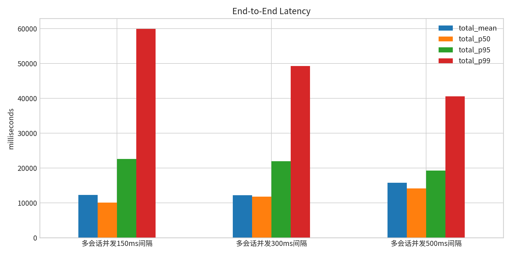
- 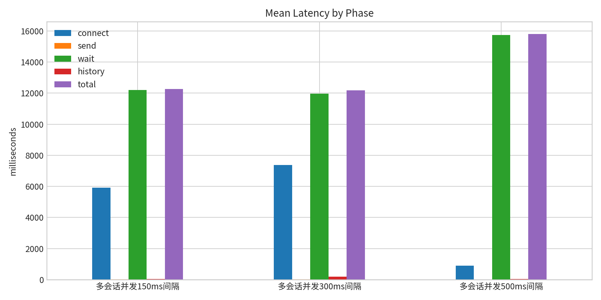
- 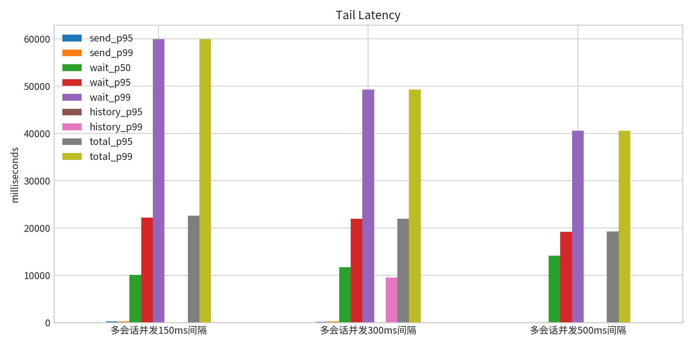
- 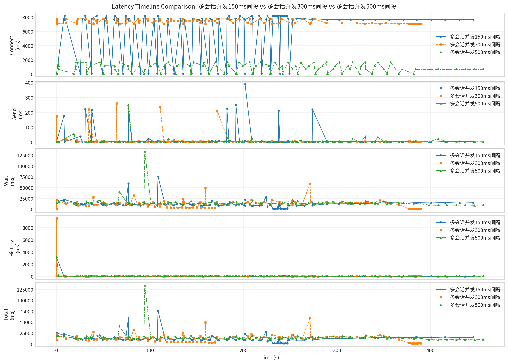
- 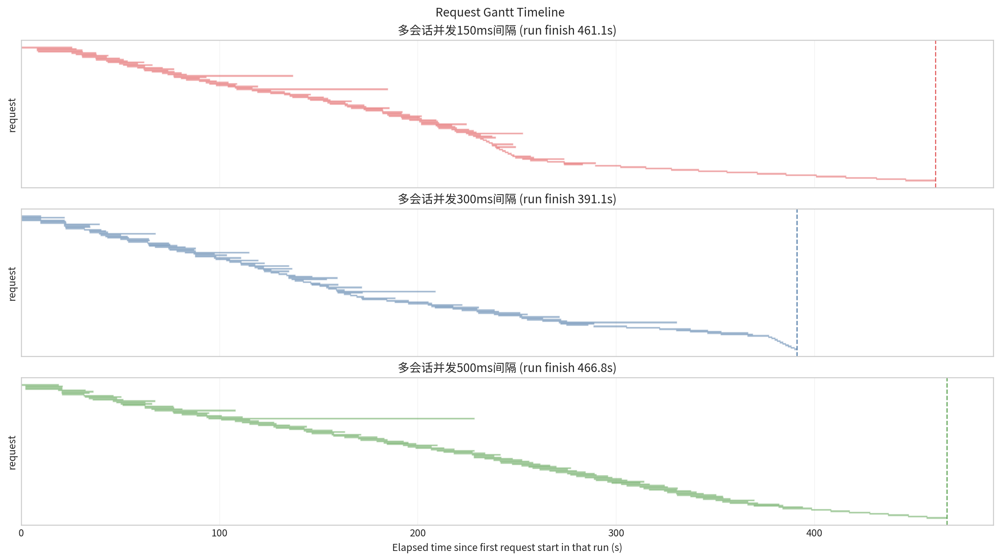
- 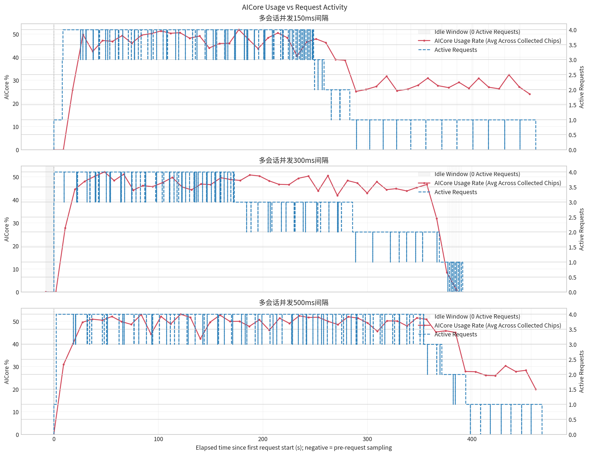
- 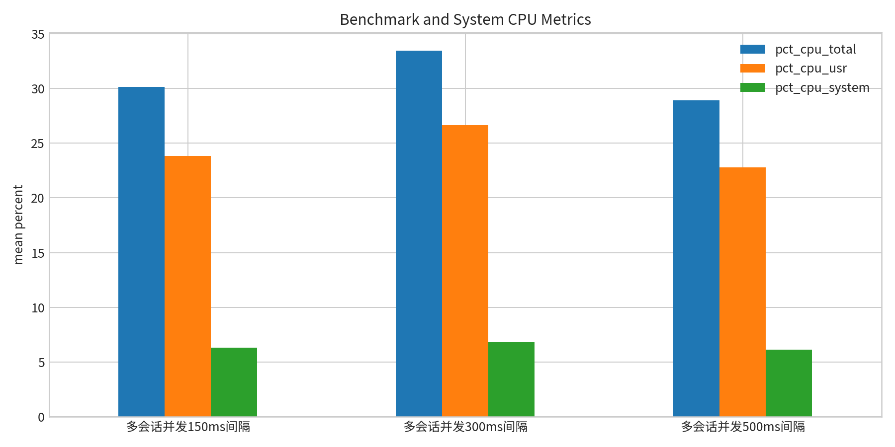
- 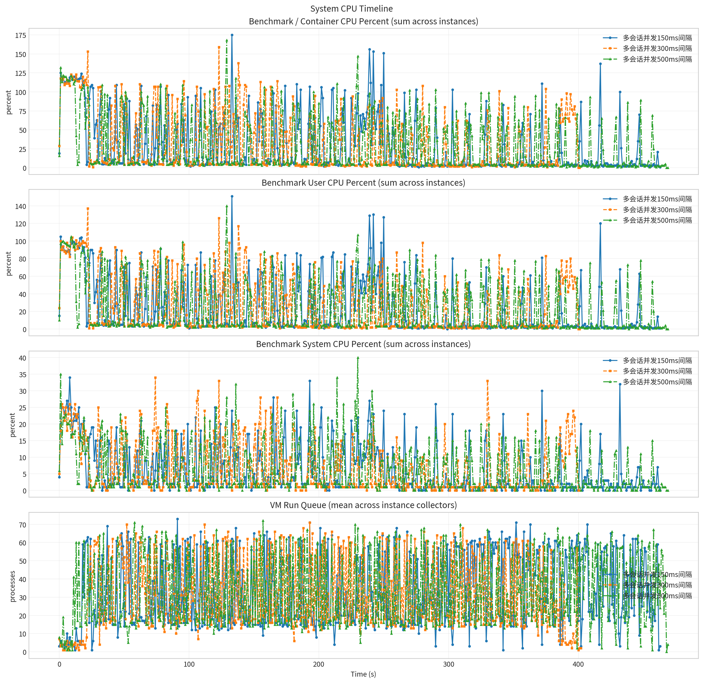
- 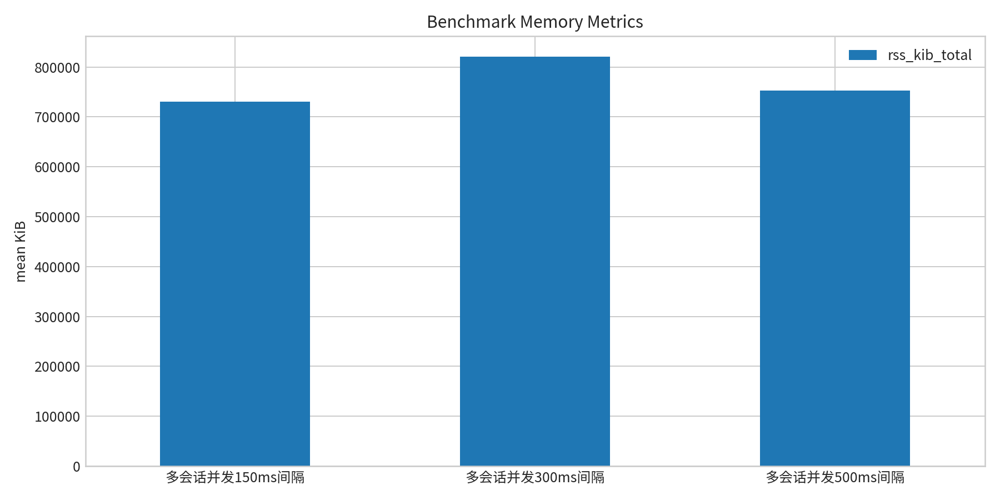
- 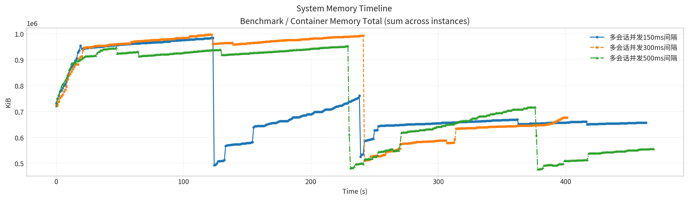
- 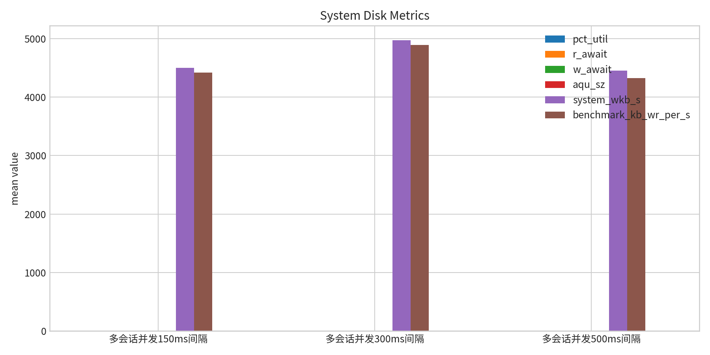
- 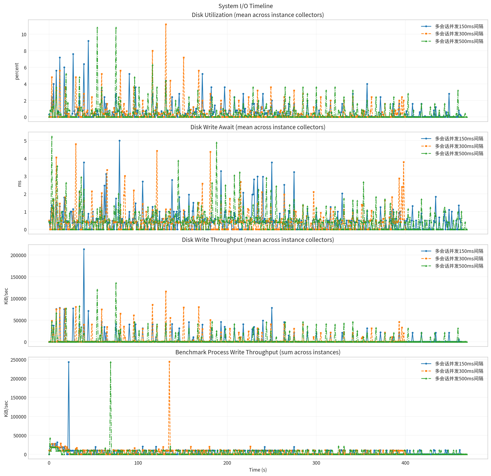
- 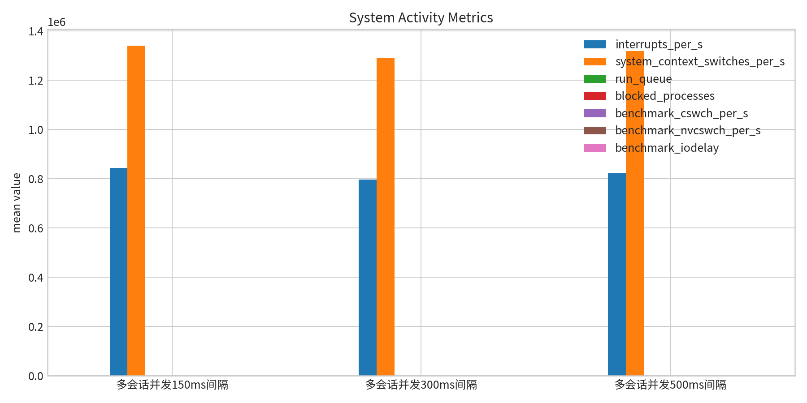
- 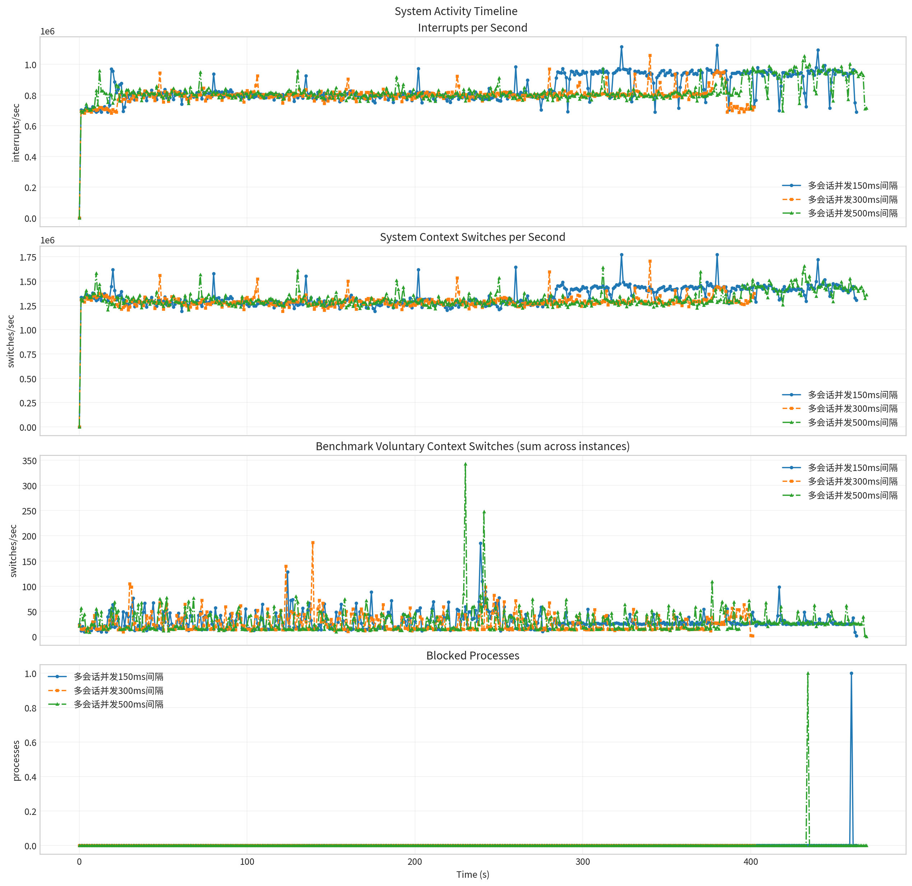
- 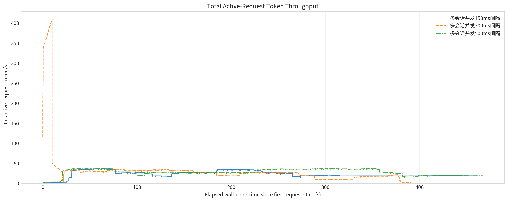
- 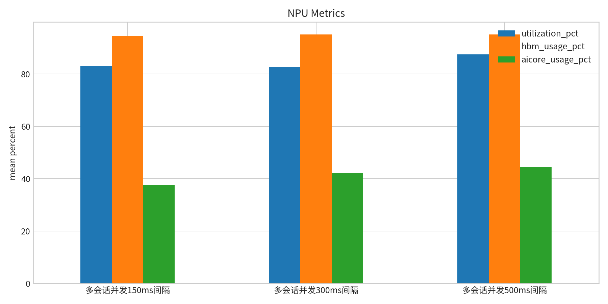
- 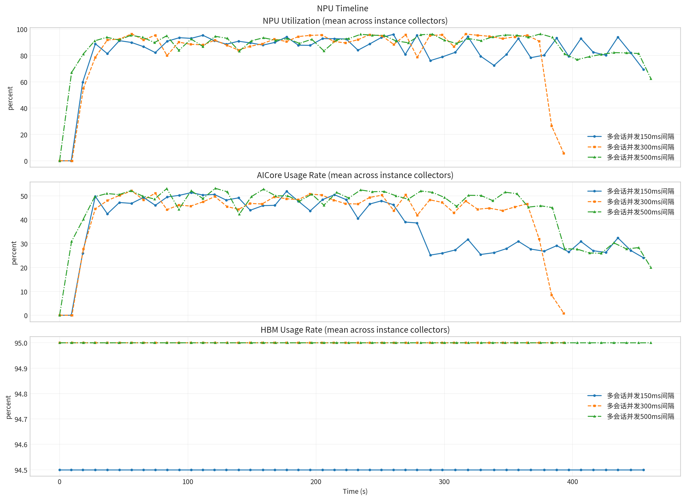

**Run Timing Table**

| scenario | run_dir | run_started_at | run_finished_at | run_wall_clock_sec | first_request_started_at | last_request_finished_at | request_window_sec |
| --- | --- | --- | --- | --- | --- | --- | --- |
| 多会话并发150ms间隔 | /root/Zehao/ClawHarness/out/batch_run_5/task-01/20260420T125313Z_vps-docker-qwen3-235b-multi-25x4w-stag150-worker | 2026-04-20T12:53:21.841252+00:00 | 2026-04-20T13:01:11.676508+00:00 | 469.835 | 2026-04-20T12:53:21.907285+00:00 | 2026-04-20T13:01:02.958821+00:00 | 461.052 |
| 多会话并发300ms间隔 | /root/Zehao/ClawHarness/out/batch_run_5/task-01/20260420T130548Z_vps-docker-qwen3-235b-multi-25x4w-stag300-worker | 2026-04-20T13:05:56.628430+00:00 | 2026-04-20T13:12:45.044197+00:00 | 408.416 | 2026-04-20T13:06:04.387360+00:00 | 2026-04-20T13:12:35.517295+00:00 | 391.130 |
| 多会话并发500ms间隔 | /root/Zehao/ClawHarness/out/batch_run_5/task-01/20260420T131723Z_vps-docker-qwen3-235b-multi-25x4w-stag500-worker | 2026-04-20T13:17:32.152036+00:00 | 2026-04-20T13:25:32.847096+00:00 | 480.695 | 2026-04-20T13:17:32.222626+00:00 | 2026-04-20T13:25:19.059390+00:00 | 466.837 |

**Latency Overview Table**

| scenario | total_mean | total_p50 | total_p95 | total_p99 |
| --- | --- | --- | --- | --- |
| 多会话并发150ms间隔 | 12263.389 | 10095.369 | 22580.736 | 59863.117 |
| 多会话并发300ms间隔 | 12178.930 | 11751.390 | 21972.822 | 49261.294 |
| 多会话并发500ms间隔 | 15793.655 | 14126.145 | 19222.430 | 40556.523 |

**Mean Latency by Phase Table**

| scenario | connect | send | wait | history | total |
| --- | --- | --- | --- | --- | --- |
| 多会话并发150ms间隔 | 5922.907 | 27.054 | 12195.869 | 40.428 | 12263.389 |
| 多会话并发300ms间隔 | 7366.226 | 16.960 | 11961.395 | 200.537 | 12178.930 |
| 多会话并发500ms间隔 | 898.628 | 8.495 | 15743.316 | 41.806 | 15793.655 |

**Tail Latency Table**

| scenario | send_p95 | send_p99 | wait_p50 | wait_p95 | wait_p99 | history_p95 | history_p99 | total_p95 | total_p99 |
| --- | --- | --- | --- | --- | --- | --- | --- | --- | --- |
| 多会话并发150ms间隔 | 215.690 | 249.944 | 10058.786 | 22187.578 | 59852.387 | 16.060 | 35.331 | 22580.736 | 59863.117 |
| 多会话并发300ms间隔 | 172.106 | 235.123 | 11739.015 | 21958.668 | 49249.991 | 21.809 | 9499.376 | 21972.822 | 49261.294 |
| 多会话并发500ms间隔 | 23.974 | 56.965 | 14114.849 | 19210.958 | 40541.727 | 16.970 | 33.874 | 19222.430 | 40556.523 |

**System CPU Table**

| scenario | pct_cpu_total | pct_cpu_usr | pct_cpu_system |
| --- | --- | --- | --- |
| 多会话并发150ms间隔 | 30.133 | 23.840 | 6.293 |
| 多会话并发300ms间隔 | 33.440 | 26.629 | 6.811 |
| 多会话并发500ms间隔 | 28.929 | 22.785 | 6.145 |

**System Memory Table**

| scenario | rss_kib_total |
| --- | --- |
| 多会话并发150ms间隔 | 730241.448 |
| 多会话并发300ms间隔 | 820487.960 |
| 多会话并发500ms间隔 | 752520.502 |

**System Disk Table**

| scenario | busiest_device | pct_util | r_await | w_await | aqu_sz | system_wkb_s | benchmark_kb_wr_per_s |
| --- | --- | --- | --- | --- | --- | --- | --- |
| 多会话并发150ms间隔 | sda | 0.458 | 0.009 | 0.406 | 0.067 | 4502.791 | 4422.621 |
| 多会话并发300ms间隔 | sda | 0.481 | 0.002 | 0.423 | 0.059 | 4971.525 | 4894.040 |
| 多会话并发500ms间隔 | sda | 0.468 | 0.003 | 0.472 | 0.053 | 4451.498 | 4323.413 |

**System Activity Table**

| scenario | interrupts_per_s | system_context_switches_per_s | run_queue | blocked_processes | benchmark_cswch_per_s | benchmark_nvcswch_per_s | benchmark_iodelay |
| --- | --- | --- | --- | --- | --- | --- | --- |
| 多会话并发150ms间隔 | 843939.440 | 1338884.073 | 33.194 | 0.002 | 29.299 | 18.506 | 0.000 |
| 多会话并发300ms间隔 | 795641.072 | 1289057.903 | 31.263 | 0.000 | 26.164 | 32.463 | 0.000 |
| 多会话并发500ms间隔 | 821966.960 | 1316656.806 | 32.304 | 0.002 | 29.161 | 17.327 | 0.000 |

**Token Throughput Table**

| scenario | overall_output_tps |
| --- | --- |
| 多会话并发150ms间隔 | 25.257 |
| 多会话并发300ms间隔 | 26.398 |
| 多会话并发500ms间隔 | 30.872 |

**NPU Table**

| scenario | utilization_pct | hbm_usage_pct | aicore_usage_pct |
| --- | --- | --- | --- |
| 多会话并发150ms间隔 | 82.974 | 94.500 | 37.557 |
| 多会话并发300ms间隔 | 82.568 | 95.000 | 42.221 |
| 多会话并发500ms间隔 | 87.409 | 95.000 | 44.374 |

**System Timeline Peaks Table**

| scenario | benchmark_cpu_peak | benchmark_cpu_peak_t_sec | benchmark_rss_peak_kib | benchmark_rss_peak_t_sec | system_disk_pct_util_peak | system_disk_pct_util_peak_t_sec | system_disk_w_await_peak | system_disk_w_await_peak_t_sec | system_interrupts_peak | system_interrupts_peak_t_sec | system_context_switches_peak | system_context_switches_peak_t_sec | system_run_queue_peak | system_run_queue_peak_t_sec | npu_utilization_peak | npu_utilization_peak_t_sec | npu_aicore_peak | npu_aicore_peak_t_sec | npu_hbm_peak | npu_hbm_peak_t_sec |
| --- | --- | --- | --- | --- | --- | --- | --- | --- | --- | --- | --- | --- | --- | --- | --- | --- | --- | --- | --- | --- |
| 多会话并发150ms间隔 | 175.000 | 133.000 | 984576.000 | 122.000 | 9.200 | 44.000 | 5.000 | 79.000 | 1124174.000 | 380.000 | 1774435.000 | 380.000 | 73.000 | 91.000 | 96.000 | 260.270 | 51.875 | 176.993 | 94.500 | 0.000 |
| 多会话并发300ms间隔 | 159.000 | 123.000 | 996820.000 | 120.000 | 11.200 | 131.000 | 4.810 | 30.000 | 1059605.000 | 340.000 | 1707707.000 | 340.000 | 71.000 | 193.000 | 96.438 | 56.255 | 52.062 | 56.255 | 95.000 | 0.000 |
| 多会话并发500ms间隔 | 168.000 | 129.000 | 952960.000 | 229.000 | 10.800 | 54.000 | 5.230 | 3.000 | 1053689.000 | 432.000 | 1654277.000 | 432.000 | 72.000 | 157.000 | 96.375 | 375.020 | 53.125 | 121.326 | 95.000 | 0.000 |
