## `serial-100` vs `1c1i-10w` vs `1c2oc-2x5w`

Generated at: 2026-05-24 08:06:08+08:00

**Run Dirs**

| scenario | run_dir | requests_total | requests_ok | requests_failed |
| --- | --- | --- | --- | --- |
| serial-100 | /root/Zehao/ClawHarness/out/batch_run_burst_smoke/context-list-smoke/20260523T235202Z_vps-docker-burst-smoke-burst-serial-100-smoke | 100 | 100 | 0 |
| 1c1i-10w | /root/Zehao/ClawHarness/out/batch_run_burst_smoke/context-list-smoke/20260523T235241Z_vps-docker-burst-smoke-burst-single-container-single-instance-10w-smoke | 100 | 100 | 0 |
| 1c2oc-2x5w | /root/Zehao/ClawHarness/out/batch_run_burst_smoke/context-list-smoke/20260523T235854Z_vps-docker-burst-smoke-burst-single-container-multi-openclaw-2x5w-smoke | 100 | 100 | 0 |

**Run Timing Table**

| scenario | run_dir | run_started_at | run_finished_at | run_wall_clock_sec | first_request_started_at | last_request_finished_at | request_window_sec |
| --- | --- | --- | --- | --- | --- | --- | --- |
| serial-100 | /root/Zehao/ClawHarness/out/batch_run_burst_smoke/context-list-smoke/20260523T235202Z_vps-docker-burst-smoke-burst-serial-100-smoke | 2026-05-23T23:52:03.142314+00:00 | 2026-05-23T23:52:41.730269+00:00 | 38.588 | 2026-05-23T23:52:03.203013+00:00 | 2026-05-23T23:52:40.707526+00:00 | 37.505 |
| 1c1i-10w | /root/Zehao/ClawHarness/out/batch_run_burst_smoke/context-list-smoke/20260523T235241Z_vps-docker-burst-smoke-burst-single-container-single-instance-10w-smoke | 2026-05-23T23:52:42.956423+00:00 | 2026-05-23T23:53:43.718576+00:00 | 60.762 | 2026-05-23T23:52:43.291854+00:00 | 2026-05-23T23:53:42.261500+00:00 | 58.970 |
| 1c2oc-2x5w | /root/Zehao/ClawHarness/out/batch_run_burst_smoke/context-list-smoke/20260523T235854Z_vps-docker-burst-smoke-burst-single-container-multi-openclaw-2x5w-smoke | 2026-05-23T23:59:02.459110+00:00 | 2026-05-23T23:59:38.939830+00:00 | 36.481 | 2026-05-23T23:59:03.346398+00:00 | 2026-05-23T23:59:36.870850+00:00 | 33.524 |

**Figures**

- 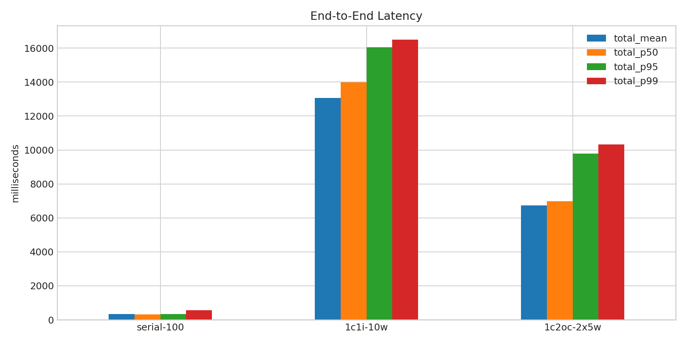
- 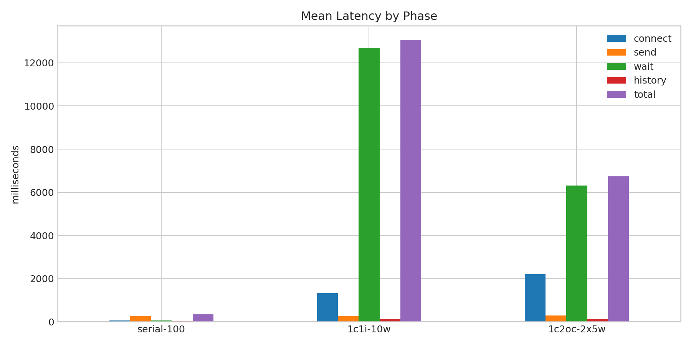
- 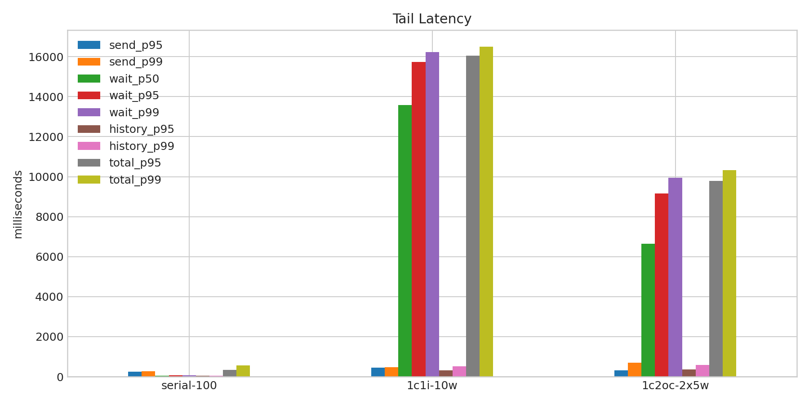
- 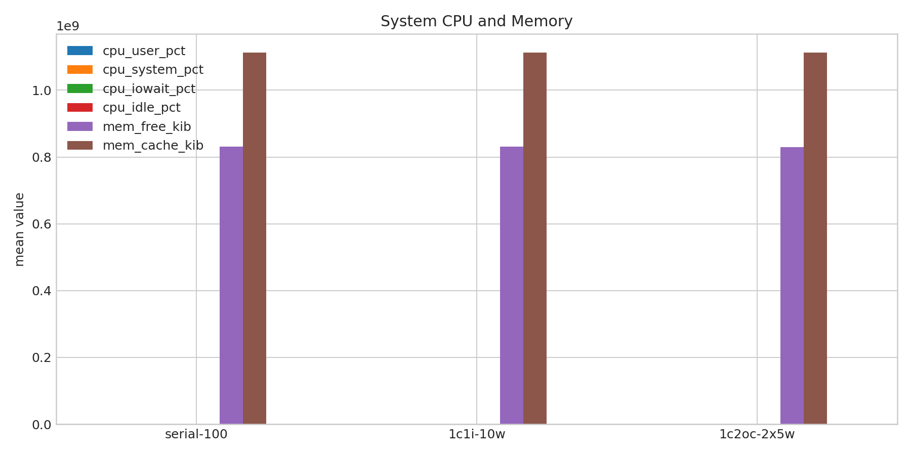
- 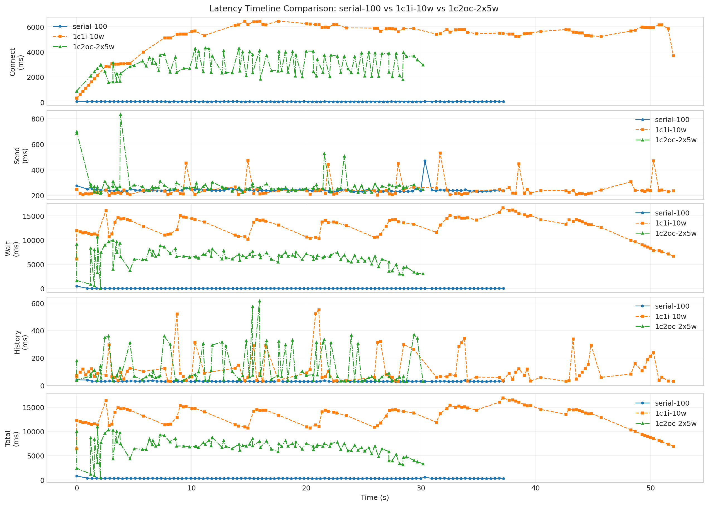
- 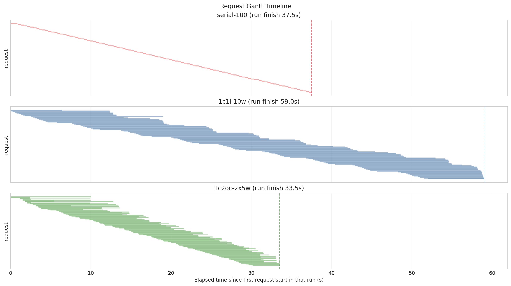
- 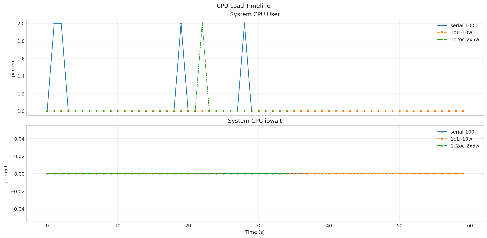
- 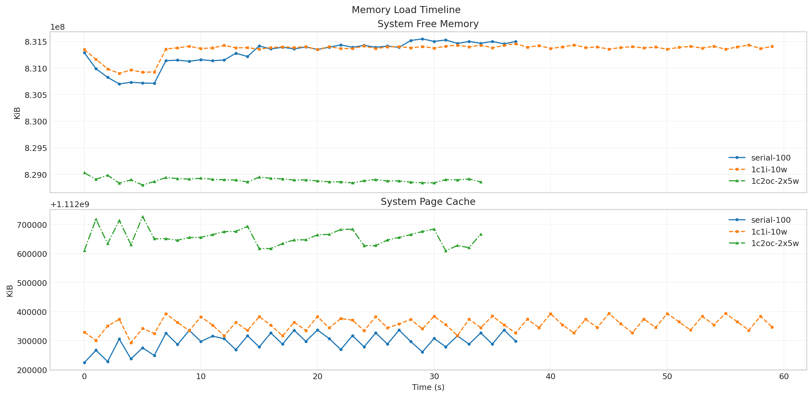
- 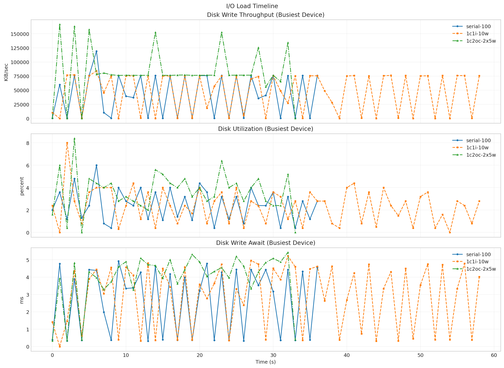
- 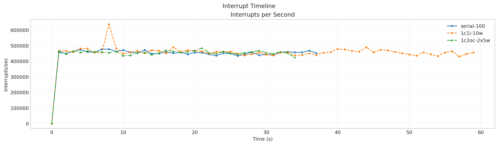
- 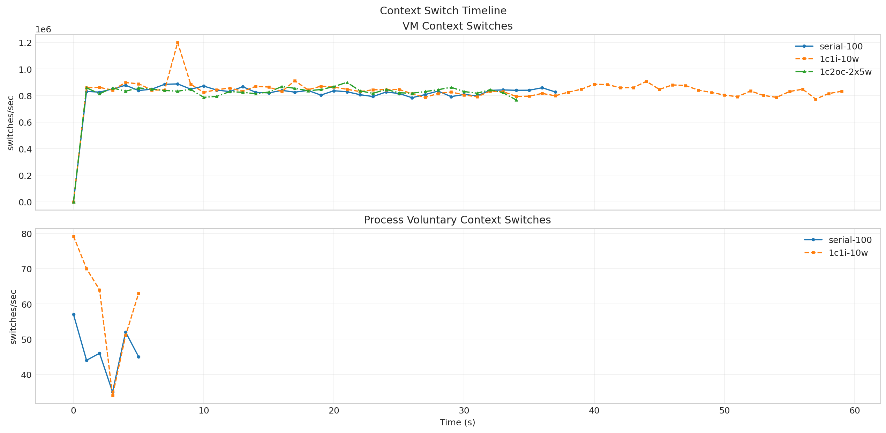

**Latency Overview Table**

| scenario | total_mean | total_p50 | total_p95 | total_p99 |
| --- | --- | --- | --- | --- |
| serial-100 | 330.461 | 321.276 | 345.605 | 551.666 |
| 1c1i-10w | 13067.035 | 13988.001 | 16047.475 | 16498.625 |
| 1c2oc-2x5w | 6731.166 | 6985.390 | 9781.570 | 10320.160 |

**Mean Latency by Phase Table**

| scenario | connect | send | wait | history | total |
| --- | --- | --- | --- | --- | --- |
| serial-100 | 60.008 | 241.977 | 57.302 | 31.158 | 330.461 |
| 1c1i-10w | 1309.544 | 244.893 | 12700.284 | 121.840 | 13067.035 |
| 1c2oc-2x5w | 2204.641 | 279.837 | 6319.435 | 131.871 | 6731.166 |

**Tail Latency Table**

| scenario | send_p95 | send_p99 | wait_p50 | wait_p95 | wait_p99 | history_p95 | history_p99 | total_p95 | total_p99 |
| --- | --- | --- | --- | --- | --- | --- | --- | --- | --- |
| serial-100 | 251.345 | 275.884 | 51.096 | 62.223 | 68.254 | 35.589 | 40.016 | 345.605 | 551.666 |
| 1c1i-10w | 447.178 | 473.138 | 13585.084 | 15736.511 | 16233.156 | 321.422 | 523.670 | 16047.475 | 16498.625 |
| 1c2oc-2x5w | 313.472 | 697.732 | 6642.087 | 9162.688 | 9947.414 | 360.458 | 575.302 | 9781.570 | 10320.160 |

**Machine Metrics Table**

| scenario | cpu_user_pct_mean | cpu_system_pct_mean | cpu_iowait_pct_mean | cpu_idle_pct_mean | mem_free_kib_mean | mem_buff_kib_mean | mem_cache_kib_mean | disk_pct_util_mean | disk_w_await_ms_mean | disk_aqu_sz_mean | interrupts_per_s_mean | context_switches_per_s_mean | run_queue_mean | blocked_processes_mean |
| --- | --- | --- | --- | --- | --- | --- | --- | --- | --- | --- | --- | --- | --- | --- |
| serial-100 | 1.105 | 1.000 | 0.000 | 98.026 | 831273861.053 | 3096927.368 | 1112295228.632 | 2.468 | 2.672 | 1.095 | 442433.342 | 810961.842 | 3.289 | 0.026 |
| 1c1i-10w | 1.000 | 1.017 | 0.000 | 98.050 | 831349704.533 | 3096972.867 | 1112355236.267 | 2.359 | 2.879 | 1.156 | 452442.250 | 831199.267 | 3.150 | 0.017 |
| 1c2oc-2x5w | 1.029 | 1.086 | 0.000 | 97.514 | 828891285.943 | 3097483.086 | 1112656464.457 | 3.635 | 3.958 | 2.194 | 442127.686 | 810701.771 | 4.800 | 0.029 |

**Process Metrics Table**

| scenario | cpu_percent | rss_kib | kb_wr_per_s | iodelay | cswch_per_s | nvcswch_per_s |
| --- | --- | --- | --- | --- | --- | --- |
| serial-100 | 92.833 | 482617.333 | 17287.333 | 0.000 | 46.500 | 37.333 |
| 1c1i-10w | 94.772 | 490004.667 | 17271.122 | 0.000 | 60.202 | 73.245 |
| 1c2oc-2x5w | - | - | - | - | - | - |

**NPU Metrics Table**

| scenario | utilization_pct | hbm_usage_pct | aicore_usage_pct | aivector_usage_pct | aicpu_usage_pct | ctrlcpu_usage_pct |
| --- | --- | --- | --- | --- | --- | --- |
| serial-100 | - | - | - | - | - | - |
| 1c1i-10w | - | - | - | - | - | - |
| 1c2oc-2x5w | - | - | - | - | - | - |

**Disk Metrics Table**

| scenario | busiest_device | pct_util | r_await | w_await | f_await | aqu_sz | wkb_s |
| --- | --- | --- | --- | --- | --- | --- | --- |
| serial-100 | sda | 2.468 | 0.037 | 2.672 | 0.000 | 1.095 | 42305.189 |
| 1c1i-10w | sda | 2.359 | 0.034 | 2.879 | 0.000 | 1.156 | 46089.644 |
| 1c2oc-2x5w | sda | 3.635 | 0.000 | 3.958 | 0.000 | 2.194 | 81995.765 |

**System Metrics Table**

| scenario | interrupts_per_s | system_context_switches_per_s | run_queue | perf_cache_misses | perf_context_switches | perf_cpu_migrations | perf_page_faults | perf_unsupported_events | strace_events_per_s_peak | strace_duration_ms_per_s_peak | strace_top_syscall | strace_top_syscall_total_duration_sec |
| --- | --- | --- | --- | --- | --- | --- | --- | --- | --- | --- | --- | --- |
| serial-100 | 442433.342 | 810961.842 | 3.289 | - | - | - | - |  | - | - |  | - |
| 1c1i-10w | 452442.250 | 831199.267 | 3.150 | - | - | - | - |  | - | - |  | - |
| 1c2oc-2x5w | 442127.686 | 810701.771 | 4.800 | - | - | - | - |  | - | - |  | - |

**Timeline Peaks Table**

| scenario | docker_cpu_peak | docker_cpu_peak_t_sec | docker_mem_peak | docker_mem_peak_t_sec | pidstat_cpu_peak | pidstat_cpu_peak_t_sec | pidstat_rss_peak | pidstat_rss_peak_t_sec | iostat_pct_util_peak | iostat_pct_util_peak_t_sec | iostat_w_await_peak | iostat_w_await_peak_t_sec | vmstat_interrupts_peak | vmstat_interrupts_peak_t_sec | vmstat_context_switches_peak | vmstat_context_switches_peak_t_sec | npu_utilization_peak | npu_utilization_peak_t_sec | npu_hbm_usage_peak | npu_hbm_usage_peak_t_sec | perf_context_switches_peak | perf_context_switches_peak_t_sec |
| --- | --- | --- | --- | --- | --- | --- | --- | --- | --- | --- | --- | --- | --- | --- | --- | --- | --- | --- | --- | --- | --- | --- |
| serial-100 | 136.520 | 0.000 | 0.020 | 2.530 | 153.000 | 2.000 | 537076.000 | 5.000 | 6.000 | 6.000 | 4.930 | 9.000 | 476705.000 | 8.000 | 887350.000 | 8.000 | - | - | - | - | - | - |
| 1c1i-10w | 137.510 | 0.000 | 0.020 | 2.530 | 154.000 | 2.000 | 544424.000 | 5.000 | 8.000 | 2.000 | 5.220 | 32.000 | 635624.000 | 8.000 | 1199608.000 | 8.000 | - | - | - | - | - | - |
| 1c2oc-2x5w | 269.180 | 5.056 | 0.080 | 5.056 | - | - | - | - | 8.400 | 3.000 | 5.430 | 32.000 | 484450.000 | 21.000 | 899224.000 | 21.000 | - | - | - | - | - | - |

**strace Key Syscalls Table**

| scenario | run_dir | openat_count | openat_total_sec | openat_mean_ms | statx_count | statx_total_sec | statx_mean_ms | newfstatat_count | newfstatat_total_sec | newfstatat_mean_ms | pread64_count | pread64_total_sec | pread64_mean_ms | clone_count | clone_total_sec | clone_mean_ms | sched_yield_count | sched_yield_total_sec | sched_yield_mean_ms | futex_count | futex_total_sec | futex_mean_ms | read_count | read_total_sec | read_mean_ms | write_count | write_total_sec | write_mean_ms | futex_total_sec_per_request | futex_total_sec_per_wall_sec | statx_total_sec_per_request | statx_total_sec_per_wall_sec | openat_total_sec_per_request | openat_total_sec_per_wall_sec | estimated_makespan_sec |
| --- | --- | --- | --- | --- | --- | --- | --- | --- | --- | --- | --- | --- | --- | --- | --- | --- | --- | --- | --- | --- | --- | --- | --- | --- | --- | --- | --- | --- | --- | --- | --- | --- | --- | --- | --- |
| serial-100 | /root/Zehao/ClawHarness/out/batch_run_burst_smoke/context-list-smoke/20260523T235202Z_vps-docker-burst-smoke-burst-serial-100-smoke | - | - | - | - | - | - | - | - | - | - | - | - | - | - | - | - | - | - | - | - | - | - | - | - | - | - | - | - | - | - | - | - | - | 38.588 |
| 1c1i-10w | /root/Zehao/ClawHarness/out/batch_run_burst_smoke/context-list-smoke/20260523T235241Z_vps-docker-burst-smoke-burst-single-container-single-instance-10w-smoke | - | - | - | - | - | - | - | - | - | - | - | - | - | - | - | - | - | - | - | - | - | - | - | - | - | - | - | - | - | - | - | - | - | 60.762 |
| 1c2oc-2x5w | /root/Zehao/ClawHarness/out/batch_run_burst_smoke/context-list-smoke/20260523T235854Z_vps-docker-burst-smoke-burst-single-container-multi-openclaw-2x5w-smoke | - | - | - | - | - | - | - | - | - | - | - | - | - | - | - | - | - | - | - | - | - | - | - | - | - | - | - | - | - | - | - | - | - | 36.481 |

**strace Mean Duration Table**

| scenario | serial-100 | 1c1i-10w | 1c2oc-2x5w |
| --- | --- | --- | --- |
| openat | - | - | - |
| statx | - | - | - |
| newfstatat | - | - | - |
| pread64 | - | - | - |
| clone | - | - | - |
| sched_yield | - | - | - |
| futex | - | - | - |
| read | - | - | - |
| write | - | - | - |

**Gateway Runtime Stage Table**

| scenario | bootstrap_load_mean_ms | skills_mean_ms | context_bundle_mean_ms | execution_admission_wait_mean_ms | reply_dispatch_queue_wait_mean_ms | reply_dispatch_queue_hold_mean_ms | reply_dispatch_pending_mean |
| --- | --- | --- | --- | --- | --- | --- | --- |
| serial-100 | - | - | - | - | - | - | - |
| 1c1i-10w | - | - | - | - | - | - | - |
| 1c2oc-2x5w | - | - | - | - | - | - | - |

**Node Focus Groups Table**

| scenario | sessions_lock_total_ms | sessions_lock_count | sessions_dir_enum_total_ms | sessions_dir_enum_count | sessions_json_total_ms | sessions_json_count | sessions_tmp_total_ms | sessions_tmp_count | bootstrap_files_total_ms | bootstrap_files_count |
| --- | --- | --- | --- | --- | --- | --- | --- | --- | --- | --- |
| serial-100 | - | - | - | - | - | - | - | - | - | - |
| 1c1i-10w | - | - | - | - | - | - | - | - | - | - |
| 1c2oc-2x5w | - | - | - | - | - | - | - | - | - | - |

**Runtime Category Samples Table**

| scenario | run_dir | sample_count | fs_worker_exec_count | fs_worker_exec_pct | fs_callback_count | fs_callback_pct | event_loop_poll_count | event_loop_poll_pct | microtask_count | microtask_pct | futex_sync_count | futex_sync_pct | worker_message_count | worker_message_pct | json_parse_count | json_parse_pct | libuv_worker_other_count | libuv_worker_other_pct | gateway_main_other_count | gateway_main_other_pct | v8_worker_count | v8_worker_pct | other_count | other_pct |
| --- | --- | --- | --- | --- | --- | --- | --- | --- | --- | --- | --- | --- | --- | --- | --- | --- | --- | --- | --- | --- | --- | --- | --- | --- |
| serial-100 | /root/Zehao/ClawHarness/out/batch_run_burst_smoke/context-list-smoke/20260523T235202Z_vps-docker-burst-smoke-burst-serial-100-smoke | - | - | - | - | - | - | - | - | - | - | - | - | - | - | - | - | - | - | - | - | - | - | - |
| 1c1i-10w | /root/Zehao/ClawHarness/out/batch_run_burst_smoke/context-list-smoke/20260523T235241Z_vps-docker-burst-smoke-burst-single-container-single-instance-10w-smoke | - | - | - | - | - | - | - | - | - | - | - | - | - | - | - | - | - | - | - | - | - | - | - |
| 1c2oc-2x5w | /root/Zehao/ClawHarness/out/batch_run_burst_smoke/context-list-smoke/20260523T235854Z_vps-docker-burst-smoke-burst-single-container-multi-openclaw-2x5w-smoke | - | - | - | - | - | - | - | - | - | - | - | - | - | - | - | - | - | - | - | - | - | - | - |

**Runtime Category Percent Table**

| scenario | serial-100 | 1c1i-10w | 1c2oc-2x5w |
| --- | --- | --- | --- |
| fs_worker_exec | - | - | - |
| fs_callback | - | - | - |
| event_loop_poll | - | - | - |
| microtask | - | - | - |
| futex_sync | - | - | - |
| worker_message | - | - | - |
| json_parse | - | - | - |
| libuv_worker_other | - | - | - |
| gateway_main_other | - | - | - |
| v8_worker | - | - | - |
| other | - | - | - |
