## `vps-docker-single-task-00-500-full` vs `vps-docker-multi-task-00-500-10x50`

**Run Dirs**

| scenario | run_dir | requests_total | requests_ok | requests_failed |
| --- | --- | --- | --- | --- |
| vps-docker-single-task-00-500-full | /root/client-harness/out/20260325T165722Z_vps-docker-single-task-00-500-full | 500 | 500 | 0 |
| vps-docker-multi-task-00-500-10x50 | /root/client-harness/out/20260325T170949Z_vps-docker-multi-task-00-500-10x50 | 500 | 500 | 0 |

**Figures**

- 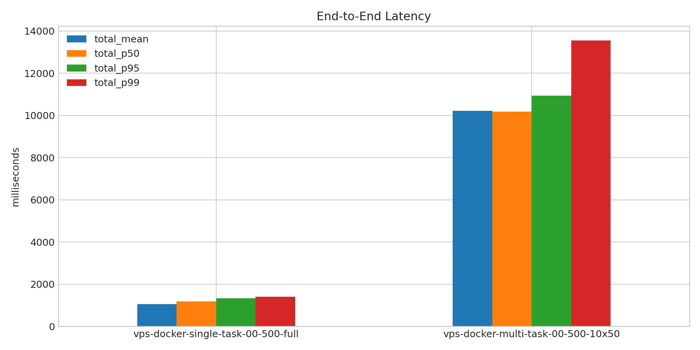
- 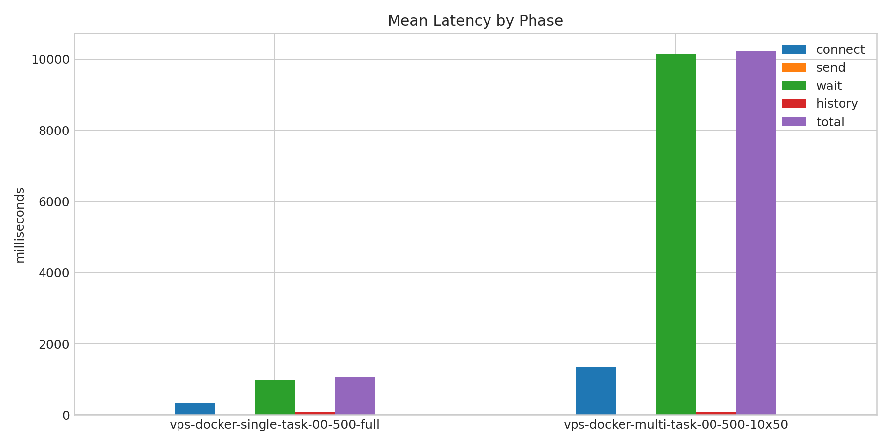
- 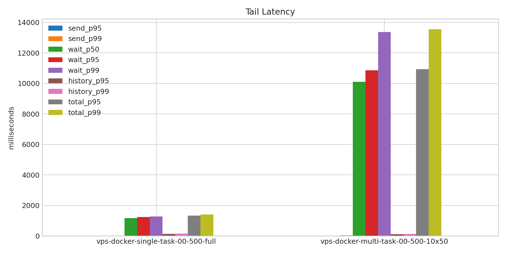
- 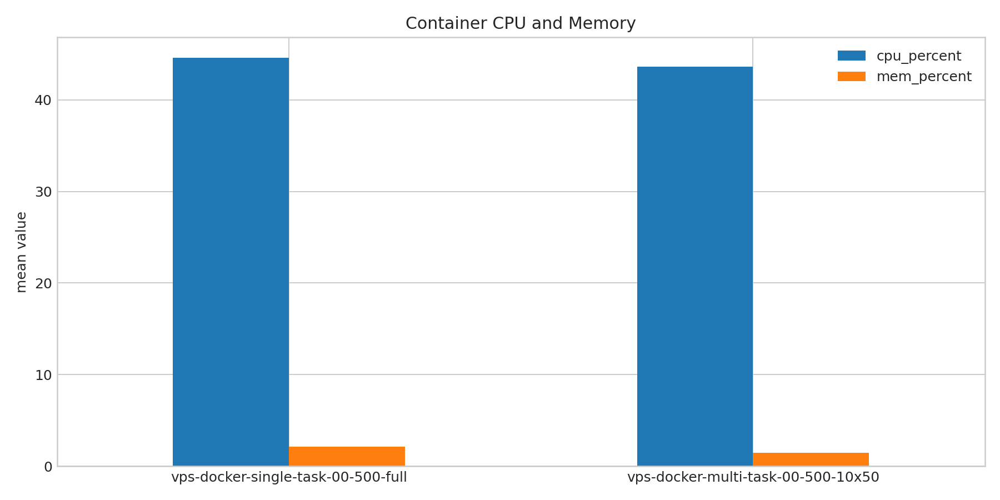
- 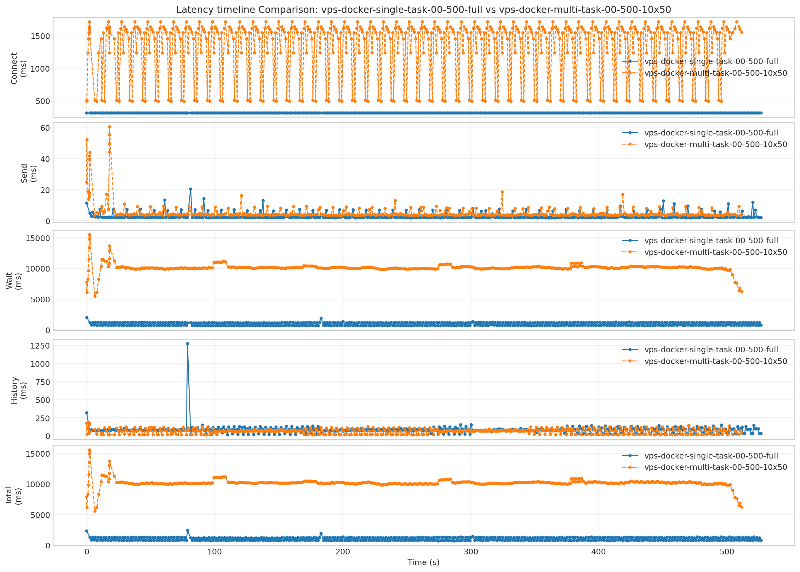
- 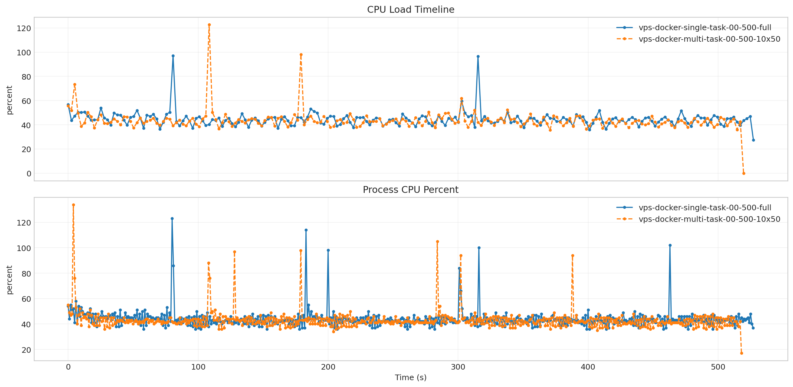
- 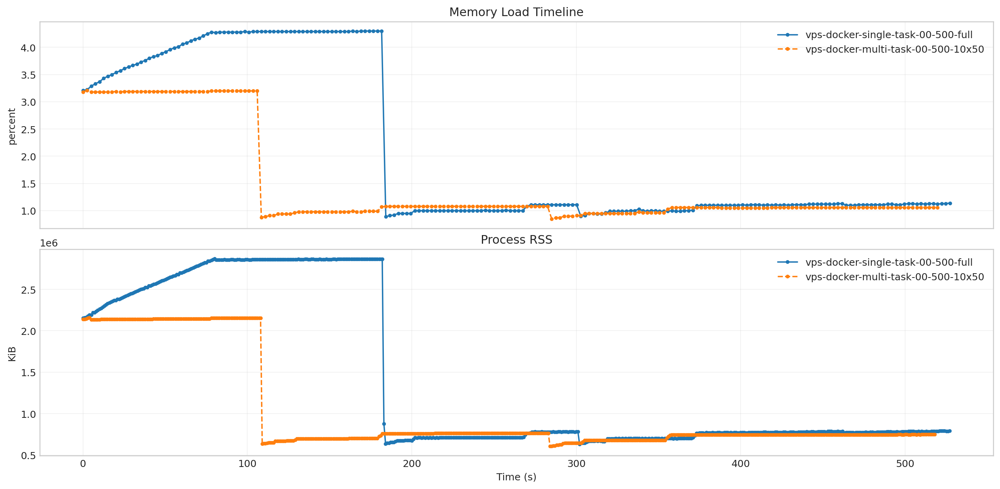
- 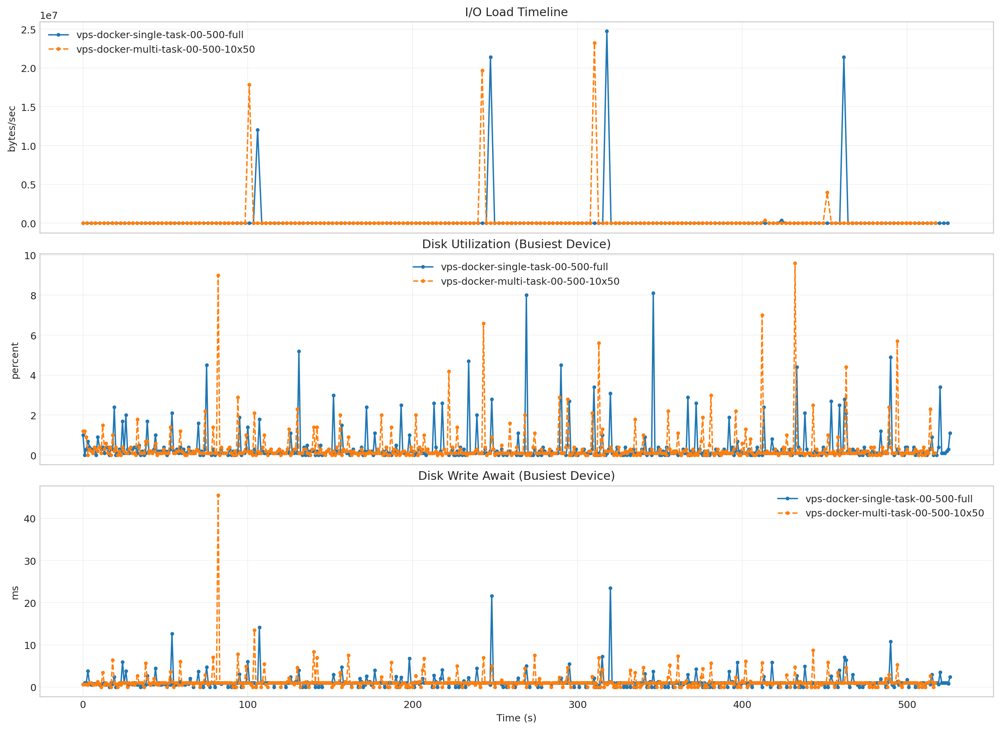
- 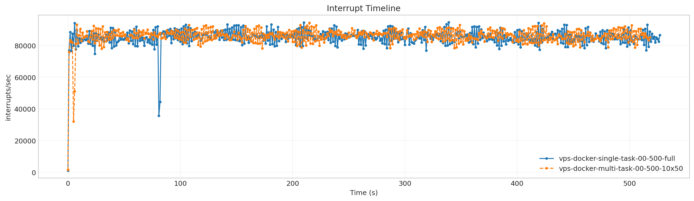
- 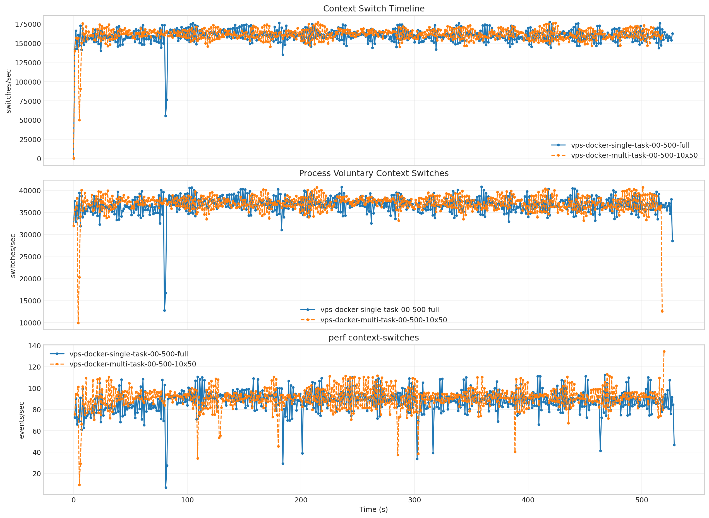
- 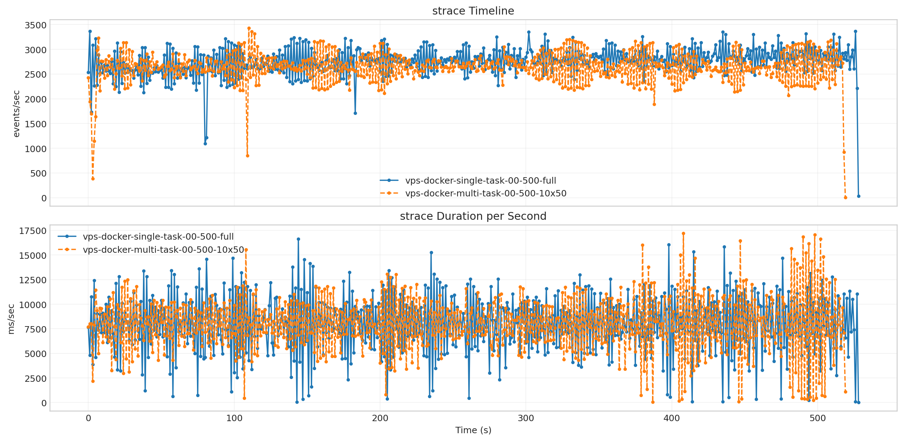
- 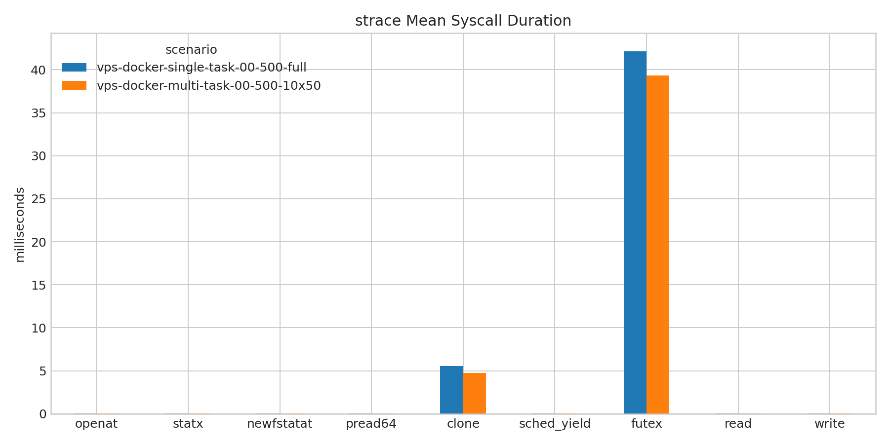
- 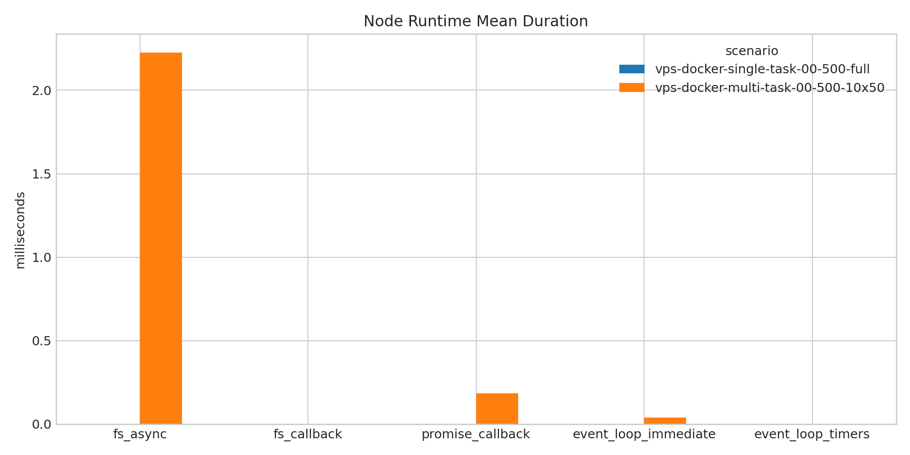
- 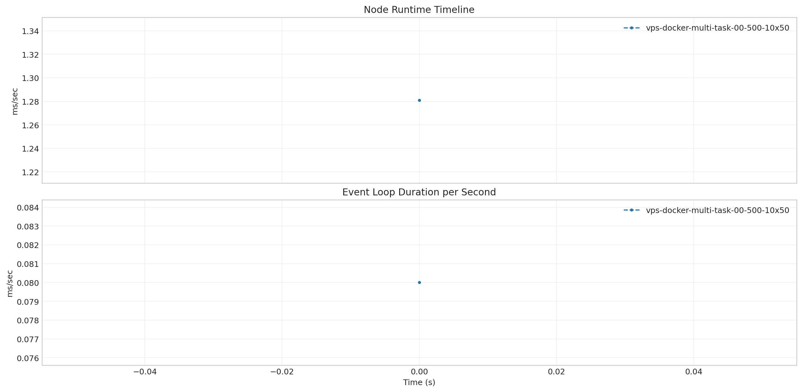
- 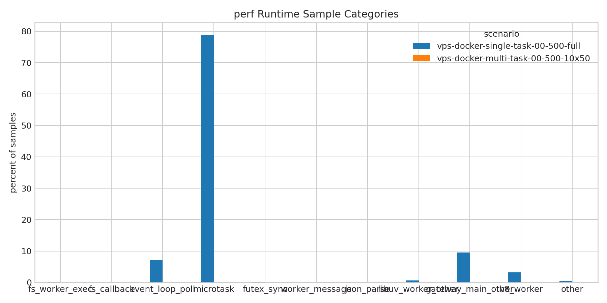

**Latency Overview Table**

| scenario | total_mean | total_p50 | total_p95 | total_p99 |
| --- | --- | --- | --- | --- |
| vps-docker-single-task-00-500-full | 1054.943 | 1188.232 | 1328.410 | 1393.996 |
| vps-docker-multi-task-00-500-10x50 | 10218.163 | 10182.247 | 10932.320 | 13553.411 |

**Mean Latency by Phase Table**

| scenario | connect | send | wait | history | total |
| --- | --- | --- | --- | --- | --- |
| vps-docker-single-task-00-500-full | 314.671 | 2.895 | 968.853 | 83.169 | 1054.943 |
| vps-docker-multi-task-00-500-10x50 | 1336.121 | 5.443 | 10148.620 | 64.074 | 10218.163 |

**Tail Latency Table**

| scenario | send_p95 | send_p99 | wait_p50 | wait_p95 | wait_p99 | history_p95 | history_p99 | total_p95 | total_p99 |
| --- | --- | --- | --- | --- | --- | --- | --- | --- | --- |
| vps-docker-single-task-00-500-full | 7.139 | 11.906 | 1155.993 | 1237.802 | 1278.817 | 130.400 | 151.478 | 1328.410 | 1393.996 |
| vps-docker-multi-task-00-500-10x50 | 9.218 | 43.891 | 10112.324 | 10861.110 | 13361.602 | 119.883 | 138.813 | 10932.320 | 13553.411 |

**Container Metrics Table**

| scenario | cpu_percent | mem_percent | block_read_bytes_per_s | block_write_bytes_per_s |
| --- | --- | --- | --- | --- |
| vps-docker-single-task-00-500-full | 44.600 | 2.099 | 0.000 | 384932.566 |
| vps-docker-multi-task-00-500-10x50 | 43.634 | 1.476 | 0.000 | 321385.129 |

**Process Metrics Table**

| scenario | cpu_percent | rss_kib | kb_wr_per_s | iodelay | cswch_per_s | nvcswch_per_s |
| --- | --- | --- | --- | --- | --- | --- |
| vps-docker-single-task-00-500-full | 44.010 | 1425805.674 | 1143.203 | 0.000 | 36690.497 | 0.083 |
| vps-docker-multi-task-00-500-10x50 | 43.086 | 1024012.778 | 1169.957 | 0.000 | 37021.163 | 0.062 |

**Disk Metrics Table**

| scenario | busiest_device | pct_util | r_await | w_await | f_await | aqu_sz | wkb_s |
| --- | --- | --- | --- | --- | --- | --- | --- |
| vps-docker-single-task-00-500-full | vda | 0.374 | 0.000 | 1.201 | 0.012 | 0.023 | 1863.878 |
| vps-docker-multi-task-00-500-10x50 | vda | 0.380 | 0.000 | 1.311 | 0.013 | 0.021 | 1863.845 |

**System Metrics Table**

| scenario | interrupts_per_s | system_context_switches_per_s | run_queue | perf_cache_misses | perf_context_switches | perf_cpu_migrations | perf_page_faults | perf_unsupported_events | strace_events_per_s_peak | strace_duration_ms_per_s_peak | strace_top_syscall | strace_top_syscall_total_duration_sec |
| --- | --- | --- | --- | --- | --- | --- | --- | --- | --- | --- | --- | --- |
| vps-docker-single-task-00-500-full | 85166.653 | 159458.686 | 1.254 | - | 87.812 | 19.512 | 22.267 | cache-misses, cache-references | 3365.000 | 16649.221 | futex | 4205.606 |
| vps-docker-multi-task-00-500-10x50 | 85966.145 | 160999.960 | 1.316 | - | 90.574 | 20.755 | 194.949 | cache-misses, cache-references | 3432.000 | 17226.127 | futex | 4138.579 |

**Timeline Peaks Table**

| scenario | docker_cpu_peak | docker_cpu_peak_t_sec | docker_mem_peak | docker_mem_peak_t_sec | pidstat_cpu_peak | pidstat_cpu_peak_t_sec | pidstat_rss_peak | pidstat_rss_peak_t_sec | iostat_pct_util_peak | iostat_pct_util_peak_t_sec | iostat_w_await_peak | iostat_w_await_peak_t_sec | vmstat_interrupts_peak | vmstat_interrupts_peak_t_sec | vmstat_context_switches_peak | vmstat_context_switches_peak_t_sec | perf_context_switches_peak | perf_context_switches_peak_t_sec |
| --- | --- | --- | --- | --- | --- | --- | --- | --- | --- | --- | --- | --- | --- | --- | --- | --- | --- | --- |
| vps-docker-single-task-00-500-full | 96.980 | 80.727 | 4.300 | 163.970 | 123.000 | 80.000 | 2872724.000 | 80.000 | 8.100 | 346.000 | 23.460 | 320.000 | 94591.000 | 339.000 | 177358.000 | 419.000 | 112.447 | 467.523 |
| vps-docker-multi-task-00-500-10x50 | 122.770 | 108.459 | 3.210 | 2.522 | 134.000 | 4.000 | 2160224.000 | 4.000 | 9.600 | 432.000 | 45.500 | 82.000 | 94242.000 | 215.000 | 177317.000 | 215.000 | 134.371 | 519.571 |

**strace Key Syscalls Table**

| scenario | run_dir | openat_count | openat_total_sec | openat_mean_ms | statx_count | statx_total_sec | statx_mean_ms | newfstatat_count | newfstatat_total_sec | newfstatat_mean_ms | pread64_count | pread64_total_sec | pread64_mean_ms | clone_count | clone_total_sec | clone_mean_ms | sched_yield_count | sched_yield_total_sec | sched_yield_mean_ms | futex_count | futex_total_sec | futex_mean_ms | read_count | read_total_sec | read_mean_ms | write_count | write_total_sec | write_mean_ms | futex_total_sec_per_request | futex_total_sec_per_wall_sec | statx_total_sec_per_request | statx_total_sec_per_wall_sec | openat_total_sec_per_request | openat_total_sec_per_wall_sec | estimated_makespan_sec |
| --- | --- | --- | --- | --- | --- | --- | --- | --- | --- | --- | --- | --- | --- | --- | --- | --- | --- | --- | --- | --- | --- | --- | --- | --- | --- | --- | --- | --- | --- | --- | --- | --- | --- | --- | --- |
| vps-docker-single-task-00-500-full | /root/client-harness/out/20260325T165722Z_vps-docker-single-task-00-500-full | 159099 | 4.448 | 0.028 | 798811 | 17.276 | 0.022 | 33655 | 0.710 | 0.021 | 71 | 0.001 | 0.019 | 36 | 0.200 | 5.542 | 1 | 0.000 | 0.032 | 99770 | 4205.606 | 42.153 | 278759 | 6.134 | 0.022 | 88547 | 2.700 | 0.030 | 8.411 | 7.106 | 0.035 | 0.029 | 0.009 | 0.008 | 591.871 |
| vps-docker-multi-task-00-500-10x50 | /root/client-harness/out/20260325T170949Z_vps-docker-multi-task-00-500-10x50 | 159423 | 4.421 | 0.028 | 800778 | 17.436 | 0.022 | 33672 | 0.718 | 0.021 | 71 | 0.001 | 0.020 | 35 | 0.166 | 4.729 | 1 | 0.000 | 0.029 | 105278 | 4138.579 | 39.311 | 186869 | 4.089 | 0.022 | 81634 | 2.528 | 0.031 | 8.277 | 7.124 | 0.035 | 0.030 | 0.009 | 0.008 | 580.934 |

**strace Mean Duration Table**

| scenario | vps-docker-single-task-00-500-full | vps-docker-multi-task-00-500-10x50 |
| --- | --- | --- |
| openat | 0.028 | 0.028 |
| statx | 0.022 | 0.022 |
| newfstatat | 0.021 | 0.021 |
| pread64 | 0.019 | 0.020 |
| clone | 5.542 | 4.729 |
| sched_yield | 0.032 | 0.029 |
| futex | 42.153 | 39.311 |
| read | 0.022 | 0.022 |
| write | 0.030 | 0.031 |

**Runtime Category Samples Table**

| scenario | run_dir | sample_count | fs_worker_exec_count | fs_worker_exec_pct | fs_callback_count | fs_callback_pct | event_loop_poll_count | event_loop_poll_pct | microtask_count | microtask_pct | futex_sync_count | futex_sync_pct | worker_message_count | worker_message_pct | json_parse_count | json_parse_pct | libuv_worker_other_count | libuv_worker_other_pct | gateway_main_other_count | gateway_main_other_pct | v8_worker_count | v8_worker_pct | other_count | other_pct |
| --- | --- | --- | --- | --- | --- | --- | --- | --- | --- | --- | --- | --- | --- | --- | --- | --- | --- | --- | --- | --- | --- | --- | --- | --- |
| vps-docker-single-task-00-500-full | /root/client-harness/out/20260325T165722Z_vps-docker-single-task-00-500-full | 902662.000 | 490.000 | 0.054 | - | - | 65144.000 | 7.217 | 711433.000 | 78.815 | 654.000 | 0.072 | 1.000 | 0.000 | - | - | 5593.000 | 0.620 | 85769.000 | 9.502 | 28960.000 | 3.208 | 4618.000 | 0.512 |
| vps-docker-multi-task-00-500-10x50 | /root/client-harness/out/20260325T170949Z_vps-docker-multi-task-00-500-10x50 | - | - | - | - | - | - | - | - | - | - | - | - | - | - | - | - | - | - | - | - | - | - | - |

**Runtime Category Percent Table**

| scenario | vps-docker-single-task-00-500-full | vps-docker-multi-task-00-500-10x50 |
| --- | --- | --- |
| fs_worker_exec | 0.054 | - |
| fs_callback | - | - |
| event_loop_poll | 7.217 | - |
| microtask | 78.815 | - |
| futex_sync | 0.072 | - |
| worker_message | 0.000 | - |
| json_parse | - | - |
| libuv_worker_other | 0.620 | - |
| gateway_main_other | 9.502 | - |
| v8_worker | 3.208 | - |
| other | 0.512 | - |

**Top strace Syscalls: `vps-docker-single-task-00-500-full`**

| scenario | count | total_duration_sec |
| --- | --- | --- |
| futex | 99770 | 4205.606 |
| statx | 798811 | 17.276 |
| read | 278759 | 6.134 |
| openat | 159099 | 4.448 |
| write | 88547 | 2.700 |

**Top strace Syscalls: `vps-docker-multi-task-00-500-10x50`**

| scenario | count | total_duration_sec |
| --- | --- | --- |
| futex | 105278 | 4138.579 |
| statx | 800778 | 17.436 |
| openat | 159423 | 4.421 |
| read | 186869 | 4.089 |
| write | 81634 | 2.528 |

**Node Runtime Metrics Table**

| scenario | fs_async_mean_ms | fs_callback_mean_ms | promise_callback_mean_ms | event_loop_immediate_mean_ms | event_loop_timers_mean_ms | fs_async_count | fs_callback_count | promise_callback_count |
| --- | --- | --- | --- | --- | --- | --- | --- | --- |
| vps-docker-single-task-00-500-full | - | - | - | - | - | - | - | - |
| vps-docker-multi-task-00-500-10x50 | 2.226 | 0.000 | 0.183 | 0.040 | 0.000 | 33.000 | 0.000 | 7.000 |

**Node Runtime Mean Duration Table**

| scenario | vps-docker-single-task-00-500-full | vps-docker-multi-task-00-500-10x50 |
| --- | --- | --- |
| fs_async | - | 2.226 |
| fs_callback | - | 0.000 |
| promise_callback | - | 0.183 |
| event_loop_immediate | - | 0.040 |
| event_loop_timers | - | 0.000 |

