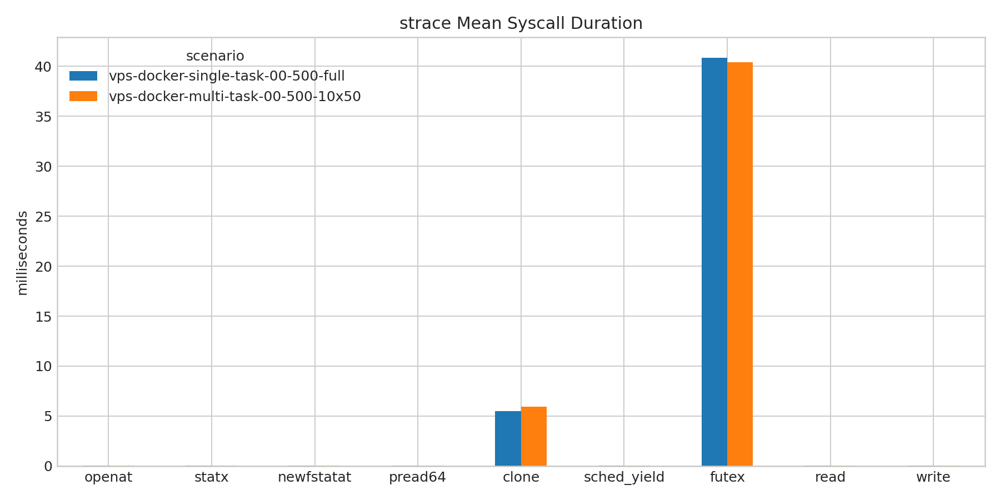
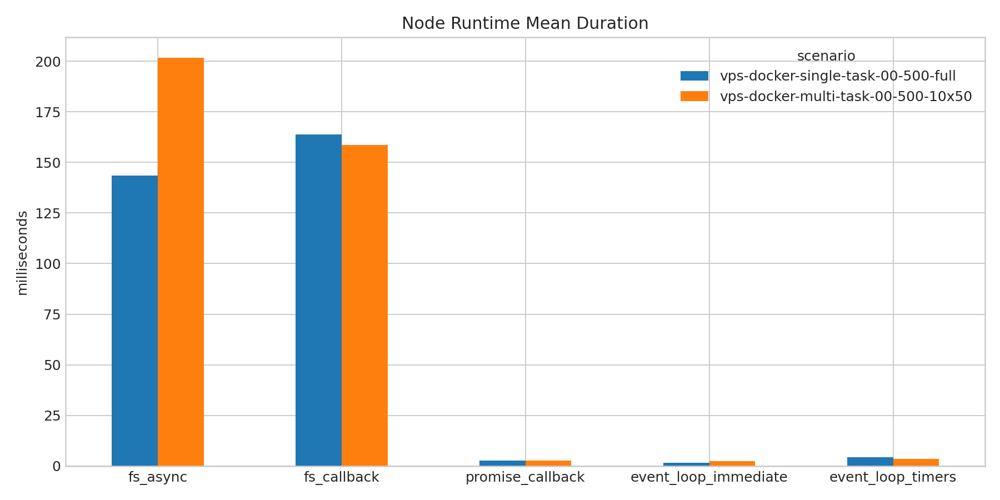
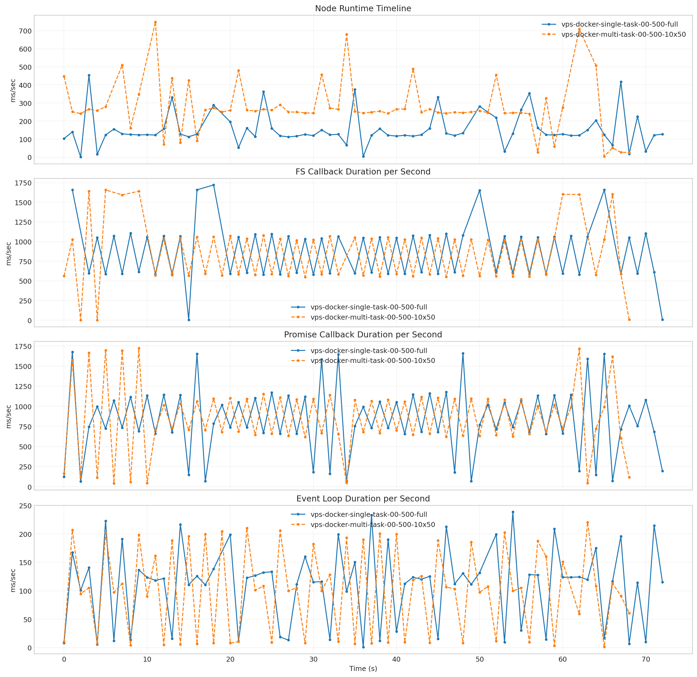
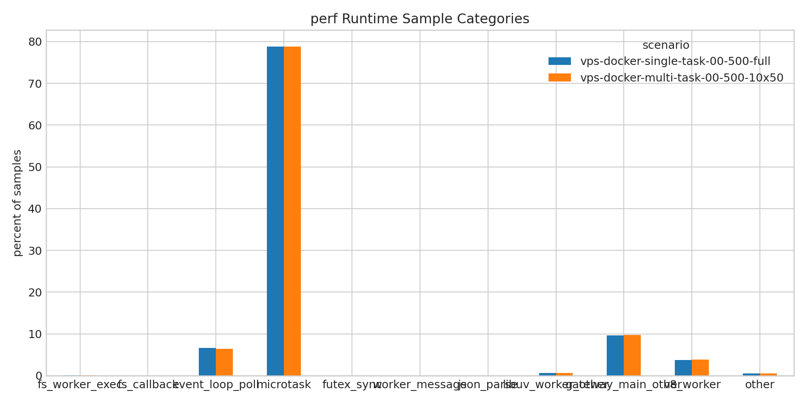

## `vps-docker-single-task-00-500-full` vs `vps-docker-multi-task-00-500-10x50`

**Run Dirs**

| scenario | run_dir | requests_total | requests_ok | requests_failed |
| --- | --- | --- | --- | --- |
| vps-docker-single-task-00-500-full | /root/client-harness/out/20260325T173324Z_vps-docker-single-task-00-500-full | 500 | 500 | 0 |
| vps-docker-multi-task-00-500-10x50 | /root/client-harness/out/20260325T174736Z_vps-docker-multi-task-00-500-10x50 | 500 | 500 | 0 |

**Figures**

- 
- 
- 
- 
- 
- 
- 
- 
- 
- 
- 
- 
- 
- 
- 
- 

**Latency Overview Table**

| scenario | total_mean | total_p50 | total_p95 | total_p99 |
| --- | --- | --- | --- | --- |
| vps-docker-single-task-00-500-full | 1061.123 | 1190.892 | 1336.504 | 1410.841 |
| vps-docker-multi-task-00-500-10x50 | 10161.143 | 10174.709 | 11308.623 | 12539.880 |

**Mean Latency by Phase Table**

| scenario | connect | send | wait | history | total |
| --- | --- | --- | --- | --- | --- |
| vps-docker-single-task-00-500-full | 225.969 | 2.847 | 973.591 | 84.659 | 1061.123 |
| vps-docker-multi-task-00-500-10x50 | 5358.133 | 5.665 | 10082.269 | 73.183 | 10161.143 |

**Tail Latency Table**

| scenario | send_p95 | send_p99 | wait_p50 | wait_p95 | wait_p99 | history_p95 | history_p99 | total_p95 | total_p99 |
| --- | --- | --- | --- | --- | --- | --- | --- | --- | --- |
| vps-docker-single-task-00-500-full | 6.953 | 11.899 | 1155.519 | 1251.777 | 1313.980 | 130.959 | 149.266 | 1336.504 | 1410.841 |
| vps-docker-multi-task-00-500-10x50 | 16.212 | 33.630 | 10096.204 | 11223.202 | 12467.330 | 125.615 | 142.507 | 11308.623 | 12539.880 |

**Container Metrics Table**

| scenario | cpu_percent | mem_percent | block_read_bytes_per_s | block_write_bytes_per_s |
| --- | --- | --- | --- | --- |
| vps-docker-single-task-00-500-full | 44.936 | 2.070 | 0.000 | 196211.034 |
| vps-docker-multi-task-00-500-10x50 | 45.259 | 2.202 | 0.000 | 369506.119 |

**Process Metrics Table**

| scenario | cpu_percent | rss_kib | kb_wr_per_s | iodelay | cswch_per_s | nvcswch_per_s |
| --- | --- | --- | --- | --- | --- | --- |
| vps-docker-single-task-00-500-full | 44.131 | 1405880.256 | 1163.207 | 0.000 | 36571.294 | 0.085 |
| vps-docker-multi-task-00-500-10x50 | 43.586 | 1524142.455 | 1187.410 | 0.000 | 36872.036 | 0.076 |

**Disk Metrics Table**

| scenario | busiest_device | pct_util | r_await | w_await | f_await | aqu_sz | wkb_s |
| --- | --- | --- | --- | --- | --- | --- | --- |
| vps-docker-single-task-00-500-full | vda | 0.390 | 0.000 | 1.276 | 0.012 | 0.032 | 2253.743 |
| vps-docker-multi-task-00-500-10x50 | vda | 0.355 | 0.000 | 1.326 | 0.013 | 0.032 | 2106.429 |

**System Metrics Table**

| scenario | interrupts_per_s | system_context_switches_per_s | run_queue | perf_cache_misses | perf_context_switches | perf_cpu_migrations | perf_page_faults | perf_unsupported_events | strace_events_per_s_peak | strace_duration_ms_per_s_peak | strace_top_syscall | strace_top_syscall_total_duration_sec |
| --- | --- | --- | --- | --- | --- | --- | --- | --- | --- | --- | --- | --- |
| vps-docker-single-task-00-500-full | 84897.087 | 158911.373 | 1.324 | - | 87.594 | 20.117 | 34.556 | cache-misses, cache-references | 3468.000 | 17977.786 | futex | 4230.283 |
| vps-docker-multi-task-00-500-10x50 | 85631.283 | 160390.180 | 1.287 | - | 89.339 | 23.614 | 136.852 | cache-misses, cache-references | 3455.000 | 17497.347 | futex | 4163.866 |

**Timeline Peaks Table**

| scenario | docker_cpu_peak | docker_cpu_peak_t_sec | docker_mem_peak | docker_mem_peak_t_sec | pidstat_cpu_peak | pidstat_cpu_peak_t_sec | pidstat_rss_peak | pidstat_rss_peak_t_sec | iostat_pct_util_peak | iostat_pct_util_peak_t_sec | iostat_w_await_peak | iostat_w_await_peak_t_sec | vmstat_interrupts_peak | vmstat_interrupts_peak_t_sec | vmstat_context_switches_peak | vmstat_context_switches_peak_t_sec | perf_context_switches_peak | perf_context_switches_peak_t_sec |
| --- | --- | --- | --- | --- | --- | --- | --- | --- | --- | --- | --- | --- | --- | --- | --- | --- | --- | --- |
| vps-docker-single-task-00-500-full | 115.050 | 80.707 | 4.260 | 80.707 | 129.000 | 81.000 | 2843484.000 | 81.000 | 8.700 | 227.000 | 17.160 | 391.000 | 94849.000 | 487.000 | 178991.000 | 487.000 | 113.099 | 133.148 |
| vps-docker-multi-task-00-500-10x50 | 123.440 | 80.715 | 4.320 | 80.715 | 138.000 | 81.000 | 2908672.000 | 81.000 | 14.500 | 300.000 | 22.460 | 387.000 | 99939.000 | 198.000 | 177702.000 | 506.000 | 112.234 | 165.182 |

**strace Key Syscalls Table**

| scenario | run_dir | openat_count | openat_total_sec | openat_mean_ms | statx_count | statx_total_sec | statx_mean_ms | newfstatat_count | newfstatat_total_sec | newfstatat_mean_ms | pread64_count | pread64_total_sec | pread64_mean_ms | clone_count | clone_total_sec | clone_mean_ms | sched_yield_count | sched_yield_total_sec | sched_yield_mean_ms | futex_count | futex_total_sec | futex_mean_ms | read_count | read_total_sec | read_mean_ms | write_count | write_total_sec | write_mean_ms | futex_total_sec_per_request | futex_total_sec_per_wall_sec | statx_total_sec_per_request | statx_total_sec_per_wall_sec | openat_total_sec_per_request | openat_total_sec_per_wall_sec | estimated_makespan_sec |
| --- | --- | --- | --- | --- | --- | --- | --- | --- | --- | --- | --- | --- | --- | --- | --- | --- | --- | --- | --- | --- | --- | --- | --- | --- | --- | --- | --- | --- | --- | --- | --- | --- | --- | --- | --- |
| vps-docker-single-task-00-500-full | /root/client-harness/out/20260325T173324Z_vps-docker-single-task-00-500-full | 159096 | 4.405 | 0.028 | 798797 | 17.343 | 0.022 | 33660 | 0.720 | 0.021 | 70 | 0.002 | 0.021 | 35 | 0.192 | 5.494 | 2 | 0.000 | 0.030 | 103536 | 4230.283 | 40.858 | 278760 | 6.170 | 0.022 | 88553 | 2.697 | 0.030 | 8.461 | 7.037 | 0.035 | 0.029 | 0.009 | 0.007 | 601.173 |
| vps-docker-multi-task-00-500-10x50 | /root/client-harness/out/20260325T174736Z_vps-docker-multi-task-00-500-10x50 | 159416 | 4.449 | 0.028 | 800835 | 17.371 | 0.022 | 33624 | 0.719 | 0.021 | 71 | 0.001 | 0.021 | 36 | 0.214 | 5.946 | 3 | 0.000 | 0.032 | 103095 | 4163.866 | 40.389 | 186947 | 4.100 | 0.022 | 81638 | 2.515 | 0.031 | 8.328 | 7.056 | 0.035 | 0.029 | 0.009 | 0.008 | 590.157 |

**strace Mean Duration Table**

| scenario | vps-docker-single-task-00-500-full | vps-docker-multi-task-00-500-10x50 |
| --- | --- | --- |
| openat | 0.028 | 0.028 |
| statx | 0.022 | 0.022 |
| newfstatat | 0.021 | 0.021 |
| pread64 | 0.021 | 0.021 |
| clone | 5.494 | 5.946 |
| sched_yield | 0.030 | 0.032 |
| futex | 40.858 | 40.389 |
| read | 0.022 | 0.022 |
| write | 0.030 | 0.031 |

**Gateway Runtime Stage Table**

| scenario | bootstrap_load_mean_ms | skills_mean_ms | context_bundle_mean_ms | execution_admission_wait_mean_ms | reply_dispatch_queue_wait_mean_ms | reply_dispatch_queue_hold_mean_ms | reply_dispatch_pending_mean |
| --- | --- | --- | --- | --- | --- | --- | --- |
| vps-docker-single-task-00-500-full | 2.758 | 698.850 | 742.934 | 0.143 | 0.002 | 0.003 | 2.000 |
| vps-docker-multi-task-00-500-10x50 | 22.000 | 700.802 | 764.308 | 9.253 | 0.002 | 0.003 | 2.000 |

**Node Focus Groups Table**

| scenario | sessions_lock_total_ms | sessions_lock_count | sessions_dir_total_ms | sessions_dir_count | bootstrap_files_total_ms | bootstrap_files_count |
| --- | --- | --- | --- | --- | --- | --- |
| vps-docker-single-task-00-500-full | 298.634 | 272.000 | 868.118 | 680.000 | 6459.129 | 884.000 |
| vps-docker-multi-task-00-500-10x50 | 733.853 | 272.000 | 4405.994 | 680.000 | 8091.316 | 793.000 |

**Runtime Category Samples Table**

| scenario | run_dir | sample_count | fs_worker_exec_count | fs_worker_exec_pct | fs_callback_count | fs_callback_pct | event_loop_poll_count | event_loop_poll_pct | microtask_count | microtask_pct | futex_sync_count | futex_sync_pct | worker_message_count | worker_message_pct | json_parse_count | json_parse_pct | libuv_worker_other_count | libuv_worker_other_pct | gateway_main_other_count | gateway_main_other_pct | v8_worker_count | v8_worker_pct | other_count | other_pct |
| --- | --- | --- | --- | --- | --- | --- | --- | --- | --- | --- | --- | --- | --- | --- | --- | --- | --- | --- | --- | --- | --- | --- | --- | --- |
| vps-docker-single-task-00-500-full | /root/client-harness/out/20260325T173324Z_vps-docker-single-task-00-500-full | 909005 | 480 | 0.053 | - | - | 60562 | 6.662 | 716422 | 78.814 | - | - | 16 | 0.002 | - | - | 5915 | 0.651 | 87316 | 9.606 | 33904 | 3.730 | 4390 | 0.483 |
| vps-docker-multi-task-00-500-10x50 | /root/client-harness/out/20260325T174736Z_vps-docker-multi-task-00-500-10x50 | 884927 | 519 | 0.059 | 3.000 | 0.000 | 56557 | 6.391 | 697134 | 78.779 | - | - | 9 | 0.001 | - | - | 5743 | 0.649 | 86496 | 9.774 | 33923 | 3.833 | 4543 | 0.513 |

**Runtime Category Percent Table**

| scenario | vps-docker-single-task-00-500-full | vps-docker-multi-task-00-500-10x50 |
| --- | --- | --- |
| fs_worker_exec | 0.053 | 0.059 |
| fs_callback | - | 0.000 |
| event_loop_poll | 6.662 | 6.391 |
| microtask | 78.814 | 78.779 |
| futex_sync | - | - |
| worker_message | 0.002 | 0.001 |
| json_parse | - | - |
| libuv_worker_other | 0.651 | 0.649 |
| gateway_main_other | 9.606 | 9.774 |
| v8_worker | 3.730 | 3.833 |
| other | 0.483 | 0.513 |

**Top strace Syscalls: `vps-docker-single-task-00-500-full`**

| scenario | count | total_duration_sec |
| --- | --- | --- |
| futex | 103536 | 4230.283 |
| statx | 798797 | 17.343 |
| read | 278760 | 6.170 |
| openat | 159096 | 4.405 |
| write | 88553 | 2.697 |

**Top strace Syscalls: `vps-docker-multi-task-00-500-10x50`**

| scenario | count | total_duration_sec |
| --- | --- | --- |
| futex | 103095 | 4163.866 |
| statx | 800835 | 17.371 |
| openat | 159416 | 4.449 |
| read | 186947 | 4.100 |
| write | 81638 | 2.515 |

**Node Runtime Metrics Table**

| scenario | fs_async_mean_ms | fs_callback_mean_ms | promise_callback_mean_ms | event_loop_immediate_mean_ms | event_loop_timers_mean_ms | fs_async_count | fs_callback_count | promise_callback_count |
| --- | --- | --- | --- | --- | --- | --- | --- | --- |
| vps-docker-single-task-00-500-full | 143.511 | 163.739 | 2.741 | 1.546 | 4.423 | 262759.000 | 339.000 | 22113.000 |
| vps-docker-multi-task-00-500-10x50 | 201.681 | 158.562 | 2.781 | 2.366 | 3.562 | 258764.000 | 339.000 | 20977.000 |

**Node Runtime Mean Duration Table**

| scenario | vps-docker-single-task-00-500-full | vps-docker-multi-task-00-500-10x50 |
| --- | --- | --- |
| fs_async | 143.511 | 201.681 |
| fs_callback | 163.739 | 158.562 |
| promise_callback | 2.741 | 2.781 |
| event_loop_immediate | 1.546 | 2.366 |
| event_loop_timers | 4.423 | 3.562 |

**Top Node FS Paths: `vps-docker-single-task-00-500-full`**

| scenario | count | total_duration_ms |
| --- | --- | --- |
| /home/node/.openclaw/agents/main/sessions/sessions.json.lock | 272 | 298.634 |
| /home/node/.openclaw/workspace/HEARTBEAT.md | 136 | 716.657 |
| /home/node/.openclaw/workspace/USER.md | 136 | 841.987 |
| /home/node/.openclaw/workspace/IDENTITY.md | 136 | 965.654 |
| /home/node/.openclaw/workspace/TOOLS.md | 136 | 1098.315 |

**Top Node FS Paths: `vps-docker-multi-task-00-500-10x50`**

| scenario | count | total_duration_ms |
| --- | --- | --- |
| /home/node/.openclaw/agents/main/sessions/sessions.json.lock | 272 | 733.853 |
| /home/node/.openclaw/workspace/HEARTBEAT.md | 122 | 1040.563 |
| /home/node/.openclaw/workspace/USER.md | 122 | 1000.695 |
| /home/node/.openclaw/workspace/IDENTITY.md | 122 | 1618.943 |
| /home/node/.openclaw/workspace/TOOLS.md | 122 | 1222.920 |

**Node FS Path Categories: `vps-docker-single-task-00-500-full`**

| scenario | count | total_duration_ms |
| --- | --- | --- |
| workspace_bootstrap | 884 | 6459.129 |
| openclaw_runtime | 842 | 1965.928 |
| markdown_docs | 68 | 375.310 |
| git_metadata | 68 | 251.230 |

**Node FS Path Categories: `vps-docker-multi-task-00-500-10x50`**

| scenario | count | total_duration_ms |
| --- | --- | --- |
| openclaw_runtime | 827 | 5885.697 |
| workspace_bootstrap | 793 | 8091.316 |
| markdown_docs | 61 | 603.280 |
| git_metadata | 61 | 497.358 |

