## `vps-docker-single-task-00-500-full` vs `vps-docker-multi-task-00-500-full`

**Run Dirs**

| scenario | run_dir | requests_total | requests_ok | requests_failed |
| --- | --- | --- | --- | --- |
| vps-docker-single-task-00-500-full | /root/client-harness/out/20260325T150238Z_vps-docker-single-task-00-500-full | 500 | 500 | 0 |
| vps-docker-multi-task-00-500-full | /root/client-harness/out/20260325T151158Z_vps-docker-multi-task-00-500-full | 500 | 500 | 0 |

**Figures**

- 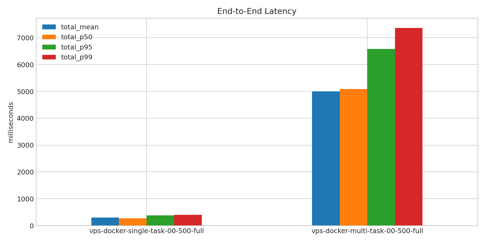
- 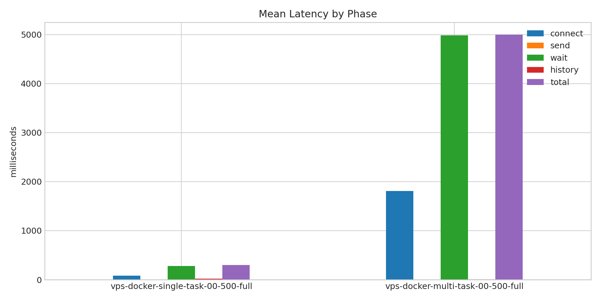
- 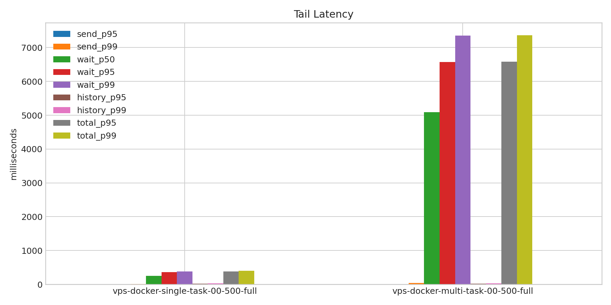
- 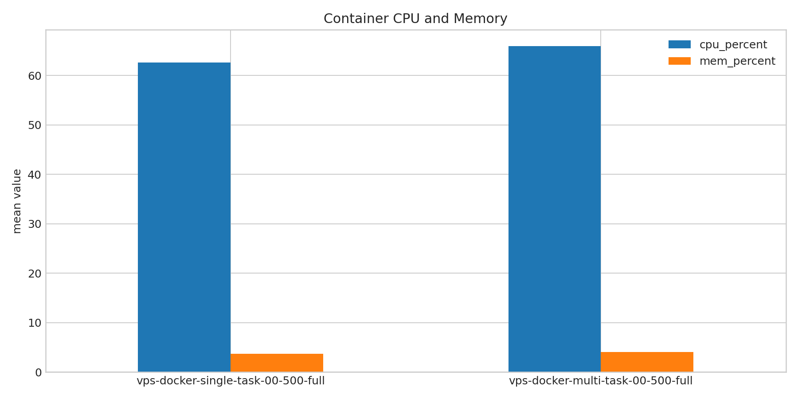
- 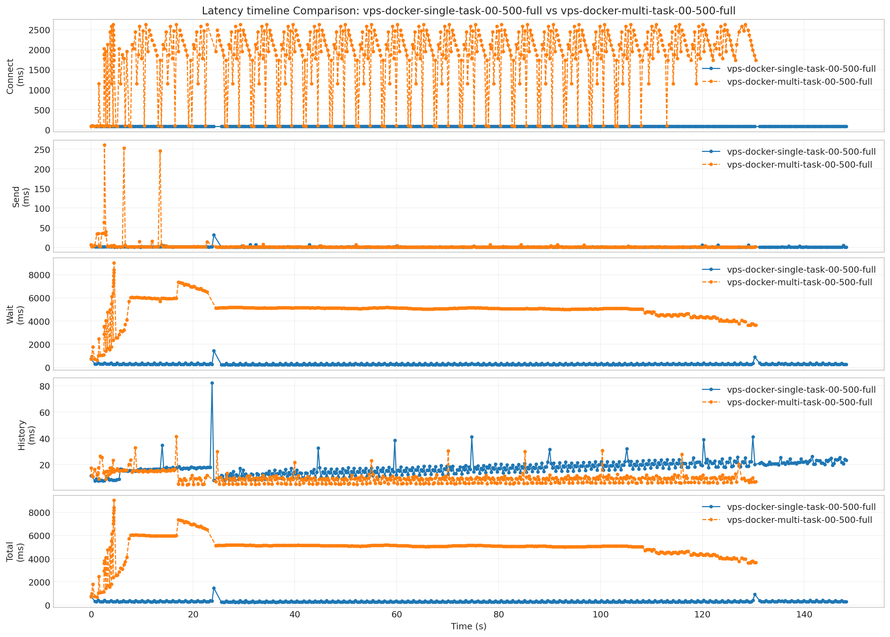
- 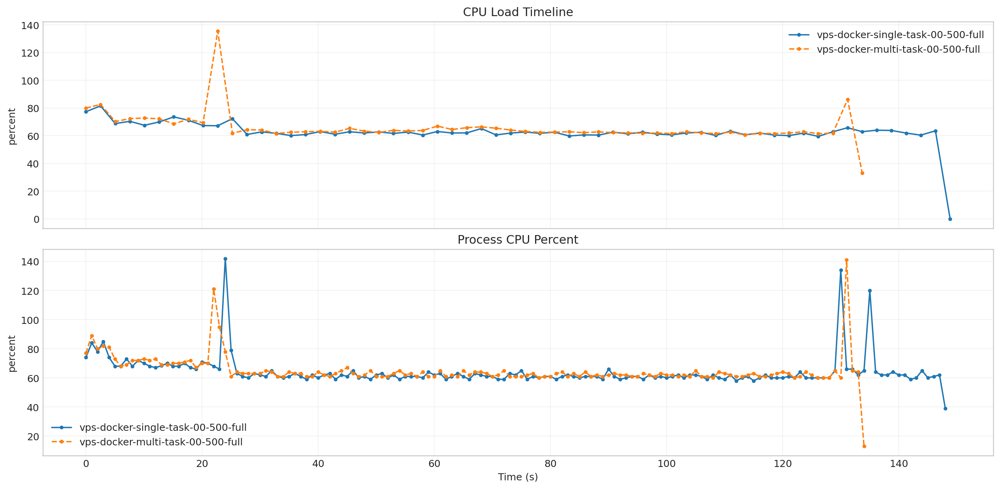
- 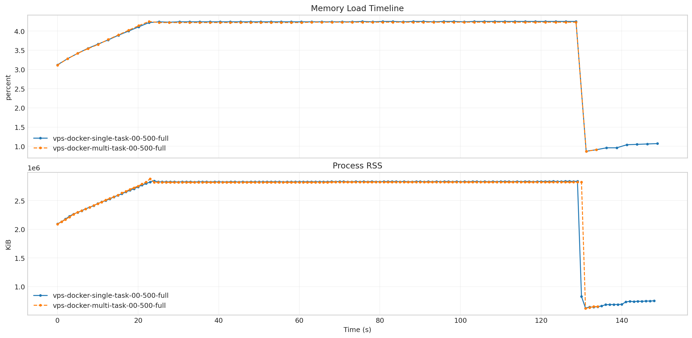
- 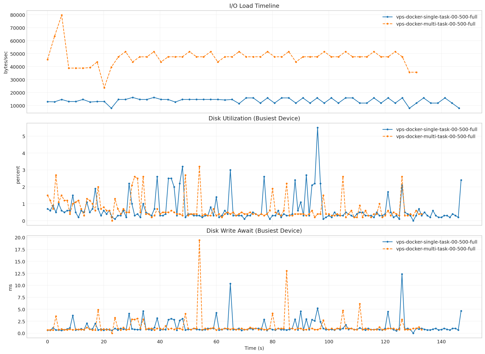
- 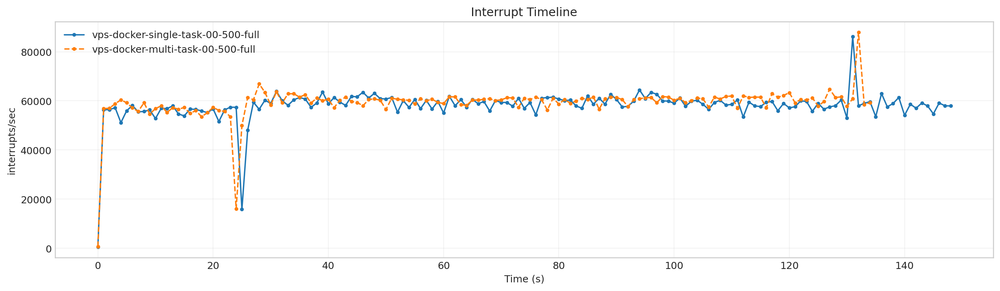
- 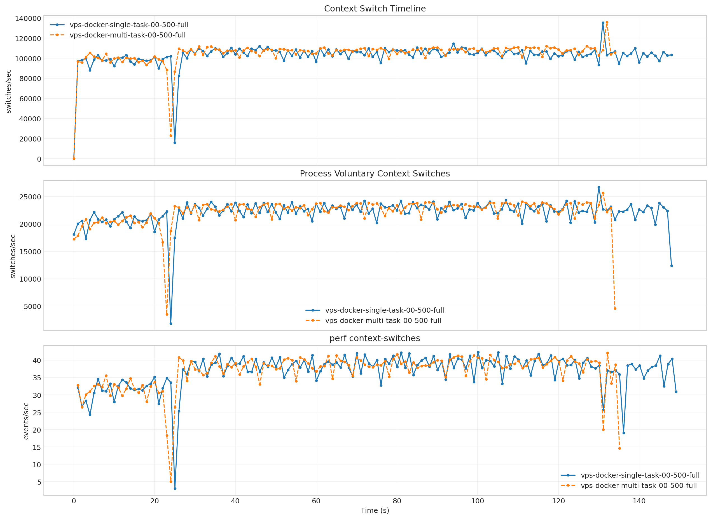
- 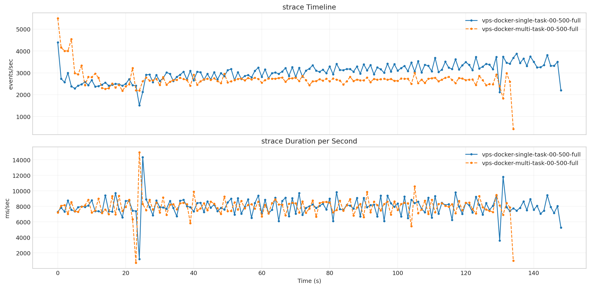

**Latency Overview Table**

| scenario | total_mean | total_p50 | total_p95 | total_p99 |
| --- | --- | --- | --- | --- |
| vps-docker-single-task-00-500-full | 297.011 | 272.935 | 384.514 | 403.824 |
| vps-docker-multi-task-00-500-full | 4998.715 | 5094.946 | 6584.162 | 7365.107 |

**Mean Latency by Phase Table**

| scenario | connect | send | wait | history | total |
| --- | --- | --- | --- | --- | --- |
| vps-docker-single-task-00-500-full | 80.510 | 1.056 | 278.546 | 17.384 | 297.011 |
| vps-docker-multi-task-00-500-full | 1806.038 | 3.456 | 4985.545 | 9.690 | 4998.715 |

**Tail Latency Table**

| scenario | send_p95 | send_p99 | wait_p50 | wait_p95 | wait_p99 | history_p95 | history_p99 | total_p95 | total_p99 |
| --- | --- | --- | --- | --- | --- | --- | --- | --- | --- |
| vps-docker-single-task-00-500-full | 1.387 | 5.995 | 251.336 | 364.335 | 386.228 | 23.766 | 34.818 | 384.514 | 403.824 |
| vps-docker-multi-task-00-500-full | 4.524 | 39.769 | 5086.257 | 6572.921 | 7358.880 | 16.180 | 29.885 | 6584.162 | 7365.107 |

**Container Metrics Table**

| scenario | cpu_percent | mem_percent | block_read_bytes_per_s | block_write_bytes_per_s |
| --- | --- | --- | --- | --- |
| vps-docker-single-task-00-500-full | 62.645 | 3.720 | 0.000 | 13728.209 |
| vps-docker-multi-task-00-500-full | 65.924 | 4.007 | 0.000 | 47188.495 |

**Process Metrics Table**

| scenario | cpu_percent | rss_kib | kb_wr_per_s | iodelay | cswch_per_s | nvcswch_per_s |
| --- | --- | --- | --- | --- | --- | --- |
| vps-docker-single-task-00-500-full | 64.183 | 2503704.564 | 229.301 | 0.000 | 22098.556 | 0.181 |
| vps-docker-multi-task-00-500-full | 65.067 | 2697240.385 | 287.141 | 0.000 | 22175.193 | 0.163 |

**Disk Metrics Table**

| scenario | busiest_device | pct_util | r_await | w_await | f_await | aqu_sz | wkb_s |
| --- | --- | --- | --- | --- | --- | --- | --- |
| vps-docker-single-task-00-500-full | vda | 0.682 | 0.000 | 1.332 | 0.014 | 0.095 | 2025.514 |
| vps-docker-multi-task-00-500-full | vda | 0.691 | 0.000 | 1.375 | 0.017 | 0.061 | 1534.806 |

**System Metrics Table**

| scenario | interrupts_per_s | system_context_switches_per_s | run_queue | perf_cache_misses | perf_context_switches | perf_cpu_migrations | perf_page_faults | perf_unsupported_events | strace_events_per_s_peak | strace_duration_ms_per_s_peak | strace_top_syscall | strace_top_syscall_total_duration_sec |
| --- | --- | --- | --- | --- | --- | --- | --- | --- | --- | --- | --- | --- |
| vps-docker-single-task-00-500-full | 58063.624 | 102702.658 | 1.396 | - | 36.838 | 40.924 | 7.303 | cache-misses, cache-references | 4399.000 | 14339.846 | futex | 1178.036 |
| vps-docker-multi-task-00-500-full | 59165.867 | 104608.681 | 1.400 | - | 36.766 | 42.471 | 204.813 | cache-misses, cache-references | 5499.000 | 14983.821 | futex | 1063.719 |

**Timeline Peaks Table**

| scenario | docker_cpu_peak | docker_cpu_peak_t_sec | docker_mem_peak | docker_mem_peak_t_sec | pidstat_cpu_peak | pidstat_cpu_peak_t_sec | pidstat_rss_peak | pidstat_rss_peak_t_sec | iostat_pct_util_peak | iostat_pct_util_peak_t_sec | iostat_w_await_peak | iostat_w_await_peak_t_sec | vmstat_interrupts_peak | vmstat_interrupts_peak_t_sec | vmstat_context_switches_peak | vmstat_context_switches_peak_t_sec | perf_context_switches_peak | perf_context_switches_peak_t_sec |
| --- | --- | --- | --- | --- | --- | --- | --- | --- | --- | --- | --- | --- | --- | --- | --- | --- | --- | --- |
| vps-docker-single-task-00-500-full | 81.530 | 2.522 | 4.250 | 75.666 | 142.000 | 24.000 | 2845320.000 | 24.000 | 5.500 | 96.000 | 12.350 | 126.000 | 86166.000 | 131.000 | 135490.000 | 131.000 | 42.335 | 100.103 |
| vps-docker-multi-task-00-500-full | 135.540 | 22.703 | 4.250 | 22.703 | 141.000 | 131.000 | 2883276.000 | 23.000 | 3.200 | 54.000 | 19.440 | 54.000 | 87876.000 | 132.000 | 135799.000 | 132.000 | 42.074 | 132.139 |

**Top strace Syscalls: `vps-docker-single-task-00-500-full`**

| scenario | count | total_duration_sec |
| --- | --- | --- |
| futex | 105320 | 1178.036 |
| read | 257991 | 5.670 |
| write | 88248 | 2.600 |
| accept4 | 1 | 0.000 |

**Top strace Syscalls: `vps-docker-multi-task-00-500-full`**

| scenario | count | total_duration_sec |
| --- | --- | --- |
| futex | 127019 | 1063.719 |
| read | 156195 | 3.422 |
| write | 82063 | 2.413 |
| accept4 | 20 | 0.001 |

