## `vps-docker-single-task-00-500-light` vs `vps-docker-multi-task-00-500-light`

**Run Dirs**

| scenario | run_dir | requests_total | requests_ok | requests_failed |
| --- | --- | --- | --- | --- |
| vps-docker-single-task-00-500-light | /root/client-harness/out/20260410T135938Z_vps-docker-single-task-00-500-light | 500 | 500 | 0 |
| vps-docker-multi-task-00-500-light | /root/client-harness/out/20260410T145118Z_vps-docker-multi-task-00-500-light | 500 | 500 | 0 |

**Run Timing Table**

| scenario | run_dir | run_started_at | run_finished_at | run_wall_clock_sec | first_request_started_at | last_request_finished_at | request_window_sec |
| --- | --- | --- | --- | --- | --- | --- | --- |
| vps-docker-single-task-00-500-light | /root/client-harness/out/20260410T135938Z_vps-docker-single-task-00-500-light | 2026-04-10T13:59:47.998531+00:00 | 2026-04-10T14:02:02.730020+00:00 | 134.731 | 2026-04-10T13:59:48.065911+00:00 | 2026-04-10T14:01:58.972557+00:00 | 130.907 |
| vps-docker-multi-task-00-500-light | /root/client-harness/out/20260410T145118Z_vps-docker-multi-task-00-500-light | 2026-04-10T14:51:28.190945+00:00 | 2026-04-10T14:53:37.880185+00:00 | 129.689 | 2026-04-10T14:51:28.263526+00:00 | 2026-04-10T14:53:27.882726+00:00 | 119.619 |

**Figures**

- 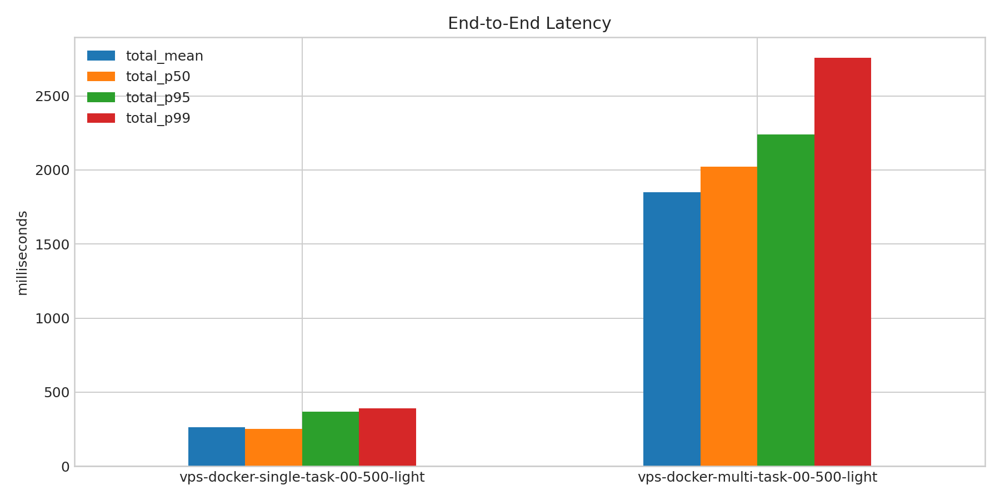
- 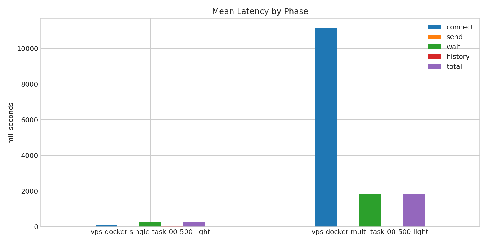
- 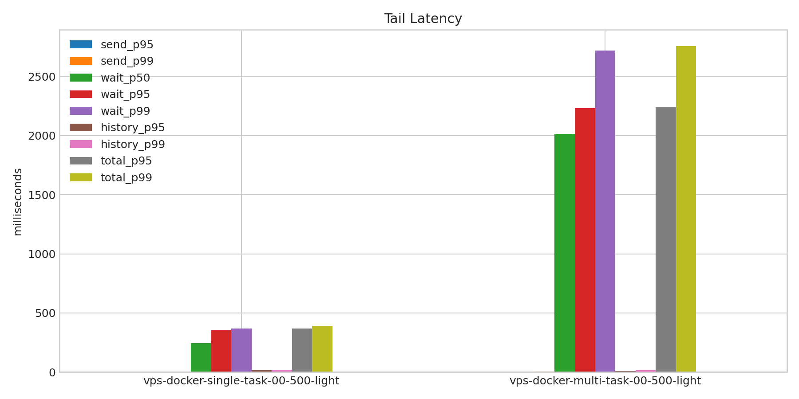
- 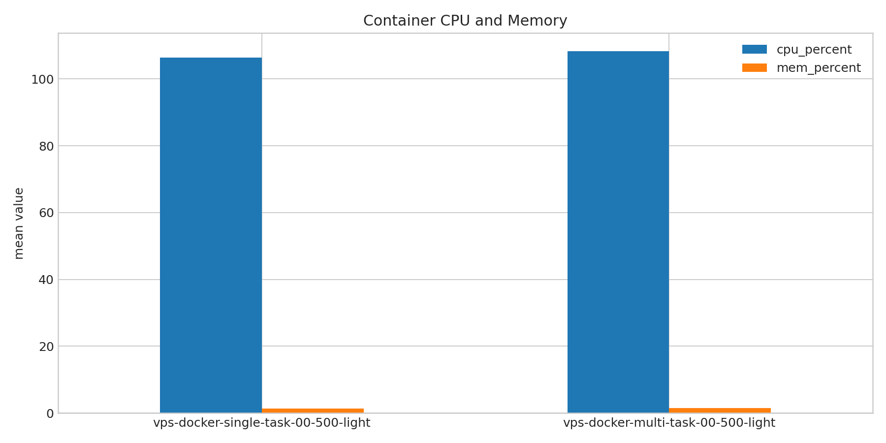
- 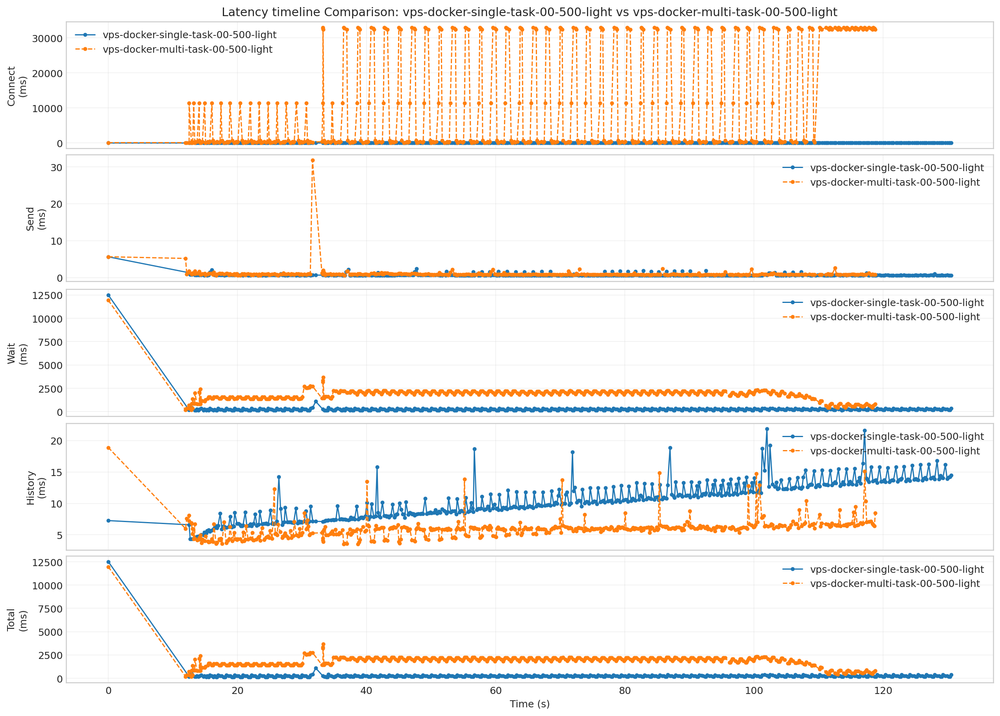
- 
- 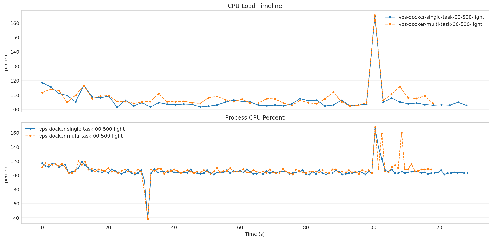
- 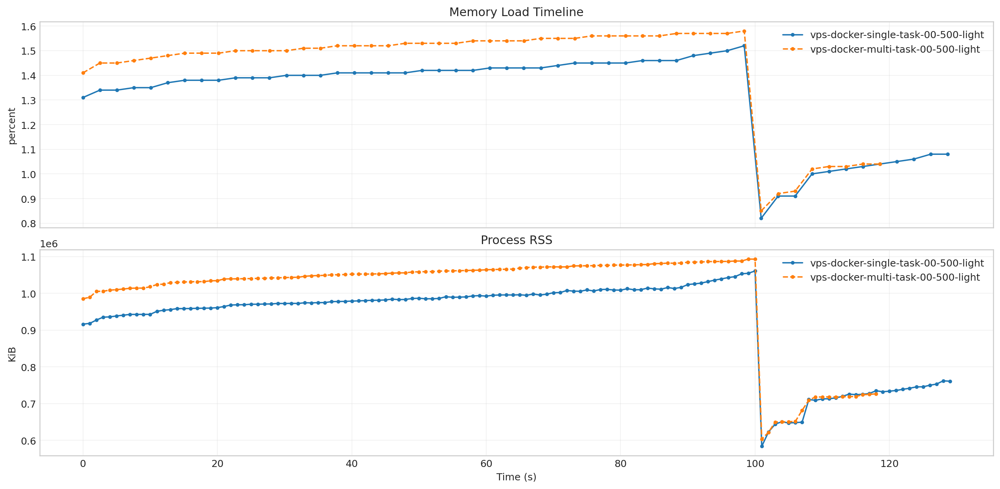
- 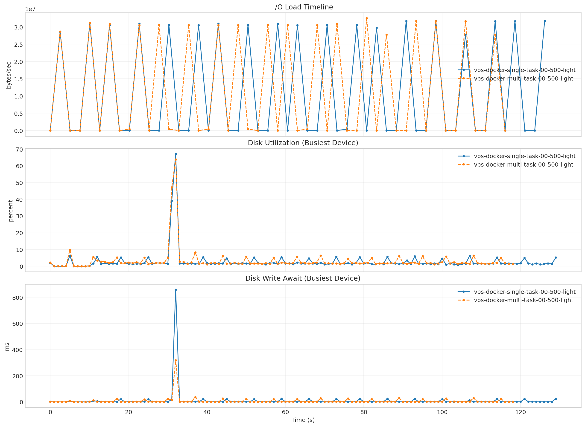
- 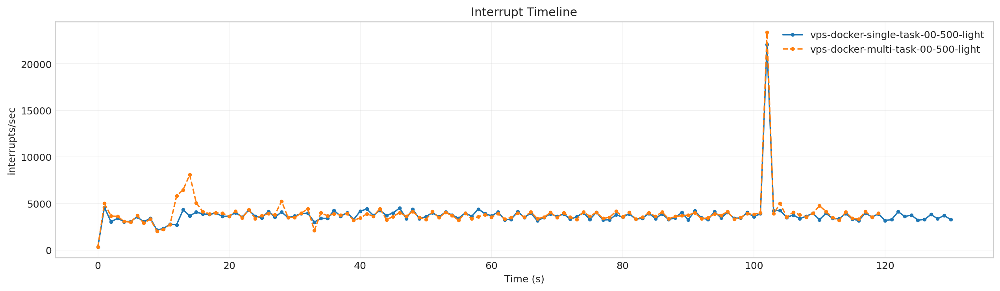
- 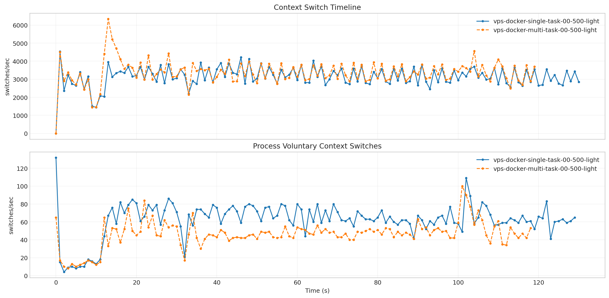
- 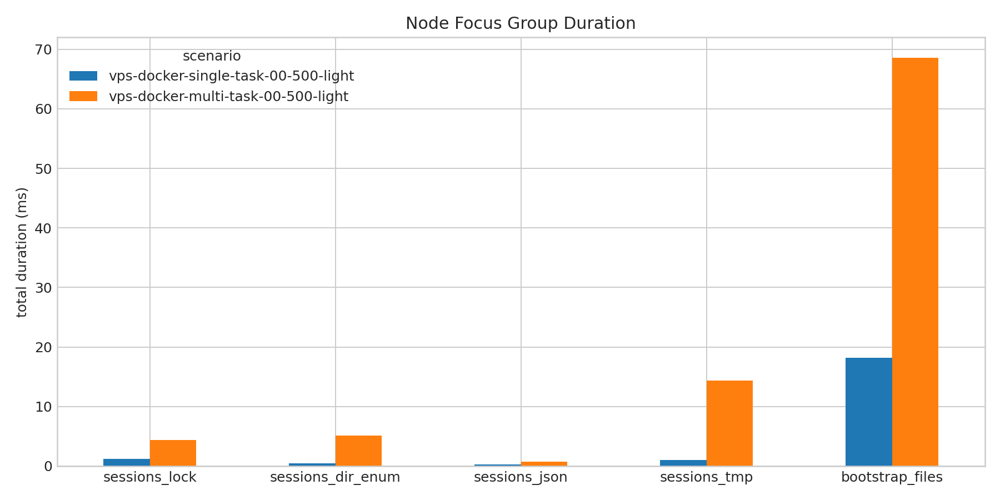
- 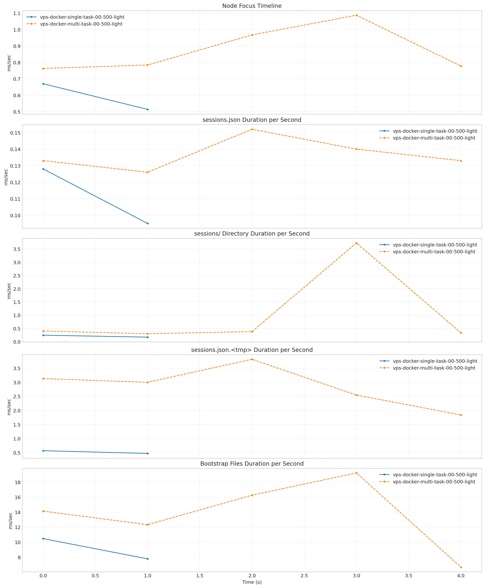
- 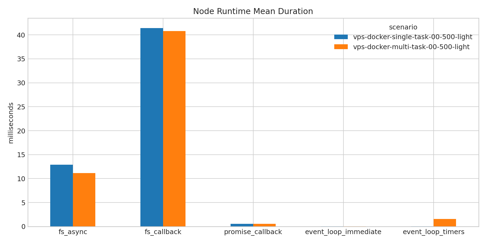
- 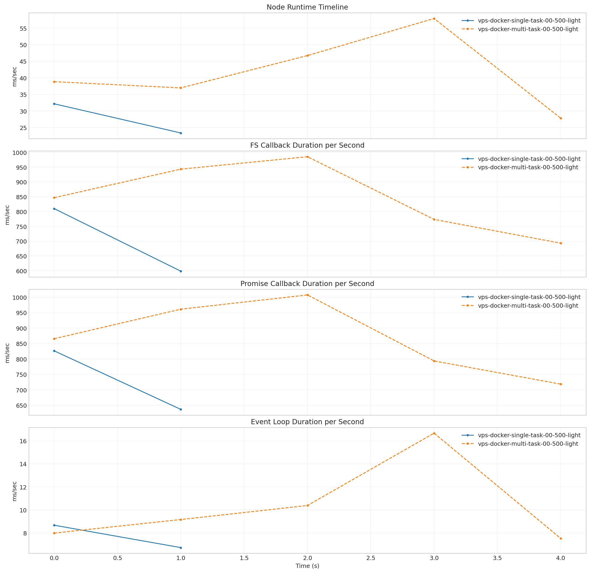

**Latency Overview Table**

| scenario | total_mean | total_p50 | total_p95 | total_p99 |
| --- | --- | --- | --- | --- |
| vps-docker-single-task-00-500-light | 261.776 | 252.928 | 367.645 | 390.102 |
| vps-docker-multi-task-00-500-light | 1850.553 | 2022.294 | 2238.814 | 2757.923 |

**Mean Latency by Phase Table**

| scenario | connect | send | wait | history | total |
| --- | --- | --- | --- | --- | --- |
| vps-docker-single-task-00-500-light | 67.175 | 0.753 | 250.597 | 10.402 | 261.776 |
| vps-docker-multi-task-00-500-light | 11138.293 | 1.006 | 1843.570 | 5.950 | 1850.553 |

**Tail Latency Table**

| scenario | send_p95 | send_p99 | wait_p50 | wait_p95 | wait_p99 | history_p95 | history_p99 | total_p95 | total_p99 |
| --- | --- | --- | --- | --- | --- | --- | --- | --- | --- |
| vps-docker-single-task-00-500-light | 1.601 | 1.853 | 244.109 | 353.796 | 369.536 | 15.224 | 18.668 | 367.645 | 390.102 |
| vps-docker-multi-task-00-500-light | 1.358 | 2.367 | 2015.739 | 2232.774 | 2720.869 | 7.585 | 13.737 | 2238.814 | 2757.923 |

**Container Metrics Table**

| scenario | cpu_percent | mem_percent | block_read_bytes_per_s | block_write_bytes_per_s |
| --- | --- | --- | --- | --- |
| vps-docker-single-task-00-500-light | 106.402 | 1.320 | 0.000 | 11423992.246 |
| vps-docker-multi-task-00-500-light | 108.331 | 1.432 | 0.000 | 11721481.454 |

**Process Metrics Table**

| scenario | cpu_percent | rss_kib | kb_wr_per_s | iodelay | cswch_per_s | nvcswch_per_s |
| --- | --- | --- | --- | --- | --- | --- |
| vps-docker-single-task-00-500-light | 105.346 | 924474.708 | 11243.963 | 0.000 | 62.256 | 1.831 |
| vps-docker-multi-task-00-500-light | 107.378 | 999649.983 | 11999.832 | 0.000 | 46.353 | 2.076 |

**Disk Metrics Table**

| scenario | busiest_device | pct_util | r_await | w_await | f_await | aqu_sz | wkb_s |
| --- | --- | --- | --- | --- | --- | --- | --- |
| vps-docker-single-task-00-500-light | vda | 2.781 | 0.000 | 10.188 | 0.047 | 0.788 | 13410.977 |
| vps-docker-multi-task-00-500-light | vda | 3.208 | 0.000 | 6.910 | 0.050 | 0.411 | 14069.412 |

**System Metrics Table**

| scenario | interrupts_per_s | system_context_switches_per_s | run_queue | perf_cache_misses | perf_context_switches | perf_cpu_migrations | perf_page_faults | perf_unsupported_events | strace_events_per_s_peak | strace_duration_ms_per_s_peak | strace_top_syscall | strace_top_syscall_total_duration_sec |
| --- | --- | --- | --- | --- | --- | --- | --- | --- | --- | --- | --- | --- |
| vps-docker-single-task-00-500-light | 3759.557 | 3138.786 | 1.069 | - | - | - | - |  | - | - |  | - |
| vps-docker-multi-task-00-500-light | 3923.483 | 3368.908 | 1.192 | - | - | - | - |  | - | - |  | - |

**Timeline Peaks Table**

| scenario | docker_cpu_peak | docker_cpu_peak_t_sec | docker_mem_peak | docker_mem_peak_t_sec | pidstat_cpu_peak | pidstat_cpu_peak_t_sec | pidstat_rss_peak | pidstat_rss_peak_t_sec | iostat_pct_util_peak | iostat_pct_util_peak_t_sec | iostat_w_await_peak | iostat_w_await_peak_t_sec | vmstat_interrupts_peak | vmstat_interrupts_peak_t_sec | vmstat_context_switches_peak | vmstat_context_switches_peak_t_sec | perf_context_switches_peak | perf_context_switches_peak_t_sec |
| --- | --- | --- | --- | --- | --- | --- | --- | --- | --- | --- | --- | --- | --- | --- | --- | --- | --- | --- |
| vps-docker-single-task-00-500-light | 164.560 | 100.912 | 1.520 | 98.389 | 165.000 | 101.000 | 1060784.000 | 100.000 | 67.100 | 32.000 | 858.710 | 32.000 | 22089.000 | 102.000 | 4530.000 | 1.000 | - | - |
| vps-docker-multi-task-00-500-light | 165.260 | 100.916 | 1.580 | 98.393 | 168.000 | 101.000 | 1093076.000 | 99.000 | 63.800 | 32.000 | 318.430 | 32.000 | 23377.000 | 102.000 | 6343.000 | 13.000 | - | - |

**strace Key Syscalls Table**

| scenario | run_dir | openat_count | openat_total_sec | openat_mean_ms | statx_count | statx_total_sec | statx_mean_ms | newfstatat_count | newfstatat_total_sec | newfstatat_mean_ms | pread64_count | pread64_total_sec | pread64_mean_ms | clone_count | clone_total_sec | clone_mean_ms | sched_yield_count | sched_yield_total_sec | sched_yield_mean_ms | futex_count | futex_total_sec | futex_mean_ms | read_count | read_total_sec | read_mean_ms | write_count | write_total_sec | write_mean_ms | futex_total_sec_per_request | futex_total_sec_per_wall_sec | statx_total_sec_per_request | statx_total_sec_per_wall_sec | openat_total_sec_per_request | openat_total_sec_per_wall_sec | estimated_makespan_sec |
| --- | --- | --- | --- | --- | --- | --- | --- | --- | --- | --- | --- | --- | --- | --- | --- | --- | --- | --- | --- | --- | --- | --- | --- | --- | --- | --- | --- | --- | --- | --- | --- | --- | --- | --- | --- |
| vps-docker-single-task-00-500-light | /root/client-harness/out/20260410T135938Z_vps-docker-single-task-00-500-light | - | - | - | - | - | - | - | - | - | - | - | - | - | - | - | - | - | - | - | - | - | - | - | - | - | - | - | - | - | - | - | - | - | 134.731 |
| vps-docker-multi-task-00-500-light | /root/client-harness/out/20260410T145118Z_vps-docker-multi-task-00-500-light | - | - | - | - | - | - | - | - | - | - | - | - | - | - | - | - | - | - | - | - | - | - | - | - | - | - | - | - | - | - | - | - | - | 129.689 |

**strace Mean Duration Table**

| scenario | vps-docker-single-task-00-500-light | vps-docker-multi-task-00-500-light |
| --- | --- | --- |
| openat | - | - |
| statx | - | - |
| newfstatat | - | - |
| pread64 | - | - |
| clone | - | - |
| sched_yield | - | - |
| futex | - | - |
| read | - | - |
| write | - | - |

**Gateway Runtime Stage Table**

| scenario | bootstrap_load_mean_ms | skills_mean_ms | context_bundle_mean_ms | execution_admission_wait_mean_ms | reply_dispatch_queue_wait_mean_ms | reply_dispatch_queue_hold_mean_ms | reply_dispatch_pending_mean |
| --- | --- | --- | --- | --- | --- | --- | --- |
| vps-docker-single-task-00-500-light | - | - | - | - | - | - | - |
| vps-docker-multi-task-00-500-light | - | - | - | - | - | - | - |

**Node Focus Groups Table**

| scenario | sessions_lock_total_ms | sessions_lock_count | sessions_dir_enum_total_ms | sessions_dir_enum_count | sessions_json_total_ms | sessions_json_count | sessions_tmp_total_ms | sessions_tmp_count | bootstrap_files_total_ms | bootstrap_files_count |
| --- | --- | --- | --- | --- | --- | --- | --- | --- | --- | --- |
| vps-docker-single-task-00-500-light | 1.184 | 28.000 | 0.415 | 14.000 | 0.223 | 7.000 | 1.033 | 28.000 | 18.223 | 91.000 |
| vps-docker-multi-task-00-500-light | 4.379 | 84.000 | 5.143 | 42.000 | 0.684 | 21.000 | 14.323 | 84.000 | 68.585 | 247.000 |

**Runtime Category Samples Table**

| scenario | run_dir | sample_count | fs_worker_exec_count | fs_worker_exec_pct | fs_callback_count | fs_callback_pct | event_loop_poll_count | event_loop_poll_pct | microtask_count | microtask_pct | futex_sync_count | futex_sync_pct | worker_message_count | worker_message_pct | json_parse_count | json_parse_pct | libuv_worker_other_count | libuv_worker_other_pct | gateway_main_other_count | gateway_main_other_pct | v8_worker_count | v8_worker_pct | other_count | other_pct |
| --- | --- | --- | --- | --- | --- | --- | --- | --- | --- | --- | --- | --- | --- | --- | --- | --- | --- | --- | --- | --- | --- | --- | --- | --- |
| vps-docker-single-task-00-500-light | /root/client-harness/out/20260410T135938Z_vps-docker-single-task-00-500-light | - | - | - | - | - | - | - | - | - | - | - | - | - | - | - | - | - | - | - | - | - | - | - |
| vps-docker-multi-task-00-500-light | /root/client-harness/out/20260410T145118Z_vps-docker-multi-task-00-500-light | - | - | - | - | - | - | - | - | - | - | - | - | - | - | - | - | - | - | - | - | - | - | - |

**Runtime Category Percent Table**

| scenario | vps-docker-single-task-00-500-light | vps-docker-multi-task-00-500-light |
| --- | --- | --- |
| fs_worker_exec | - | - |
| fs_callback | - | - |
| event_loop_poll | - | - |
| microtask | - | - |
| futex_sync | - | - |
| worker_message | - | - |
| json_parse | - | - |
| libuv_worker_other | - | - |
| gateway_main_other | - | - |
| v8_worker | - | - |
| other | - | - |

**Node Runtime Metrics Table**

| scenario | fs_async_mean_ms | fs_callback_mean_ms | promise_callback_mean_ms | event_loop_immediate_mean_ms | event_loop_timers_mean_ms | fs_async_count | fs_callback_count | promise_callback_count |
| --- | --- | --- | --- | --- | --- | --- | --- | --- |
| vps-docker-single-task-00-500-light | 12.871 | 41.428 | 0.564 | 0.027 | 0.039 | 65177.000 | 34.000 | 2596.000 |
| vps-docker-multi-task-00-500-light | 11.174 | 40.800 | 0.545 | 0.031 | 1.561 | 196250.000 | 104.000 | 7980.000 |

**Node Runtime Mean Duration Table**

| scenario | vps-docker-single-task-00-500-light | vps-docker-multi-task-00-500-light |
| --- | --- | --- |
| fs_async | 12.871 | 11.174 |
| fs_callback | 41.428 | 40.800 |
| promise_callback | 0.564 | 0.545 |
| event_loop_immediate | 0.027 | 0.031 |
| event_loop_timers | 0.039 | 1.561 |

**Top Node FS Paths: `vps-docker-single-task-00-500-light`**

| scenario | count | total_duration_ms |
| --- | --- | --- |
| /home/node/.openclaw/agents/main/sessions/sessions.json.lock | 28 | 1.184 |
| /home/node/.openclaw/workspace/HEARTBEAT.md | 14 | 1.860 |
| /home/node/.openclaw/workspace/USER.md | 14 | 2.225 |
| /home/node/.openclaw/workspace/IDENTITY.md | 14 | 2.606 |
| /home/node/.openclaw/workspace/TOOLS.md | 14 | 2.990 |

**Top Node FS Paths: `vps-docker-multi-task-00-500-light`**

| scenario | count | total_duration_ms |
| --- | --- | --- |
| /home/node/.openclaw/agents/main/sessions/sessions.json.lock | 84 | 4.379 |
| /home/node/.openclaw/agents/main/sessions | 42 | 5.143 |
| /home/node/.openclaw/workspace/HEARTBEAT.md | 38 | 8.106 |
| /home/node/.openclaw/workspace/USER.md | 38 | 8.647 |
| /home/node/.openclaw/workspace/IDENTITY.md | 38 | 10.092 |

**Node FS Path Categories: `vps-docker-single-task-00-500-light`**

| scenario | count | total_duration_ms |
| --- | --- | --- |
| workspace_bootstrap | 91 | 18.223 |
| openclaw_runtime | 91 | 4.380 |
| markdown_docs | 7 | 0.899 |
| git_metadata | 7 | 0.525 |

**Node FS Path Categories: `vps-docker-multi-task-00-500-light`**

| scenario | count | total_duration_ms |
| --- | --- | --- |
| openclaw_runtime | 270 | 38.941 |
| workspace_bootstrap | 247 | 68.585 |
| markdown_docs | 19 | 4.507 |
| git_metadata | 19 | 3.382 |

