## `vps-docker-swebench-smoke-burst-serial-2-smoke` vs `vps-docker-swebench-smoke-burst-single-container-multi-openclaw-2x1w-smoke`

**Run Dirs**

| scenario | run_dir | requests_total | requests_ok | requests_failed |
| --- | --- | --- | --- | --- |
| vps-docker-swebench-smoke-burst-serial-2-smoke | /root/Zehao/ClawHarness/out/batch_run_swe_smoke/task-swebench-verified-astropy-11693/20260524T002648Z_vps-docker-swebench-smoke-burst-serial-2-smoke | 2 | 2 | 0 |
| vps-docker-swebench-smoke-burst-single-container-multi-openclaw-2x1w-smoke | /root/Zehao/ClawHarness/out/batch_run_swe_smoke/task-swebench-verified-astropy-11693/20260524T003813Z_vps-docker-swebench-smoke-burst-single-container-multi-openclaw-2x1w-smoke | 2 | 2 | 0 |

**Run Timing Table**

| scenario | run_dir | run_started_at | run_finished_at | run_wall_clock_sec | first_request_started_at | last_request_finished_at | request_window_sec |
| --- | --- | --- | --- | --- | --- | --- | --- |
| vps-docker-swebench-smoke-burst-serial-2-smoke | /root/Zehao/ClawHarness/out/batch_run_swe_smoke/task-swebench-verified-astropy-11693/20260524T002648Z_vps-docker-swebench-smoke-burst-serial-2-smoke | 2026-05-24T00:26:49.866216+00:00 | 2026-05-24T00:31:25.531079+00:00 | 275.665 | 2026-05-24T00:26:49.925013+00:00 | 2026-05-24T00:31:24.066942+00:00 | 274.142 |
| vps-docker-swebench-smoke-burst-single-container-multi-openclaw-2x1w-smoke | /root/Zehao/ClawHarness/out/batch_run_swe_smoke/task-swebench-verified-astropy-11693/20260524T003813Z_vps-docker-swebench-smoke-burst-single-container-multi-openclaw-2x1w-smoke | 2026-05-24T00:38:21.180569+00:00 | 2026-05-24T00:41:26.894372+00:00 | 185.714 | 2026-05-24T00:38:21.981870+00:00 | 2026-05-24T00:41:23.165476+00:00 | 181.184 |

**Figures**

- 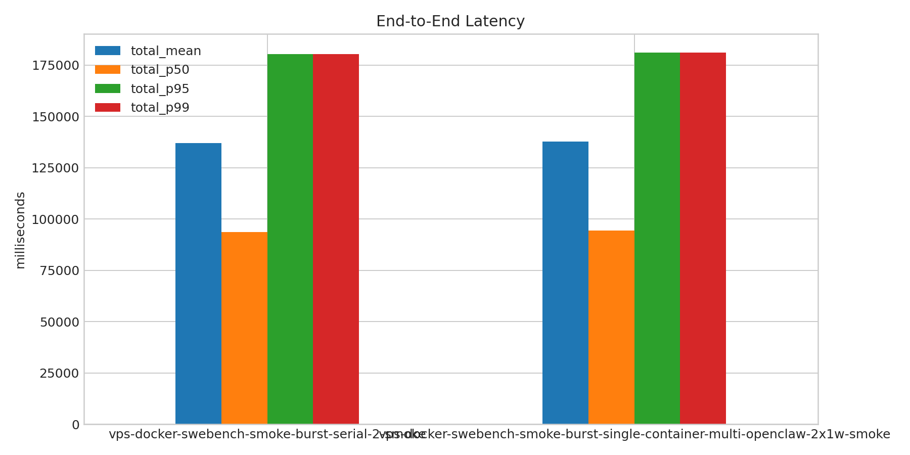
- 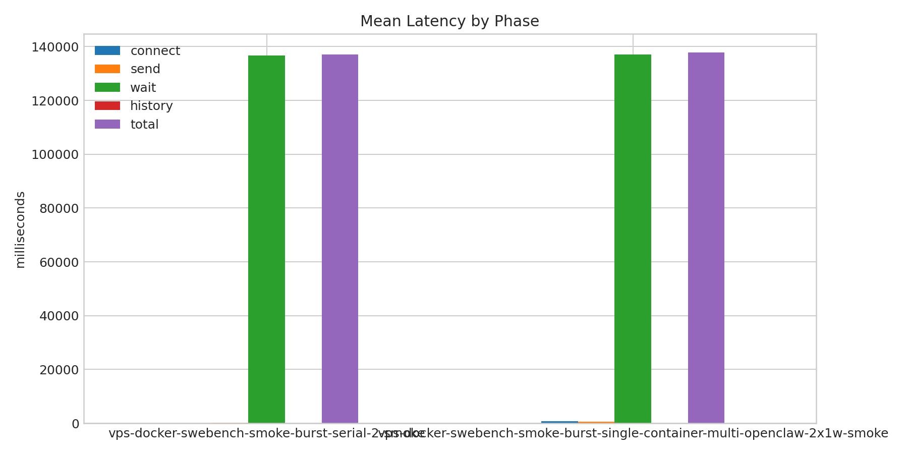
- 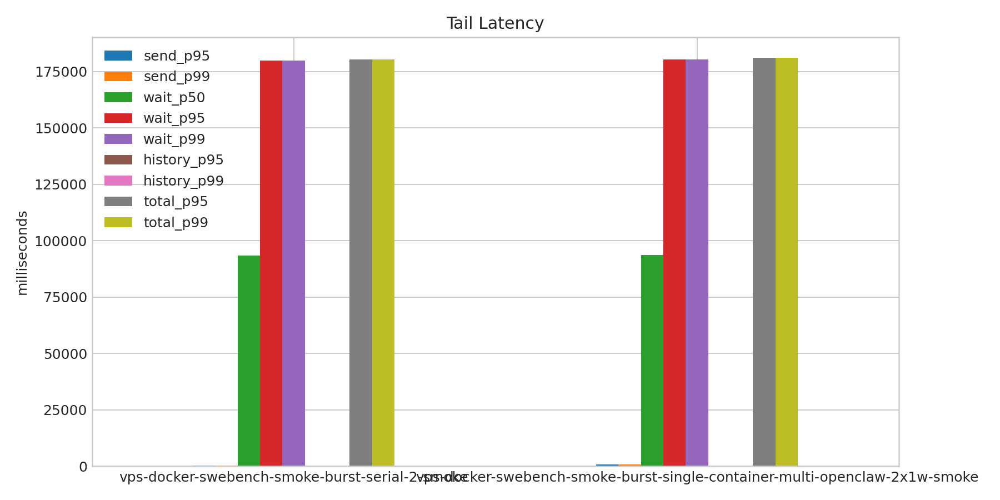
- 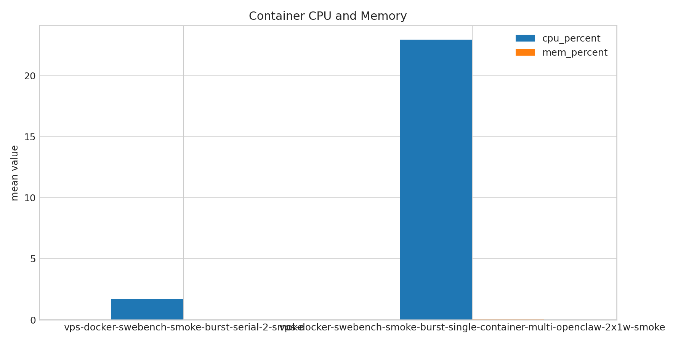
- 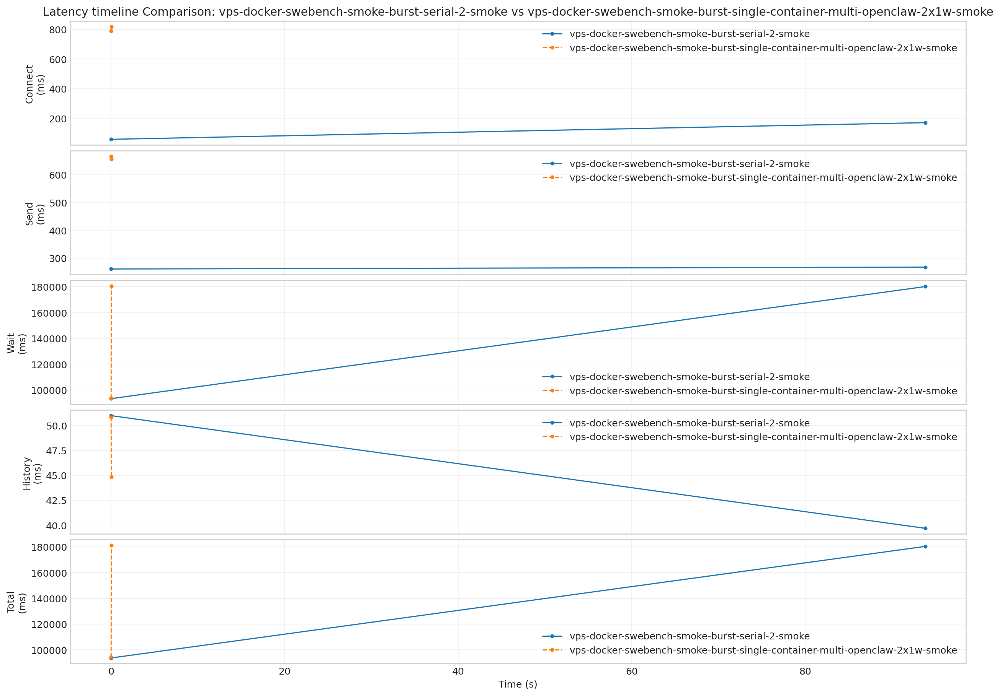
- 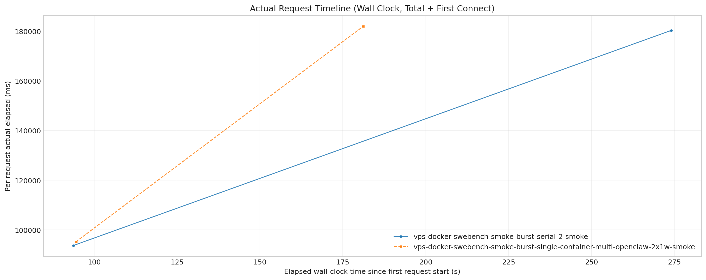
- 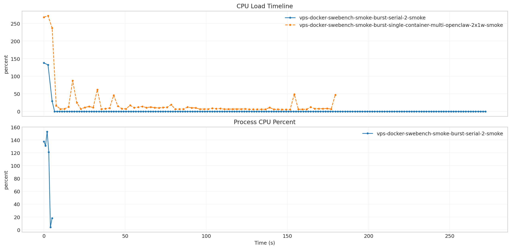
- 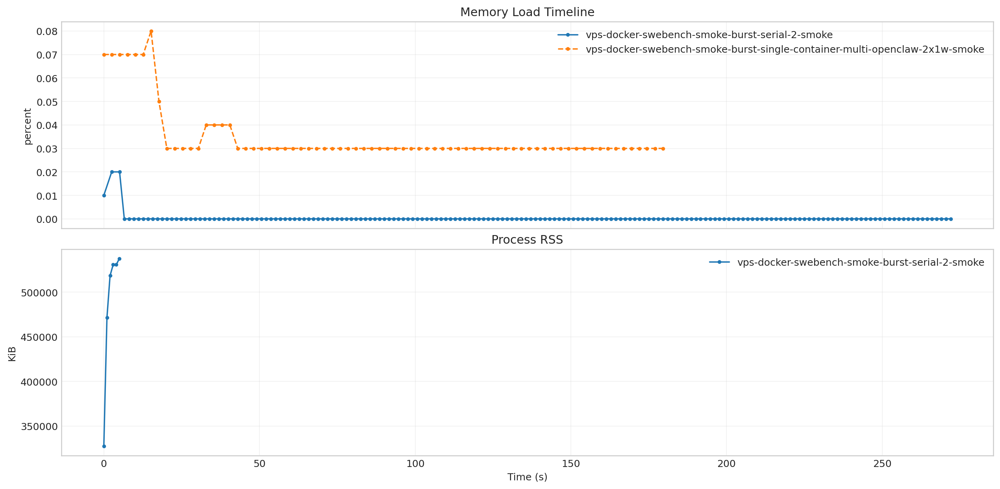
- 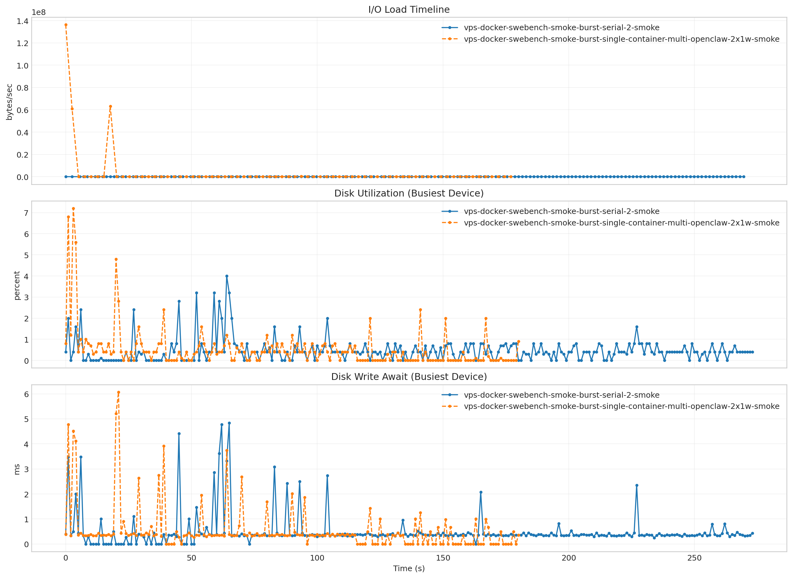
- 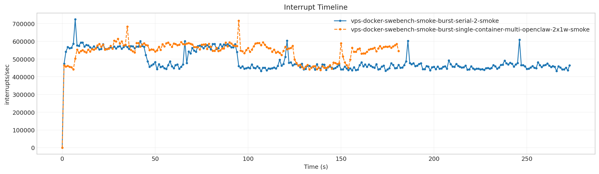
- 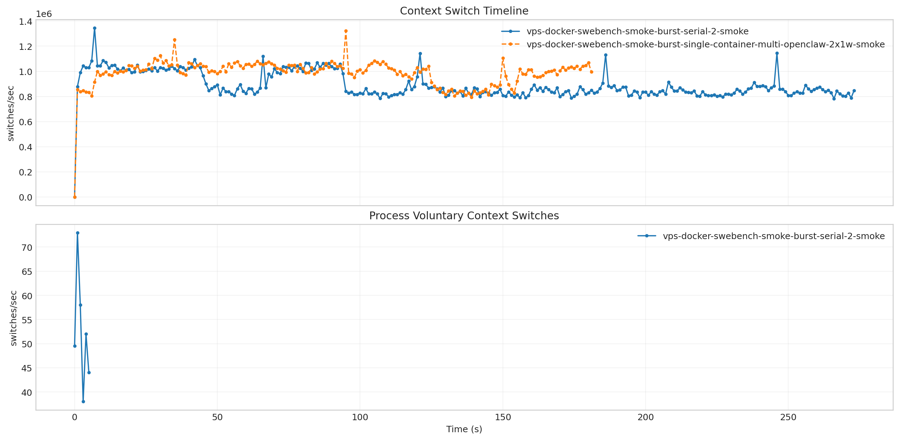

**Latency Overview Table**

| scenario | total_mean | total_p50 | total_p95 | total_p99 |
| --- | --- | --- | --- | --- |
| vps-docker-swebench-smoke-burst-serial-2-smoke | 136984.439 | 93657.752 | 180311.126 | 180311.126 |
| vps-docker-swebench-smoke-burst-single-container-multi-openclaw-2x1w-smoke | 137824.008 | 94482.184 | 181165.832 | 181165.832 |

**Mean Latency by Phase Table**

| scenario | connect | send | wait | history | total |
| --- | --- | --- | --- | --- | --- |
| vps-docker-swebench-smoke-burst-serial-2-smoke | 58.472 | 263.803 | 136675.251 | 45.328 | 136984.439 |
| vps-docker-swebench-smoke-burst-single-container-multi-openclaw-2x1w-smoke | 803.665 | 661.116 | 137115.005 | 47.825 | 137824.008 |

**Tail Latency Table**

| scenario | send_p95 | send_p99 | wait_p50 | wait_p95 | wait_p99 | history_p95 | history_p99 | total_p95 | total_p99 |
| --- | --- | --- | --- | --- | --- | --- | --- | --- | --- |
| vps-docker-swebench-smoke-burst-serial-2-smoke | 267.118 | 267.118 | 93346.223 | 180004.279 | 180004.279 | 50.979 | 50.979 | 180311.126 | 180311.126 |
| vps-docker-swebench-smoke-burst-single-container-multi-openclaw-2x1w-smoke | 666.173 | 666.173 | 93765.128 | 180464.883 | 180464.883 | 50.815 | 50.815 | 181165.832 | 181165.832 |

**Container Metrics Table**

| scenario | cpu_percent | mem_percent | block_read_bytes_per_s | block_write_bytes_per_s |
| --- | --- | --- | --- | --- |
| vps-docker-swebench-smoke-burst-serial-2-smoke | 1.673 | 0.000 | 0.000 | 64.104 |
| vps-docker-swebench-smoke-burst-single-container-multi-openclaw-2x1w-smoke | 22.962 | 0.035 | 228.340 | 3673311.420 |

**Process Metrics Table**

| scenario | cpu_percent | rss_kib | kb_wr_per_s | iodelay | cswch_per_s | nvcswch_per_s |
| --- | --- | --- | --- | --- | --- | --- |
| vps-docker-swebench-smoke-burst-serial-2-smoke | 94.103 | 486119.333 | 17271.788 | 0.000 | 52.417 | 48.212 |
| vps-docker-swebench-smoke-burst-single-container-multi-openclaw-2x1w-smoke | - | - | - | - | - | - |

**NPU Metrics Table**

| scenario | utilization_pct | hbm_usage_pct | aicore_usage_pct | aivector_usage_pct | aicpu_usage_pct | ctrlcpu_usage_pct |
| --- | --- | --- | --- | --- | --- | --- |
| vps-docker-swebench-smoke-burst-serial-2-smoke | - | - | - | - | - | - |
| vps-docker-swebench-smoke-burst-single-container-multi-openclaw-2x1w-smoke | - | - | - | - | - | - |

**Disk Metrics Table**

| scenario | busiest_device | pct_util | r_await | w_await | f_await | aqu_sz | wkb_s |
| --- | --- | --- | --- | --- | --- | --- | --- |
| vps-docker-swebench-smoke-burst-serial-2-smoke | sda | 0.465 | 0.051 | 0.502 | 0.000 | 0.058 | 2817.762 |
| vps-docker-swebench-smoke-burst-single-container-multi-openclaw-2x1w-smoke | sda | 0.511 | 0.078 | 0.547 | 0.000 | 0.116 | 5560.044 |

**System Metrics Table**

| scenario | interrupts_per_s | system_context_switches_per_s | run_queue | perf_cache_misses | perf_context_switches | perf_cpu_migrations | perf_page_faults | perf_unsupported_events | strace_events_per_s_peak | strace_duration_ms_per_s_peak | strace_top_syscall | strace_top_syscall_total_duration_sec |
| --- | --- | --- | --- | --- | --- | --- | --- | --- | --- | --- | --- | --- |
| vps-docker-swebench-smoke-burst-serial-2-smoke | 487159.558 | 890667.996 | 3.416 | - | - | - | - |  | - | - |  | - |
| vps-docker-swebench-smoke-burst-single-container-multi-openclaw-2x1w-smoke | 543408.637 | 985502.357 | 6.885 | - | - | - | - |  | - | - |  | - |

**Timeline Peaks Table**

| scenario | docker_cpu_peak | docker_cpu_peak_t_sec | docker_mem_peak | docker_mem_peak_t_sec | pidstat_cpu_peak | pidstat_cpu_peak_t_sec | pidstat_rss_peak | pidstat_rss_peak_t_sec | iostat_pct_util_peak | iostat_pct_util_peak_t_sec | iostat_w_await_peak | iostat_w_await_peak_t_sec | vmstat_interrupts_peak | vmstat_interrupts_peak_t_sec | vmstat_context_switches_peak | vmstat_context_switches_peak_t_sec | npu_utilization_peak | npu_utilization_peak_t_sec | npu_hbm_usage_peak | npu_hbm_usage_peak_t_sec | perf_context_switches_peak | perf_context_switches_peak_t_sec |
| --- | --- | --- | --- | --- | --- | --- | --- | --- | --- | --- | --- | --- | --- | --- | --- | --- | --- | --- | --- | --- | --- | --- |
| vps-docker-swebench-smoke-burst-serial-2-smoke | 137.830 | 0.000 | 0.020 | 2.529 | 153.000 | 2.000 | 537868.000 | 5.000 | 4.000 | 64.000 | 4.840 | 65.000 | 723917.000 | 7.000 | 1345255.000 | 7.000 | - | - | - | - | - | - |
| vps-docker-swebench-smoke-burst-single-container-multi-openclaw-2x1w-smoke | 271.840 | 2.530 | 0.080 | 15.178 | - | - | - | - | 7.200 | 3.000 | 6.070 | 21.000 | 715852.000 | 95.000 | 1322678.000 | 95.000 | - | - | - | - | - | - |

**strace Key Syscalls Table**

| scenario | run_dir | openat_count | openat_total_sec | openat_mean_ms | statx_count | statx_total_sec | statx_mean_ms | newfstatat_count | newfstatat_total_sec | newfstatat_mean_ms | pread64_count | pread64_total_sec | pread64_mean_ms | clone_count | clone_total_sec | clone_mean_ms | sched_yield_count | sched_yield_total_sec | sched_yield_mean_ms | futex_count | futex_total_sec | futex_mean_ms | read_count | read_total_sec | read_mean_ms | write_count | write_total_sec | write_mean_ms | futex_total_sec_per_request | futex_total_sec_per_wall_sec | statx_total_sec_per_request | statx_total_sec_per_wall_sec | openat_total_sec_per_request | openat_total_sec_per_wall_sec | estimated_makespan_sec |
| --- | --- | --- | --- | --- | --- | --- | --- | --- | --- | --- | --- | --- | --- | --- | --- | --- | --- | --- | --- | --- | --- | --- | --- | --- | --- | --- | --- | --- | --- | --- | --- | --- | --- | --- | --- |
| vps-docker-swebench-smoke-burst-serial-2-smoke | /root/Zehao/ClawHarness/out/batch_run_swe_smoke/task-swebench-verified-astropy-11693/20260524T002648Z_vps-docker-swebench-smoke-burst-serial-2-smoke | - | - | - | - | - | - | - | - | - | - | - | - | - | - | - | - | - | - | - | - | - | - | - | - | - | - | - | - | - | - | - | - | - | 275.665 |
| vps-docker-swebench-smoke-burst-single-container-multi-openclaw-2x1w-smoke | /root/Zehao/ClawHarness/out/batch_run_swe_smoke/task-swebench-verified-astropy-11693/20260524T003813Z_vps-docker-swebench-smoke-burst-single-container-multi-openclaw-2x1w-smoke | - | - | - | - | - | - | - | - | - | - | - | - | - | - | - | - | - | - | - | - | - | - | - | - | - | - | - | - | - | - | - | - | - | 185.714 |

**strace Mean Duration Table**

| scenario | vps-docker-swebench-smoke-burst-serial-2-smoke | vps-docker-swebench-smoke-burst-single-container-multi-openclaw-2x1w-smoke |
| --- | --- | --- |
| openat | - | - |
| statx | - | - |
| newfstatat | - | - |
| pread64 | - | - |
| clone | - | - |
| sched_yield | - | - |
| futex | - | - |
| read | - | - |
| write | - | - |

**Gateway Runtime Stage Table**

| scenario | bootstrap_load_mean_ms | skills_mean_ms | context_bundle_mean_ms | execution_admission_wait_mean_ms | reply_dispatch_queue_wait_mean_ms | reply_dispatch_queue_hold_mean_ms | reply_dispatch_pending_mean |
| --- | --- | --- | --- | --- | --- | --- | --- |
| vps-docker-swebench-smoke-burst-serial-2-smoke | - | - | - | - | - | - | - |
| vps-docker-swebench-smoke-burst-single-container-multi-openclaw-2x1w-smoke | - | - | - | - | - | - | - |

**Node Focus Groups Table**

| scenario | sessions_lock_total_ms | sessions_lock_count | sessions_dir_enum_total_ms | sessions_dir_enum_count | sessions_json_total_ms | sessions_json_count | sessions_tmp_total_ms | sessions_tmp_count | bootstrap_files_total_ms | bootstrap_files_count |
| --- | --- | --- | --- | --- | --- | --- | --- | --- | --- | --- |
| vps-docker-swebench-smoke-burst-serial-2-smoke | - | - | - | - | - | - | - | - | - | - |
| vps-docker-swebench-smoke-burst-single-container-multi-openclaw-2x1w-smoke | - | - | - | - | - | - | - | - | - | - |

**Runtime Category Samples Table**

| scenario | run_dir | sample_count | fs_worker_exec_count | fs_worker_exec_pct | fs_callback_count | fs_callback_pct | event_loop_poll_count | event_loop_poll_pct | microtask_count | microtask_pct | futex_sync_count | futex_sync_pct | worker_message_count | worker_message_pct | json_parse_count | json_parse_pct | libuv_worker_other_count | libuv_worker_other_pct | gateway_main_other_count | gateway_main_other_pct | v8_worker_count | v8_worker_pct | other_count | other_pct |
| --- | --- | --- | --- | --- | --- | --- | --- | --- | --- | --- | --- | --- | --- | --- | --- | --- | --- | --- | --- | --- | --- | --- | --- | --- |
| vps-docker-swebench-smoke-burst-serial-2-smoke | /root/Zehao/ClawHarness/out/batch_run_swe_smoke/task-swebench-verified-astropy-11693/20260524T002648Z_vps-docker-swebench-smoke-burst-serial-2-smoke | - | - | - | - | - | - | - | - | - | - | - | - | - | - | - | - | - | - | - | - | - | - | - |
| vps-docker-swebench-smoke-burst-single-container-multi-openclaw-2x1w-smoke | /root/Zehao/ClawHarness/out/batch_run_swe_smoke/task-swebench-verified-astropy-11693/20260524T003813Z_vps-docker-swebench-smoke-burst-single-container-multi-openclaw-2x1w-smoke | - | - | - | - | - | - | - | - | - | - | - | - | - | - | - | - | - | - | - | - | - | - | - |

**Runtime Category Percent Table**

| scenario | vps-docker-swebench-smoke-burst-serial-2-smoke | vps-docker-swebench-smoke-burst-single-container-multi-openclaw-2x1w-smoke |
| --- | --- | --- |
| fs_worker_exec | - | - |
| fs_callback | - | - |
| event_loop_poll | - | - |
| microtask | - | - |
| futex_sync | - | - |
| worker_message | - | - |
| json_parse | - | - |
| libuv_worker_other | - | - |
| gateway_main_other | - | - |
| v8_worker | - | - |
| other | - | - |

