## `single-instance-2w` vs `single-container-2x1w` vs `multi-container-2x1x1w`

Generated at: 2026-05-24 08:45:17+08:00

**Run Dirs**

| scenario | run_dir | requests_total | requests_ok | requests_failed |
| --- | --- | --- | --- | --- |
| single-instance-2w | /root/Zehao/ClawHarness/out/batch_run_swe_smoke/task-swebench-verified-astropy-11693/20260524T003703Z_vps-docker-swebench-smoke-burst-single-container-single-instance-2w-smoke | 2 | 2 | 0 |
| single-container-2x1w | /root/Zehao/ClawHarness/out/batch_run_swe_smoke/task-swebench-verified-astropy-11693/20260524T003813Z_vps-docker-swebench-smoke-burst-single-container-multi-openclaw-2x1w-smoke | 2 | 2 | 0 |
| multi-container-2x1x1w | /root/Zehao/ClawHarness/out/batch_run_swe_smoke/task-swebench-verified-astropy-11693/20260524T004127Z_vps-docker-swebench-smoke-burst-multi-container-single-openclaw-2x1x1w-smoke | 2 | 2 | 0 |

**Run Timing Table**

| scenario | run_dir | run_started_at | run_finished_at | run_wall_clock_sec | first_request_started_at | last_request_finished_at | request_window_sec |
| --- | --- | --- | --- | --- | --- | --- | --- |
| single-instance-2w | /root/Zehao/ClawHarness/out/batch_run_swe_smoke/task-swebench-verified-astropy-11693/20260524T003703Z_vps-docker-swebench-smoke-burst-single-container-single-instance-2w-smoke | 2026-05-24T00:37:05.098400+00:00 | 2026-05-24T00:38:13.538515+00:00 | 68.440 | 2026-05-24T00:37:05.181603+00:00 | 2026-05-24T00:38:12.042926+00:00 | 66.861 |
| single-container-2x1w | /root/Zehao/ClawHarness/out/batch_run_swe_smoke/task-swebench-verified-astropy-11693/20260524T003813Z_vps-docker-swebench-smoke-burst-single-container-multi-openclaw-2x1w-smoke | 2026-05-24T00:38:21.180569+00:00 | 2026-05-24T00:41:26.894372+00:00 | 185.714 | 2026-05-24T00:38:21.981870+00:00 | 2026-05-24T00:41:23.165476+00:00 | 181.184 |
| multi-container-2x1x1w | /root/Zehao/ClawHarness/out/batch_run_swe_smoke/task-swebench-verified-astropy-11693/20260524T004127Z_vps-docker-swebench-smoke-burst-multi-container-single-openclaw-2x1x1w-smoke | 2026-05-24T00:41:39.284703+00:00 | 2026-05-24T00:44:45.277239+00:00 | 185.993 | 2026-05-24T00:41:39.393655+00:00 | 2026-05-24T00:44:40.613999+00:00 | 181.220 |

**Figures**

- 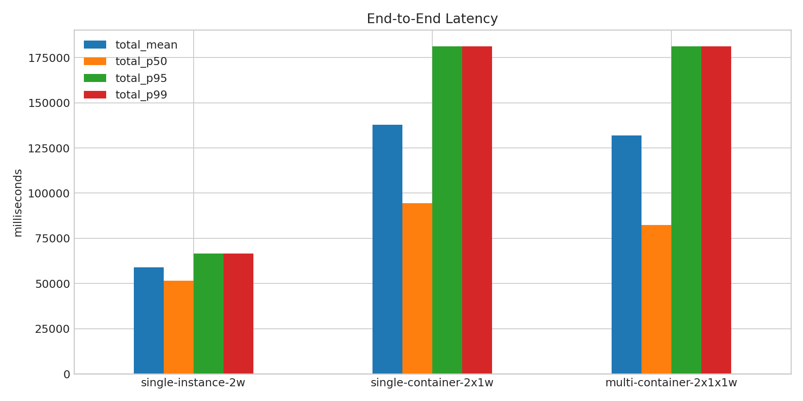
- 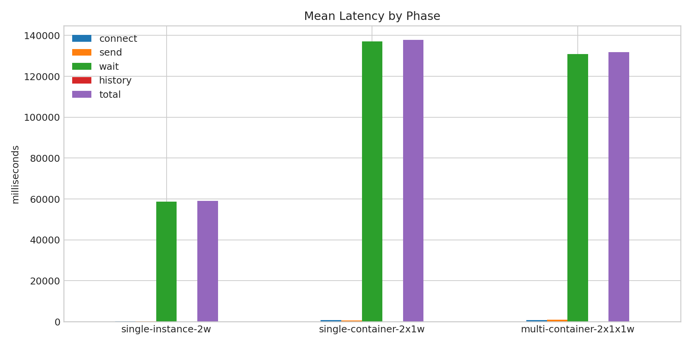
- 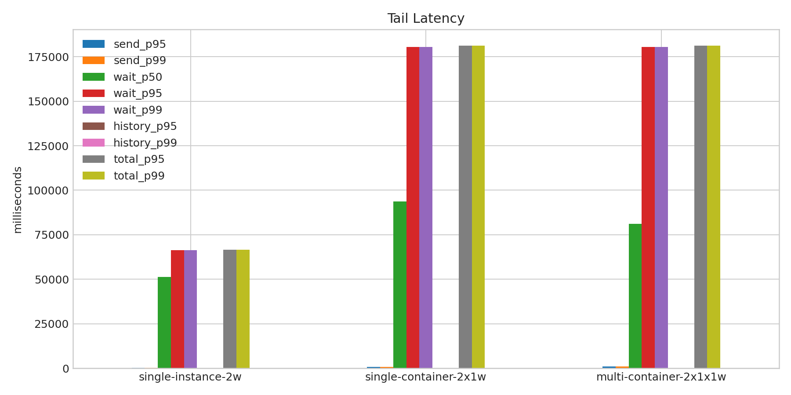
- 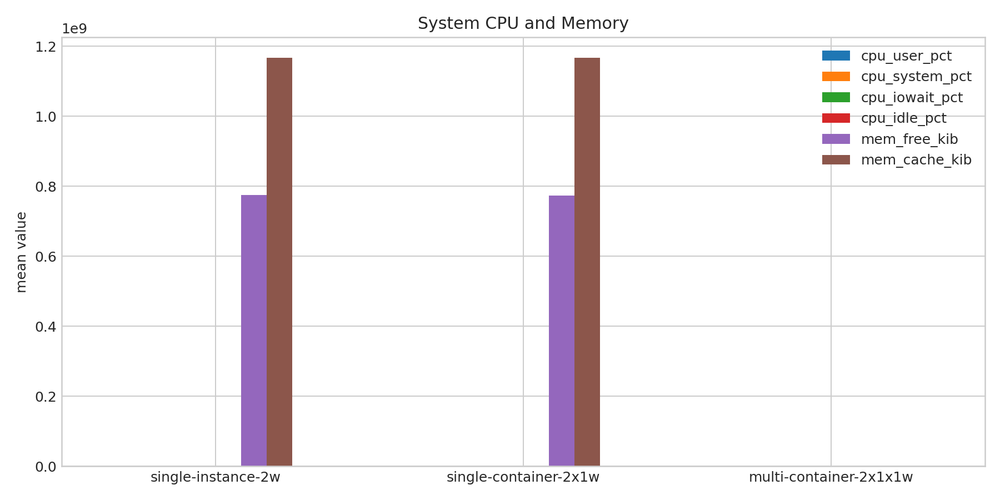
- 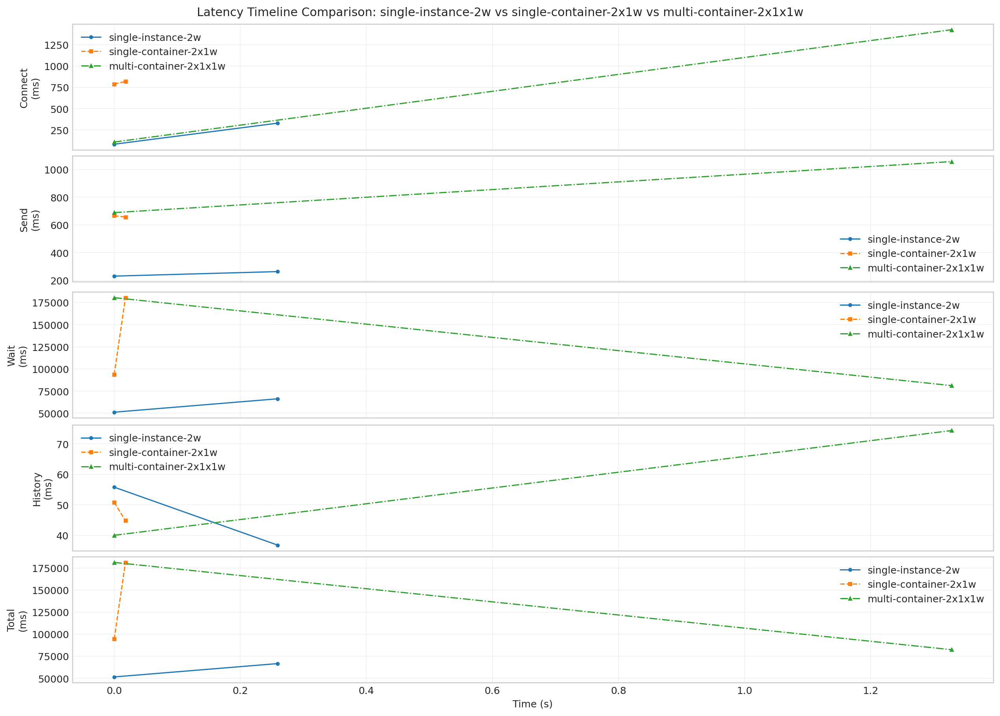
- 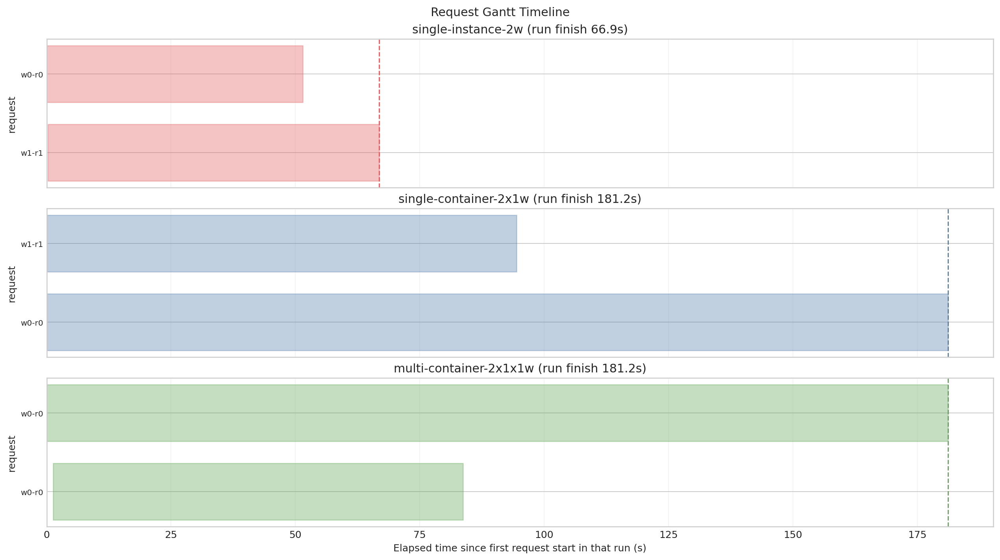
- 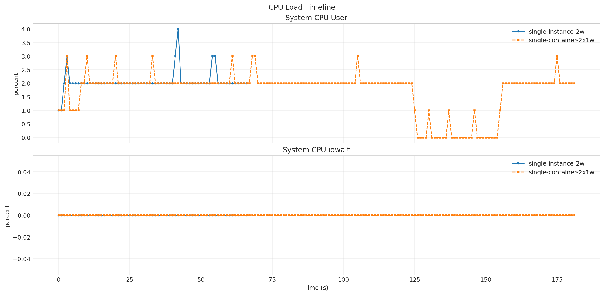
- 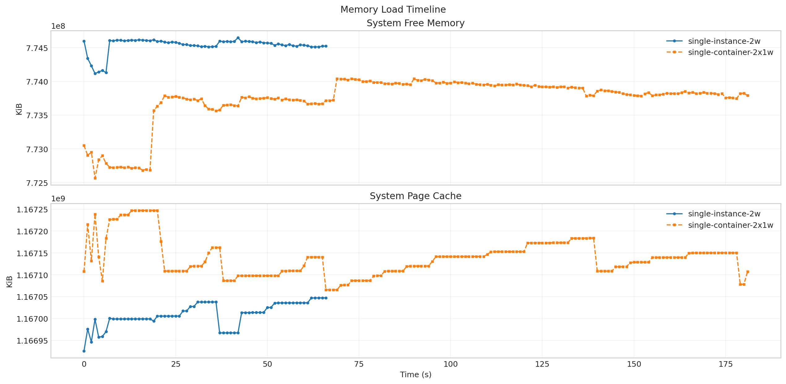
- 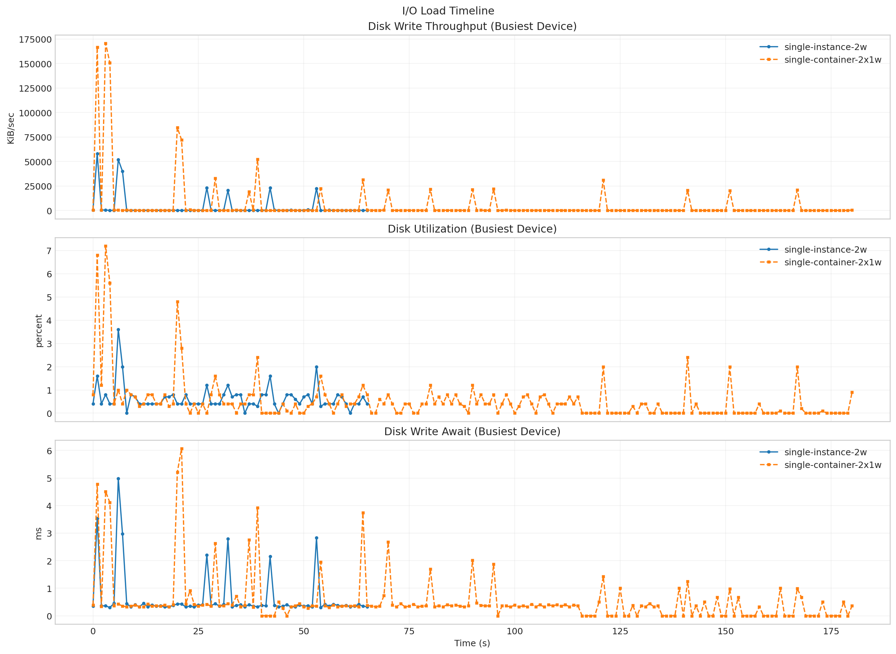
- 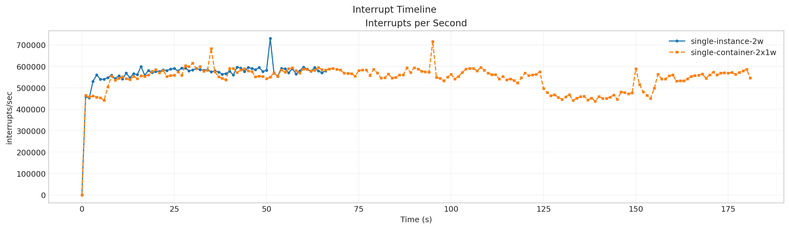
- 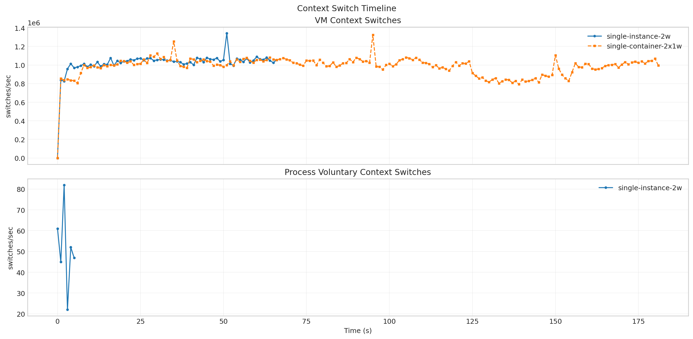

**Latency Overview Table**

| scenario | total_mean | total_p50 | total_p95 | total_p99 |
| --- | --- | --- | --- | --- |
| single-instance-2w | 59048.417 | 51494.643 | 66602.191 | 66602.191 |
| single-container-2x1w | 137824.008 | 94482.184 | 181165.832 | 181165.832 |
| multi-container-2x1x1w | 131791.384 | 82362.424 | 181220.345 | 181220.345 |

**Mean Latency by Phase Table**

| scenario | connect | send | wait | history | total |
| --- | --- | --- | --- | --- | --- |
| single-instance-2w | 206.475 | 246.798 | 58755.250 | 46.313 | 59048.417 |
| single-container-2x1w | 803.665 | 661.116 | 137115.005 | 47.825 | 137824.008 |
| multi-container-2x1x1w | 767.042 | 872.140 | 130862.010 | 57.184 | 131791.384 |

**Tail Latency Table**

| scenario | send_p95 | send_p99 | wait_p50 | wait_p95 | wait_p99 | history_p95 | history_p99 | total_p95 | total_p99 |
| --- | --- | --- | --- | --- | --- | --- | --- | --- | --- |
| single-instance-2w | 263.054 | 263.054 | 51208.251 | 66302.250 | 66302.250 | 55.796 | 55.796 | 66602.191 | 66602.191 |
| single-container-2x1w | 666.173 | 666.173 | 93765.128 | 180464.883 | 180464.883 | 50.815 | 50.815 | 181165.832 | 181165.832 |
| multi-container-2x1x1w | 1056.031 | 1056.031 | 81232.004 | 180492.015 | 180492.015 | 74.340 | 74.340 | 181220.345 | 181220.345 |

**Machine Metrics Table**

| scenario | cpu_user_pct_mean | cpu_system_pct_mean | cpu_iowait_pct_mean | cpu_idle_pct_mean | mem_free_kib_mean | mem_buff_kib_mean | mem_cache_kib_mean | disk_pct_util_mean | disk_w_await_ms_mean | disk_aqu_sz_mean | interrupts_per_s_mean | context_switches_per_s_mean | run_queue_mean | blocked_processes_mean |
| --- | --- | --- | --- | --- | --- | --- | --- | --- | --- | --- | --- | --- | --- | --- |
| single-instance-2w | 2.060 | 1.896 | 0.000 | 96.090 | 774533873.672 | 3105089.970 | 1167009167.284 | 0.644 | 0.652 | 0.094 | 564608.701 | 1020328.896 | 7.955 | 0.015 |
| single-container-2x1w | 1.698 | 1.555 | 0.000 | 96.780 | 773731684.220 | 3105353.319 | 1167138186.549 | 0.511 | 0.547 | 0.116 | 543408.637 | 985502.357 | 6.885 | 0.011 |
| multi-container-2x1x1w | - | - | - | - | - | - | - | - | - | - | - | - | - | - |

**Process Metrics Table**

| scenario | cpu_percent | rss_kib | kb_wr_per_s | iodelay | cswch_per_s | nvcswch_per_s |
| --- | --- | --- | --- | --- | --- | --- |
| single-instance-2w | 93.167 | 485153.333 | 17287.333 | 0.000 | 51.500 | 84.833 |
| single-container-2x1w | - | - | - | - | - | - |
| multi-container-2x1x1w | - | - | - | - | - | - |

**NPU Metrics Table**

| scenario | utilization_pct | hbm_usage_pct | aicore_usage_pct | aivector_usage_pct | aicpu_usage_pct | ctrlcpu_usage_pct |
| --- | --- | --- | --- | --- | --- | --- |
| single-instance-2w | - | - | - | - | - | - |
| single-container-2x1w | - | - | - | - | - | - |
| multi-container-2x1x1w | - | - | - | - | - | - |

**Disk Metrics Table**

| scenario | busiest_device | pct_util | r_await | w_await | f_await | aqu_sz | wkb_s |
| --- | --- | --- | --- | --- | --- | --- | --- |
| single-instance-2w | sda | 0.644 | 0.000 | 0.652 | 0.000 | 0.094 | 3844.000 |
| single-container-2x1w | sda | 0.511 | 0.078 | 0.547 | 0.000 | 0.116 | 5560.044 |
| multi-container-2x1x1w | - | - | - | - | - | - | - |

**System Metrics Table**

| scenario | interrupts_per_s | system_context_switches_per_s | run_queue | perf_cache_misses | perf_context_switches | perf_cpu_migrations | perf_page_faults | perf_unsupported_events | strace_events_per_s_peak | strace_duration_ms_per_s_peak | strace_top_syscall | strace_top_syscall_total_duration_sec |
| --- | --- | --- | --- | --- | --- | --- | --- | --- | --- | --- | --- | --- |
| single-instance-2w | 564608.701 | 1020328.896 | 7.955 | - | - | - | - |  | - | - |  | - |
| single-container-2x1w | 543408.637 | 985502.357 | 6.885 | - | - | - | - |  | - | - |  | - |
| multi-container-2x1x1w | - | - | - | - | - | - | - |  | - | - |  | - |

**Timeline Peaks Table**

| scenario | docker_cpu_peak | docker_cpu_peak_t_sec | docker_mem_peak | docker_mem_peak_t_sec | pidstat_cpu_peak | pidstat_cpu_peak_t_sec | pidstat_rss_peak | pidstat_rss_peak_t_sec | iostat_pct_util_peak | iostat_pct_util_peak_t_sec | iostat_w_await_peak | iostat_w_await_peak_t_sec | vmstat_interrupts_peak | vmstat_interrupts_peak_t_sec | vmstat_context_switches_peak | vmstat_context_switches_peak_t_sec | npu_utilization_peak | npu_utilization_peak_t_sec | npu_hbm_usage_peak | npu_hbm_usage_peak_t_sec | perf_context_switches_peak | perf_context_switches_peak_t_sec |
| --- | --- | --- | --- | --- | --- | --- | --- | --- | --- | --- | --- | --- | --- | --- | --- | --- | --- | --- | --- | --- | --- | --- |
| single-instance-2w | 134.870 | 0.000 | 0.020 | 2.527 | 154.000 | 2.000 | 536340.000 | 5.000 | 3.600 | 6.000 | 4.980 | 6.000 | 729851.000 | 51.000 | 1341860.000 | 51.000 | - | - | - | - | - | - |
| single-container-2x1w | 271.840 | 2.530 | 0.080 | 15.178 | - | - | - | - | 7.200 | 3.000 | 6.070 | 21.000 | 715852.000 | 95.000 | 1322678.000 | 95.000 | - | - | - | - | - | - |
| multi-container-2x1x1w | - | - | - | - | - | - | - | - | - | - | - | - | - | - | - | - | - | - | - | - | - | - |

**strace Key Syscalls Table**

| scenario | run_dir | openat_count | openat_total_sec | openat_mean_ms | statx_count | statx_total_sec | statx_mean_ms | newfstatat_count | newfstatat_total_sec | newfstatat_mean_ms | pread64_count | pread64_total_sec | pread64_mean_ms | clone_count | clone_total_sec | clone_mean_ms | sched_yield_count | sched_yield_total_sec | sched_yield_mean_ms | futex_count | futex_total_sec | futex_mean_ms | read_count | read_total_sec | read_mean_ms | write_count | write_total_sec | write_mean_ms | futex_total_sec_per_request | futex_total_sec_per_wall_sec | statx_total_sec_per_request | statx_total_sec_per_wall_sec | openat_total_sec_per_request | openat_total_sec_per_wall_sec | estimated_makespan_sec |
| --- | --- | --- | --- | --- | --- | --- | --- | --- | --- | --- | --- | --- | --- | --- | --- | --- | --- | --- | --- | --- | --- | --- | --- | --- | --- | --- | --- | --- | --- | --- | --- | --- | --- | --- | --- |
| single-instance-2w | /root/Zehao/ClawHarness/out/batch_run_swe_smoke/task-swebench-verified-astropy-11693/20260524T003703Z_vps-docker-swebench-smoke-burst-single-container-single-instance-2w-smoke | - | - | - | - | - | - | - | - | - | - | - | - | - | - | - | - | - | - | - | - | - | - | - | - | - | - | - | - | - | - | - | - | - | 68.440 |
| single-container-2x1w | /root/Zehao/ClawHarness/out/batch_run_swe_smoke/task-swebench-verified-astropy-11693/20260524T003813Z_vps-docker-swebench-smoke-burst-single-container-multi-openclaw-2x1w-smoke | - | - | - | - | - | - | - | - | - | - | - | - | - | - | - | - | - | - | - | - | - | - | - | - | - | - | - | - | - | - | - | - | - | 185.714 |
| multi-container-2x1x1w | /root/Zehao/ClawHarness/out/batch_run_swe_smoke/task-swebench-verified-astropy-11693/20260524T004127Z_vps-docker-swebench-smoke-burst-multi-container-single-openclaw-2x1x1w-smoke | - | - | - | - | - | - | - | - | - | - | - | - | - | - | - | - | - | - | - | - | - | - | - | - | - | - | - | - | - | - | - | - | - | 185.993 |

**strace Mean Duration Table**

| scenario | single-instance-2w | single-container-2x1w | multi-container-2x1x1w |
| --- | --- | --- | --- |
| openat | - | - | - |
| statx | - | - | - |
| newfstatat | - | - | - |
| pread64 | - | - | - |
| clone | - | - | - |
| sched_yield | - | - | - |
| futex | - | - | - |
| read | - | - | - |
| write | - | - | - |

**Gateway Runtime Stage Table**

| scenario | bootstrap_load_mean_ms | skills_mean_ms | context_bundle_mean_ms | execution_admission_wait_mean_ms | reply_dispatch_queue_wait_mean_ms | reply_dispatch_queue_hold_mean_ms | reply_dispatch_pending_mean |
| --- | --- | --- | --- | --- | --- | --- | --- |
| single-instance-2w | - | - | - | - | - | - | - |
| single-container-2x1w | - | - | - | - | - | - | - |
| multi-container-2x1x1w | - | - | - | - | - | - | - |

**Node Focus Groups Table**

| scenario | sessions_lock_total_ms | sessions_lock_count | sessions_dir_enum_total_ms | sessions_dir_enum_count | sessions_json_total_ms | sessions_json_count | sessions_tmp_total_ms | sessions_tmp_count | bootstrap_files_total_ms | bootstrap_files_count |
| --- | --- | --- | --- | --- | --- | --- | --- | --- | --- | --- |
| single-instance-2w | - | - | - | - | - | - | - | - | - | - |
| single-container-2x1w | - | - | - | - | - | - | - | - | - | - |
| multi-container-2x1x1w | - | - | - | - | - | - | - | - | - | - |

**Runtime Category Samples Table**

| scenario | run_dir | sample_count | fs_worker_exec_count | fs_worker_exec_pct | fs_callback_count | fs_callback_pct | event_loop_poll_count | event_loop_poll_pct | microtask_count | microtask_pct | futex_sync_count | futex_sync_pct | worker_message_count | worker_message_pct | json_parse_count | json_parse_pct | libuv_worker_other_count | libuv_worker_other_pct | gateway_main_other_count | gateway_main_other_pct | v8_worker_count | v8_worker_pct | other_count | other_pct |
| --- | --- | --- | --- | --- | --- | --- | --- | --- | --- | --- | --- | --- | --- | --- | --- | --- | --- | --- | --- | --- | --- | --- | --- | --- |
| single-instance-2w | /root/Zehao/ClawHarness/out/batch_run_swe_smoke/task-swebench-verified-astropy-11693/20260524T003703Z_vps-docker-swebench-smoke-burst-single-container-single-instance-2w-smoke | - | - | - | - | - | - | - | - | - | - | - | - | - | - | - | - | - | - | - | - | - | - | - |
| single-container-2x1w | /root/Zehao/ClawHarness/out/batch_run_swe_smoke/task-swebench-verified-astropy-11693/20260524T003813Z_vps-docker-swebench-smoke-burst-single-container-multi-openclaw-2x1w-smoke | - | - | - | - | - | - | - | - | - | - | - | - | - | - | - | - | - | - | - | - | - | - | - |
| multi-container-2x1x1w | /root/Zehao/ClawHarness/out/batch_run_swe_smoke/task-swebench-verified-astropy-11693/20260524T004127Z_vps-docker-swebench-smoke-burst-multi-container-single-openclaw-2x1x1w-smoke | - | - | - | - | - | - | - | - | - | - | - | - | - | - | - | - | - | - | - | - | - | - | - |

**Runtime Category Percent Table**

| scenario | single-instance-2w | single-container-2x1w | multi-container-2x1x1w |
| --- | --- | --- | --- |
| fs_worker_exec | - | - | - |
| fs_callback | - | - | - |
| event_loop_poll | - | - | - |
| microtask | - | - | - |
| futex_sync | - | - | - |
| worker_message | - | - | - |
| json_parse | - | - | - |
| libuv_worker_other | - | - | - |
| gateway_main_other | - | - | - |
| v8_worker | - | - | - |
| other | - | - | - |
